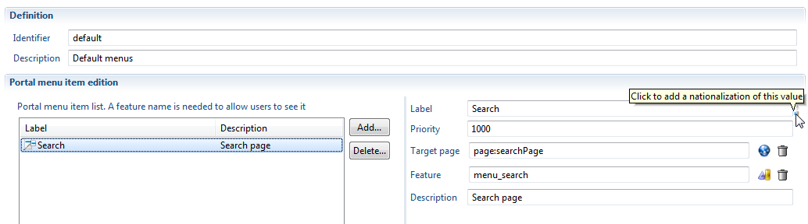
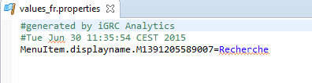
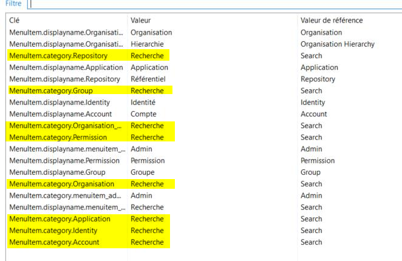
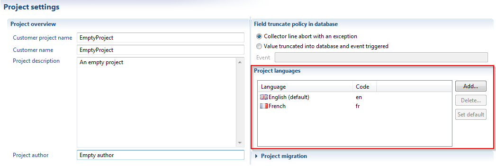

# Localisation of labels included in project files

There is no general localisation of the fields that are input in project files (names, labels, descriptions, etc...). This is usually not a problem, as those values are not meant to be displayed outside of the studio interface. However, there are cases where the values end up being visible by the end user, and when those values would stand out in an otherwise nationalised interface. A mechanism has been incorporated in iGRC to address this issue, allowing to add nationalisations while editing a project file.

Here are examples of situations in which you would require localisation:  

- to enforce a full localisation of some fields that are displayed in the web portal
- to [create a facet](../../add-ons/add-on-creation.md), to offer localised display of variables that will be asked from the user during installation
- to enforce localised titles for tasks and processes in a workflow process
- to enforce localised control display names during the data collection phase

## How to add a localised value

Your project files being in a given language (see below for explanations on how to declare this default language), you only need to add files for the other languages existing in your project. localisations are stored in properties files placed in the `/localisation` folder of the project, but you don't really need to bother with that. Available localisations are signaled in the editors by a little blue flag at the bottom left of the field.

When clicking on this element, you will be prompted for a localised value of this field, and a file in which to put it. If the file does not exist, it will be automatically created. If it already exists, the value will be added to the previous content. If another value is already present for the same field, it will be overwritten.

> [!warning] As is usual in properties localisation files (see reports for another example), the name of the file is not important, but it must end by the code of the language. For example: `myfile_en.properties`, `myfile_fr.properties,` etc...  
> You can have any number of properties files in the localisations folder, you can even create subfolders if you wish, so that you can keep your localisations well structures especially if you need to isolate them for inclusion in a facet.  

When validating the previous wizard, you can see that the properties file you chose has indeed been updated with a new property key:

> [!warning] localisation of categories in menuitems should be done for every item (or at least for the first one):

## Setting the project languages and default language

For localisations to be correctly displayed, you will have to declare the language used in the project files, and the list of languages that you expect to use in your project.
This can be done in the Project tab of the main project file, in the Project languages section. The default language is the one that is used in the project files.

When trying to display a localised label, we will try to locate the right language for the user (using web browser localisation for instance). If the value is not present, we will choose to display the English version, and as a last fallback the version used in the project files.

## List of available localisations in editors

Here is a comprehensive list of all available localisations:

- label for a web portal menu item (displayed in the web portal menu bar)
- label for a rule packaged as a criteria, in the criteria editor (displayed in the rule editor palette, and in the web portal rule widget)
- labels for a rule [temporal criteria](../../audit-rules/03-time-management#create-temporal-analysis-rule-criteria), which means labels for both the criteria and its negation (displayed in the rule editor palette, and in the web portal rule widget)
- label for a [configuration variable](../../technical-configuration/index.md) (displayed during facet installation if variable is included in the facet, and in the configuration editor)
- title of a workflow definition (displayed in the task manager page, in the section where the processes can be started)
- title of a workflow process (displayed in the process section of the task manager, in the process admin page or in notifications)
- title of a workflow activity (displayed in the task list of the task manager, in the process admin page or in notifications)
- title of an identity visualization graph
