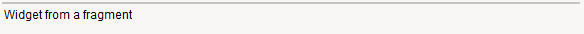
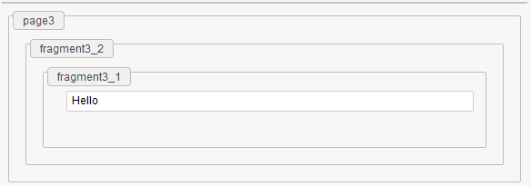
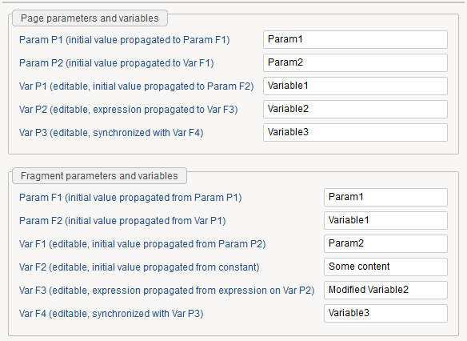
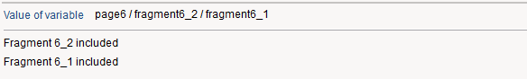
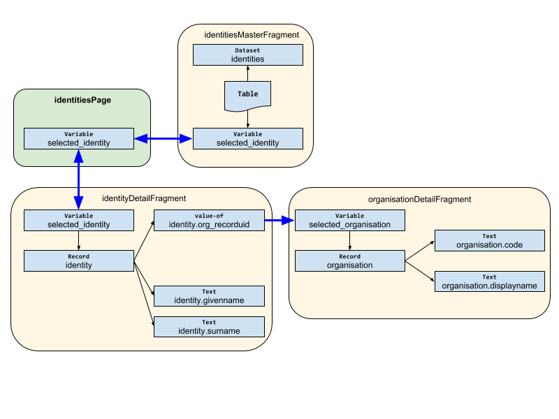
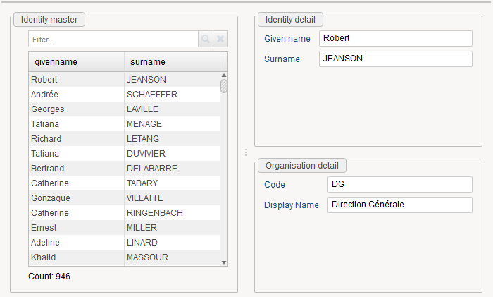

# Page Fragments

In order to promote re-usability in the development of portal pages, the concept of fragments has been introduced in the page language.  
The structure of a fragment is similar to that of a page object while it's behavior is closer to that of a widget: It's a top level element which can contains parameters, variables, data-bindings and widgets and can be included in a page as any other widget.  

## Declaring and including a fragment

A fragment is declared using the `PageFragment` keyword. It can then be included in the Widget block of a page with the `IncludeFragment` widget.  

A fragment has approximately the same structure as a page. It supports the following optional attributes: `feature:`, `mixins:`, `enter-event:` and `exit-event:`, each having the same meaning as the page attribute of the same name. You can provide the Parameters, Variables, Data-binding and Widgets blocks as defined in [Structure of a Page](./index#structure-of-a-page).  

The simplest possible example of fragment declaration and usage is:  

```page
fragment1 = PageFragment {  
    Header {
        value: "Widget from a fragment"
    }
}
page1 = Page {
    title: "Fragments example 1"
    IncludeFragment(fragment1)
}
```

The rendered portal page is:  

  

A given fragment can be included in any number of pages and a page can include any number of fragments (and even include the same fragment more than once).

## Synchronizing a variable value between a page and an included fragment  

As no assumptions can be made on which page will include a given fragment, the behavior, by construction, is independent of any page. It only depends on the parameters and variables that are passed to it.  

Therefore, in the `IncludeFragment` widget, one can provide a list of variables of the page which will be bound to variables of the fragment. Such a binding between variables is bidirectional, which means that changes of the value of a variable in the page or in the fragment will immediately be reflected on the other side. The syntax of this kind of bindings is `var_in_page binds-to var_in_fragment`.  

Here is an example of variables binding:  

```page
fragment2 = PageFragment {
    var_in_fragment = Variable
    Group {
        title: "In fragment"
        Edit {
            variable: var_in_fragment
            label: "Edit variable"
        }
    }
}
page2 = Page {
    title: "Fragments example 2"
    var_in_page = Variable {
        type: String
        initial: "Hello"
    }
    Text {
        value: var_in_page
        label: "Value of variable"
        compact: True
    }
    Spacer {
        height: 10
    }
    IncludeFragment(fragment2 with var_in_page binds-to var_in_fragment)
}
```

The corresponding page is:  

  

In this example, if you change the value of the variable in the Edit widget of the fragment, the value of the Text widget will change accordingly.  

Note that, despite the fact that all the examples in this document will refer to page variables, it can also apply to workflow variables built from a `TaskRecord`.  

With a suitable workflow definition, the page defined in the previous example could have been.  

```page
page2bis = Page {
    title: "Fragments example 2 (workflow)"
    taskId = Parameter {
        mandatory: True
    }
    task = TaskRecord(taskId)
    Text {
        value: task.wk_var
        label: "Value of variable"
        compact: True
    }
    Spacer {
        height: 10
    }
    IncludeFragment(fragment2 with task.wk_var binds-to var_in_fragment)
}
```

(the binding is also bidirectional such that the workflow variable is updated along with the fragment variable.)  

## Nesting fragments inside other fragments

Fragment can not only be included in pages but also in other fragments, up to any appropriate level of nesting. For instance:  

```page
fragment3_1 = PageFragment {
    var_f3_1 = Variable
    Group {
        title: "fragment3_1"
        border: True
        Text {
            value: var_f3_1
        }
    }
}
fragment3_2 = PageFragment {
    var_f3_2 = Variable {
        initial: "Hello"
    }
    Group {
        title: "fragment3_2"
        border: True
        IncludeFragment(fragment3_1 with var_f3_2 binds-to var_f3_1)
    }
}
page3 = Page {
    title: "Fragments example 3"
    Group {
        title: "page3"
        border: True
        IncludeFragment(fragment3_2)
    }
}
```

The corresponding page is then :  

  

> Variable bindings must be done from the including page or fragment to the directly included fragment.

In order to make clear which part is the container element and which part is the included one, the container will, in the rest of this document, be designated as a page, even though it can be a fragment which includes another fragment.  

## Variables and values propagation

In addition to variable bidirectional bindings, it is also possible to propagate the value of an expression to a variable (or a parameter) of a fragment. Note that this propagation is unidirectional, from the page to the fragment, never the other way around. This kind of propagation follows the syntax`value-of expression to elt_fragment` where`expression` is evaluated in the context of the page and`elt_fragment` is a parameter or a variable declared in the fragment. If the target element in the fragment is a parameter, only the initial value of the expression will be propagated but if it is a variable, changes in the value of the expression will induce a value change in the fragment.  

Special care must be taken in this latter case where a mutable expression is propagated to a fragment variable: a change in the value of the expression will override the value of the fragment variable even if the variable has been mutated in the fragment (for example when there is a Edit widget for this variable).  

The following example illustrates the different use cases:  

```page
fragment4 = PageFragment {

    param_f1 = Parameter
    param_f2 = Parameter
    var_f1 = Variable
    var_f2 = Variable
    var_f3 = Variable
    var_f4 = Variable

    Group {
        title: "Fragment parameters and variables"
        Text { value: param_f1 label: "Param F1 (initial value propagated from Param P1)"}
        Text { value: param_f2 label: "Param F2 (initial value propagated from Var P1)"}
        Edit { variable: var_f1 label: "Var F1 (editable, initial value propagated from Param P2)"}
        Edit { variable: var_f2 label: "Var F2 (editable, initial value propagated from constant)"}
        Edit { variable: var_f3 label: "Var F3 (editable, expression propagated from expression on Var P2)"}
        Edit { variable: var_f4 label: "Var F4 (editable, synchronized with Var P3)"}
    }

}

page4 = Page {
    title: "Fragments example 4"

    param_p1 = Parameter { default: "Param1" }
    param_p2 = Parameter { default: "Param2" }
    var_p1 = Variable { initial: "Variable1" }
    var_p2 = Variable { initial: "Variable2" }
    var_p3 = Variable { initial: "Variable3" }

    Group {
        title: "Page parameters and variables"
        Text { value: param_p1 label: "Param P1 (initial value propagated to Param F1)"}
        Text { value: param_p2 label: "Param P2 (initial value propagated to Var F1)"}
        Edit { variable: var_p1 label: "Var P1 (editable, initial value propagated to Param F2)"}
        Edit { variable: var_p2 label: "Var P2 (editable, expression propagated to Var F3)"}
        Edit { variable: var_p3 label: "Var P3 (editable, synchronized with Var F4)"}
    }
    IncludeFragment {
        fragment: fragment4 with
            value-of param_p1 to param_f1,
            value-of var_p1 to param_f2,
            value-of param_p2 to var_f1,
            value-of "Some content" to var_f2,
            value-of Concat("Modified ", var_p2) to var_f3,
            var_p3 binds-to var_f4
    }
}
```

The corresponding page is then :  

  

An example of the vigilance point mentioned above is illustrated in the interaction between `var_p2` and `var_f3` which are both editable but any change in `var_p2` will override the value of `var_f3` with the value of `Concat("Modified ", var_p2)`.  

## Firing events from a fragment to the page or fragment including it  

It can sometimes be very interesting to send some event from a fragment to the page including it. It will, for example, be the case when the fragment contains a button whose action cannot be fully completed inside the fragment, maybe because some part of the context has been kept only in the page.  

Implementing this is separated in two parts:  

- in an action list of the fragment, add a `FireFragmentEvent` action with a string as argument,
- in the `IncludeFragment` widget of the page add a `fragment-events:` block, whose content is similar to a `StringCase` action content (`when predicate then [ actions ]` list). The predicate part is tested against the argument given to the `FireFragmentEvent` action in the fragment.  

All the branches of the `fragment-events:` whose predicate is true will be executed (contrary to, for example, a `StringCase` where only the first matching one is executed) and the actions of the matching branches will be executed in the order of their declaration.  

> The event is only sent to the direct container of the fragment and never to other eventual parent containers. However another `FireFragmentEvent` action can be present in a branch of the `fragment-events:` (see in the example below the `"ok"` event from the last button of `fragment5_1` is sent to `fragment5_2` which in turn send an `"ok up"` event to the page).  

It is not necessary that the page catches any event sent by the fragment; if no corresponding `fragment-events:` branch matches the event string then the event will be discarded silently.  

```page
fragment5_1 = PageFragment {
    ButtonGroup {
        uniform: True
        Button {
            actions: FireFragmentEvent "click1"
            text: "Button 1"
        }
        Button {
            actions: FireFragmentEvent "click2"
            text: "Button 2"
        }
        Button {
            actions: FireFragmentEvent "click3"
            text: "Button 3"
        }
        Button {
            actions: FireFragmentEvent "ok"
            text: "OK"
        }
    }
}

fragment5_2 = PageFragment {
    IncludeFragment {
        fragment: fragment5_1
        fragment-events: {
            when StartsWith "click" then [
                Flash Information "A button was clicked"
            ]
            when "click1" then [
                Message Information "Button 1 was clicked"
            ]
            when "ok" then [
                FireFragmentEvent "ok up"
            ]
        }
    }
}

page5 = Page {
    title: "Fragments example 5"
    IncludeFragment {
        fragment: fragment5_2
        fragment-events: {
            when "ok up" then [
                Message Information "OK was clicked"
            ]
        }
    }
}
```

## Enter and exit events  

The declaration block of a fragment supports the `enter-event:` (resp. `exit-event:`) attribute which allows a list of actions to be executed when the page including the fragment is about to be activated (resp. deactivated).  

The `enter-event:` actions of the page are always executed first, then recursively the `enter-events:` actions of the included fragments. For the `exit-event:` the principle is the same but the order of execution is reversed, starting from the deeply nested fragments and finishing with the page:  

```page
fragment6_1 = PageFragment {
    enter-event: Set Concat(var_6_1, " / fragment6_1") to var_6_1
    var_6_1 = Variable
    Header {
        value: "Fragment 6_1 included"
    }
}

fragment6_2 = PageFragment {
    enter-event: Set Concat(var_6_2, " / fragment6_2") to var_6_2
    var_6_2 = Variable
    Header {
        value: "Fragment 6_2 included"
    }
    IncludeFragment(fragment6_1 with var_6_2 binds-to var_6_1)
}

page6 = Page {
    title: "Fragments example 2"
    enter-event: Set "page6" to var_6
    var_6 = Variable {
        type: String
        initial: ""
    }
    Text {
        value: var_6
        label: "Value of variable"
        compact: True
    }
    Separator
    IncludeFragment(fragment6_2 with var_6 binds-to var_6_2)
}
```

The corresponding page is then :  

  

## A more realistic example

The following example illustrate a more realistic example, although still a bit contrived one (for the sake of the demonstration). It should not be assumed that such a fine-grained carving of fragments is a best practice principle. As a rule of thumb, if you do not expect some part of a page to be reused more than a couple of times there is no point in extracting it to a fragment.  

This example shows an identity master-detail page, with the identity detail also displaying the detail of the organization to which the identity belongs. The three parts identity list, identity detail and organization detail are all extracted to different fragments.  

Variable bindings are used to synchronize the selected identity between the page `identitiesPage` and the fragments `identitiesMasterFragment` (which changes the value of the `selected_identity` variable) and `identityDetailFragment` (which reads the `selected_identity` variable to display the suitable information). An expression propagation is used between the `identityDetailFragment` and `organisationDetailFragment` fragments.  

  

```page
organisationDetailFragment = PageFragment {
    selected_organisation = Variable {
        type: Integer
    }
    organisation = Record(br_organisation with selected_organisation to recorduid)
    Group {
        title: "Organisation detail"
        Text {
            value: organisation.code
            label: "Code"
        }
        Text {
            value: organisation.displayname
            label: "Display Name"
        }
    }
}

identitiesMasterFragment = PageFragment {
    selected_identity = Variable {
        type: Integer
    }
    identities = Dataset {
        view: br_identity
    }
    Group {
        title: "Identity master"
        Table {
            data: identities
            show-count: True
            show-filter: True
            selection-changed-event: FireFragmentEvent "changed"
            layout: Layout {
                grab: horizontal True vertical True
            }
            Column {
                column: recorduid
                selection: selected_identity
                hidden: True
            }
            Column {
                column: givenname
                width: 100%
            }
            Column {
                column: surname
                width: 100%
            }
        }
    }
}

identityDetailFragment = PageFragment {
    selected_identity = Variable {
        type: Integer
    }
    identity = Record(br_identitydirectorganisation with selected_identity to recorduid)
    Group {
        title: "Identity detail"
        Text {
            value: identity.givenname
            label: "Given name"
        }
        Text {
            value: identity.surname
            label: "Surname"
        }
    }
    IncludeFragment {
        fragment: organisationDetailFragment with value-of identity.org_recorduid to selected_organisation
    }
}

identitiesPage = Page {
    title: "Identities"
    selected_identity = Variable {
        type: Integer
    }
    Splitter {
        disposition: Horizontal
        layout: Layout {
            grab: horizontal True vertical True
        }
        IncludeFragment {
            fragment: identitiesMasterFragment with selected_identity binds-to selected_identity
            fragment-events: {
                when "changed" then [If selected_identity [Flash Information Concat("Identity changed: ", selected_identity)]]
            }
        }
        IncludeFragment(identityDetailFragment with selected_identity binds-to selected_identity)
    }
}
```

The corresponding page is then :  

  

## Dynamic Fragments

Fragments are really useful when displaying details about a given entity in a master-detail page.  
If the page displays homogeneous entities (e.g. AD accounts), it's easy to provide the detail of the entity (e.g. an AD account) in a fragment and display this fragment in the page.

Now consider that entities to display in this page are not homogeneous, and the detail to display depends on its characteristics.  
For example consider a page that displays applications: Many different entities are modeled as applications: business applications, file shares, CyberArk vaults, CyberArk safes, Configuration items, etc..  
Each specific entity would provide a specific fragment with meaningful information , but how to decide which fragment to display depending on the entity?  

A first implementation would to use a `ConditionalGroup` that would branch depending of the entity type. But this approach has a critical issue: the main detail panel fragment needs to import and reference all the fragments of all known specialized fragments, which could come from many different facets. This means that the generic application detail fragment has a dependency on all known apps related facets, and moreover, needs to be modified and delivered each time a new app sub-type is introduced in a new facet.  

This is clearly not convenient, hence the need from a more dynamic approach to including fragments.

### Syntax and usage

The new `IncludeDynamicFragment` statement allows to include a fragment by its name passed as a string, without having to import it in the page, similarly to `GoTo Dynamic` statement.

`IncludeDynamicFragment` has the same syntax as `IncludeFragment` with two new options:

```page
  IncludeDynamicFragment ( <fragmentName>, <baseFragmentRef> [ with <bindings> ])
```

extended syntax:

```page
  IncludeDynamicFragment {
    dynamic-name: <fragmentName>
    base-fragment:<baseFragmentRef> [ with <bindings> ]
    background: ...
    layout: ...
    margins:...
    fragment-events: ...
    ...
   }
```

Where:  

- **fragmentName** : the name of the dynamic fragment as a string, typically computed as an expression. The actual fragment to include will be resolved at runtime by searching a matching fragment in all declared fragments in the project. fragmentName can also point to a multi-valued variable that contains a list of fragment names. See section **Dynamic fragment selector** below for details.
- **baseFragmentRef** : reference to a statically bound fragment which provides the binding contract for params and variables, helps for auto-completion in the editor  
and acts as a fallback if the dynamic fragment does not exist.  

Here is an example in short syntax:

```page
Set Concat ( "bw_app_detail_", LowerCase selectedApp.type ) to fragmentName
IncludeDynamicFragment ( fragmentName bw_app_generic with selectedAppUid binds-to uid)  
```

In the example above, `selectedApp.type` could contain "Profile" and a fragment named `bw_app_detail_profile` will be searched in all available page files in the project.

In order to save performances, if the same dynamic fragment is included in an `IncludeDynamicFragment` over and over, but with different parameters or variables,  
it's created only the first time,  cached in memory and recycled when the parameters are changed.

### Dynamic fragment selector

Sometimes, it can be useful to have a list of fallback fragments instead of a single one. The first one to be found will be used. For example, to provide more and more specific detail fragments ( general permission, shared folder permission, netapp folder). In which case the verbose syntax will allow to provide the different dynamic names, between brackets , much like css font-family statement.

```page
IncludeDynamicFragment { 
  dynamic-name: [ perm_frag_name, "bw_shared_folder_detail" ] 
  base-fragment: bw_permission_detail
}   
```

In this case, the widget will search for dynamic fragment name found in `perm_frag_name`, then if not found use `bw_shared_folder_detail`, then if not found, use the base fragment (`bw_permission_detail`).

### Limitations

Because of its dynamic nature, some features of fragments are not supported when the fragment is included through `IncludeDynamicFragment`:

- periodicActions inside the fragment won't be triggered  
- exit-event actions won't be triggered  
- enter-event and post-render-event actions will be triggered only the first time a given dynamic fragment is included in a dynamic fragment, not when its parameters are changed or when it's replaced by another fragment then displayed again
