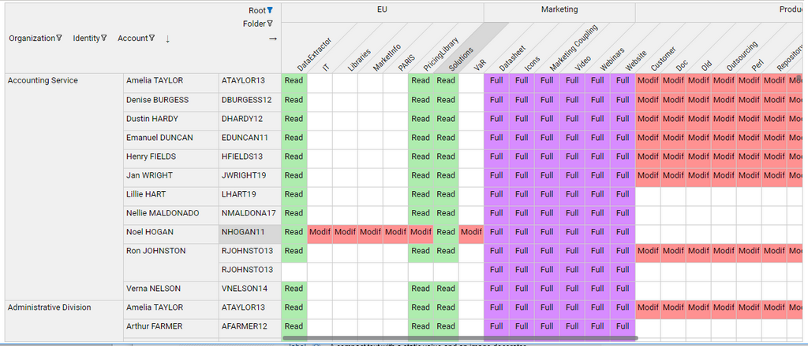
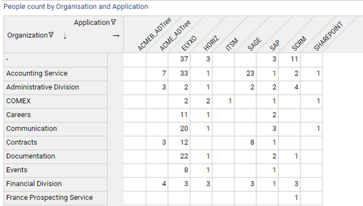
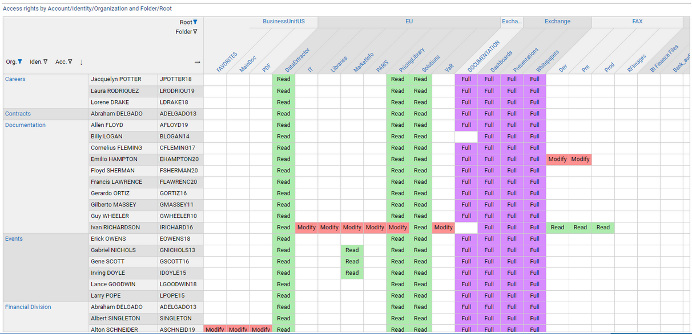
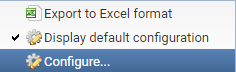
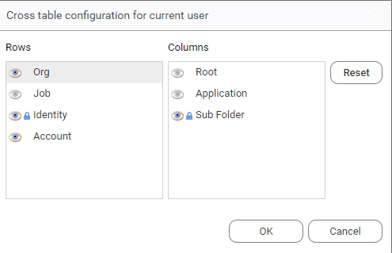
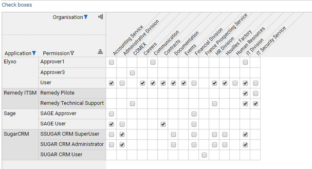
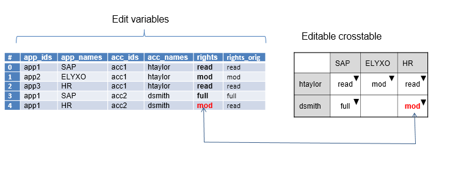
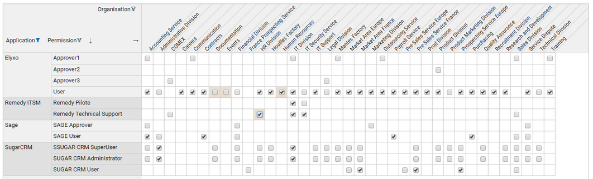
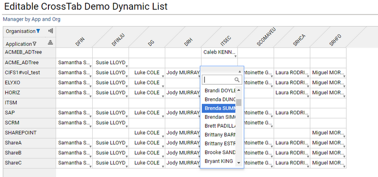
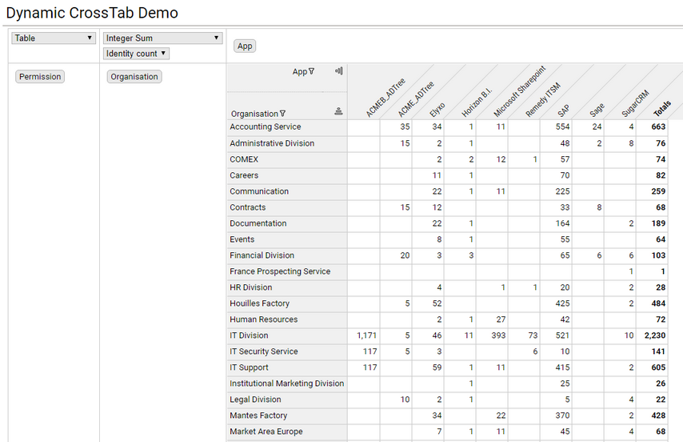

# Cross table

A **cross table** is a two-way table that displays aggregated information (also known as _Measure_ in the BI jargon) in rows and columns (also known as _Dimensions_). Its main purpose is to vizualize the relationship between rows and columns and to display large datasets in a condensed format.  
A typical cross table  example in the context of IAM would be to display access rights by permissions and user accounts.  
Columns and rows of the cross table can be optionally grouped to further emphasize the organization of data. For example, permissions could be grouped by applications, and accounts by repository or groups.  



Pages language offers three variants of cross tables:  

- Fixed cross table
- Editable cross table
- Dynamic cross table  

> The source code of the examples provided are packaged in the facet `bw_crosstab_docs_1.0.facet` attached to this page.

## Fixed cross table

- The cross table rows and columns dimensions and grouping are predefined
- Cell content can be displayed as a combination of text, icon and conditionally colored background and text .
- The user can select a cell and take actions accordingly (such as displaying a message, updating a detail panel or jumping to a different page )
- The user can click the row and column header labels and take actions accordingly
- The User can filter rows and columns header values
- The cross table can be exported as a Microsoft Excel spreadsheet

### Syntax

**CrossTable** defines a crosstable component  

| _attribute_                     | _type_                         | _purpose_                                                                                                                                                                                                                                                                                                                                |
|:--------------------------------|:-------------------------------|:-----------------------------------------------------------------------------------------------------------------------------------------------------------------------------------------------------------------------------------------------------------------------------------------------------------------------------------------|
| **data\***                      | DataSet                        | References a Dataset that will provide data for the cross table.<br>- Each row in the dataset represents a cell in the cross table.<br>- The dataset must provide one or more attributes for displaying the cell content,<br>- The dataset must provide attributes to determine the cell column and row.                                 |
| **columns\***                   | Dim list (comma- separated)    | List of dimensions to be displayed as columns of the cross table, from top to bottom. if there is more than one dimension, the column headers will be grouped.<br>See definition of **Dim** below                                                                                                                                        |
| **rows\***                      | Dim list (comma- separated)    | List of dimensions to be displayed as rows of the cross table, from left to right.<br>If there is more than one dimension, the row headers will be grouped. <br>See definition of **Dim** below                                                                                                                                          |
| **cell-content\***              | CellContent                    | Describes how a cell is displayed (see below)<br>See **CellContent** below                                                                                                                                                                                                                                                               |
| **layout**                      | Layout                         | Defines the sizing of the crosstable within its container and the layout inside the cross table itself.<br>See **Layout** below                                                                                                                                                                                                          |
| **selection-changed-event**     | Action list (comma- separated) | List of actions to execute when a cell is selected by the user.<br>These actions can make use of the variables referenced in the Dim selection attributes                                                                                                                                                                                |
| **column-header-click**         | Action list (comma- separated) | List of actions to execute when the user clicks a column header link.<br>These actions can make use of the variables referenced in the Dim header-click attributes of the column dimensions.                                                                                                                                             |
| **row-header-click**            | Action list (comma- separated) | List of actions to execute when the user clicks a row header link.<br>These actions can make use of the variables referenced in the Dim header-click attributes of the row dimensions.                                                                                                                                                   |
| **label**                       | String                         | Optional title of the crosstable                                                                                                                                                                                                                                                                                                         |
| **cluster-sortable**            | Boolean                        | Option that allows cluster sorting of crosstable cells using an advanced classification algorithm. When this option is True, a cluster sort button is displayed in the top-left area                                                                                                                                                     |
| **cluster-keep-sort-on-change** | Boolean                        | Option that preserves any previous user-initiated cluster sorting order when the crosstab is updated (data is reloaded). It's up to the designer to ensure that this option can actually be enabled, i.e. that crosstab changes will not affect cluster sorting results. This is typically the case for role-mining and review crosstabs |
| **export-disabled**             | Boolean                        | Option to conditionnally Enable or not the export of the Cross tab data.   |
| **swappable** | Boolean | when set to true, rows and columns can be swapped by the end-user for readability and balance |
| **configurable** |  Boolean | defines if current user can set configuration for this crosstable for himself |
| **default-configurable** |  Boolean predicate |  defines if current user can set default configuration for this crosstable for all users (only makes sense if persist-configuration is set)  |
| **persist-configuration** |  Boolean | 	defines if crosstable configuration change is persisted to database |
| **persist-configuration-keys** |  String List | 	list of string to allows different configurations for the same crosstable, for example per user profile. the keys are evaluated once  |
| **configuration-changed-event** |  Actions | actions to be executed each time configuration is changed. It's also executed at startup when the configuration is loaded. can be used in combination with the masked variables   |

**Dim** describes a row or column dimension of the cross table

| _attribute_      | _type_           | _purpose_                                                                                                                                                                                                                                |
|:-----------------|:-----------------|:-----------------------------------------------------------------------------------------------------------------------------------------------------------------------------------------------------------------------------------------|
| **value\***      | dataset column   | References a column in the dataset that will provide a key for the column/row.<br>It's a good practice to use an attribute with compact values (such as recorduid or code) as the value , to ensure good performance of the cross table. |
| **label**        | dataset column   | References an attribute in the dataset that will provide a label for the column/row.<br>If not defined, the value attribute will be used also to display the label.                                                                      |
| **header**       | string           | Display name for the dimension, to be displayed in the top left corner of the cross table.<br>This could be a localized string. If not provided, the label of dimension will be the name of the value attribute.                         |
| **selection**    | variable         | Single-valued variable that will hold the value (key)<br>Of the matching column or row header when a cell is selected.                                                                                                                   |
| **header-click** | variable         | Single-value variable that will hold the value (key) of the matching column or row header when the header is clicked.<br>Note that when this attribute is provided, the header labels for that dimension are displayed as links.<br>For the links to work you **must** set the `row-header-click` **and** `column-header-click` properties          |
| **tooltip**      | string           | The tooltip to be used to highlight. If not set, then the label attribute will be used as a tooltip.                                                                                                                                     |
| **width**        | nnn px <br> nnn% | Limits the width for the row header.                                                                                                                                                                                                     |
| **locked** |  Boolean | 	when the crossable is configurable, define if visibility of this dimension can be changed in the configuration dialog |
| **initially-masked** |  Boolean | when crosstable is configurable, defines if the configurable dimension is initially masked.  |
| **masked** |  Variable | variable is set when the dimension visibility is changed after configuration or at startup. Useful to know which dimension events ( selection, filter, header-click) are relevant |

**CellContent** defines how a cell of the cross table is displayed, as a combination of text, image and background coloring

| _attribute_ | _type_                                                                    | _purpose_                                                                                                                                                                                                                                                                                                                                                                                                               |
|:------------|:--------------------------------------------------------------------------|:------------------------------------------------------------------------------------------------------------------------------------------------------------------------------------------------------------------------------------------------------------------------------------------------------------------------------------------------------------------------------------------------------------------------|
| **text**    | string expression                                                         | string expression computing the optional text that will be displayed in each cell, <br> based on the value of one or more columns of the dataset                                                                                                                                                                                                                                                                        |
| **image**   | TemplateImageSelection  <br> IntImageSelection  <br> StringImageSelection | image expression computing the optional image that will be displayed in each cell,<br> based on the value of one or more columns of the dataset.<br>The expression could be defined either inline (using IntImageSelection or StringImageSelection), <br> or using a named TemplateImageSelection defined elsewhere.<br>The paths for the images are relative to the **/reports/icons/** folder of the current project. |
| **styling** | IntStyling <br> StringStyling                                             | styling expression computing the conditional style to apply to each cell.<br>Only the background and foreground (text) color are taken into account                                                                                                                                                                                                                                                                     |
| **align**   | Left <br> Center <br> Right                                               | alignment for the cell content. Defaut is **Left**                                                                                                                                                                                                                                                                                                                                                                      |

**Layout** defines the sizing of the crosstable within its container and the layout inside the cross table itself

| _attribute_                | _type_           | _purpose_                                                                                                                                                                |
|:---------------------------|:-----------------|:-------------------------------------------------------------------------------------------------------------------------------------------------------------------------|
| **cell-width**             | nnn px           | Defines the uniform width of cells in pixels. Content exceeding the width will be truncated, and a tooltip text will display the full content. Default width is 40px     |
| **cell-height**            | nnn px           | Defines the uniform height of cells in pixels.<br>Default height is 25px                                                                                                 |
| **col-headers-max-height** | nnn px <br> nnn% | Maximum height that the columns headers can take, in absolute pixels or in % or the cross table height.<br>Default value is 30% of the table height                      |
| **row-headers-max-width**  | nnn px <br> nnn% | Maximum width that the row headers can take, in absolute pixels or in % or the cross table width. <br>Default value is 30% of the table width                            |

**Example1**: a simple crosstab that displays people count by organization and application  



```page
identityByOrgAndPerm = Dataset {
    view: identitybyorgandperm
}

CrossTable {
    label: "People count by Organization and Application"
    data: identityByOrgAndPerm
    columns: Dim { value: app_recorduid label: app_code header: "Application"  }
    rows:    Dim {value: org_recorduid label: org_displayname header: "Organization"  }
    cell-content: CellContent {
        text: Current nb_identities

    }
}
```

**Example2** : a more complex crosstab with column and row grouping, text+color content and header click enabled.  



```page
rightsLabel = IntMapping {
 when =3 then "Full"
 when =2 then "Modify"
 when =1 then "Read"
 otherwise "-"
}


//stylings
fullStyle = Style {
  background: Color RGB ( 215 , 140, 255 )
}

modifyStyle = Style {
  background: Color RGB ( 255 , 145, 145 )
}

readStyle = Style {
  background: Color RGB ( 174 , 236, 174 )
}

crosstab_sfrights = Page {
 title: "Shared Folders rights by Account/Identity/Organization and Root"

 /* Variables */
 org_sel_id = Variable
 acc_sel_id = Variable
 id_sel_id = Variable
 folder_sel_id = Variable
 root_sel_id = Variable

 root_header_id = Variable
 folder_header_id = Variable
 org_header_id = Variable

 rightByAccountAndPerm = Dataset {
   view: fsright_perm_identity  
 }


CrossTable {
      label: "Access rights by Account/Identity/Organization and Folder/Root"
      data: rightByAccountAndPerm
      columns:
         Dim { value: root_recorduid label: root_displayname header: "Root" selection: root_sel_id header-click: root_header_id} ,
         Dim { value: folder_recorduid label:folder_displayname header: "Folder" selection: folder_sel_id header-click: folder_header_id }

      rows:
        Dim { value: org_recorduid label: org_displayname  header: "Org." selection: org_sel_id header-click: org_header_id},
        Dim { value: id_recorduid label: id_fullname  header: "Iden." selection: id_sel_id  },
        Dim { value: acc_recorduid label: acc_login header: "Acc." selection: acc_sel_id }

      cell-content: CellContent {
  text: Transform Current basic_code using rightsLabel  
  align: Center
            styling: IntStyling( Current basic_code){
               when =3 then fullStyle
               when =2 then modifyStyle
               when =1 then readStyle
            }
   }

      layout: Layout {
        cell-width: 50px
      }

   selection-changed-event: Message Concat ("The following item has been selected: org id=", org_sel_id , " identity id=", id_sel_id,
               " account id=",acc_sel_id, " folder id=", folder_sel_id)

   column-header-click: StringCase(folder_header_id) {
       when IsEmpty then [Message Concat ("click Root: " , root_header_id  )]
       otherwise [Message Concat ("click Folder: " , folder_header_id  )] }

   row-header-click: GoTo Activity Organisation Detail with org_header_id to paramOrganisationUid

    }


}
```

## Crosstable web configuration

It's possible to configure a crosstable directly from the web portal to show or hide some dimensions. The configuration can be set for the current users and/or for all users as a default setting. This is especially useful when some dimensions of the crosstable are not relevant for a given project, or data for these dimensions is not available, so its preferable to not  display them. 

The widget configuration are inspired from the Table widget attributes:

- To enable configuration in the web, set `configurable` to `True`
- To persist the configuration to the database , set `persist-configuration` to `True`
- To restrict the right to define default configuration for all users, set `default-configurable` to an appropriate condition, typically using a `FeaturePredicate`
- In some case specified dimensions must not hidden even if the crosstable is configurable. Typically as they are required for the good operation of the app. This is done by setting `locked` to `True` in the `Dim` definition.

Refer to the syntax table above for a full reference of crosstable configuration.

Configurable crosstab Syntax example:

```page
Crosstable {
   configurable: True
   default-configurable: FeaturePredicate(rm_admin)
   persist-configuration: True

   rows:
     Dim { value: identity locked: True   } 
     Dim { value: job initially-masked: False }
     Dim { value: contract  initially-masked: False }
} 
```





## Editable Cross Table

This variant displays a cross table where cell values can be edited by the end-user.  

- The cross table rows and columns dimensions and grouping are predefined
- the user can filter rows and columns header values
- cell values can be edited in either of two ways:
  - through check boxes ( boolean values)
  - through selection from a list of choices, static or dynamic (e.g. retrieved from a view).
- the current values of the crosstable can be exported as an Excel spreadsheet file.



The API allows to easily track changes on the cross table, for example to update review tickets.  
The main difference with the fixed cross table is that the original data for the crosstable are provided by a set of coordinated multi-valued variables and the resulting edited data will be stored in one of these variables.  

All column, rows and editable value variables must be in sync with each other, which means that each index in the set of variables will represent an editable cell in the cross table.  
Cells that have not mapping in the variables cannot be edited. This allows to prevent some cells of the cross table to be changed.  

The schema below explains the relationship between the edition variables (to the left) and the resulting editable cross table.  



### Syntax

**EditCrossTable** defines an editable crosstable component.  

| _attribute_ | _type_ | _purpose_ |
| :- | :- | :- |
| **data\*** |  DataSet |  references a Dataset that will provide data for the cross table. <br> - Each row in the dataset represents an editable cell in the crosstable.<br>- The dataset must provide one or more attribute for displaying the cell content (see edit-value)<br>- the dataset must provide attributes to determine the cell column and row.|
| **columns\*** | Dim list (comma- separated) | list of dimensions to be displayed as columns of the cross table, from top to bottom. if there is more than one dimension, the column headers will be grouped. <br>see definition of **Dim** below |
| **rows\***  | Dim list (comma- separated) | list of dimensions to be displayed as rows of the cross table, from left to right. <br>if there is more than one dimension, the row headers will be grouped. <br>see definition of **Dim** below |
| **edit-value\*** | EditValue | describes how each cell can be edited <br>see **EditValue** below |
| **edit-event** | Action list (comma- separated) | list of actions to execute each time a cell is edited by the user.<br>The exact changes can be tracked through the edit-value variables. |
| **label**  |  String  |  optional title of the crosstable |
| **layout** |  Layout | Defines the sizing of the crosstable within its container and the layout inside the cross table itself. <br>see **Layout** below |

**Dim** describes a row or column dimension of the editable cross table.  

| _attribute_ | _type_ | _purpose_ |
| :- | :- | :- |
| **value** \* | multi-valued variable | References a multi-valued variable that holds the key for the column/row of each cell.<br>It's a good practice to use compact values (such as recorduid or code) as the value , to ensure good performance of the cross table. |
| **label** | multi-valued variable | references a multi-valued variable that will provide a label for the column/row. <br>if not defined, the value variable will be used also to display the label.  |
| **header**   |  string | display name for the dimension, to be displayed in the top left corner of the cross table. <br>his could be a localized string. <br>If not provided, the label of dimension will be the name of the value variable. |

**EditValue** defines how a cell of the cross table can be edited.  

| _attribute_ | _type_ | _purpose_ |
| :- | :- | :- |
| **header** | string | optional label for the edited value |
| **value\*** | multi-valued variable | References a multi-valued variables that will hold the current values of the edited cells. <br>At startup this variable must contain the original values. <br>In checkbox mode, the variable must contain boolean values |
| **text** | multi-valued variable | References a multi-valued variables that will hold the current displayed labels of the edited cells.<br>At startup this variable must contain the original displayed labels. <br>If not provided, the labels will be retrieved from the labels of the choices combo (in Combo mode).<br>This latter capability is useful for static list of choices for which the display labels are defined as NLS strings in Pages.<br>It's not recommended to use it for dynamic list of choice with possibly very large datasets. In this case, it's better to have the labels computed in the values dataset. |
| **original-value\*** | multi-valued variable | References a multi-valued variables that will hold the original values of the edited cells (before any change could occur). <br>This variable will be automatically filled at startup from **value** variable. <br>This variable allows to track what cells have actually been modified, by comparing with value variable, in order to perfom incremental updates to the Ledger (eg. updating Review Tickets) |
| **mode\*** | CheckBox \| Combo | indicates how the edit values can be modified. Possible values are CheckBox and Combo. <br>In **Checkbox** mode, cells are displayed as check boxes. No other setting is required. <br>In **Combo** mode, cells can be edited by selecting a value from a pop-up list. The contents of the list are defined in a **Combo** tag (see below) |

**Combo** defines the content of the selection list from which values can be selected.  

| _attribute_ | _type_ | _purpose_ |
| :- | :- | :- |
| **data\*** | Dataset |  References a Dataset that will provide data for the suggestion list. <br>This could be either static or dynamic data depending on the dataset. |
| **value\*** | dataset column | References a column in the dataset that will provide the internal values for the choices in the list. When an item is selected from the list, its **value** will be written at the appropriate index into the **value** variable of the EditValue tag |
| **text\***| multi-valued variable | References a column in the dataset that will provide the display labels for the choices in the list. When an item is selected from the list, <br> its **text** will be written at the appropriate index into the <br>**text** variable of the EditValue tag (if provided) |

**Layout** defines the sizing of the crosstable within its container and the layout inside the cross table itself.  

| _attribute_ | _type_ | _purpose_ |
| :- | :- | :- |
| **cell-width** | nnn px | defines the uniform width of cells in pixels. Content exceeding the width will be truncated, <br>and a tooltip text will display the full content. <br>Default width is 40px  |
| **cell-height** | nnn px | defines the uniform height of cells in pixels. <br>Default height is 25px |
| **col-headers-max-height** | nnn px \| nnn% | maximum height that the columns headers can take, in absolute pixels <br>or in % or the cross table height. <br>Default value is 30% of the table height |
| **row-headers-max-width** | nnn px \| nnn% | maximum width that the row headers can take, <br>in absolute pixels or in % or the cross table width.<br>Default value is 30% of the table width |

**Example1** : an simple editable cross table with check boxes. The view identitybyorganperm provides the initial values.  

```page
editCrosstabCheck = Page {
 title: "Editable CrossTab Demo (checkboxes)"
    enter-event: TransferData identityByOrgAndPerm(perm_displayname, app_displayname, org_displayname, allow) to ( perms,apps,orgs, values)


 /* Variables here */

 apps = Variable { multivalued: True}
 perms = Variable { multivalued: True}
 orgs = Variable { multivalued: True}
 values = Variable { multivalued: True type: Boolean}
 originals = Variable { multivalued: True type: Boolean}


 identityByOrgAndPerm = Dataset {
   view: identitybyorgandperm
 }


 /* Page content */
 EditCrossTable {
    label: Label {value: "Check boxes" break: True }
    layout: Layout { cell-width: 25px /*cell-height: 20px*/ }
 columns:
    Dim{ value: orgs header: "Organisation" }
 rows:
    Dim{ value: apps header: "Application"},
    Dim{ value: perms header: "Permission" }

 edit-value: EditValue {
     value: values
     header: "Allow"
     original-value: originals
     mode: Checkbox  
     }
 }

}
```



**Example2** : editable cross table with static list of choices  

```page
editCrosstabList = Page {
 title: "Editable CrossTab Demo Static List"
    enter-event: TransferData identityByOrgAndPerm(perm_displayname, app_displayname, org_displayname, right) to ( perms,apps,orgs, values)


 /* Variables here */

 orgs = Variable { multivalued: True}
 apps = Variable { multivalued: True}
 perms = Variable { multivalued: True}
 values = Variable { multivalued: True }
 originals = Variable { multivalued: True }


 identityByOrgAndPerm = Dataset {
   view: identitybyorgandperm //with "B%" to permLike
 }


 states = Dataset {
   values: [
     ( key -> "allow",  label -> "Autoriser"  ) ,
     ( key -> "deny", label -> "Refuser" )
   ]
 }

       /* secondary dataset to track changes */

 dsUpdates = Dataset {
   columns: apps,orgs, perms, values, originals excludes: SameValuePredicate (Current values, Current originals )
 }

 /* Page content */
 EditCrossTable {
     label: "Identity right Matrix"
     layout: Layout{ cell-width: 60px }
 columns: Dim{ value: orgs header: "Organisation"}
 rows:
    Dim{ value: apps header: "Application"},
    Dim{ value: perms header: "Permission" }
 edit-value: EditValue {
     value: values
     header: "Rights"
     original-value: originals
  mode: Combo {
                data: states
                value: key
                text: label
           }  
     }
 }


 /* secondary table to display changes */
 Table {
   layout: Layout{ grab: horizontal True vertical False  hint: height 150}
   label: "Change list"
   data: dsUpdates
   show-count: True
   Column { column: apps header: "App"}
   Column { column: orgs header: "Org"}
   Column { column: perms header: "Perm" width: 200px}
   Column { column: values header: "Allow"}
 }
}
```


**Example3** : editable cross table with dynamic list of choices  

Note that the initial value dataset also provides labels for the edit values (column manager\_names)  

```page
editCrosstabDynamicList = Page {
 title: "Editable CrossTab Demo Dynamic List"
     enter-event: TransferData managersByOrgAndApp(app_code, org_code, mgr_uid, mgr_fullname) to ( apps, orgs, manager_uids, manager_names)

 orgs = Variable { multivalued: True}
 apps = Variable { multivalued: True}
 manager_uids = Variable { multivalued: True }
 manager_names = Variable { multivalued: True }
 managers_uids_orig = Variable { multivalued: True }

 managersByOrgAndApp = Dataset {
   view: managersbyorgandapp
 }

    identities = Dataset {  
        view: identities
    }

   EditCrossTable {
 label: "Manager by App and Org"
 layout: Layout{ cell-width: 90px }
 columns: Dim{ value: orgs header: "Organisation"}
 rows:  Dim{ value: apps header: "Application"}
     edit-value: EditValue {
        header: "Rights"
     value: manager_uids
        original-value: managers_uids_orig
       text: manager_names
       mode: Combo {
          data: identities
          value: uid
          text: fullname
        }  
  }
    }
}
```



## Dynamic Cross Table

- the crosstable provides a number of dimensions and measures
- the user can drag and drop the available dimensions to rows or columns to dynamically build a crosstable to fit his needs
- the user can select the measure to use among the list of available measure, and the aggregation function to use ( eg. count, sum, maximum, average, etc...)
- the user can select to display the aggregated data as figures, bar chart or heatmaps
- the user can filter the different dimensions to display only a subset of the crosstable
- the user can export the crosstab to an Excel spreadsheet file



### Syntax

**DynamicCrossTable** defines a dynamic crosstable component  

|  _attribute_ | _type_ | _purpose_ |
| :- | :- | :- |
|  **data\*** |  DataSet |  references a Dataset that will provide data for the cross table for all the possible dimensions and measures <br> - Each row in the dataset represents a cell in the crosstable.<br>- The dataset must provide one attribute for displaying the cell content,<br>- the dataset must provide attributes to determine the cell column and row.|
| **dimensions\*** | Dim list (comma- separated) |  list of all available dimensions , that can be interactively dropped to rows and columns <br>see definition of **Dim** below |
| **measures\***  | Measure list (comma- separated) |  list of measures that can be selected to display in cell content.<br>See definition of **Measure** below |
| **layout** | Layout | defines the sizing of the crosstable within its container and the layout inside the cross table itself.<br>See **Layout** below |
| **label**  |  String  |  optional title for the crosstable |

**Dim** describes a possible dimension for the dynamic cross table  

| _attribute_ | _type_ | _purpose_ |
| :- | :- | :- |
| **value** \* | dataset column | references a column in the dataset that will provide a key for the column/row.<br>It's a good practice to use an attribute with compact values (such as recorduid or code) as the value , to ensure good performance of the cross table. |
| **label** |  dataset column | references an attribute in the dataset that will provide a label for the column/row. <br>if not defined, the value attribute will be used also to display the label. |
| **header** |  string | display name for the dimension, to be displayed in the top left corner of the cross table and in the dimension interactive areas. <br>This could be a localized string.<br>If not provided, the label of dimension will be the name of the value attribute. |

**Measure** describes a possible measure for the dynamic crosstable

| _attribute_ | _type_ | _purpose_ |
| :- | :- | :- |
| **value** \* | dataset column | references a column in the dataset that will provide a value for the cell.<br>This is usually a numeric value  |
| **header**   |  string | display name for the measure <br>This could be a localized string. <br>If not provided, the label of the measure will be the name of the dataset column. |

**Layout** defines the sizing of the crosstable within its container and the layout inside the cross table itself  

| _attribute_ | _type_ | _purpose_ |
| :- | :- | :- |
| **cell-width** | nnn px | defines the uniform width of cells in pixels. Content exceeding the width will be truncated, and a tooltip text will display the full content.<br>Default width is 40px  |
| **cell-height** | nnn px | defines the uniform height of cells in pixels. <br>Default height is 25px |
| **col-headers-max-height** | nnn px \| nnn% | maximum height that the columns headers can take,<br> in absolute pixels or in % or the cross table height.<br>Default value is 30% of the table height |
| **row-headers-max-width** | nnn px \| nnn% | maximum width that the row headers can take, <br>in absolute pixels or in % or the cross table width. <br>Default value is 30% of the table width |

**Example1** : a simple dynamic crosstable, with 3 possible dimensions and one possible measure.  

```page
dynCrosstab = Page {
 title: "Dynamic CrossTab Demo"

 identityByOrgAndPerm = Dataset {
   view: identitybyorgandperm
 }


  DynamicCrossTable {
    //label: "Dynamic "
     layout: Layout {
     cell-width: 50px
      }  
 data: identityByOrgAndPerm
 dimensions:
   Dim {value: app_recorduid label: app_displayname  header: "App"  },
   Dim {value: org_recorduid  label: org_displayname header: "Organisation" },
   Dim {value: perm_recorduid label: perm_displayname header: "Permission" }
 measures:  
   Measure {value: nb_identities  header: 'Identity count'}
 }

}
```

## Downloads

To download crosstab usage example please use the following link to the marketplace:
[Marketplace](https://marketplace.brainwavegrc.com/package/bw_crosstab_docs/)
