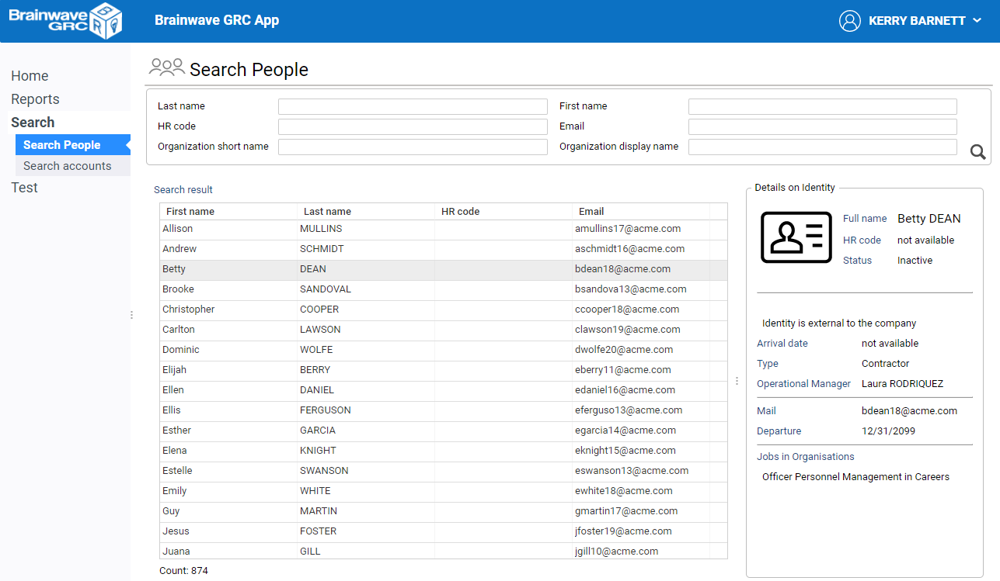
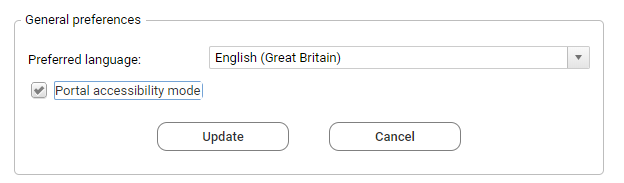
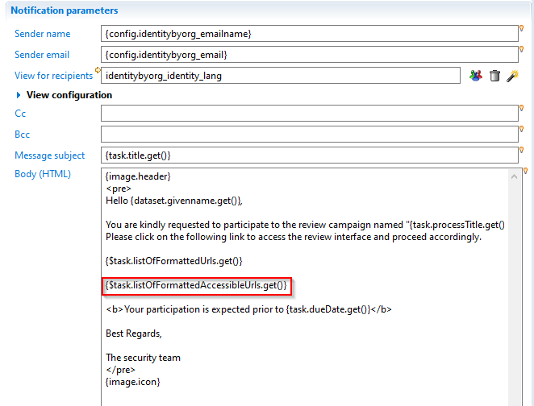
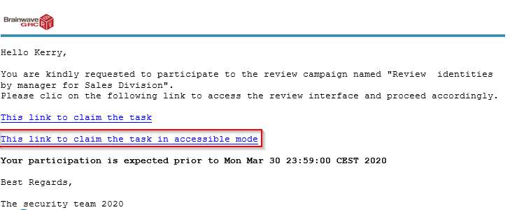
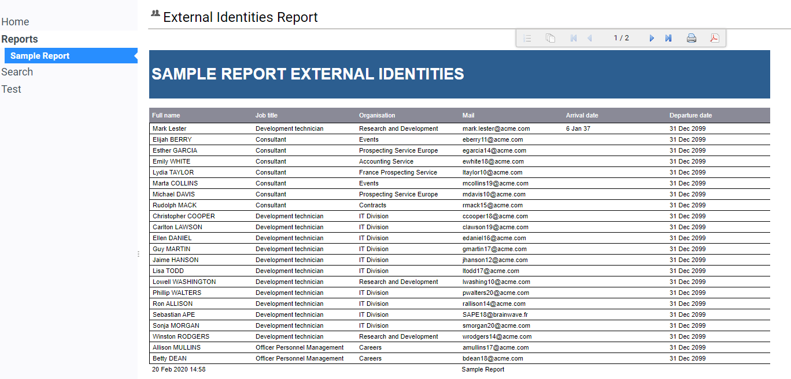

# Accessibility

The following chapter describes how to effectively implement accessibility in Brainwave's web portal.

> The default project has not been updated to be accessible compatible.
>
> To make a page or a report accessible, it is up to the consultant developing the project to ensure that the necessary steps are taken into account.

The following components of the web portal have been updated to be accessible out of the box:

- The login page
- The logout button
- Navigation menu bar
- User preferences

The pages language has been updated to allow the configuration of specific pages or reports to be accessible.

The complete list of accessible elements are detailed below :

- [Accessible page widgets](#accessible-page-widgets)
- [Accessible containers](#accessible-containers)
- [Alerts and dialog boxes](#alerts-and-dialog-boxes)

The selection of theses elements was done to ensure that the following common scenarios were made accessible:

- Common portal interaction
  - login/logout
  - Navigation through menus
  - User preferences
- Usage of the Search pages
- Usage of table based reports
- Usage of dedicated pages, such as review pages

As an example, when carrying out a task using only the keyboard, if an unnecessary number of keystrokes is necessary, then it is necessary to re-think and re-design the interactions in the page so that the same task can be performed with an acceptable number of key strokes.

Sometimes, redesigning pages for accessibility may be even beneficial to both end-users that do need assistive technologies (**AT**) and end-users that don't.

## System Requirements

Accessibility of Brainwave web portal has been successfully tested with the following combination:

- Reader software: *JAWS 2019*-  (from [Freedom Scientific](https://www.freedomscientific.com/products/software/jaws/) )
- Browsers: *Chrome*- 80+ or *Firefox*- 68 ESR  

Please note that Firefox requires JAWS to be already running when Firefox is started for accessibility to operate properly.  
Other reader software and browser combinations may result in partial accessibility.

## Enabling accessibility

When an end-user connects to the web portal, he can switch the portal to "**accessible mode**".


The accessible mode can be turned on/off for each different registered user either:

- By clicking on the *accessible link*- sent via notification

This is typically done in the context of a review campaign or when a batch report is available. In this case, the web portal switches to accessible mode for this user. In addition the choice is remembered the next time the same user connects.

To understand how to include accessible links in email notifications, refer to:

[Accessible Email notifications](#accessible-email-notifications)

- Via the *User Preferences*- page in the web portal

By checking the *Portal accessible mode*- option in the user preference page. The choice is remembered the next time the same end-user reconnects to the portal.


### Enabling accessibility on the server

In order for the accessibility option to become available to be turned on or off, it must be globally enabled on Tomcat web server by adding the following Java option:

```sh
-Daccessibility_enabled=true
```

On a server running on Windows, edit or create *setenv.bat*- file located in *CATALINA_BASE\bin*- directory with the following:

```sh
set CATALINA_OPTS=-Daccessibility_enabled=true
```

On a server running on Linux, edit or add *setenv.sh*- file located in  *CATALINA_BASE/bin*- directory with the following:

```sh
export CATALINA_OPTS=-Daccessibility_enabled=true
```

## Accessible Email notifications

When configuring email notifications for a review task request within a review campaign, you can include in the email a link to take the review task while switching the portal to accessibility mode.

To include this link, include the macro `{$task.listOfFormattedAccessibleUrls.get()}` to the mail body in the notifyrule editor :


Here is an example of the resulting email:


## Designing accessible pages

### Restricting content for accessibility

To provide accessible and non-accessible content for the same page, it is necessary to update the menus so that only accessible content is accessible to users that use Assistive Technologies.
In the same way, it is possible to show or hide widgets within the same page for accessible or not accessible content.

When the portal is in *accessible mode*- for the current user, he's granted a special *portal_accessible*- role that is broken down through configuration in *portal_accessible*- feature. This *portal_accessible feature*- can be tested to control menus and page content with regard to accessibility.

### Restricting menus

When the portal is in accessible mode, the following pages and reports will be including the navigation menu:

- Pages referenced by *menuitems*- that have *portal_accessible*- feature will be included in the menus. The page feature should be left empty (not set) to avoid conflicts.
- Reports referenced by *menuitems*- that have *portal_accessible*- feature will be included in the menus. The page feature should be left empty (not set) to avoid conflicts.
- Home pages, that ie, pages that have *homepage-for:*- set to *portal_accessible**.

### Routing to accessible pages

If the page is not reachable through a menu, as this is the case for review tasks pages, you can route to different pages , using the `conditional-redirect:` statement, as in the following example:

```page
identity_review = Page {
title: "identitybyorg"
    conditional-redirect:
       ConditionalRedirect {
         condition:  FeaturePredicate portal_accessible
         target: Page identity_review_a11y with taskId to taskId
       },
        ConditionalRedirect {
            condition: True
            target: Page identity_review with taskId to taskId
        }
     ...
}
```

### Filtering content within a page

You can filter content inside a given page using the *portal_accessible*- feature with *hidden:*- attribute or *ConditionalGroup**

## Accessible page widgets

The table below list the widgets that have been made accessible and can be used in accessibility scenarios pages.
Some complex widgets have only a subset of functionalities made accessible.

| Widget / Statement           | Accessible behavior                                                                                                                                                                    | ARIA                                                                    | Options that are accessible or Specific behavior                                                                                                                                                                                                                    |
| :--------------------------- | :------------------------------------------------------------------------------------------------------------------------------------------------------------------------------------- | :---------------------------------------------------------------------- | :------------------------------------------------------------------------------------------------------------------------------------------------------------------------------------------------------------------------------------------------------------------ |
| *Button*- and *ButtonGroup*- | tab focus, <br>activation with enter or space bar,<br> one-key shortcuts                                                                                                               | role=button, aria-label,  aria-pressed                                  | In the case of icon-only buttons, a tooltip must be specified to be used as aria label                                                                                                                                                                              |
| *Check Box*-                 | tab focus, activation with space bar,                                                                                                                                                  | role=checkbox , aria-checked, aria-label                                |                                                                                                                                                                                                                                                                     |
| *Radio Button*-              | tab/arrow focus, activation with space bar                                                                                                                                             | role=radio, aria-checked                                                |                                                                                                                                                                                                                                                                     |
| *Image*-                     | neutral                                                                                                                                                                                | role="none"                                                             | Only decorative images that do not carry any meaning or information should be used. If not the case, the image should be accmpanied with a Text widget with the same meaning                                                                                        |
| *Text*-                      | read-only text                                                                                                                                                                         | none                                                                    |                                                                                                                                                                                                                                                                     |
| *Edit*-                      | tabbed focus, reading label, typing text                                                                                                                                               | role="textbox", aria-label provided by *label:*- attribute of widget    |                                                                                                                                                                                                                                                                     |
| *Header*-                    | reads as level-2 heading                                                                                                                                                               | role="heading", aria-level=2                                            |                                                                                                                                                                                                                                                                     |
| *SearchEdition*-             | - search form, <br> - tabbing through search fields and entering text, <br> - enter key applies the search,<br>- auto-completion  (yellow bulb) is disabled when in accessibility mode | role="form" , each field will be aria-labelled with its label attribute | - only form mode is allowed so must have *simple-mode-only:True**.  <br> - Auto-completion is not active                                                                                                                                                            |
| *Table*-                     | - tabbed focus, <br> - reading grid label, <br> - reading column headers and total number of rows , <br> - navigating / selection with arrow keys                                      | role="grid", aria-rowcount  (and sub roles/aria-states)                 | - Table must be used in  single-selection only. <br> - *check-boxes*- are not allowed, <br> - *show-filter*- is not allowed, <br> - *configurable:*- is not allowed. <br> - *sortable:*- is not allowed on columns , <br> - *preserve-selection: True*- can be used |

## Accessible containers

| Container                        | Accessible behavior                                                                                                                                                                                                                  | ARIA                                                                                                                                                                                         | Options that are accessible                                                                                                                                                                                                                          |
| :------------------------------- | :----------------------------------------------------------------------------------------------------------------------------------------------------------------------------------------------------------------------------------- | :------------------------------------------------------------------------------------------------------------------------------------------------------------------------------------------- | :--------------------------------------------------------------------------------------------------------------------------------------------------------------------------------------------------------------------------------------------------- |
| *Group*-  or *ConditionalGroup*- | - if group has *region:True**, it's considered a *live region*- and any change to its inner content will trigger reading again the region's content <br> - if Group has *title:*- atttibute, it will be read as a heading of level 2 | - if Group has a *title:*- attribute, the title is considered as h2 title. (role=heading level=2) <br> -  if  *region:True**,  aria-role=region and aria-live = polite ansd aria-atomic=true | Group with *region:True*- (aria-live) should only include read-only widgets (basically text  and image) as interactive widgets such as tab folders and tables nested inside live region are not handled correctly by asssistive technology           |
| *Browser*-                       | reads browser title and inner content                                                                                                                                                                                                | -                                                                                                                                                                                            | Browser can be useful to include otherwise non-accessible content using a static html file. <br> Browser being technically an iframe that points to another html document, it's your responsibility to ensure the accessibility of the embedded html |
| *Splitter**, *Grid*- or *Flow*-  | neutral ( layout-only containers)                                                                                                                                                                                                    | role="none"                                                                                                                                                                                  | -                                                                                                                                                                                                                                                    |

## Alerts and dialog boxes

| Container                | Accessible behavior                                                                                              | ARIA                                                     | Remarks |
| :----------------------- | :--------------------------------------------------------------------------------------------------------------- | :------------------------------------------------------- | :------ |
| *Flash*-                 | - reads the alert. <br> - the flash box will disappear automatically after 15sec or if Esc is pressed            | role="alert"                                             |         |
| *Message*- or *Confirm*- | - reads the message box title , content, and button <br> - focus on OK button <br>- hit enter or Esc to close    | role="alertdialog" , aria-modal="true", aria-describedby | -       |
| *Dialog*-                | - reads the message box title <br> focuses and read the first interactive widget <br>- hit enter or Esc to close | role="dialog" , aria-modal="true", aria-describedby      |

## Non accessible widgets

This is a non-comprehensive list of widgets and containers that are not currently accessible and thus should not be used when accessibility is at stake.

- Tab Folder
- SetNavigator
- CrossTable, EditCrossTable and DynamicCrosstable
- HtmlIncludeWidget
- Chart
- Tree
- Combo
- Scale
- Spinner
- Tiles

## Designing accessible reports

A report as displayed in Brainwave web portal consists of an embedded *BIRT*- report,  plus a set of buttons to navigate across the report, print and export in various formats.



The toolbar buttons are all accessible, _i.e._ icons have a title and can be clicked using the keyboard only.

This is the list of BIRT widgets that are accessible and can be used in accessible reports:

| Widget                      | Accessible behavior                                                                                                                                                                              | Options or limitations                                                                                                                                                                                               |
| :-------------------------- | :----------------------------------------------------------------------------------------------------------------------------------------------------------------------------------------------- | :------------------------------------------------------------------------------------------------------------------------------------------------------------------------------------------------------------------- |
| *Table*-                    | table is read as a aria datagrid                                                                                                                                                                 | use simple tabular tables with column headers<br> don't use row groups and table footers                                                                                                                             |
| *Label*- and *DynamicText*- | the widget text is read.                                                                                                                                                                         |                                                                                                                                                                                                                      |
| *Text*-                     | - in plain text mode, the widget text is read <br> - in HTML mode, it depends on the HTML code. <br> - css styles applied to the text (ie h1, h2) are only visual and do not affect the semantic | Note that you can use Text in HTML to add more accessible behavior. <br> For example, to include a level-2 heading in a report, use <**h2**>title</**h2**> in HTML mode, instead of apply h2 css style to plain text |

## General accessibility guidelines

- Single page UI

Avoid interactions that span across several pages. Typically the default search page that opens another page to display details on the selected item.

- Prioritize information

When displaying many information on an item, (eg detail panel) put the most information first, so that it's read first.

- Shortcuts:

Add direct shortcuts to buttons that need to be used frequently, for example action buttons in a review page

- Accessible first

When possible, design the page with only accessible widgets, so that the same page will serve all users.

## Examples with code

The add-on below includes mandatory items to enable accessibility and a set of fully functional accessible samples:

| files                                     | description                                 |
| :---------------------------------------- | :------------------------------------------ |
| `searchIdentities_a11y.page`              | sample accessible search page on identities |
| `report_page.page table_report.rptdesign` | sample accessible report page               |

[Accessibility example add-on](https://download.brainwavegrc.com/index.php/s/qBnfXe3AD4JFyw9/download)
