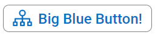
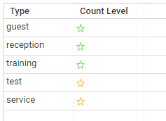

# Images and colors

## Named Colors

To ensure consistency of color use in your pages, and ease of maintenance, you can use **named colors** instead of hard-coding colors in your pages.

A Named color is declared with the **Color** keyword as follows:

```page
<name> = Color <colorspec>
```

Examples

```page
file: myColors.page

okColor = Color RGB(128, 255, 128)  //Green
warningColor = Color #FF6A22  //Yellow  
criticalColor = Color #FF0000
titleColor = Color Theme.foreground1
```

The value of a named color can be any valid color value :

| Type                      | Syntax                         | Example                                                          |
| :------------------------ | :----------------------------- | :--------------------------------------------------------------- |
| **RGB**                   | RGB( r, g ,b)                  | RGB(128, 25, 255)                                                |
| **HEX long**              | HEX ( #RRGGBB)                 | HEX ( #FF8080)                                                   |
| **HEX short**             | #RRGGBB                        | #FF8080                                                          |
| **RGB with transparency** | RGBA ( r, g, b, a)             | RGBA( 128, 25, 255, 0.5 )                                        |
| **standard color**        | red, green, blue, yellow, etc. | eg. red                                                          |
| **Theme color**           | Theme.{colorname}              | Theme.foreground1                                                |
| **another named color**   | {colorname}                    | titleColor.  Note that a named color should not reference itself |

The named color must be declared outside of a Page container, much like NLS, Constants, etc. usually in a resources.pages file.
It can then be used anywhere as follows:

- import the page file that include the color definition in your page
- reference the color by its name wherever a color can be used (ie mainly in styles)

Examples:  

```page
file: myPage.page

import "myColors.page"

okStyle = Style{
  font: "Arial"
  size: 12px
  foreground: okColor;
  background: Color white;
}

Page {
    Text {
      value: "OK"
      style: okStyle
    }  
}
```

## Theme colors

Theme page colors, as defined in the configuration, can be referenced in pages using `Theme.colorname` syntax.
This is useful to ensure consistent color usage across pages and add-ons.

The table below list the theme colors

| Color                         | Reference                                                                                                                                                                                                                        |
| :---------------------------- | :------------------------------------------------------------------------------------------------------------------------------------------------------------------------------------------------------------------------------- |
| **Foreground#1**              | text and icon color of general un-styled buttons in pages. This color can also be used in pages using `Theme.foreground1`                                                                                                        |
| **Background#1**              | background color of general , un-styled buttons in pages This color can also be used in pages using `Theme.background1`                                                                                                          |
| **Foreground#2**              | intended for text and icons of *primary* buttons in pages. This color can be used in pages using `Theme.foreground2`                                                                                                             |
| **Background#2**              | intended for background color of *primary* buttons in pages. This color can also be used in pages using `Theme.background2`                                                                                                      |
| **Foreground#3**              | intended for text and icons of *secondary* buttons in pages. This color can be used in pages using `Theme.foreground3`                                                                                                           |
| **Background#3**              | intended for background color of *secondary* buttons in pages. This color can also be used in pages using `Theme.background3`                                                                                                    |
| **Foreground#4**              | this color can be used in pages using `Theme.foreground4`                                                                                                                                                                        |
| **Background#4**              | this color can be used in pages using `Theme.background4`                                                                                                                                                                        |
| **Selection**                 | color of selected items in common widgets in pages (eg. table selected rows, tab folder selected tab,  combo box selection, etc...). This color can be used in pages using `Theme.selection`  for example in custom html widgets |
| **Focus**                     | color of highlighted area when a wiget is in focus (eg. button, check-box, table, tab-folder, text edit, etc...)                                                                                                                 |
| **Custom#1 through Custom#5** | these colors can be freely used in customer projects pages using `Theme.user1` through `Theme.user5`                                                                                                                             |

[Theme configuration](../installation-and-deployment/brainwaves-web-portal/web-portal-theme-customization/level-1.md)

## SVG images

It's now possible to use SVG images in portal pages, wherever bitmap images are accepted.
Since SVG images are vector graphics, they can be rendered at any size, without loss of precision.
You can specify an optional size when using an svg image in Pages. For example, you could use the same *account* svg image file to display as a list of small icons in a table , and a larger image in accounts detail panel.

Moreover, monochromatic SVG images can be dynamically colored to a given color, and the same svg image can be displayed at different places with different colors. This is especially useful in tow use cases:

- matching the graphical chart colors of a company
- displaying images with dynamically computed colors ( eg. red / green / blue)

## Modifying images using Style

**Style** statement has been extended to support image sizing and coloring for SVG.
Sizing and coloring applies to widgets for which the style is assigned using `styling:` statement.
You can combine image styling with other styling attributes ( text size and color, background color ) .

| Option           | Meaning                                                                                                                                                                          | Example              |
| :--------------- | :------------------------------------------------------------------------------------------------------------------------------------------------------------------------------- | :------------------- |
| **image-color**  | optional, allows to colorize SVG image with the specified color.                                                                                                                 | image-color: #FF0000 |
| **image-width**  | optional, allows to scale an SVG image to the specified width in pixels. If only width is specified but not height, assumes the icon is square and sets image height accordingly | image-width: 32px    |
| **image-height** | optional, allows to scale an SVG image to the specified height in pixels                                                                                                         | image-height: 20px   |

> Technically speaking , coloring an SVG image means dynamically replacing any `fill=color` or `fill: color` within the SVG source with the specified color.
If no fill statement is present in the SVG file, coloring will have no effect.
Moreover, any `stroke` (lines coloring) attribute present in the SVG file will not be affected by coloring.

> Resizing an SVG means dynamically adding or replacing existing `width="xxx"` and `"height="yyy"` occurrences within the SVG file with the provided new width and height.

### Example 1: big colored button

```page
blueColor = Color #0C71C3

bigBlueButton = Style {
  size: 24px
  background: Color white
  foreground: blueColor
  image-color: blueColor
  image-width: 32px
  image-height: 32px
}

myPage = Page {
....
  Button {
    text: "Big Blue Button!"
    image: "svg/orga.svg"
    styling: bigBlueButton
    actions: Flash "action"
  }
}

```



### Example 2: table with status icons

```page
 /* colors and styles */

okColor = Color #51cb3a
warningColor =Color #FEA31B
criticalColor = Color #FF3535

 risk_baseStyle = Style {
    image-width: 12px
 }

 risk_criticalStyle = Style( risk_baseStyle) {
   image-color: criticalColor
 }

 risk_warningStyle = Style( risk_baseStyle) {
   image-color: warningColor
 }

 risk_okStyle = Style( risk_baseStyle) {
   image-color: okColor
 }

 riskStyleTemplate = IntStylingTemplate {
  when > 40 then risk_criticalStyle
  when > 20 then risk_warningStyle
  otherwise risk_okStyle
}

/* page content */
myPage = Page {
....
    Table {
      data: counts
     Column {
        column: noownercode
        header: "Type"
      }
      Column {
        column: count
        header: "Count Level"
        image:  "svg/fav.svg"
        text: ""
        styling: StylingTemplateSelection ( Current count) using riskStyleTemplate
      }
    }
}
```



## Image Maps

An **Image map** is a named set of images, similar to NLS for text strings.  Each image in the image map is referenced using a unique logical name.
The main benefit of image maps is to simplify maintenance of numerous images across different projects and add-ons.  For example, if you modify an image file name or location, you only need to change its reference in the image map and the change will be reflected in all occurrences.

To define an image map, use the following syntax:

```page
<imageMapName> = ImageMap {
   (<entryName> [ "<path_to_image" ] )*
}
```

Here is a basic example of an ImageMap than references default small entities icons ( grey / 16 px)

```page
file: image-maps.page

conceptsSmall = ImageMap {
  account [ "16/audit/grey/account_16.png" ]
  identity [ "16/audit/grey/identity_16.png" ]
  application [ "16/audit/grey/application_16.png" ]
  organisation [ "16/audit/grey/orga_16.png" ]
  permission [ "16/audit/grey/perm_16.png" ]
}
```

You can then reference an image map entry in pages anywhere an image is accepted using the following syntax:

```page
%imageMapName.entryName
```

As usual, you also need to import the page file that declares the image map.

For example, referencing the identity icon as small icon of identity search page:

```page
import "webportal/image-maps.page"

identitySearchPage = Page {
  title: $search.identity.title
  icon: %conceptsSmall.identity
}   
```

In the case of SVG images, it's also possible to size or colorize the image directly in the image map entry using the following syntax:

```page
<entryName> [ "<path_to_svg>" [ width: <number>px]  [ height: <number>px]  [ color: <color_value> ] ]
```

where `<color_value>` is any acceptable color constant expression.

For example, it could be possible to define different images maps for different colors and or sizes, using the same reduced set of SVG images.

Considering again the concepts image maps, let's define two images maps for large and small concepts:

```page
conceptsSmall = ImageMap {
   account [ "svg/account.svg" width: 16px ]
   identity [ "svg/identity.svg" width: 16px ]
   application [ "svg/app.svg" width: 16px ]
   organisation [ "svg/org.svg" width: 16px ]
   permission [ "svg/perm.svg" width: 16px ]
}

conceptsLarge = ImageMap {
   account [ "svg/account.svg" width: 48px ]
   identity [ "svg/identity.svg" width: 48px ]
   application [ "svg/app.svg" width: 48px ]
   organisation [ "svg/org.svg" width: 48px ]
   permission [ "svg/perm.svg" width: 48px ]
}
```

Usage:

```page
import "webportal/image-maps.page"

identitySearchPage = Page {
  title: $search.identity.title
  icon: %conceptsSmall.identity
  large-icon: %conceptsLarge.identity
}   
```

You can freely combine size and color modifications using both ImageMap and Styling.

The example below defines a default button style that uses the configuration default button color for text and icons.

```page
defaultButtonStyle = Styling {
  icon-color: Theme.foreground1
  foreground: Theme.foreground1
}

Button {
   text: "Default Identity Button"
   image: %conceptsSmall.identity
   styling: defaultButtonStyle
}
```

> If an image color is set in both an image map and a style, and both are applied to the same widget, the image map color setting will take over. The same goes for image width and height.
When maximum flexibility is needed, it's advised to not set colors and sizes in ImageMaps, but rather using styles.
