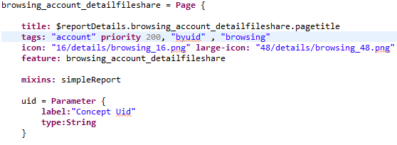

# Detail pages

In older versions (pre 2015), the detail functionality was provided by BIRT reports. Now, the details of an element are provided by a Detail Page with a new user interface.  

The Detail pages display what is considered to be the most relevant information of the element. At the same time, it includes links to reports and pages to obtain more information.  

## linking to a Detail Page

The recommended way to link to a Detail Page is to use the default Detail Activity as follows:  

However, it can also be linked to as any other page using **GoTo Page**.  

## Required parameters

The only mandatory parameter is the **UID**, the name of the parameter changes according to the concept following the format: **paramConceptUid**.  

Some examples: **paramAccountUid**, **paramIdentityUid**, **paramPermissionUid**.  

Detail pages support the new search and navigation system, and for that reason they accept the optional parameters: [paramSearchMode and serialized searches](./03-search-pages#search-pages-and-navigation-system).

## Adding links

There is no need to modify the Detail Pages in order to link to new reports or pages. As detail pages implement the [tagging system](./index#tags), it is enough to properly tag the new reports/pages following the default tags an comply with the requirements.  

The detail page of a concept includes links to pages and reports that will provide more information about the concept that is being reviewed. These reports and pages have been classified in 4 categories according to their goal:     **browsing** , **review** , **mining** and **analytics**. At the same time, reports are built using standard BIRT report files or as a page document.  

As a general practice, the declaration of BIRT reports is done in the files `webportal/pages/reports/custom.page` and `webportal/pages/reports/standard.page`.  

Pages, on the other hand, are located in a subfolder that matches their category. In this way `webportal/pages/reports/browsing` includes pages that will serve as browsing reports.  

New pages and reports that follow the custom tags and comply with requirements will be automatically linked from the detail pages.  

The detail pages have been designed to create the links dynamically taking advantage of the [tagging system](./index#tags). They will link automatically to all pages and reports that are properly tagged with the same concept and that expect to receive the UID as a parameter. The Identity Detail page will link to all pages and reports that contain the tags **identity** and **byuid**. Follow the default tags and comply with the requirements in order to obtain the best results.  

### Parameters

Detail pages will send:  

- The **recorduid** of the concept being reviewed, this parameter is sent in order to guarantee backwards compatibility with legacy reports that use the uid. The use of this parameter in new pages and reports is **strongly** discouraged. The best practice is to use the **uid** instead.
- The **uid**  of the concept being reviewed, serves as default identifier of the element.
- Two parameters related to the search mode:  [searchMode flag and the serialized search](./03-search-pages#search-pages-and-navigation-system).  

The page and report might use more parameters; However, they will not be sent by default by the detail page. For that reason, it is recommended that any other parameter is declared optional.

### Default Tags

The minimal required tags are:  the concept tag and the **byuid** tag. However, best practice is to include a third tag that matches the category:

|  **Tag** | **Description** | **Priority** |
|:--|:--|:--|
|  The concept tag | This tag is directly associated to the concept. The tags used.  **account, application, group, identity, organisation, permission, physical,  physicalaccess, repository, sharedfolder and sharepoint** | The priority declared on this tag is related to the order in which the link will be displayed. The value is one of the default priorities and is related to each of the categories. The idea is that that the link are displayed by category |
| **byuid** | This tags means that the page or report expect to receive the uid as a parameter. | Not used |
| **browsing**  | Browsing reports and pages | Default value is 200, declared in concept tag |
| **review**  | Review reports and pages | Default value is 300, declared in concept tag |
| **analytics** | Analytics reports and pages | Default value is 400, declared in concept tag |
| **mining** | Mining reports and pages | Default value is 500, declared in concept tag |
| **printable** | Tag used to identify the printable version of the detail page. Only one report by concept should be tagged as **printable.** By default , the old reports used as detail reports use this tag. | Default value is 100, declared in concept tag |

An example of a properly tagged browsing Page:

#### Requirements

For better results, a **Page** or a **Report** that is to be linked from a Detail Page should:  

- Be tagged with 3 tags following the default tags
- Include a priority, associated to the concept tag
- Have a large-icon sized 48px. The recommendation is to use 1 icon by category.
- Having a icon sized 16px is not mandatory but recommended
