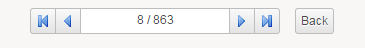
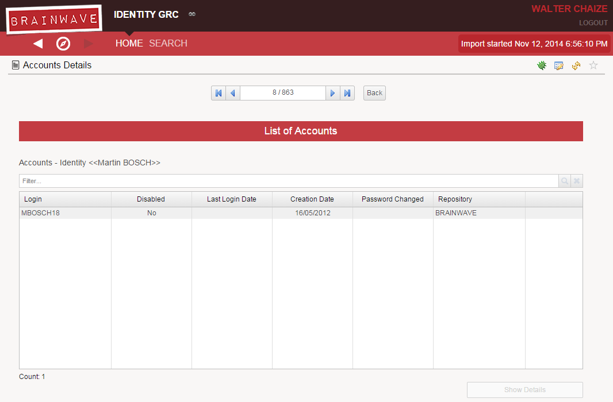
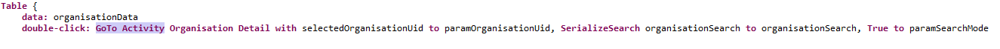
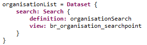

# Search pages

The Search Pages Menu has also been rewritten in order to be more dynamic. It takes advantage of the new [tagging system](./index#tags).

The new Search Pages Menu searches for pages or reports tagged using the default tags. In order to be properly displayed they should comply with the requirements.

## Default Tags

The Search Pages Menu uses the following tag:  

| **Set of Tags** | **Description** |  **Priority** |
|:--|:--|:--|
|  "**conceptsearch**" | This includes pages or reports that have as main goal the search of concepts. For example: search of sharepoint elements .  | Priority is used to set the order of the buttons in the menu. It starts in 50 and finishes in 550 using increments of 50. |

It is compatible with the tags used in the [General Menu](./02-general-menu).

## Requirements

- The **description** field must be used since it will contain the text to be displayed in the button. The good practice being to keep this short. Example: Sharepoint. The **title** is not used in the Search Pages Menu to allow compatibility with the [General Menu](./02-general-menu).
- The **largeIcon** filed must be declared. It should be an image with size of 48px. It is recommended to follow the look-and-feel
- Search Pages must not expect to receive any parameter.

## Search Pages and Navigation System

  

Search pages have been reviewed and completely modified. A new widget has been included to bring the richness of the core search engine to the webportal. The widget support 2 modes of operation: simple and advanced.
In the simple mode, the most commonly used fields are exposed to offer the possibility to filter. In advanced mode, it allows to create advanced queries like the desktop client would.  

The capabilities of the new search system don't stop there. When a query has been built the set of results are kept in the [Detail Page](./01-detail-pages). It is represented as a Navigator:  

  

The navigator is a widget that allows to move from an element to another in the set of results. It also allows to go back to the search in case the user needs to modify it.  

But the navigator is not only present in the [Detail Page](./01-detail-pages) , any page can support the navigator functionality. It has also been implemented in the new pages that handle the reports category browsing.  

  

This allow the user to browse in depth the details of the elements in the result set.

### Search widget

The Search Widget is called **SearchEdition** and requires a **SearchDefinition**. They are declared as following:  

  

The search definition can be serialized to be sent as a parameter. This is needed so that the next page can use the definition to support the navigation function together with the parameter **paramSearchMode** which is a boolean flag indicating whether there is a search defined or not:  

  

This two parameters are sent by default from the Search Pages to the [Detail Page](./01-detail-pages) and from there to all the [pages and reports it links to](./01-detail-pages#adding-links}). The target pages may use them to show a navigator. By default , the navigator is supported in all browsing pages.

### The search Navigator

For a Page to support the navigator function it should:  

- Receive as parameters a **search definition** and a **paramSearchMode**  


- Define a variable to hold the UID of the selected item. The navigator will modify this variable, so all the datasets in the page should use this variable to represent the current item. It is recommended to use the paramConceptUid as an initial value of this variable:  

  

- Declare a navigation list  that is build from the search definition  

  

- Insert a navigation object , customizing the desired behavior when clicking on **back-link**. Example:

  

This is in general the way the navigator is implemented in the browsing pages.  

### limit the autocompletion scope

As of version `2016 R3 SP6` a fonctionality has been added that allow the consultant to limit the autocompletion results of the SearchEdition widget. In other words this allow the consultant to limit the entries visible for a given user through the autocomplete.  

For this a new parameter has been added to the `SearchEdition`: `completion-view`  

This can be configured either:  

- By passing the desired parameters to a specified view:  

```page
SearchEdition {
 definition: applicationSearch
 layout: Layout { grab: horizontal True vertical False }
 simple-mode-columns: 2
        simple-mode-layout: SimpleModeLayout {
     code { label: $application.code },
     name { label: $application.displayname }
 }
 completion-view: [
 Application as <view> with <page parameters> to <view parameters>
 ]
}
```

- By using a view where the perimeter has been configured and the perimeters have been defined in the corresponding `.roles` files. See [Features and Roles](../21-features-and-roles/index) for more information on how to configure perimeters in the `.roles` files.  

Several components can be declared at the same time. The list of applicable components is as followed:  

- Application
- Account
- Asset
- Group
- Identity
- JobTitle
- Organisation
- Permission
- Reconciliation
- Repository
- Right
- TicketLog
- Usage

> Please note that only the declared components will be filtered.

## Search Page timeouts

In version 2015 of brainwave the webportal it is possible to create your own search rules.  
The effect is, that depending on the data collected, the execution of these search rules can take significant amounts of time before returning a result. During this time your navigator is frozen.  

In order to avoid these delays a timeout has been positioned.  

To configure the timeout you need to add to the following parameters to the source view of your technical configuration between the `<WebPortal></WebPortal>` tags, the property value is provided in seconds:  

```xml
<Property name="dataset.search.short-timeout" propertyvalue="15"/>
<Property name="dataset.search.long-timeout" propertyvalue="30"/>
```

- `dataset.search.short-timeout` corresponds to a first message. In this case after 15s a message will ask the user if he would like to continue or abandon the search
- `dataset.search.long-timeout` corresponds to the amount of time after which the search is aborted.

> **Note**: If the user decides to continue the search, then the webportal will re-execute it from scratch. As such it is required to increase the value of `dataset.search.long-timeout` in comparison to `dataset.search.short-timeout`.  

## Change columns in the advanced search pages

The columns displayed in the advanced search pages depend on standard views of the default project. If you wish to change the columns displayed it is necessary for you to change the default search page as well as the view used.  

> It is highly recommended to create a new view and/or rule when applying these modifications to the default project as other pages can depend on the default view. Changes applied to the view could then affect other pages.  

Here are the steps to follow:  

1. locate the view used in the advance search page
2. navigate and change the corresponding view adding your required attributes
3. Add the columns to display to the page
4. Apply the changes to the web portal

### Locate the used view

The first step would be to locate the views used in the advanced search page. As an example to add a column to the advanced group search you should navigate to: `\webportal\pages\group\search.page`.  

In the case of the group search, the view used in the search page is found:  

```page
groupData = Dataset {
   search: Search {
     definition: groupSearch
     view: br_group_searchpoint
   }
}
```

### Navigate and apply changes to the view  

When navigating to the view you can see that each attribute in the view corresponds to a column in the advanced search page. You can add your desired attributes to the view. In the following example the import action and deleted action attributes were added to the view.  

If you have duplicated view to work on a separate copy do not forget to change the name of the view called in the page (e.g. the `br_group_searchpoint` in the groupData).  

  

To be made visible in the webportal, the added attributes must also be added the corresponding page search.page.  

> It is not recommended to add a new component to the view as it can impact the results directly. If you are required to add a component then only add LEFT JOINS !

### Add the columns to display to the page

In the page locate the table corresponding to the displayed data and add the columns corresponding to the attributes added to the view. For each added attribute the corresponding following block should be added :  

```page
Column {
 column: repository_ATTRIBUTE
 header: $prepository.ATTRIBUTE
 width: 250px
 sortable: True
 initially-masked: True
}
```

The initially-masked option enables you to initially display or not the column.  

### Apply the changes to the webportal  

Applying the changes to the web portal will depend on your technical configuration. You have three possible configurations:  

1. If the project is included in the WAR you have to re-export the war file.
2. If you chose to detach the project from the WAR but did not activate the option to automatically reload modified pages you have to restart the web portal
3. If you chose to detach the project from the WAR and activated the option to automatically reload modified pages you have to refresh the page  

You can find the type of configuration used in your context in the Web portal and Export tabs of your technical configuration.

### Remarks

You should note that, as each search page depends on a different initial component if you change the displayed columns for the advanced Identity search, these changes will not apply to the advanced group search. The modifications have to be done for each initial component.
