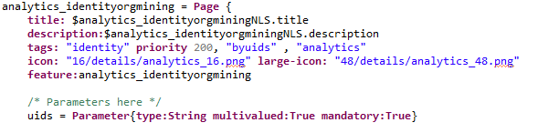

# Analytics section

An analytics section has been added to the search pages as of version 2015 R3. Thanks to this section you can add your search results in a dedicated pages or report for further analysis:  

## Enable/Disable

The analytics section is attached to a 'feature'. The current user must have the feature to see the 'show/hide' analytics button.  

The corresponding features are located in the `/webportal/features/pages.featureconfiguration` element:  

|  **feature name** | **description** |
|:--|:--|
| `identitysearch_analytics` |  Show the analytics panel in the identity search view |
| `accountsearch_analytics` |  Show the analytics panel in the account search view |
| `applicationsearch_analytics` |  Show the analytics panel in the application search view |
| `groupsearch_analytics` |  Show the analytics panel in the group search view |
| `organisationsearch_analytics` |  Show the analytics panel in the organisation search view |
| `permissionsearch_analytics` |  Show the analytics panel in the permission search view |
| `repositorysearch_analytics` |  Show the analytics panel in the repository search view |

## Managing analytics pages and reports

The search pages have been designed to create the links dynamically to analytics pages and reports taking advantage of the [tagging system](./index#tags). They will link automatically to all pages and reports that are properly tagged with the same concept and that expect to receive the UIDs as a parameter. The Identity Search page will link to all pages and reports that contain the tags **identity** and **byuids**. Follow the default tags and comply with the requirements in order to obtain the best results.  

## Parameters

Search pages will send:  

- The **uids**  of the concept being reviewed, serves as identifier of the elements selected in the search view.  

The page and report might use more parameters; However, they will not be sent by default by the search page. For that reason, it is recommended that any other parameter is declared optional.

## Default Tags

The minimal required tags are:  the concept tag and the **byuids** tag. However, best practice is to include a third tag that matches the category:  

|  **Tag** | **Description** | **Priority** |
|:--|:--|:--|
|  **The concept tag** | This tag is directly associated to the concept. The tags used. **account, application, group, identity, organisation, permission, repository** | The priority declared on this tag is related to the order in which the link will be displayed. The value is one of the default priorities and is related to each of the categories. The idea is that that the link are displayed by category |
| **byuid** | This tags means that the page or report expect to receive the uid as a parameter. | Not used |
| **browsing**  | Browsing reports and pages | Default value is 200, declared in concept tag |
| **review**  | Review reports and pages | Default value is 300, declared in concept tag |
| **analytics** | Analytics reports and pages | Default value is 400, declared in concept tag |
| **mining** | Mining reports and pages | Default value is 500, declared in concept tag |
| **printable** | Tag used to identify the printable version of the detail page. Only one report by concept should be tagged as **printable.** By default , the old reports used as detail reports use this tag. | Default value is 100, declared in concept tag |

An example of a properly tagged analytics Page:  

The uids parameter should be used as such in the views :

> [warning] Please note that due to a technical constraint the uids parameter won't be able to address more than 2000 distinct values.
