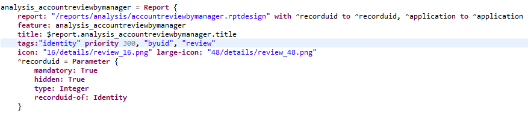
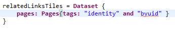
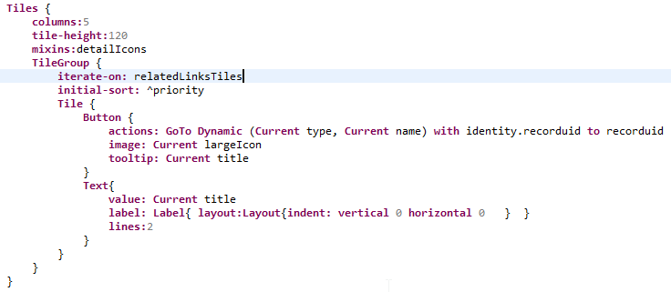

# Webportal features

An effort has been made to obtain a framework that is more flexible.  

From homepages to browsing reports. Pages have been restructured to include new Search and Detail Pages to improve the general user experience, reduce the workload and encourage modular development.  

The following pages are dedicated to describe the new functionalities and to serve as documentation and a guide.  

## Tags

In the declaration of a **Page** or a **Report** in the pages language it is possible to assign one or many tags to each report and page.

This functionality is used to classify the different pages or reports into different categories or groups. In this way, all pages that expect to receive as a parameter a uid can be part of the group `byuid` and be tagged accordingly.

Since multiple tags are supported, it is possible to be more strict in the classification and a page could for example be part of the groups: **byuid**, **identity** and **review**. In this case the page expects to receive a uid but at the same time is related to the concept identity and offers a **review**.  

### tag procedure

Tagging a **Page** or a **Report** is easy, it is part of the pages language and is added in the declaration (**tags**) as following:

  

And for a **Report:**  

  

### Tag advantages

The pages language includes some features that allow to take advantage of the tagging system. Probably the most Important is the ability to create a **Dataset** that will filter objects by their tags:  

  

This **Dataset** will contain all pages and reports that have been tagged as **byuid** and **identity** , the resulting objects may or may not contain more tags. When the keyword **and** is used, the results will include **only** the elements that contain **all** the tags. The **Dataset** is populated dynamically. All the new pages added to the project containing these 2 tags simultaneously will be added to the **Dataset**.  

With this information , it is possible to use one of the widgets that support iteration like **GridRowGroup** in a Grid or **TileGroup** in Tiles. This example will create tiles  that link to the pages or reports in the **Dataset:**  

  

It is possible to use the keyword **Current**  to have access to the information declared in each object like: type, name, title, icon or largeIcon.  

As shown above, it is possible to declare a **priority** when tagging. This priority may have different meanings but it is by default used mainly to give an specific order to the objects. Using the feature **initial-sort**: priority will sort the objects by ascending priority.  

### Access Control to Pages and Reports

This issue has been taken into consideration. The good practice on this subject is to define a feature in each **Page** and **Report**. Features can be created in a one-per-element basis or the same feature can be assigned to several elements that will be shown or hidden as a unity.  

A **Dataset** of tagged elements will be filtered by their features. Meaning that it will contain elements with **no feature**  and elements with features that are assigned to the profile of the current user. Leaving an element without feature is to be **avoided**.

### Default Tags

Some tags have been declared by default in the Webportal. This have been done mainly to dynamically link to different reports and pages. Like that, many different sections of the portal will be automatically refreshed to include links to new report and pages with minimal modification. The sections that implement this system are easy to extend with new pages and reports. The only requirement is that the new elements are tagged properly following the standards of each section.  

It has been implemented in:  

- [General Menu in the Home Page](./02-general-menu)
- [Search Pages Menu](./03-search-pages)
- [Reports and Pages in the Detail Pages](./01-detail-pages#adding-links)