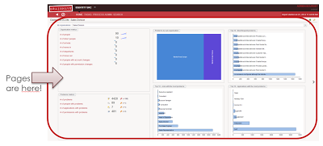
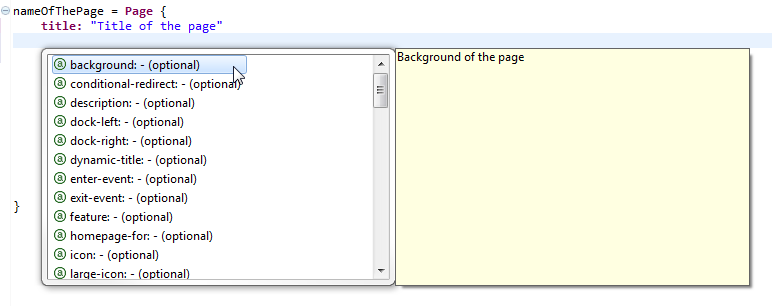
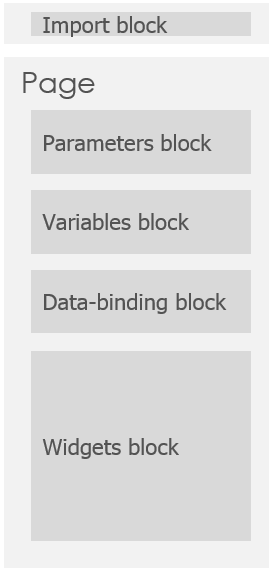
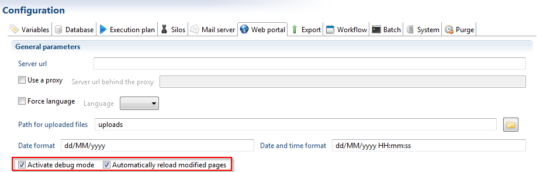
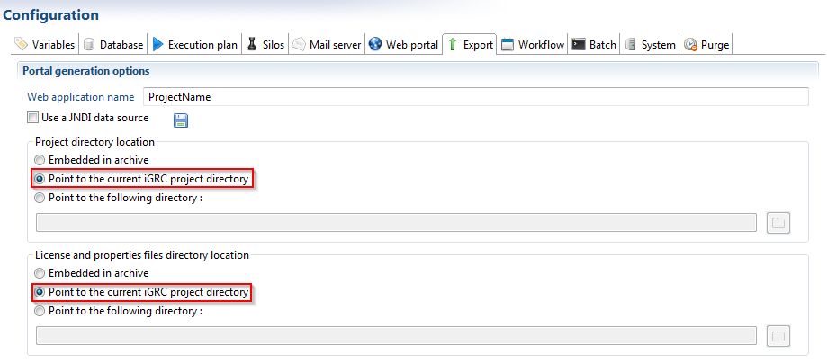
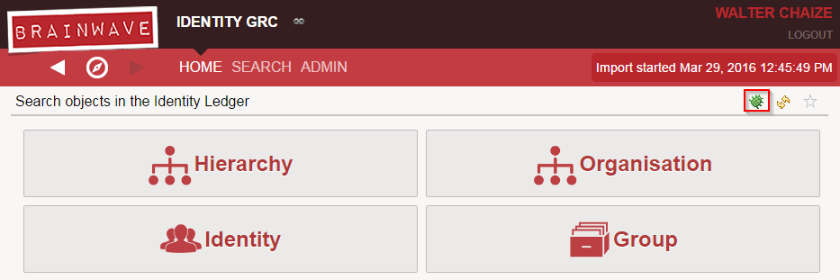

# Pages

Pages is the Brainwave data visualization technology that leverages the Identity Ledger data through the web portal.  
Through this technology, you can declare your own dashboards, analytics, forms or workflows GUIs in the web portal.  
A Page can be as simple as a 1 KPI dashboard or as rich as the Workflow Task Manager.  
All the web portal interfaces are provided as Pages along with their .sources!  

  

## Things to know

- Pages in the project are located under **/webportal/pages**
- Pages are defined in `.page` files
- As a best practice, 1 file should contain only 1 page
- Pages are part of your project and will be part of the exported .war file
- This export behaviour can be customized in the technical configuration

## Structure of a page

In the Pages language all the elements are declared as objects. Objects are declared following the syntax:  

```page
objectIdentifier = ObjectType {
    attribute: "Value"
}
```

There are many types of objects that we will cover in this and the following pages. Some of them:  

**Pages** are the main containers, they represent one page in the webportal and their identifier must be unique in the whole project. Pages is the object with the biggest scope and can contain many objects.  

**Parameters** , **Variables** , **Datasets** and **Records** are objects with a limited scope. Their identifiers must be unique in the page that contains them.  

**Widgets** don't require an identifier, they are objects that represent elements inside a page. They will be rendered and displayed.  

### Page Object

A page is declared in the following way:  

```page
nameOfThePage = Page {
    title: "Title of the page"
}
```

This declares a Page object with the name or identifier **nameOfThePage**, the identifier must be unique in the whole project and it will be used to create links to this page.  

A page can have many attributes , but only 1 is required: title. To browse the list of attributes supported by the language, we can always use the autocompletion as a guide. Using the key combination **Ctrl + Space**  will show a list of possible keywords or objects to include:  

  

### Objects in a Page

After the attributes, the page will contain objects organised in **blocks** following this structure:  

  

All the blocks are **optional**  but they must be declared in that fixed order

### Import Block

The import block is a very particular block. It can be used to reference another file with resources that can be reused. The syntax is as following:  
`import "/webportal/pages/resources/mappings.page"`

### Hello World Page

A minimal hello world page will look like this:  

```page
nameOfThePage = Page {
 title: "Hello Word Page"
     homepage-for: All priority 100000

 Text {
 value: "Hello World !!"
 compact: True
 }
}
```

We are using the Text widget to display a message.

### Things to Remember

- The identifier of each page **must be unique** in the project. Duplicated identifiers will cause errors when the webportal is started
- **Ctrl + Space** will activate the autocompletion
- **Ctrl + Clic** on some references will jump to the definition (other page, view, ...)
- Blocks of objects must be declared in the defined order: Parameters, Variables, Data-binding and Widgets

## Pages in the technical configuration

The tab **Web portal** of the technical configuration of your project allows you to customize many options of the webportal and also the behaviour of pages.  

At the same time the tab **Export**  allows you to define whether or not your pages should be included in the .war file generated with the webportal  

### Development

For pages development, it is recommended to tweak the technical configuration to have the pages reloaded automatically. Like this, it is possible to see the changes on-the-fly.  
At the same time, it is also recommended to activate the "debug mode", so that we can inspect values of parameters, variables and other important information while we develop.  

This can be done:  

- Ticking the checkboxes "Activate debug mode" and Automatically reload modified pages in the tab **Web portal**

  

By default, a timeout interval of 10 seconds is set between pages reload. You can reduce this interval through the `pages.auto-reload.interval` property.  

- Selecting the options to point to current iGRC project directory in the **Export** tab  

With this option, the project will not be embedded in the .war file. The portal will load the files directly from the current directory. We will be working with the same files that are being deployed.  

  

After changing these options in the technical configuration, we can save it, **Generate Web portal** and deploy the portal.  

Our development environment is now ready. The .page files will be read and parsed when the application server is restarted. Changes to existing pages will take effect on-the-fly.  

### Debug Mode

Activating the debug mode as described before, can be useful to inspect the values of parameters and variables of the pages.  
When the debug mode is activated correctly , you will be able to see the icon of a little bug in every page :  

  

Clicking on it will display a dialog box with information about the variables and parameters of the page.
