# Reconciliation Policies

When creating a reconciliation rule, it is not known for which repository it applies. It is only in the Result tab of the rule editor that you can filter by repository name to view the accounts that have been reconciled there.  

The reconciliation policy allows you to define, for each reconciliation rule, the repository in which it must be executed.  

This way the reconciliation policy allows you to globally define the reconciliation operations to perform, repository by repository. Once a reconciliation policy is configured, it can be referenced in the execution plan and be automatically executed on new orphan accounts on each data load.  

> [!warning] Please note that reconciliation policy can be resource consuming depending on complexity of the reconciliation rule used and also on number of account criteria within the rule.
>
> The first stage in the reconciliation is used to set the cache up with the data used to be used. It is possible fot the progress bar to appear stuck before the account reconciliation is started.

## Understanding the reconciliation rule sequence

Reconciling an account with the correct identity requires the use of precise search criteria when configuring a rule, for example, a unique HR id criterion. However, this rule does not reconcile accounts belonging to internal company identities that do not have HR unique identities such as people from outside the company. It will, therefore, be necessary to create another rule to reconcile these accounts. This rule can, for example, relate to the account user's email criterion.  

In order to execute all the rules you need for the reconciliation, you can create a reconciliation policy. In the main menu, click on **new \> reconciliation policy**. Here you will define all the reconciliation rules on the repositories you need.  

To add rules to your reconciliation policy, click on the **"Add"** button. On the right part of the screen, select the repository, then you can choose the rules for this repository by clicking on **"Add"** on the right part of the screen.  

In the event that several rules are executed in the same repository, the reconciliation policy engine behaves like a rules sequencer.  

You have two possibilities for sequencing rules:  

### Sequencing reconciliation rules

  

For each account, the engine searches to find its identity in the Ledger. You have three scenarios in the execution of the first rule:  

- The engine finds the identity. The result of the reconciliation is written in Ledger and the engine goes to the next reconciliation account.

- The engine does not find the identity. The next rule is executed on the same account.

- The engine finds several identities. Execution of the rule by the account is stopped and the engine goes to the next reconciliation account. Please note, that the accounts that match several identities are not considered for the following next rules as they are less reliable.  

> [!warning] The rules are sorted from the most precise to the most general. It is, therefore, necessary to sequence them according to the criteria used in the configuration.

### Sequencing repository reconciliations  


For each account, the reconciliation policy engine executes the following rules if no identity was found in the execution of the first reconciliation rule.

## Referencing the reconciliation policy in the execution plan

Once you have created your reconciliation policy you must reference it in the execution plan.  

Please see [here](../../timeslots-and-execution-plan/timeslots-and-execution-plan) to understand data loading in the execution plan.  

This stage corresponds to the execution of all the reconciliation rules on the repositories that were defined in the reconciliation policy. The accounts are reconciled and the results saved in the Ledger in the active analysis period.  

- On the main menu click on **technical configuration**  then on **Execution Plan** tab.

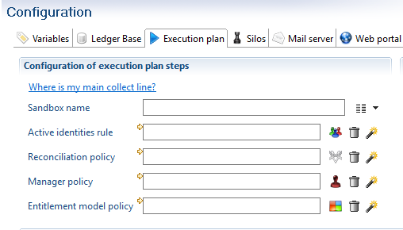  

- Click the  button to select your reconciliation policy

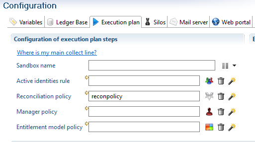  

- You can delete your reconciliation policy reference by clicking   
- You can create your reconciliation policy with the help of the reconciliation policy creation wizard button   
- To manually run you reconciliation policy, in the main menu click on **Open the execution plan**. The  button allows you to execute your reconciliation policy.  


## Marking ownerless accounts

In addition to reconciling accounts to database identities, it is possible to automatically mark ownerless accounts by giving them a code that corresponds to their type (service account, training account, administrative account, etc.). This step, which is configured in the same way as the account reconciliation policy in the **Accounts without owner**  tab, is performed on each repository before applying the reconciliation rules.  

For each repository, you can choose a list of rules that will be applied in a predefined order. Here we are dealing with simple rules ( **.rule**  extension files) based on accounts, and not reconciliation rules. All accounts that are returned by the rule are marked with the defined code.  

Example: If we know that in the OpenLDAP repository, all training accounts have a login starting with **'FORM'**. So we will create the following rule called `OpenLDAP_formation.rule`:  

  

We add this rule to the reconciliation policy in the **Accounts without owner**  tab for the repository in question. A new code 'formation' is created to associate with this rule.  

  

In the **Results** tab, the ownerless accounts appear in both the summary statistics and in the details if you click on the  icon


## Display reconciliation policy results

In the **'Results' tab** , the **Summary**  tab offers an overview of the results of the policy that has just been performed.  

  

It is divided into four distinct areas:  

- The upper left part offers a summary of the reconciliation policy by repository. More precisely, for each repository, you can see the proportion of reconciled (or ownerless) accounts in the database before the policy was executed, the proportion obtained with the simulation, and the proportion of accounts that remain unreconciled.  
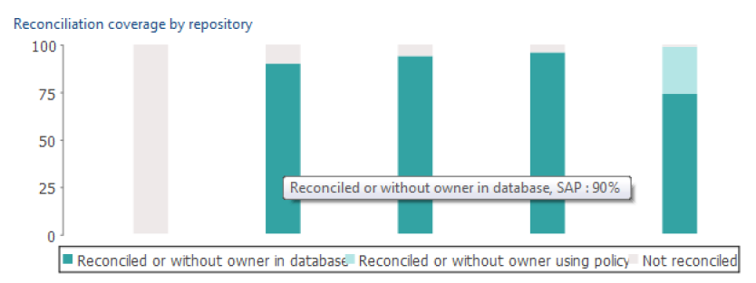  
- The upper right part shows the overall distribution of accounts after the policy simulation, between reconciled, unreconciled, ownerless accounts or accounts reconciled with several results. It integrates the reconciliation results already found in the database.  
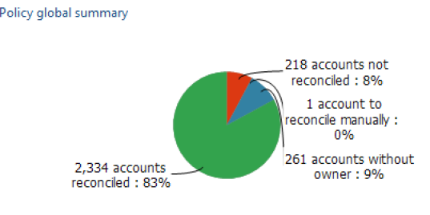  
- The table on the lower left allows you to view the results of all the rules applied to the repositories. It is possible to see the number of accounts on which the rule was applied (obviously this number decreases as more accounts are reconciled by previous rules), the number of accounts the rule reconciled, etc. It is possible to detect rules that have no use or are poorly organized. Please remember that if a rule returns more than one owner for a given account this account is not reconciled but will be examined by the following rules; you must therefore avoid, as much as possible, placing rules that generate a large number of duplicates in the first position.  

To the right of the table is a summary graph that shows the repetition of the different types of accounts according to the line selected on the table, whether a repository or a rule.  


## Automatic generation of reconciliation rules

The software offers the possibility of automatically generating reconciliation rules from the account and identity data in the database. These rule files that are automatically added to the **'reconciliation'**  folder, can be used as they are or can be changed. They also help to identify any matches between account and identity attributes.

### Generic rules

When creating a new reconciliation policy, checking the **Suggest reconciliation rules** box and clicking on the **Next**  tab starts the reconciliation rule calculation that will be automatically added to the new policy.  

  
The results of the rules found are displayed by repository, with the percentage of accounts for which more than one owner was found and the percentage of accounts that can be reconciled for each rule. The amount of time that this step takes can vary depending on the number of repositories and accounts. This step is optional and can be interrupted while being processed.  

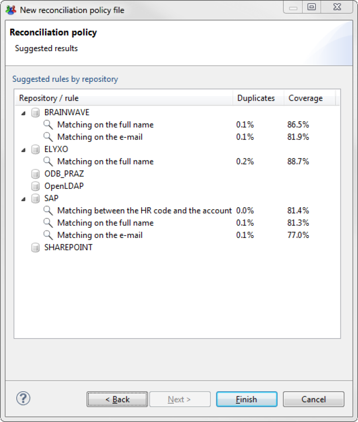  
Depending on the data, the calculation may suggest several rules, or none, depending on the repository. If several rules are found for a single repository, they are ordered in a way that optimizes the number of accounts reconciled.

### Creation wizard

The reconciliation rule creation wizard is found under the  icon located at the repository choice level in reconciliation policy configuration tab.  

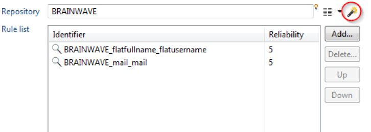  

When this icon is clicked, the rules are calculated for the selected repository and added to the policy. The new files which are placed in the **reconciliation**  folder of the project, and are named according to the convention `<Repository name>_<attribute1>_<attribute2>`, where `attribute1` and `attribute2` are the attributes that are matched in the created rule.  

  

Rules generated when a new policy is created are only simple rules and there is usually little risk of ambiguities occurring on reconciliation results. The wizard, on the other hand, is capable of creating more rules. It is possible to click on the wizard many times and it will attempt to calculate new rules each time, which are increasingly determinist, until it can no longer find any matches.  

The suffix `_fuzzy`  is placed at the end the name of a rule generated by the wizard to signal a less deterministic rule. Some of these rules can be complex, and generally it is recommended that you check their results before including them in a reconciliation policy.  

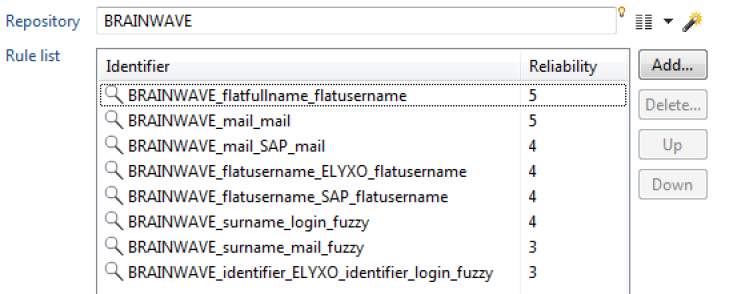  

> The wizard does not simulate the entire policy, so it possible that a generated rule will not end up reconciling any account, because the accounts on which it is ap   plied would have been reconciled by one of the rules placed above it in the policy.

### How to use the wizard

The wizard is capable of calculating reconciliation rules that are based on accounts that have already been reconciled in other repositories. This is because the correct use of the wizard is not to generate all possible rules but to use it in an **iterative reconciliation process**. Here is the general method to employ:  

- For each repository, if you have not created any rules when creating the reconciliation policy, click once on the wizard. Eliminate the rules marked "fuzzy" and the run policy as it is configured with these rules. Save the results in the database.
- You can now click on the wizard again, which will calculate the rules taking into account the new reconciliation results. You can save the results in the database again, then start to use all the rules that the wizard can generate.
- It is possible to edit the rules proposed by the wizard at any time to improve them. A common case is to add the initial of the first name to a generated rule on the surname of a person.
- If a repository always has an unusually high level of unreconciled accounts, and the wizard cannot find any rule, or only finds rules that are insufficiently relevant, there is no other solution except to try and build a rule yourself. It can still be interesting to study the generated rules to identify any attribute matches detected by the wizard.

## Importing and exporting manual reconciliations

To allow synchronization of the manually updated reconciliations between various environments or between different timeslots the possibility of exporting and importing reconciliations has been developed.

The exported reconciliations can then be accessed or corrected before being reimported into another analysis period and/or environnement.

This applies both to accounts that have been reconciled with people in the database and accounts marked as ownerless or having an owner who has left; we can combine all the actions linked to the reconciliation that were performed individually outside of the reconciliation policy.

### Exporting manual reconciliations

There are two methods to export all manual reconciliations performed either in the studio or in the portal

1. Navigate to the **Timeslots**  tab next to the ledger, select an analysis period and choose the **export the manual reconciliations of this timeslot**  option.  
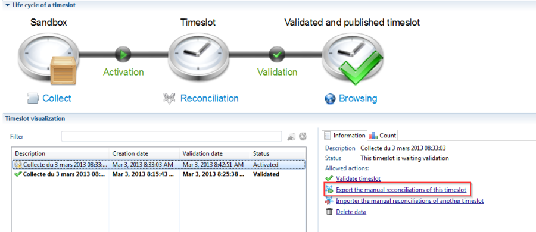  
2. Directly in the file menu of the studio.
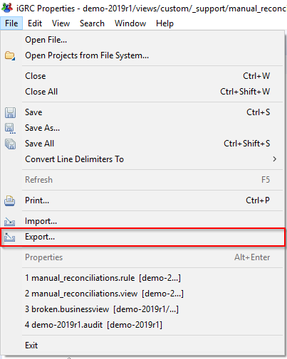  

In both cases a window will open that asks you to provide the file name. It is possible to change the project or the timeslot on which you wish to export the manual reconciliations.  

  

Upon clicking finish the file is created. Each line has account attributes, the attributes of the identity with which it was reconciled as well as the reconciliation information (ownerless account code, reconciliation comment, etc.)  

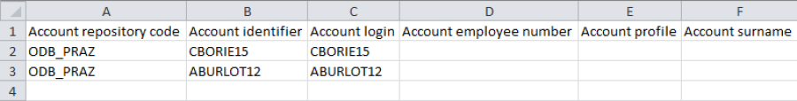  

### Input file generation

In addition to exporting the reconciliation file it is possible to manually create it. To do so the file **must** respect the following format:

1. Format: CSV
2. Mandatory columns
    - Account repository code (cannot be empty and must be the first column of your file)
    - Account identifier (cannot be empty)
    - hrCode (cannot be empty)
    - mail (can be empty)
    - surname (if present in the file, cannot be empty)
    - givenname (can be empty)
    - Reconciliation leave date (can be empty)
    - Reconciliation comment (can be empty)

> `mail`, `surname` and `givenname` columns are used if the identity cannot be found with the `hrCode`. So, they are optional but must be present.

Here is an example of input file expected :
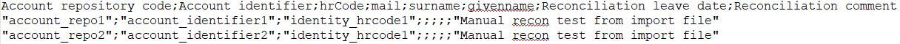

### Importing manual reconciliations

In the same manner as the export Importing manual reconciliations can be done using different methods in the studio, importing manual reconciliations can be done:

1. In the timeslot tab  
2. Using the dedicated import menu

#### In the Timeslots tab

Importing manual reconciliations is found in the **Timeslots**  tab, under the **Import the manual reconciliations of another timeslot**  option.  

> When using this method, once a timeslots has been validated, it is no longer possible to import manual reconciliations.
>
>   

Once the link clicked the import reconciliation wizard opens. It is then necessary to:

1. Select the project to import the reconciliations to
2. Select the timeslot to import reconciliations to
3. Select the CSV file containing the reconciliation to be imported
4. If desired check the option to overwrite the existing reconciliations

  

By clicking finish you initialize the import process, which ends by displaying the number of accounts it was possible to reconcile compared to the total number in the file.  

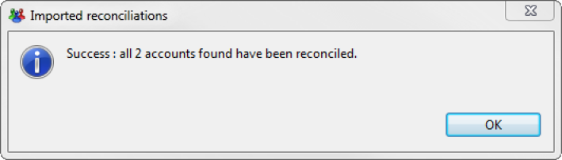  

Incorrect reconciliations are automatically written to another CSV file with the same name as the original file but suffixed with `\_rejected`.  

#### Using the import menu

Using the import menu provides similar results to the process detailed above. The process is as follows:

1. In an opened iGRC Studio, go to the `File` menu and click on `Import...`

2. Expand the iGRC Analytics menu, select the `Import manual reconciliations` choice and then, click `Next`

3. In the next step, select your project and then, click `Next`
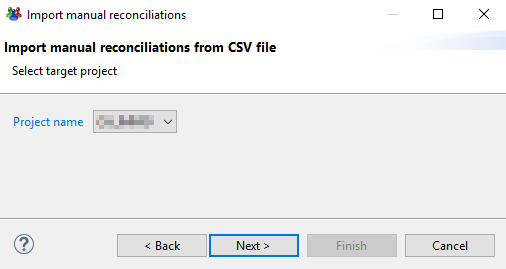
4. In the next step, select the desired timeslot when you want to import your manual reconciliation file and the input file and then, click `Finish`
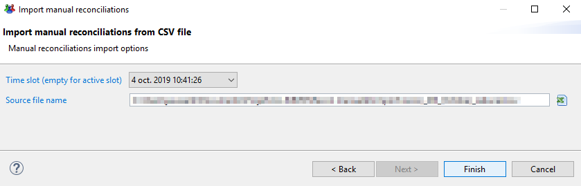
5. If the operation succeeds, the following window should be displayed:
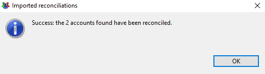

> If you wish to overwrite existing reconciliations in the selected timeslot, please check the option `Overwrite existing reconciliations`

Incorrect reconciliations are automatically written to another CSV file with the same name as the original file but suffixed with `\_rejected`.

## Break report of existing reconciliations

During each execution plan the product will report the existing reconciliations from the previous timeslots to the new one. It will then execute the reconciliation policy **only** on accounts that are not reconciled.

This mean if there are errors in the reconciliation of certain accounts in the previous timeslots they will systematically be reported.

The causes of errors in account reconciliations are various, and include:

- Incomplete or corrupted import files
- Issues in the configuration of the reconciliation rules
- Issues in the configuration of the reconciliation policy

As of version **Ader R1 SP5**, to allow consultants to correct these types of issues and stop the report of reconciliation for certain accounts during the execution plan it is necessary to follow the steps detailed below.

### Prepare account list

It is necessary to identify the list of accounts on which it is required to stop the report of the reconciliation. This operation will only work on a given list of accounts.

> It is recommended to use rules and/or views to extract the list of accounts and export it through the `igrc_view.[cmd|sh]` command.
> Note that an export directly from the view in the studio will create a UTF8-BOM file, that is not compliant.

Once the list of accounts is ready, a CSV file containing two mandatory columns should be created:

- The account identifier
- The repository code of the account

The format of the CSV file must correspond to the format configured in the other properties field of the web portal tab in the technical configuration.

CSV Preference are:

- export.csv.encoding
- export.csv.separator
- export.csv.block

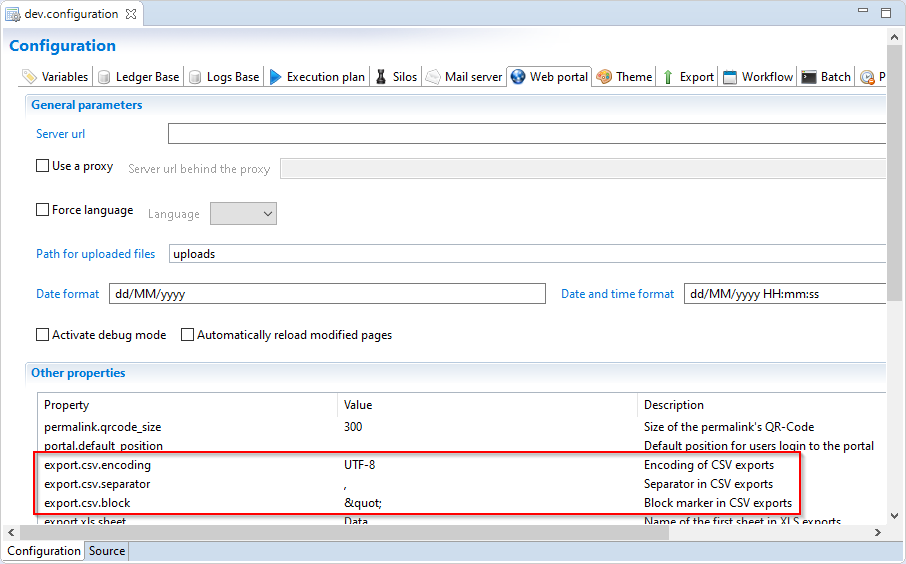

> [!warning] The option to break the recons also prevails over the collect. Meaning that if a no-owner flag is set in the collect for an account that is also in the file, this flag will be ignored and the account will be handled by the reconpolicy.

### Break the postponement

This option is only available when running the execution plan trough a command line.  

The command line must include the following additional options

- `-f`: Full path to the CSV File containing list of accounts identifiers and repository codes (file prepared in first step)
- `-a`: Column name in the CSV file containing accounts identifier
- `-r`: Column name in then CSV file containing repository code

```cmd
igrc_batch [existing IGRC batch command arguments...] -f <csv file path> -a <account identifier column name> -r <repository code column name>
```

Command example:

```cmd
igrc_batch support C:\Applications\Ader dev -f C:\Applications\recons.csv -a identifier -r code
```


> If the CSV preference in the technical configuration are null or empty the batch command will use the following default values:
>
> - export.csv.encoding=`UTF-8`
> - export.csv.separator=`,`
> - export.csv.block=`"`

## Assigning a reliability index to a reconciliation rule

Assigning a **reliability index**  to a reconciliation rule that has a value of between 1 and 5. This value represents the confidence that we have in the reconciliations found by the rule.  

For example, a rule based on a non-ambiguous criterion such as a person's email or unique id, which is usually unique, can be considered as having maximum reliability. Conversely, a rule based on an account reconciliation of another repository, or on a less deterministic rule such as the three first letters of the surname, presents a greater risk of errors or false positives; these will be assigned a less reliable index.  

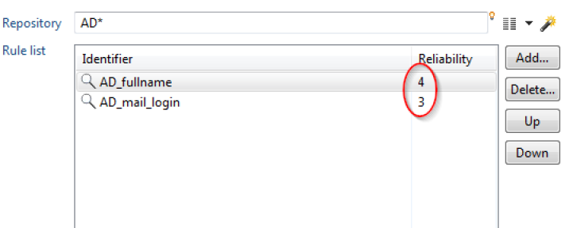  

It should be noted that a reliability index is automatically assigned to rules generated by the rule creation wizard. It is of course possible to edit it afterwards.  

**Example of use:** Every quarter you launch a reconciliation review to individually validate all the reconciliations which have a reliability index of less than 3 (out of 5).  

### Executing reconciliation rules by default

It is possible to execute reconciliation rules on all of your repositories. To do this you define a joker `*` in the reconciliation policy. It is, however, advised to perform this operation in the final position if you also want to execute other rules on each of your repositories, as shown in the screenshot below.

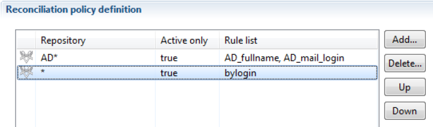  

### Executing reconciliation rules on all repositories

If you have many account repositories, the reconciliation engine allows you to execute the reconciliation rules on all your repositories in one step.  
For example, if you have two repositories, `AD_admin` and `AD_users`, you can put a joker `*`  after the AD prefix as shown in the screenshot below (`AD*`).  

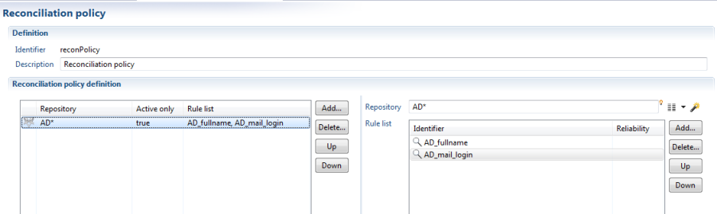

### Not examining deactivated accounts in the reconciliation policy

If you wish to speed up the processing of the reconciliation policy, it is possible to only take into account active accounts, so that there is no systematic attempt to reconcile deactivated accounts. This is done in the policy settings tab, in the left panel, by changing the option **Active only**  to `true`.  

  

This option makes it possible to improve the performance of the reconciliation processing; it is not advised for general use but for use only in specific situations where the number of irreconcilable inactive accounts is particularly high and greatly increases the time it takes to process the policy.
