# Reconciliation Rules

## Overview

The reconciliation rule engine is based on the data contained in the Ledger. The principle of a reconciliation rule is to find items in the Ledger that make it possible to make a link between an account and its user. For example:  

- Which identity does the account whose login is the same as the login of a user belong to?
- Who does the account belong to whose standardized name resembles the name of the user?
- Which is the identity that owns the account whose login starts with the first letter of the first name followed by the surname of a user?
- etc.  

A reconciliation rule is configured by combining a series of criteria based on the Ledger's identity concept, a bit like a question. The rule returns the list of item identifiers that answer the question asked.  

Please note that the software is capable of generating appropriate reconciliation rules by itself. For more details please go to the **Automatic generation of reconciliation rules** section of this document.

## Reconciliation rules based on attributes"

A reconciliation rule is created by configuring attribute search criteria. The available search criteria depend on the concept that is selected in the rule editor. In order to make it easier to select the criteria they are ordered by category.  

Please note that not all the search criteria available on the system apply to reconciliation rules. Reconciliation rules only apply to certain specific attributes (login, unique ID, mail, etc.).  

Search criteria based on attributes use test operations.  
The following test operations are used the most in the creation of reconciliation rules:  

- `is` : Strict equality test (corresponds to the '=' operator).  

Example of use: creation of a reconciliation rule based on the **'HR Code'** (User unique id) attribute  

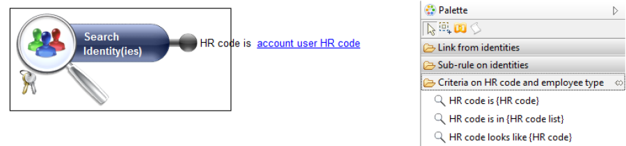  

- **looks like:**  Specific test on strings of characters: Verifies whether a string looks like to the string given as a parameter.  

Example of use: Creation of a reconciliation rule based on the **'mail'** attribute  

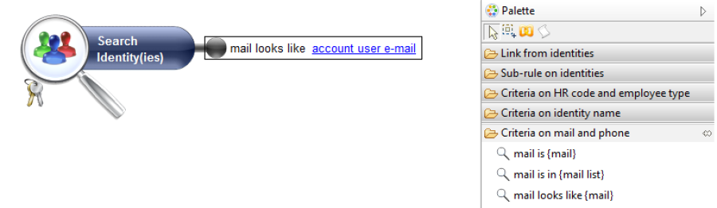  

- **is similar** : Specific test on strings of characters: verifies whether a string is close to the string given as a parameter, with a few differences.  

Example of use: Creation of a reconciliation rule based on the **'full name'** attribute  

  

This rule makes it possible, for example, to reconcile an account whose full name is Jacques DUPONT with the identity Jacques DUPOND.

## Reconciliation rule on a set of attributes"

It is possible to combine several search criteria on one Ledger concept. This operation is performed either directly at the level of the selected concept using the **AND/OR graphic**  operator   

 if you wish to configure a precedence between the operators, or if you wish to perform a 'NOT' operator on the criterion.  

You can choose the operator by double clicking on the concept's AND/OR switch or by selecting the context entry in the 'Toggle operator between criteria (AND/OR)' (Change operator between criteria (AND/OR)) menu. The selected concept links change color according to the operation selected to show you which concept carries the combination. Red links for an **AND**  operator, green links for an **OR**  operator.

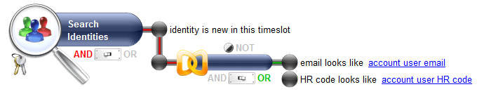  

This rule allows you to reconcile accounts whose:  

- owner identity was not identified in the last analysis period.
- **AND**  at least one of these conditions are satisfied:
- the email resembles the account user's email
- **OR**  the unique id resembles the account user's unique id

## Standardized attribute reconciliation rule

It is possible to reconcile an account with its owner identity by using the user name as the criterion. This operation may fail when faced with compound or accented names.  

Identity information is, in most cases, supplied manually from the HR repository. Errors may therefore occur when entering this information. (For example: Hélène in the identities and Hélène in the accounts, Marie-Françoise in the identities and marie francoise in the accounts, etc.).  

To overcome these irregularities, the reconciliation engine incorporates the notion of **standardized attributes**. The principle consists of eliminating all special characters contained in the composition of the name (examples of special characters are: `ç`, `_`, `'`, `^`, etc.).  

The use of a standardised attribute occurs when configuring reconciliation rules.  
The notion of standardized attributes is applied to **surname, first name**  and **full name**  criteria.  
Example of use: the following rule makes it possible to reconcile accounts whose standardized surname is identical to the surname of the user who owns it. To do this:

- Click on the magnifying glass to make the criteria applicable to the 'Identity' concept appear in the palette
- Open the **'Criteria on identity name'**  section
- Drag and drop the **'surname looks like {surname}''** criterion on the Identity concept
- Click on the **{surname}**  hyperlink and enter the **account user normalized surname (no accentuation)** parameter into the criterion :  

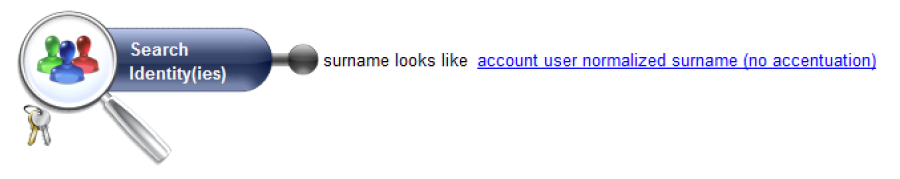

## Understanding the results tab

You can see the results of your rule at any time by selecting the 'results' tab in the graphical editor.  

This tab has two sub-tabs:  

### Rule simulation sub-tab

This sub-tab allows you to simulate the result of the rule, generally speaking, and/or to save the rule in the Ledger.  

  

- When the results are correct, you can execute the rule by clicking on the  icon. This command writes the reconciliations in the Ledger.
- The  icon deletes all the reconciliation and from current the analysis period and loads manual and automatic reconciliations from the last analysis period onto the Ledger.
- The  icon allows you to update the reconciliation rule results.

### The 'Ledger' sub-tab

You can see the results of your rule at any time by selecting the **'Results'** then the **'Ledger'** sub-tab. Reconciliation is performed on the last loaded analysis period and the results are displayed in the form of a master/detail list.  

- Clicking on a list item brings up the detail on the right side of the screen.
- It is possible to filter the results returned using the 'Filter' banner. To do this you must click on 'Filter' to display the available filter criteria.

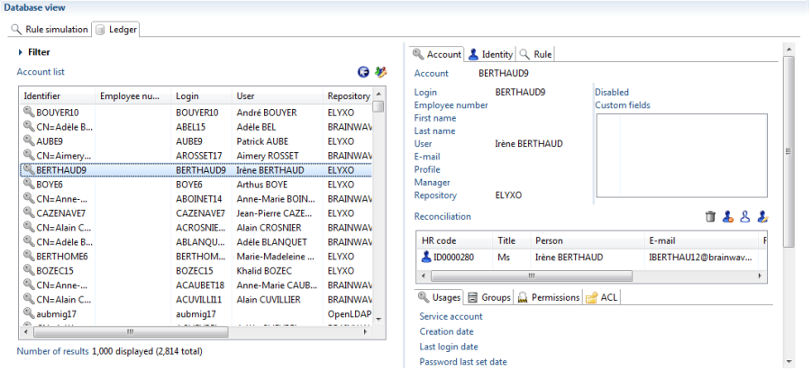  

- The **Account**  sub-tab, located on the right of the screen allows you to display the account details
- The **Identity**  sub-tab, located on the right of the screen allows you to display the owner identity details of the account
- The **Rule**  sub-tab allows you to display the result of the reconciliation rule.

## Manual reconciliation"

The result details interface lets you intervene dynamically in the account reconciliation. It is possible to perform manual reconciliation operations on accounts that were not reconciled. This operation is done from a rule result or from the Ledger.

### Manual reconciliation from a rule result

It is possible that a reconciliation rule does not reconcile an account with an identity. This is generally the case with service accounts, accounts belonging to people who have left the company or whose owner identity has changed surname, first name, etc. By selecting the account, you can perform various operations:

#### Account owner update

Click on the  icon located on the right side of the screen. This command allows you to reconcile the account with its owner identity that you select by replacing the criteria search field or by double clicking directly on the identity name.

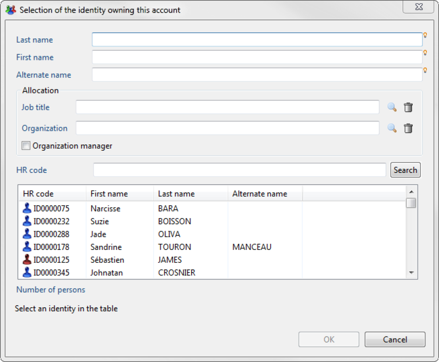  

You can add a description to the account reconciliation in the comment field.

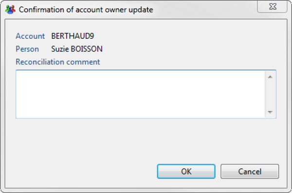  

You can display the results of your reconciliation by using the **"Only reconciled accounts"** filter on the **'Ledger'** screen .  

#### Mark account as ownerless

Click on the  icon located on the right side of the screen. This command allows you to mark an account as a service account.  

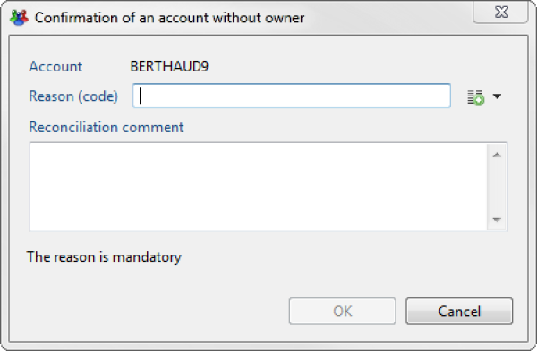  

#### Mark account as belonging to a leaver

Click on the icon .  
This command allows you to mark an account belonging to someone who has left the company.  

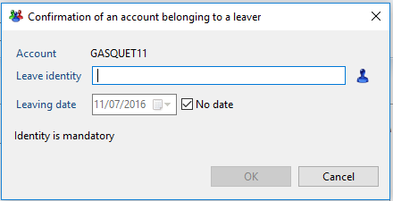  

#### Delete account reconciliation

You can delete a reconciliation by using the icon  located on the right of the ledger tab.  

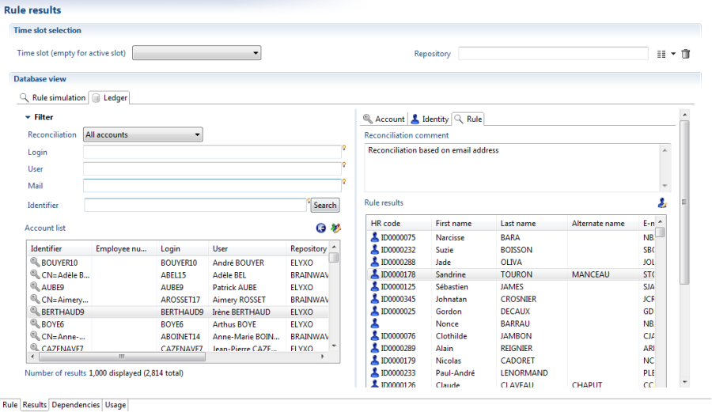  

> A reconciliation rule can, in some cases, bring up multiple identities for the same account (for example with perfect homonyms). In this situation you can intervene manually on the account in order to reconcile the correct identity in the **'Rule'** sub-tab..

### Manual reconciliation from the Ledger

It is possible to manually reconcile an account from the Ledger. You have to activate the iGRC Ledger view and click on the **"Account"** tab to make the list of all the accounts appear. By double clicking on an account, you can perform the same operations as in the **"Manual reconciliation from a rule result"** section.  

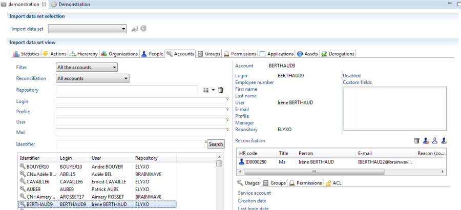

## Reconciliation rules: Advanced concepts

### Using Joins

Configuring a reconciliation rule usually exploits two Ledger concepts: the Identity concept and the Accounts concept. This operation is performed by making join relationships between two concepts.  
The join is used when the criterion that you want to use to reconcile the accounts only exist in the identity repository or the accounts repository.  
The join relationships available by Ledger concept are displayed in the **'Link from...'** section in the graphical editor's palette.  
To use a join you just have to drag and drop the link onto the graphical editor, followed by the selection of the concept from the rule on which you want to apply the additional concepts.  

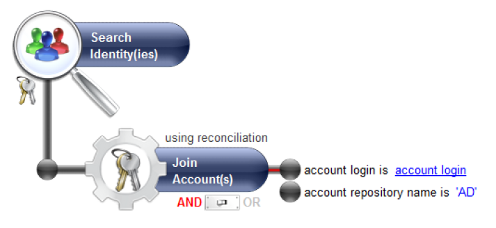  

### Using calculated attributes

It is possible to create an attribute when the available criteria do not allow you to make an advanced search of the identities. The attribute contains a JavaScript expression; the rule engine will calculate its results when it executes the rule.  

Example of use: The following rule allows you to reconcile accounts whose login is formed of the 3 first characters of the first name followed by the 3 first characters of the surname of the owner identity. To do this, we are going to create two parameters that will call `start_name`  and `start_surname`  respectively .  

- Open the **'Criteria on identity name'**  section, drag and drop the **'given name looks like {given name}'** hyperlink.  

- Select the **'Set the criterion with a global parameter of the rule'**  box and click on the following icon

  

- button to make it appear in the input box.
- Enter a unique identifier for your reconciliation rule, for example `start_name`
- Enter a description for your parameter, for example **'Start of first name'**  

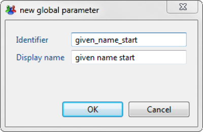  

- Click **OK**  to return to the graphical editor interface.
- Once created, the parameter appears in the rule's properties. Just one click on the parameter name allows you to show its value (0 is the default value)  

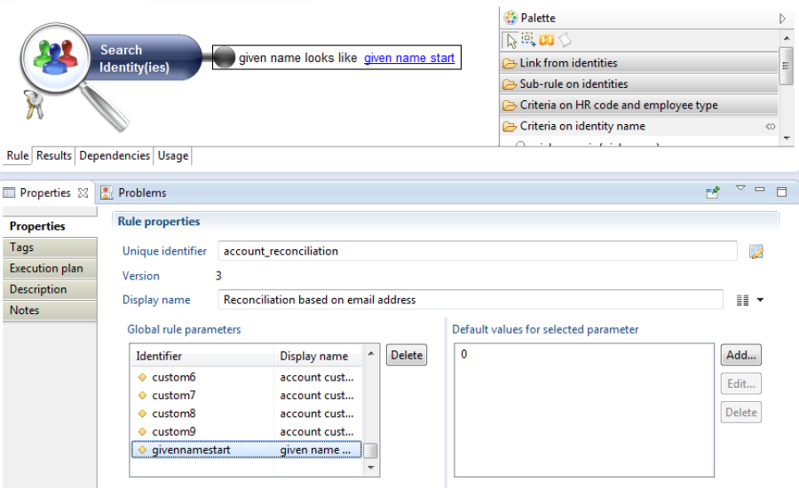  

- Click on **Edit...**  to set the parameter with a JavaScript expression.
- We are going to use the `Substring ()` method to return the first 3 characters of the login. Please refer to the collection guide for more details about JavaScript methods.
- It is best to click on the little light bulb on the right of the field and choose the `login` parameter. This will fill the field with the correct syntax without a typing error.  

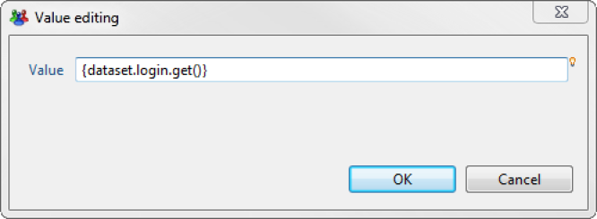  

- Place the curser after the parentheses and enter the character `.` (full stop character). By pressing **Control-Space**  on your keyboard a context window is opened offering a list of JavaScript methods as shown in the screenshot below:  

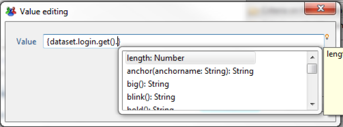  

A simple click on a method shows its details.  

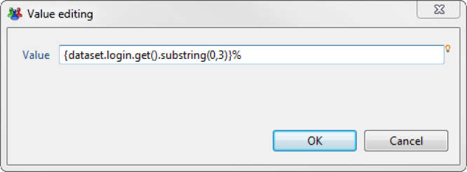  

It's the same principle for configuring the `start_surname`  attribute. Simply replace the arguments provided in the `substring ()` with `3` and `6`.  

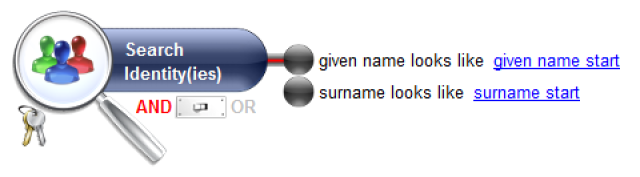  

You can view the results of the rule by selecting the **'Results'** tab in the graphical editor. The reconciliation takes place on the last loaded analysis period.  

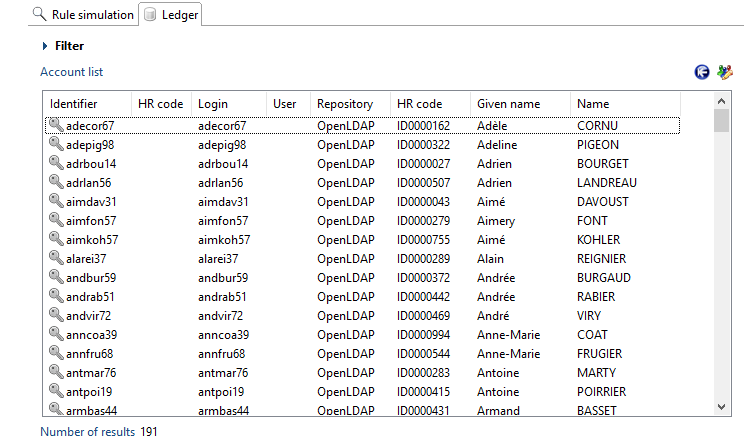  

## Best practices for the optimization of the reconciliation rules

### What is optimization for reconciliation rules ?

A reconciliation rule is translated into an SQL query that is then used in the database.  

For each account pending reconciliation, the SQL query is submitted to the database to find a corresponding unique identity. If the SQL query returns several identities, then the next reconciliation rule defined in the policy is used until a rule returns a unique identity or none.  

This means that if the database contains 1000 accounts, 1000 SQL queries are executed in the database to find the identities for a given rule.  

The purpose of the optimization is to avoid all these SQL queries on the database. All the identities are read in memory and for each account, the product checks which identities match the rule definition without sending any queries to the database. In order to do that, all the conditions found in the reconciliation rule (like `login equals xxx` or `fullname starts with xxx`) are interpreted in memory by the rule engine.  

### What are the known limitations ?

When the reconciliation policy is executed, the rule engine determines, for each rule selected in the policy, if it can be executed in an optimized manner (i.e executing a unique select query on identities and then performing a comparison in memory). Otherwise, the rule is executed by the database (x accounts generate x select) which is much slower.  

Some reconciliation rule constructions cannot be optimized.  
The following list details the conditions that prevent the optimization to take place.  

1. Criteria using "less than" or "greater than"
2. Criteria using dates interval (between date A and date B)
3. Criteria "not like" and "not in"
4. Aggregates (COUNT, MIN, MAX,...)
5. Not operator in group component
6. Join data in another timeslot
7. Join with a numbering constraint (Exactly 2 accounts or more than 3 identities,...)
8. Several joins combined with an OR operator
9. Several joins to the same entity
10. Sub-rules

If you do not use any of the features listed above, your reconciliation rule will be optimized.  

> Please note that the previous conditions also apply to the modules:
>
> - Entitlement model policy (Theoretical rights)
> - Manager policy
