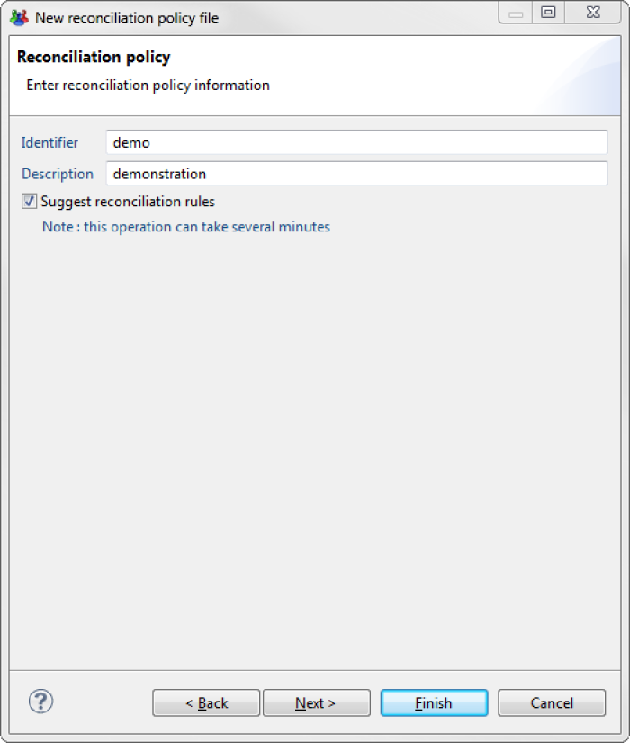

# Table of contents
{: .no_toc .text-delta }

1. TOC
{:toc}
---

The software offers the possibility of automatically generating reconciliation rules from the account and identity data in the database. These rule files that are automatically added to the **'reconciliation'**  folder, can be used as they are or can be changed. They also help to identify any matches between account and identity attributes.

# Generic rules

When creating a new reconciliation policy, checking the **Suggest reconciliation rules** box and clicking on the **Next**  tab starts the reconciliation rule calculation that will be automatically added to the new policy.   

    
The results of the rules found are displayed by repository, with the percentage of accounts for which more than one owner was found and the percentage of accounts that can be reconciled for each rule. The amount of time that this step takes can vary depending on the number of repositories and accounts. This step is optional and can be interrupted while being processed.   

    
Depending on the data, the calculation may suggest several rules, or none, depending on the repository. If several rules are found for a single repository, they are ordered in a way that optimizes the number of accounts reconciled.

# Creation wizard

The reconciliation rule creation wizard is found under the  icon located at the repository choice level in reconciliation policy configuration tab.   

   

When this icon is clicked, the rules are calculated for the selected repository and added to the policy. The new files which are placed in the **reconciliation**  folder of the project, and are named according to the convention `<Repository name>_<attribute1>_<attribute2>`, where `attribute1` and `attribute2` are the attributes that are matched in the created rule.   

   

Rules generated when a new policy is created are only simple rules and there is usually little risk of ambiguities occurring on reconciliation results. The wizard, on the other hand, is capable of creating more rules. It is possible to click on the wizard many times and it will attempt to calculate new rules each time, which are increasingly determinist, until it can no longer find any matches.     

The suffix `_fuzzy`  is placed at the end the name of a rule generated by the wizard to signal a less deterministic rule. Some of these rules can be complex, and generally it is recommended that you check their results before including them in a reconciliation policy.   

    

---

**NOTE:** The wizard does not simulate the entire policy, so it possible that a generated rule will not end up reconciling any account, because the accounts on which it is ap   plied would have been reconciled by one of the rules placed above it in the policy.

---

# How to use the wizard

The wizard is capable of calculating reconciliation rules that are based on accounts that have already been reconciled in other repositories. This is because the correct use of the wizard is not to generate all possible rules but to use it in an **iterative reconciliation process**. Here is the general method to employ:   

- For each repository, if you have not created any rules when creating the reconciliation policy, click once on the wizard. Eliminate the rules marked "fuzzy" and the run policy as it is configured with these rules. Save the results in the database.
- You can now click on the wizard again, which will calculate the rules taking into account the new reconciliation results. You can save the results in the database again, then start to use all the rules that the wizard can generate.
- It is possible to edit the rules proposed by the wizard at any time to improve them. A common case is to add the initial of the first name to a generated rule on the surname of a person.
- If a repository always has an unusually high level of unreconciled accounts, and the wizard cannot find any rule, or only finds rules that are insufficiently relevant, there is no other solution except to try and build a rule yourself. It can still be interesting to study the generated rules to identify any attribute matches detected by the wizard.
