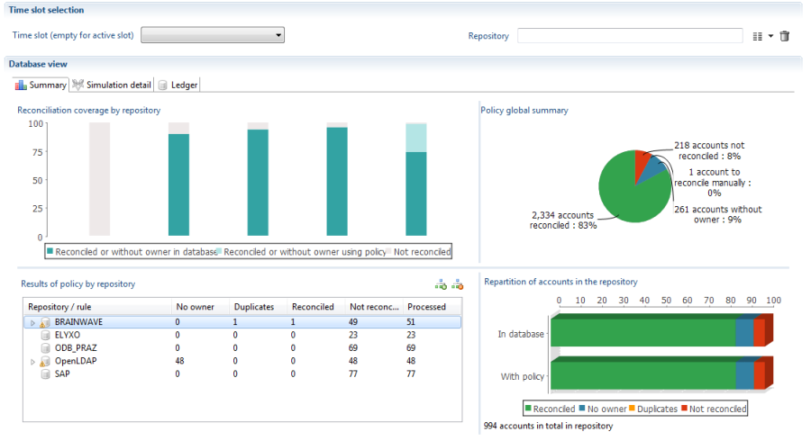
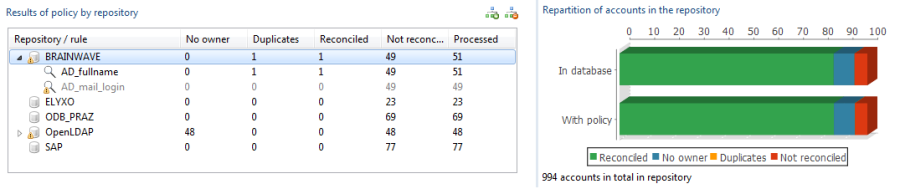

In the **'Results' tab** , the **Summary**  tab offers an overview of the results of the policy that has just been performed.   

     

It is divided into four distinct areas:   

- The upper left part offers a summary of the reconciliation policy by repository. More precisely, for each repository, you can see the proportion of reconciled (or ownerless) accounts in the database before the policy was executed, the proportion obtained with the simulation, and the proportion of accounts that remain unreconciled.    
       

- The upper right part shows the overall distribution of accounts after the policy simulation, between reconciled, unreconciled, ownerless accounts or accounts reconciled with several results. It integrates the reconciliation results already found in the database.   
       

- The table on the lower left allows you to view the results of all the rules applied to the repositories. It is possible to see the number of accounts on which the rule was applied (obviously this number decreases as more accounts are reconciled by previous rules), the number of accounts the rule reconciled, etc. It is possible to detect rules that have no use or are poorly organized. Please remember that if a rule returns more than one owner for a given account this account is not reconciled but will be examined by the following rules; you must therefore avoid, as much as possible, placing rules that generate a large number of duplicates in the first position.   

To the right of the table is a summary graph that shows the repetition of the different types of accounts according to the line selected on the table, whether a repository or a rule.   

       
