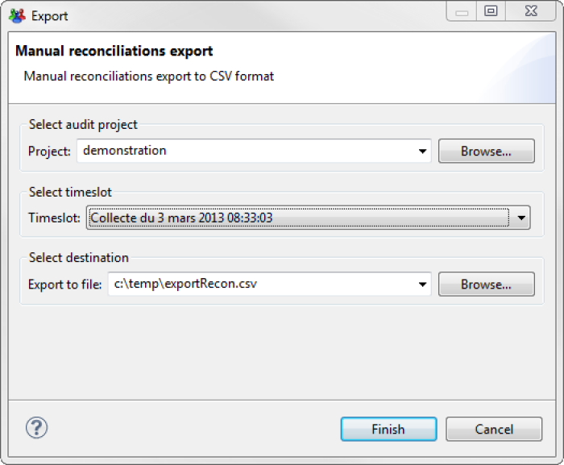
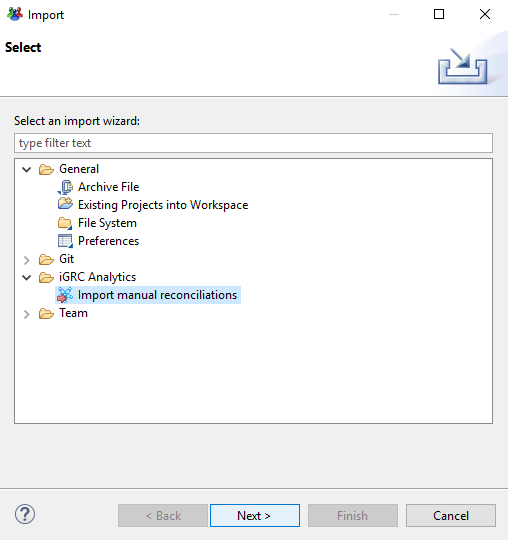

# Table of contents
{: .no_toc .text-delta }

1. TOC
{:toc}

---

To allow synchronization of the manually updated reconciliations between various environments or between different timeslots the possibility of exporting and importing reconciliations has been developed.

The exported reconciliations can then be accessed or corrected before being reimported into another analysis period and/or environnement.

This applies both to accounts that have been reconciled with people in the database and accounts marked as ownerless or having an owner who has left; we can combine all the actions linked to the reconciliation that were performed individually outside of the reconciliation policy.

# Exporting manual reconciliations

There are two methods to export all manual reconciliations performed either in the studio or in the portal

1. Navigate to the **Timeslots**  tab next to the ledger, select an analysis period and choose the **export the manual reconciliations of this timeslot**  option.    

   

2. Directly in the file menu of the studio.

   

In both cases a window will open that asks you to provide the file name. It is possible to change the project or the timeslot on which you wish to export the manual reconciliations.   

      

Upon clicking finish the file is created. Each line has account attributes, the attributes of the identity with which it was reconciled as well as the reconciliation information (ownerless account code, reconciliation comment, etc.)   

  

# Input file generation

In addition to exporting the reconciliation file it is possible to manually create it. To do so the file **must** respect the following format:
1. Format : CSV
2. Mandatory columns
    - Account repository code (cannot be empty and must be the first column of your file)
    - Account identifier (cannot be empty)
    - hrCode (cannot be empty)
    - mail (can be empty)
    - surname (if present in the file, cannot be empty)
    - givenname (can be empty)
    - Reconciliation leave date (can be empty)
    - Reconciliation comment (can be empty)

---

**NOTE:** `mail`, `surname` and `givenname` columns are used if the identity cannot be found with the `hrCode`. So, they are optional but must be present.

---

Here is an example of input file expected :

# Importing manual reconciliations

In the same manner as the export Importing manual reconciliations can be done using different methods in the studio, importing manual reconciliations can be done 
1. In the timeslot tab 
2. Using the dedicated import menu

## In the Timeslots tab

Importing manual reconciliations is found in the **Timeslots**  tab, under the **Import the manual reconciliations of another timeslot**  option.    

--- 

**NOTE:** When using this method, once a timeslots has been validated, it is no longer possible to import manual reconciliations.

     

---

Once the link clicked the import reconciliation wizard opens. It is then necessary to:
1. Select the project to import the reconciliations to
2. Select the timeslot to import reconciliations to
3. Select the CSV file containing the reconciliation to be imported
4. If desired check the option to overwrite the existing reconciliations

     

By clicking finish you initialize the import process, which ends by displaying the number of accounts it was possible to reconcile compared to the total number in the file. 

  

Incorrect reconciliations are automatically written to another CSV file with the same name as the original file but suffixed with `\_rejected`.      

## Using the import menu

Using the import menu provides similar results to the process detailed above. The process is as follows:

1. In an opened iGRC Studio, go to the `File` menu and click on `Import...`

2. Expand the iGRC Analytics menu, select the `Import manual reconciliations` choice and then, click `Next`

3. In the next step, select your project and then, click `Next`

4. In the next step, select the desired timeslot when you want to import your manual reconciliation file and the input file and then, click `Finish`

5. If the operation succeeds, the following window should be displayed:

---

**NOTE:** If you wish to overwrite existing reconciliations in the selected timeslot, please check the option `Overwrite existing reconciliations`

---

Incorrect reconciliations are automatically written to another CSV file with the same name as the original file but suffixed with `\_rejected`.  