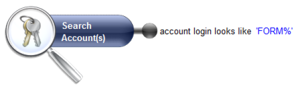
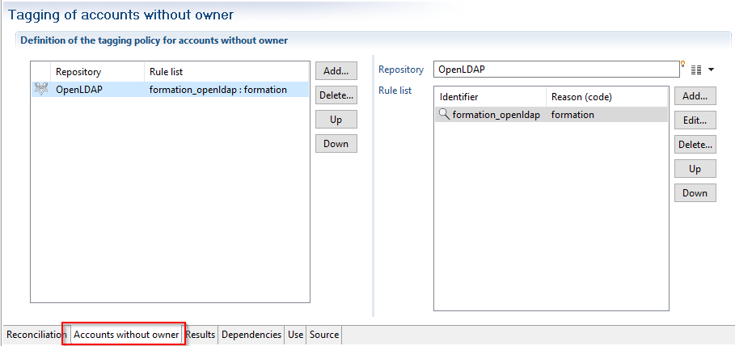
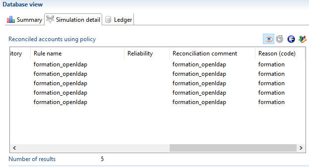

In addition to reconciling accounts to database identities, it is possible to automatically mark ownerless accounts by giving them a code that corresponds to their type (service account, training account, administrative account, etc.). This step, which is configured in the same way as the account reconciliation policy in the **Accounts without owner**  tab, is performed on each repository before applying the reconciliation rules.       
For each repository, you can choose a list of rules that will be applied in a predefined order. Here we are dealing with simple rules ( **.rule**  extension files) based on accounts, and not reconciliation rules. All accounts that are returned by the rule are marked with the defined code.      

Example:     
If we know that in the OpenLDAP repository, all training accounts have a login starting with **'FORM'**. So we will create the following rule called `OpenLDAP_formation.rule`  :   

   

We add this rule to the reconciliation policy in the **Accounts without owner**  tab for the repository in question. A new code 'formation' is created to associate with this rule.   

      

In the **Results** tab, the ownerless accounts appear in both the summary statistics and in the details if you click on the  icon

