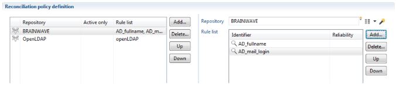
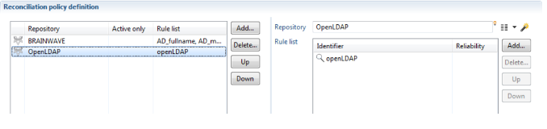

# Table of contents
{: .no_toc .text-delta }

1. TOC
{:toc}
---

Reconciling an account with the correct identity requires the use of precise search criteria when configuring a rule, for example, a unique HR id criterion. However, this rule does not reconcile accounts belonging to internal company identities that do not have HR unique identities such as people from outside the company. It will, therefore, be necessary to create another rule to reconcile these accounts. This rule can, for example, relate to the account user's email criterion.   

In order to execute all the rules you need for the reconciliation, you can create a reconciliation policy. In the main menu, click on **new \> reconciliation policy**. Here you will define all the reconciliation rules on the repositories you need.   

To add rules to your reconciliation policy, click on the **"Add"** button. On the right part of the screen, select the repository, then you can choose the rules for this repository by clicking on **"Add"** on the right part of the screen.   

In the event that several rules are executed in the same repository, the reconciliation policy engine behaves like a rules sequencer.   

You have two possibilities for sequencing rules:   

# Sequencing reconciliation rules

   

For each account, the engine searches to find its identity in the Ledger. You have three scenarios in the execution of the first rule:   

- The engine finds the identity. The result of the reconciliation is written in Ledger and the engine goes to the next reconciliation account.

- The engine does not find the identity. The next rule is executed on the same account.

- The engine finds several identities. Execution of the rule by the account is stopped and the engine goes to the next reconciliation account. Please note, that the accounts that match several identities are not considered for the following next rules as they are less reliable.     

---

**IMPORTANT:** The rules are sorted from the most precise to the most general. It is, therefore, necessary to sequence them according to the criteria used in the configuration.

---

# Sequencing repository reconciliations   

For each account, the reconciliation policy engine executes the following rules if no identity was found in the execution of the first reconciliation rule.   
