# Advanced Concepts

## Subreports

When formatting complex reports, it can sometimes be useful to present the information by following a master/detail type logic: For each main element listed (for example, each identity from the ledger), display a set of characteristics of this element (for example, its organizations, groups, ...).  
If the concept of grouping in the table allows you to handle the simplest cases, it quickly becomes impossible to limit yourself to this functionality because information retrieval requires running multiple queries on the identity ledger (usually n + 1: A query to list the master elements, followed by n queries to retrieve additional information for each of the master elements listed).  
The report editor allows you to contextualize queries run on the ledger, and thus handle the constraints related to master/detail type displays. Many reports available as standard in Brainwave Identity GRC use this feature. We suggest that after reading this chapter, you edit these reports in order to access examples of implementation (`templateanalysis.rptdesign`, ...).  
The set-up of subreports is based on the nesting of List and Table type components, as well as the dynamic configuration of Datasets referenced by the sub-components.  
Let's look at the example of a report that lists the applications for each identity. We will create this report not by relying on a grouping of rows in a table, but by configuring a subreport.  
To do this, we will insert a Table in our report and associate a Dataset which is based on the audit view 'br_identity' to this Table. This component displays the ordered list of all the identities in the ledger.  
We then insert a List component into the 'Detail Row' line of our Table component, then we associate a Dataset that relies on the `br_applicationsbyidentity` Audit View with this List component.

  

At this stage, for each identity, we list all the applications present in the ledger. However, we wish to list only those applications to which each identity has access. To do this, we are going to configure our Dataset at the List component level. This involves selecting the 'Binding' section of the List component properties editor, and clicking on the `Data Set Parameter Binding...` button. A dialog box opens, allowing us to pass parameters to the Dataset dynamically each time the list is displayed.  
We wish to pass the unique identifier for each identity as a parameter to our `applicationsbyidentity` Dataset, so that the List component displays only the applications available for a given identity. So we develop the `identityrecorduid` parameter of the Dataset with the value retrieved from the Dataset of the parent Table component (the Dataset which lists out the identities). This means configuring the following script: `row["recorduid"]`

  

Our List component is now controlled by a datum of the Table component in which it is contained. We have just created a master/detail type report.

  

> Rely on the naming convention of the Audit Views to select the views consistent with the retrieval of details about a Ledger concept. Audit Views that accept a unique concept identifier from the ledger as a parameter have a name like `detailsbymaster`. For example, if you want to retrieve the list of applications for a given identity, you need to select the `applicationsbyidentity` view.

Master/detail type queries are particularly resource intensive because at a minimum, it means performing n +1 queries to the Ledger. So do not forget to limit the number of master query results, and it's better to use tables with groupings whenever possible.

## Charts

The report editor includes a chart generation engine. This engine is able to represent the data from the Ledger in many different ways. It is also possible to overlay different charts, perform aggregation and analysis operations of the data displayed, ...

### Available Charts

The available types of charts are:

#### Bar

Serial or stacked histogram... ability to overlay any other type of charts (curve, ...)

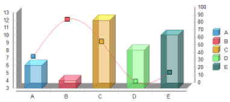

#### Line

Serial or stacked line... ability to overlay any other type of charts (curve, ...)

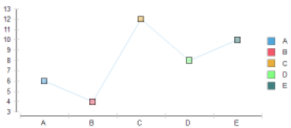

#### Area

Serial or stacked area... ability to overlay any other type of charts (curve, ...)

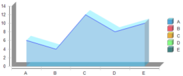

#### Pie

Pie chart ([Pie Chart](http://en.wikipedia.org/wiki/Pie_chart))  

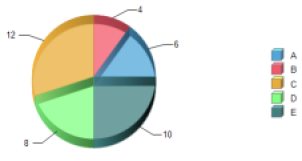

#### Meter

View-meter  

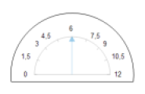

#### Scatter

Scatter plot ([Scatter plot](http://en.wikipedia.org/wiki/Scatter_plot))

#### Stock

Candlestick chart ([Candlestick chart](http://en.wikipedia.org/wiki/Candlestick_chart))

#### Bubble

Bubble chart ([Bubble chart](http://en.wikipedia.org/wiki/Bubble_chart))

#### Difference

Difference between series of values

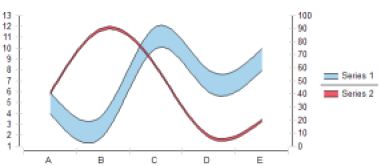

#### Gantt

Gantt Chart ([Gantt chart](http://en.wikipedia.org/wiki/Gantt_chart))

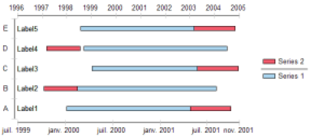

#### Tube

Serial or stacked tube histogram... ability to overlay any other type of charts (curve, ...)

#### Cone

Serial or stacked cone histogram... ability to overlay any other type of charts (curve, ...)

#### Pyramid

Serial or stacked pyramid histogram... ability to overlay any other type of charts (curve, ...)

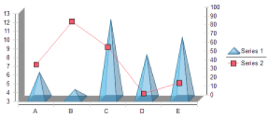

#### Radar

Radar ([Radar chart](http://en.wikipedia.org/wiki/Radar_chart))

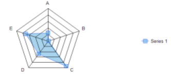
**_Radar_**

#### Treemap

Treemap ([Treemapping](https://en.wikipedia.org/wiki/Treemapping))

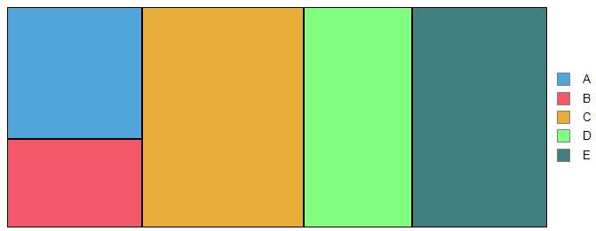

### General Principles about Creating Charts

Creating a chart in the report is based on the 'Chart' Component present in the Components Palette. Dragging/dropping this component in the editing area of the report makes the graphics wizard appear.

Creating a chart always follows the following steps:

1. Select the type of chart
2. Configure the extraction of useful data for the chart
    - From a Dataset
    - From a Table or List type Component
3. Configuring chart layout options
    - Colors
    - Display options : axes, legends, ...
    - Chart interactivity
4. Configuration of the chart size in the report

The first three steps of creating a chart are based on the three tabs of the Chart Settings wizard of the editor:

- Select Chart Type
- Select Data
- Format Chart

The contents of the 'Select Data' and 'Format Data' tabs may vary depending on the type of chart you selected. Therefore, in this documentation, we will focus on describing the general configuration logic and we invite you to play around with the settings on each type of chart by relying directly on the Brainwave Identity GRC report editor.

### Retrieve the Chart Data

Once you have chosen the type of chart, the second tab of the wizard allows you to select the data to display in your chart. The appearance of this dialog box may change slightly depending on the type of chart used, but the configuration principles are identical.  

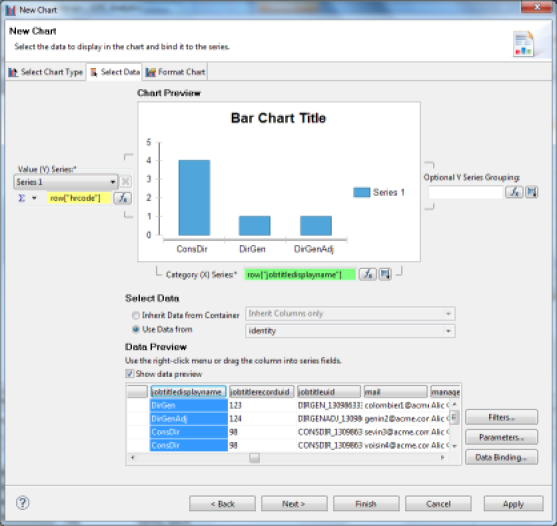  

The data used for a chart can be located either in a Dataset or in a Component in which the chart is contained (List, Table).

> when data is retrieved from a List or Table component, the Chart component will be based not on the Dataset referenced by the Component, but on the data Binding performed at the component level. This allows you to use the calculated columns locally at the component level as well as the table groupings, aggregations, ...

Once the data source for the chart is selected, simply drag/drop the columns present in the 'Data Preview' wizard in the corresponding boxes of the 'Chart Preview' area of the wizard. Most of the time the 'category (X)' will consist of a string. The values axis ( Value (Y)) can accept a numerical value directly, or accept an arbitrary value on which to perform an aggregation operation in order to deduce a value.  
It is possible to rely on a Dataset that sends a single list of identities, for example, each with his job, in order to create a chart that represents the number of persons per job. This involves choosing a unique identifier of the identity (for example, the code RH) as a series value (Y), and set on this field an aggregate function like counting elements (Count).

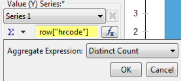  

The available aggregation functions are:

- **Sum** : sum of the elements
- **Average** : average of the elements
- **Count** : count the number of elements
- **Distinct Count** : count the number of unique elements
- **First** : first value of the sequence
- **Last** : last value of the sequence
- **Minimum** : minimum of elements
- **Maximum** : maximum of elements
- **weighted Average** : weighted average of elements
- **Median** : median of elements
- **Mode** : value that appears the most often
- **STDDEV** : typical gap
- **Variance** : variance
- **Irr** : financial function ([Internal Rate of Return](http://en.wikipedia.org/wiki/Internal_rate_of_return) of a series of periodic Cash Flow)
- **Mirr** : financial function ([(Modified Internal Rate of Return](http://en.wikipedia.org/wiki/Modified_internal_rate_of_return) of a series of periodic Cash Flow)
- **NPV** : financial function ([Net Present Value](http://en.wikipedia.org/wiki/Net_present_value) of a varying series of periodic cash)
- **Percentile** : Centile of the sequence of elements
- **Quartile** : Quartile of the sequence of elements
- **Moving Average** : moving average of elements
- **Running Sum** : running sum of elements
- **Running NPV** : financial function (Running net present value of a varying series of periodic cash)
- **Rank** : element rank
- **Is-Top-N** : Boolean expression indicating whether a value is one of the higher n values
- **Is-Top-N-Percent** : Boolean expression indicating whether a value is in the higher n percentage
- **Is-Bottom-N** : Boolean expression indicating whether a value is one of the lower n values
- **Is-Bottom-N-Percent** : an expression indicating whether a value is in the lower n percentage
- **Percent Rank** : value's rank as a percentage of the file
- **Percent Sum** : Percentage of a total
- **Running Count** : Number of elements fitting a condition

> The 'Sum' aggregation function is selected by default in the wizard; this requires that the value to be set be numerical. If you set a Text type value the chart will not display anything. You must change the aggregation function to the 'Count' or 'Distinct Count' function to count the number of elements instead.  
It is also possible to sort the category data (X-axis) according to arbitrary criteria. Do this by clicking the button to the right of the category column setting.

  

It is also possible to pass parameters to the Dataset used by the chart component. This can be achieved in two ways:

- By clicking on the 'Parameters...' button in the chart creation wizard
- By selecting the 'Chart' component in the chart editor, then selecting the 'Binding' section in the component's editor properties.

This setting is identical to that of the Table and List components. We invite you to refer to the documentation section detailing the use of parameters in the Table and List components for more information on this subject ([Subreports](#subreports))

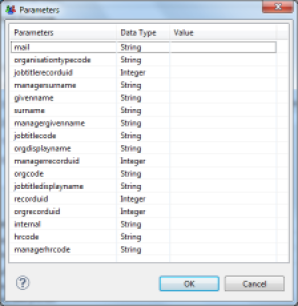  

### Chart Formating

Charts may be formatted with the help of the third tab of the chart wizard: 'Format Chart'.

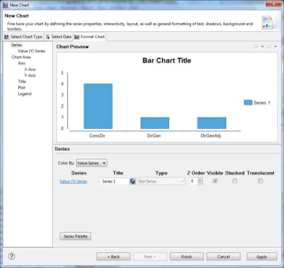  

The available functions depend on the type of chart selected. It is possible to perform the following operations:

- Choice of output format (bitmap, vector)
- Chart representation (simple, translucent, ...)
- Chart colors
- Complementary chart parameters (type of point, ...)
- 2D axes/2D depth/3D formatting
- Chart area formatting (perspective lines, ...)
- Chart title formatting
- Legend formatting
- Interactivity configuration by clicking on a chart area

We invite you to discover these features directly by using the Chart Editor. See also the chapter "Laying Out and Formatting a Chart' in the 'BIRT Report Developer Guide' Brainwave Analytics documentation.

## Pivot Tables

The report editor offers advanced analysis capabilities allowing the dynamic generation of [OLAP data cubes](https://en.wikipedia.org/wiki/OLAP_cube) which can then be represented in the form of multi-dimensional pivot tables.  
PivotTables are indispensable when it comes to analyzing mass data, for example, to highlight common characteristics or anomalies.  
In our context, the representation in the form of pivot tables allows us, for example, to display the number of people who have access to a set of permissions in a table (for example, the shared/audit subdirectory) by the organization a person belongs to. Anomalies appear immediately: here, people who have access to the audit directories though they are not part of the audit organization.  
The report editor and the pivot table chart component can display multi-dimensional cubes. Here we focus on the configuration of a two-dimensional cube. Adding new dimensions follows the same principle of configuration.  
The easiest way to create a data cube based on a Dataset is to position a 'Cross Tab' type component in the graphical editor, then drag/drop one of the columns from the Dataset on which we want to create a data cube.

This opens the data cube wizard. The wizard allows you to define the dimensions and measurements of your data cube. To do this, in the editor, simply drag/drop columns corresponding to the dimensions in the field '(Drop a field here to create a group), and the columns corresponding to the measurements in the field' (Drop a field here to create a summary field). '

> It is possible to create sub-dimensions by dragging/dropping columns in already configured dimension fields.

The measurement field can either directly accept a numerical value or perform an aggregation operation on a numerical/text value. To do this, select your measurement field in the editor and click on 'Edit'. You can then select an aggregation operation. Available aggregation operations are:

- **SUM** : Sum of numerical values
- **MAX** : Maximum value among the set of values
- **MIN** : Minimum value among the set of values
- **FIRST** : First value displayed
- **LAST** : Last value displayed
- **COUNT** : Count the number of elements
- **COUNTDISTINCT** : Count the number of unique elements

> If your dataset presents information in a format that is directly compatible with the analysis you wish to conduct, it is possible to optimize system performance by selecting the 'Check this option if the data in the primary dataset has been grouped and aggregated in a way that matches the cube definition' option in the 'Data Set' tab of the data cube creation wizard.

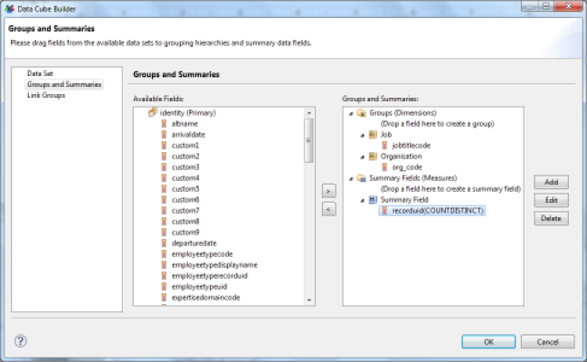  

Once your data cube has been configured, it is accessible in the 'Data Explorer' view under the 'Data Cubes' entry.

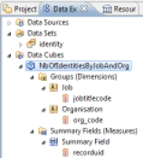  

Simply drag/drop the dimensions into the rows and columns of your pivot table, as well as measurements in the detail field.

  

Once formatted, your pivot table will appear as follows in your reports:

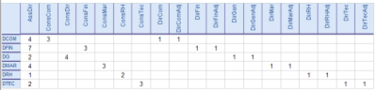  

## Localization

Brainwave Identity GRC supports the configuration of multiple languages. English and French are standard throughout the product, including in the reports.

It is also possible to add new languages in the web portal and reports. This chapter describes the method used to localize your reports.

It is possible to add properties files (`.properties` extension) to your reports to outsource label management.  

If multiple languages are present, we recommend you create a file for each language. The report engine will then dynamically select the correct file based on the current language.  

The naming convention for properties files follows the i18n java language standard: properties files must be suffixed with `_` followed by the language code (standard [ISO 639](http://fr.wikipedia.org/wiki/ISO_639)). A file without a suffix must also be present; this is the language used by default.

> The default language of the report engine is English. The localization file without a suffix must have content in English.  
Only the file without a suffix is set in the report, other files are automatically deducted by the report engine by appending the language code to the default file.  

Configure a properties file in a report by selecting the 'Resources' tab in the report properties editor (_tip:_ First click on an area outside the report in the report editor in order to access this properties editor). Then simply add a reference to the files by clicking the 'Add File...' button from the 'Properties files' area.  

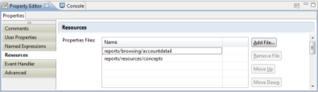

> There is a properties file referenced by default in reports created with the Brainwave Identity GRC wizard. This is the 'concepts.properties' file.

This file has a localized version of all the concepts present in the product, including all the columns for all the Identity Ledger items. The use of these properties is to be preferred in order to ensure the consistency of all reports. This file is located in the '/reports/resources' subdirectory of your audit project. To localize text, select the component in question in the editor and select the 'Localization' tab of the properties editor.

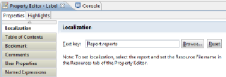

It is then possible to select existing text in the properties file, or create new text.

A dedicated localization editor is also present when setting up the association of text to a column value ('Map' function in most of the components).

> The properties file that will be modified is the one corresponding to the working language of Brainwave Analytics; this language is the default language of the operating system. If the file corresponding to the language does not exist, then the default will be changed.

A dedicated properties editor is available to you in Brainwave Analytics; it allows you to handle the batch translation of a report by creating a new properties file and comparing values ​​in pairs with reference values while editing. Simply edit a properties file in the editor. Brainwave Analytics deduces the default file and all the language files present from your file. It allows you to choose the language with which to perform the pairs comparison when editing.  
We recommend that you only translate your reports once they are finalized using the dedicated localization files editor.

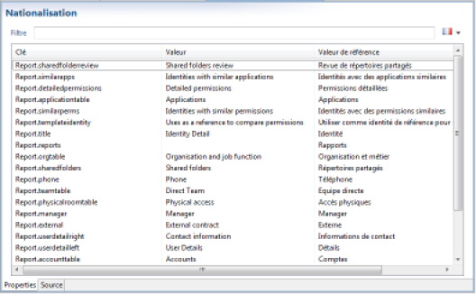

## Scripting

The reporting engine includes the Mozilla Rhino foundation's JavaScript language. BIRT has many events on which scripts may be triggered to customize data presentation or the report layout.  
A detailed presentation of this functionality is beyond the scope of this guide. We invite you to consult the 'Scripting Reference' chapter of the 'BIRT Report Developer Guide' documentation available in Brainwave Analytics as well as online documentation of the Eclipse foundation: [documentation](http://www.eclipse.org/birt/documentation/integrating/scripting.php) for more information about the scripting capabilities offered by the solution.

## Assigning a Reliability Index to a Reconciliation Rule

See ["Reconciliation Policies"](../reconciliation/reconciliation-policies/reconciliation-policies.md)
