# Review wizard editor

In this chapter, we are going through all the editor tabs to understand the settings and the impact on the campaign in the portal.

## Review wizard tab

This is the main tab with a reminder of the information filled in the wizard dialog.

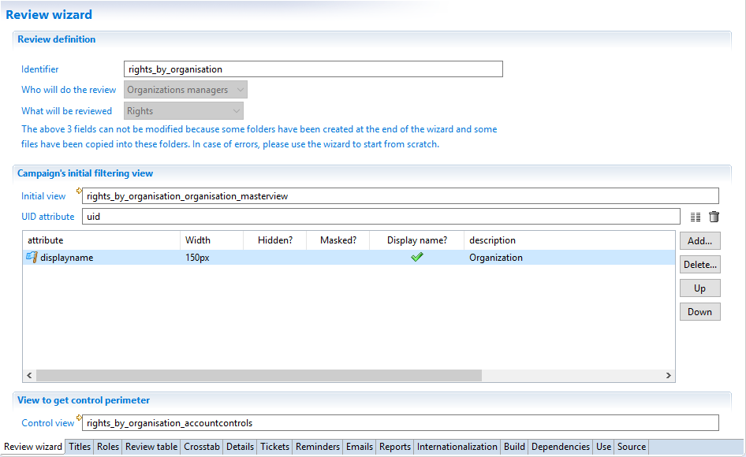

> [!warning] The review identifier is not editable and should not be changed even in XML using the Source tab. Once the wizard dialog has been validated, the identifier can not be changed because it has already been used for folder names, for patching views, reports... This is too late to change it. If the identifier is wrong, the only way is to delete this review and create a new one.

The section called `Campaign's initial filtering view` is used to define a part of the scope.
When the wizard is created, the answer `Who will do the review` gives 2 information:

- what kind of Ledger concept is used to dispatch the review items,
- how to find the reviewers.

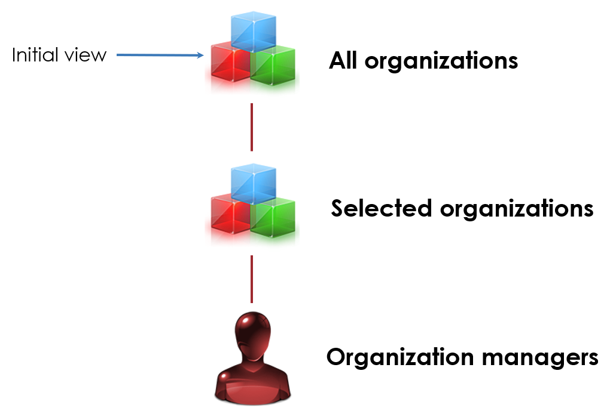

For the example of the right review by organization managers, the answer `Organization managers` gives 2 information:

- the reviewed items (the rights) are dispatched by organization.
It means that the organization is part of the scope and that the campaign start page lists the organizations so the campaign owner may select some of them.
- the reviewers are the managers of the selected organizations.

The field `ìnitial view` points to a view returning the initial scope (before filtering by the campaign owner) used in the campaign start page.
For our right review by organization managers, the view should return organizations only.
This view does not deal with managers. The logic to select the managers will be addressed in the tab called `Roles`

The next fields are used to select view attributes to display in the campaign start page.
For example, you may display the organization short and full names.
For each attribute, you can specify

- the column width
- if the column is hidden. The value can be used later but the user will never see it.
- if the column is initially masked. The user can configure the table in the campaign start page to show initially masked columns.
- if this attribute is the display name of the item. This will be used to display information in the campaign manager.
- the description which is displayed in the table header in the campaign start page.

Exactly one and only one column should be marked as the display name.

The UID is a special field which should uniquely identify the scope (the organization in our example).

A default view has already been created with a default behavior by the wizard dialog.
To customize the initial scope or the returned attributes, the best practice is to edit the view created by the wizard.
There is no need to create another view because the view generated by the wizard belongs to the project and can be safely modified.

The last field named `control view` is a view also used to filter the scope.
The idea is to filter the items to review by selecting the kind of controls.
On the review start page, if one or more controls are selected, only the items having a discrepancy on the selected controls will be reviewed.

This feature is active only for certain kinds of items ('What'):

- for Accounts and Rights, a view is generated to list controls having discrepancies on accounts.
- for Identities and Allocations, a view is generated to list controls having discrepancies on identities.
- for all other kinds of review, the filtering based on controls is not available.

the scope definition diagram is now updated with control filtering:

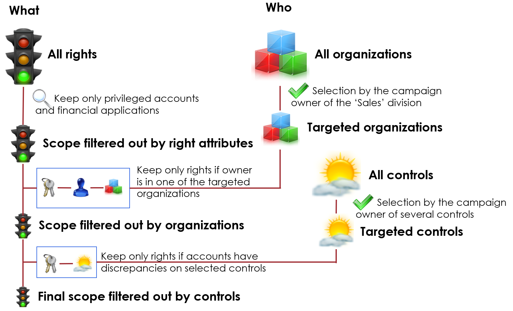

When this feature is available, the view generated by the wizard is used to display all the controls returning discrepancies on either accounts or identities.
If the campaign owner does not select any control then the scope is unchanged.
Otherwise the scope of reviewed items is reduced to the items having at least one discrepancy.

> For a right review, the default control view selects controls based on accounts. It means that the discrepancies related to these accounts are not directly related to the rights. For example a control to find accounts without password change will be returned by the control view because it returns accounts. But in the context of a right review, the discrepancy is not related to a specific right but to the account, whatever rights it gives. It may be confusing for reviewers if the number of control discrepancies is displayed on each right while the discrepancies are related to accounts.

## Titles tab

This tab is used to define the review titles. There are 3 titles:

- Process definition title: This title is displayed when the campaign owner wants to set up review.
In the campaign manager, a click on the button `Add a new campaign` displays the list of process definition titles that can be used to prepare a campaign.
- Review process title: This is the title of the detail workflow. It is displayed in the campaign manager to follow the review progress.
For a given campaign, the list of detail processes is displayed using this title.
For example, in a right review by organization managers, there will be a specific title for each organization selected in the scope.
- Review manual task title: This is the title that the user (organization manager for example) sees in his task list.

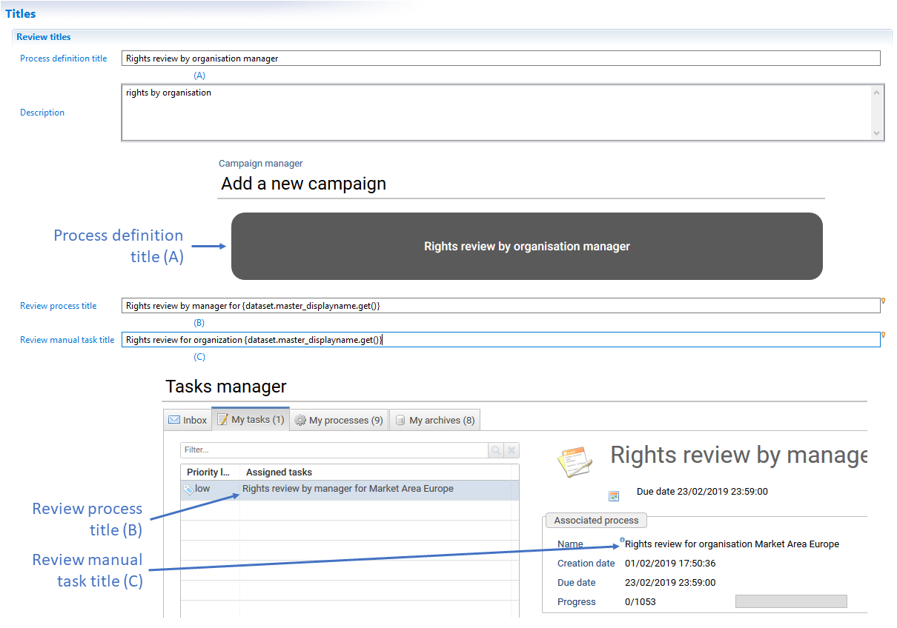

The last 2 titles (process title and manual task title), it is possible to build a different title for each organization.
This is accomplished by inserting in the title the information obtained from the initial view.
In the right review by organization manager, the initial view defines the list of organizations.
In the first editor tab called `Review wizard` a subset of the view attributes have been added in the table so they are accessible in the process.
All these attributes can be used to customize the title.

To insert the content of an attribute into a title, you can click on the small electric bulb  on the right of the title field.
It will open a menu with all the attributes that have been added in the table of the first tab.

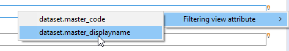

## Roles tab

The role tab is used to define review actors. There are 3 kinds of actors:

- the reviewers,
- the escalation reviewers,
- the contributors.

The reviewers are the primary candidates for the task. If the task is not finished after a period of time, an escalation is triggered.
The escalation reviewers are added to the primary candidates or replace the primary candidates.
A reviewer or an escalation reviewer may ask a contributor for help.
All these people may delegate the task to delegates.

The following table summarizes the responsibilities:

| Actor                        | Responsibility              | Description                                                                                                                                                                                                                                               |
| :--------------------------- | :-------------------------- | :-------------------------------------------------------------------------------------------------------------------------------------------------------------------------------------------------------------------------------------------------------- |
| Reviewer                     | Accountable and Responsible | The reviewer is accountable. He may do the review himself to let a delegate do it.                                                                                                                                                                        |
| Reviewer delegate            | Responsible                 | The delegate is not accountable. In the review, the delegate can validate the review without the delegator seeing it                                                                                                                                      |
| Escalation reviewer          | Accountable and Responsible | Same as `Reviewer`                                                                                                                                                                                                                                        |
| Escalation reviewer delegate | Responsible                 | Same as `Reviewer delegate`                                                                                                                                                                                                                               |
| Contributor                  | Consulted                   | This person suggests an action (accept, revoke...) on items to review but is neither accountable nor responsible and can not validate the review. At the end of the day, the reviewer (or the delegate) is the only one to be able to validate the review |
| Contributor delegate         | Consulted                   | Same as `Contributor`                                                                                                                                                                                                                                     |

Each section of the role tab is for a kind of reviewer.

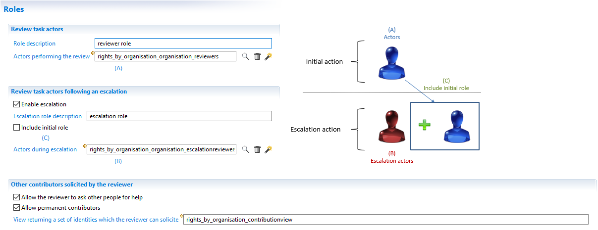

If escalation takes place, by default, the escalation reviewers replace the primary reviewers who can no longer take the task.
If the option `Include initial role` is checked, then the escalation reviewers are added to the candidate list and both reviewer and escalation reviewers can take the task.

In the review page, the button `Ask to...`is used to ask other people for help on the selected items to review. These are the contributors.
This button can be removed from the page so that the reviewer can not ask someone else for help.
If the button is active, then a view can be customized so that the reviewer can only select identities among the list.

When asking for help, the reviewer may check an option to permanently ask this contributor for this item in the next reviews.
This option can be disabled if `Allow permanent contributions` is unchecked.

> [!warning] If the `Ask to...` button is active, the contributors are added to the candidates.
It means that the same task is shared between all candidates and if a contributor takes the task, the other contributors and the reviewers won't be able to take the task.
Only one candidate can work on the task at any given time.

## Review table tab

This tab defines the content of the review page for the reviewer. There are 2 sections:

- the first section defines the actions available for the reviewer,
- the second section defines the content to review (the list of items).

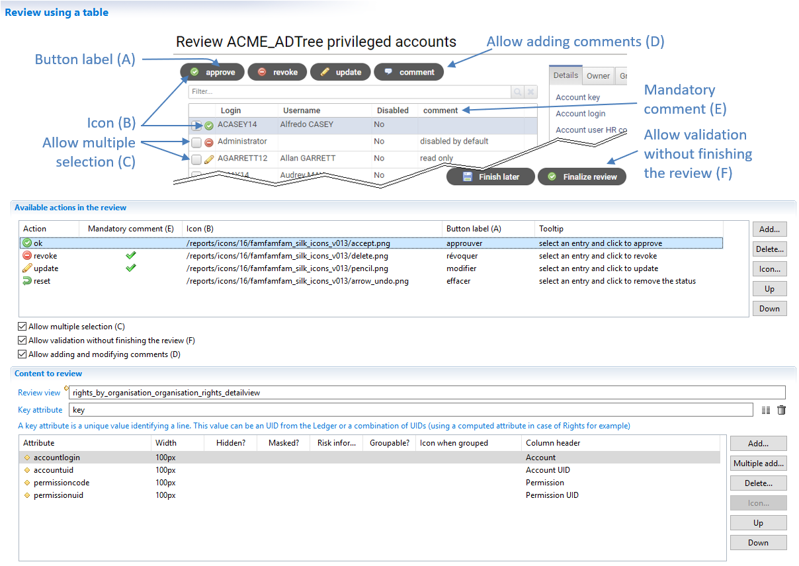

### Actions

In the review page, the actions appear in a toolbar above the review table.
All the actions are enabled when at least one item is selected in the table.

The way the user selects some items in the table depends on the option `Allow multiple selection`.
If this option is checked, then the table has some checkboxes on the left to select several items.

In the review editor, the section named `Available actions in the review` is used to define the actions with their attributes (name, icon, label and tooltip)
When the review is created, there is a list of actions already defined.
These actions can be removed from the list if they are not relevant in the customer context.
New actions can also be added to the available list.
These actions are stored in TicketReview status column attached to the item to remember the manager's decision.

The Brainwave product does not know the meaning of each action defined in this list except in the remediation.
The remediation process gets all the tickets having a status `revoke` or `update` to dispatch them to remediation actors.
All other actions are ignored by the remediation process.
If new actions are added in the review process, the remediation process should be modified to accommodate the new list.

The column `Mandatory comment` defines if a comment must be entered for an action.
The option `Allow adding and modifying comments` lets the user change any comments for any action, even action for which the comment is not mandatory.

The option named `Allow validation without finishing the review` keeps the validate button disabled if some items do not have an associated action.

### Items

The section named `Content to review` points to a view which computes the item list to review.
This view has two goals:

- filter the items to define the scope of the review. This can be the privileged accounts or the rights on certain applications for example.
- get the attributes to display in the review page.

A view is already set when the wizard dialog finishes. This view depends on the answer `What will be reviewed`.

The best practice to add attributes not currently in the view or to change the filtering is to edit the view.
There is no need to create a new view. The generated view belongs to the project so it can be changed for the customer need.

The `Key attribute` is an attribute returned by the view to uniquely identified an item.
This is usually the item's UID. But in some situation, there is no unique key.
This is typically the case for Rights where we do not have any UID but instead we have 3 UIDs (account, permission and périmeter).
The view for a right review computes an attribute based on key base on the 3 UIDs.

For each attribute, you can specify

- the column width
- if the column is hidden. The value can be used later but the user will never see it.
- if the column is initially masked. The user can configure the table in the campaign start page to show initially masked columns.
- if the risk information should be displayed.
- if this column can be used to group items.
- the icon to display for the group lines in the table.
- the column header.

### Filters

As explained in a previous chapter, the items may be filtered by one or several rules.
There is no option in the wizard interface about this feature as it is implemented inside the detail view itself.

The mechanism is to prepare some rules and write the results in the database during the execution plan.
These rules have special tags so they can be retrieved later.
The campaign start page lists all the rules with the specific tags.
A view has been generated at the end of the wizard dialog to list these rules:

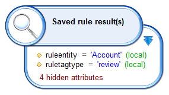

As you can see, the attribute `ruletagtype` should contain `review` and the attribute `ruleentity` should contain the main entity for each kind of review.
The above screenshot is for a right review. The filtering is based on `Account`.
It means that if we want to offer filtering rules in the campaign start page for this campaign definition, we need to prepare rules with:

- the value `review` in `ruletagtype`
- the value `Account` in `ruleentity`

In the portal, The user may select zero, one or several rules to filter the items.
The campaign starts and the detail view is executed for each sub-process.
The detail view contains a filter to keep only the items where the main entity is among one of the selected rules.

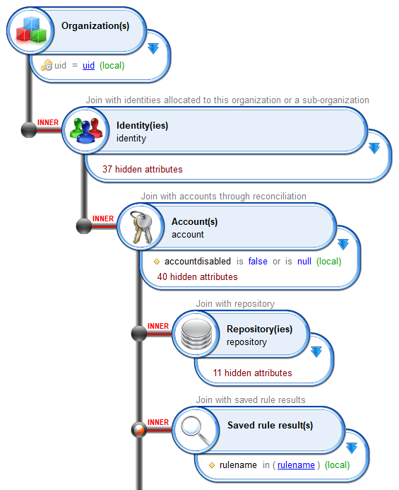

> When applying a filter on items to review, there is a choice between filtering in the view or filtering in rules.
The difference is:

- When filtering in the detail view, the user has no opportunity to change the filter. It defines the maximum set of items to review.
- When offering filtering rules, the campaign owner selects the combination of filters he wants. It lets the user split his review into several campaigns.
The drawback of this approach is that, at the end of the day, it is more difficult for the campaign owner to check if all the items have been reviewed
if several reviews have been launched with different filters

## Crosstab tab

The cross table (crosstab) is a new way to perform the review. The crosstab offers these enhancements over the review in list mode:

- The user sees all the items to review in a more graphical approach. This looks like a matrix. For example, for a right review, the column header contains permission names and the row header contain account logins. Non empty cells means that there is a right to review.
- The crosstab offers a sort button to reorganize the columns and the rows so that pattern appears in the grid. The logic behind this button is to group similar items. For example, in a right review, accounts are sorted in order to group accounts with the same permissions. And the same logic applies the other way: permissions are sorted in order to group permissions given to the same accounts.
- The user can visually compare columns or rows. For example, in a right review, the user can compare 2 rows to understand which permissions is owned by the first account and not by the second one. If both accounts belongs to identities in the same team with the same job, it lets the reviewer focus on differences and validate permissions in common.
- The graphical user interface lets the reviewer select a rectangle in the crosstab to set a status on all the selected cells. In the context of a right review, this is very handy if rights are given through an IAM solution or based on HR rules because identities with the same role or same job function will have the same rights.

The crosstab is an additional way of performing the review, meaning that it is optional. The review in list mode is always available for the user. If the crosstab is activated, it gives an alternate page to the user who can switch from the list to the crosstab and the other way using a button.
The crosstab page (crosstab widget along with the buttons, filters and detail pane) offers all the features of the review in list mode.
When both modes are active, the methodology for the reviewers is different because they can leverage both modes to focus on specific items (list mode) or get an overview with similarities (crosstab mode).

### Parameters

The option `Enable crosstab review interface in addition to the table one` must be checked to get allow the crosstab in the review.
The option `Start the review in crosstab mode` is used to display the crosstab page when the user takes the review task.

Most of the list mode parameters applies to crosstab mode:

- the actions
- the options about multiple selection, validation and comments
- the name of the view and the key attribute.

The same view is shared between the two modes.

The difference between the two modes is that the list mode requires a set of columns to be selected in the table.
For the crosstab, one must define the dimensions for columns and rows.
Dimensions can be seen as layers in columns and rows and are displayed in the headers.
Basically the number of dimension is the number of lines in the header.
For example, in a right review, each cell is a right. A right is between an account and a permission.
Accounts and permissions are the crosstab dimensions.
Account is the dimension for rows and Permission is the dimension for columns.
We can also display the other way (accounts as columns and permissions as rows) if it seems more logical.

But if we only display one dimension, we lose contextual information. For example, who are the owners of the accounts.
So we can add a layer (a new dimension) to the crosstab row header to have a first layer with identities and then a second layer with accounts.
And we could also add a third layer to know which organization the identity is working in.. So there will be 3 dimensions:

- organization
- identity
- account

Following the same idea, we can add a layer to the crosstab column header to display in the first line the applications and in the second line the permissions.

The following screenshot shows the parameters for a right review with 2 dimensions in columns and rows:

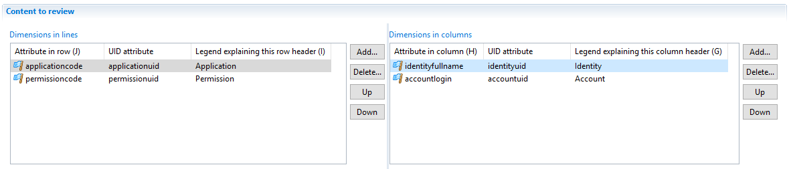

There is an order consideration for both dimensions. Dimensions must be defined from the widest to the most precise.
For example, the dimensions in columns start with the identity.
The combination of the last lines of both dimensions (permission and account in our example), should always define uniquely a cell.

A dimension is defined by 3 attributes:

- an attribute which is displayed in the header
- an UID which is used to uniquely identify this item in the dimension
- the legend of the dimension

For account, we are going to display the login in this dimension and the attribute which identify an account is the accountuid.
The legend is 'Account' so that the user knows that, in this dimension, the values are accounts.

### Dimension identifiers

Particular attention should be paid to UIDs in dimensions.

The concept of dimension has 3 purposes:

- display the cell context (application name, permission name, identity name and account name)
- group smaller dimensions into broader ones (application contains permissions, identities own accounts)
- allow a click on a dimension item to display details in the right pane

The UID attribute is used display the information in the left panel.
From a technical perspective, the value found in the UID attribute is given to the right pane (a page fragment) so that the details for this specific item are displayed
When clicking on a specific account login, the account UID is given to the right panel to display information for this specific account.

In the right review, the 4 dimensions are 4 different Ledger concepts, each one having its own UID.
We end-up with applicationuid, permissionuid, identityuid and accountuid.
But what if I we want to add a third dimension above identity to group them into 2 categories (internal, external) found in the column identityinternal

The issue here is that we do not have any UID for identityinternal. This attribute is a boolean in the identity concept.
The editor allows you to select the same attribute (here identityinternal) for both the display attribute and the UID attribute.
This is the right way to do it in our example, even if identityinternal is not an UID.

How can it work ?
The crosstab does not use the UIDs for broader dimensions. It is only used to display details on the right panel.
In this example, the right panel will receive a value True or False when the user clicks on this header in the crosstab.
But, as long as the page fragment is aware that the value passed is a boolean and not an UID, there is no issue.

The UID defined in the tab `Review table` and the field `Key attribute` which uniquely identifies a line in list mode is *NOT* used in the context of a crosstab.
So how does the crosstab uniquely identify a cell?
The crosstab defines a cell using the 2 UIDs from the most precise dimension.
For example, in a right review, a cell is defined by the accountuid and the permissionuid.

To sum-up, when the user clicks on a cell, the crosstab gives the 2 most precise UIDs (a pair of UIDs) to the details pane and when the user clicks on a dimension, the crosstab gives the UID of that dimension.

### Relevance of the crosstab mode

Crosstab mode is not relevant in all situations. This is why it is not active by default.
The right review is the best example of a review where the crosstab mode brings comfort and efficiency.

But all kinds of review do not support crosstab mode.
To be able to add crosstab mode, the `What` item must be a relation between 2 concepts.
For the right review, the right is a relation between an account and a permission meaning that a right is at the crossing of an account and a permission.
If we want to review accounts, there is only one dimension. No crossing so the crosstab is not relevant.

What happens if we decide to activate the crosstab for reviews where the item is not defined on 2 concepts ?
In this situation, we must take care of the UIDs involved in the crosstab.
A cell has no unique UID but a pair of UIDs.

In the example of an account review, a cell must represent an account.
Let's design a crosstab in which we have 2 dimensions in rows: the repository and the account.
In columns, we want to display the direct group which the account belongs to.

Now we have 2 hypothesis:

- An account may belong to several groups.
- An account belongs to a maximum of one group.

If an account belongs to several groups, there will be several cells concerning one account.
For example if the account ABOURGET18 belongs to the group Users and Administrators, then the line for ABOURGET18 will display 2 non empty cells (one in Users column and one in Administrators column).
But the 2 cells are pointing to the same account.
From a user experience, this is not a good idea for 2 reasons:

- The user may accept the cell under Users and revoke the cell under Administrators. The user is misled because only one status is expected (on the account) but he can set a status in 2 cells.
- The user may think he is reviewing the membership of an account in a group. But this is wrong
With a model where an account belongs to several groups, this crosstab does not work.

If the account belongs to at most one group, this is different.
From a user experience, there is no more issue as each account appears only in one cell.
But the crosstab is almost empty because there is only one active cell on each line. In this situation, the crosstab does not offer a better visualisation than the list mode.

In both hypothesis, the crosstab is not relevant and may even be confusing the reviewer.

## Details tab

The details tab is used to select what kind of information is displayed in the right pane of the review page.
This right pane may contain several tabs, each one displaying a different information.
From a technical perspective, each tab contains a page fragment.

These fragments are found in the bw_fragments add-on.
It contains many fragments that can be directly used by the review.
In this tab, the objective is to link an item or a dimension to a fragment.

The `Add...` button opens this dialog box to select a fragment:

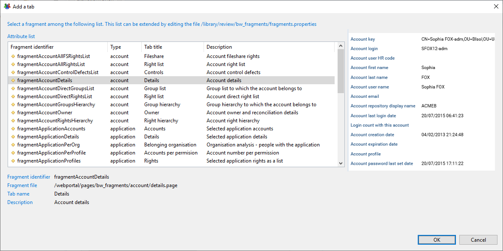

A preview is displayed on the right pane when you select one fragment name in the list.
Once a fragment has been selected, the screen looks like this:

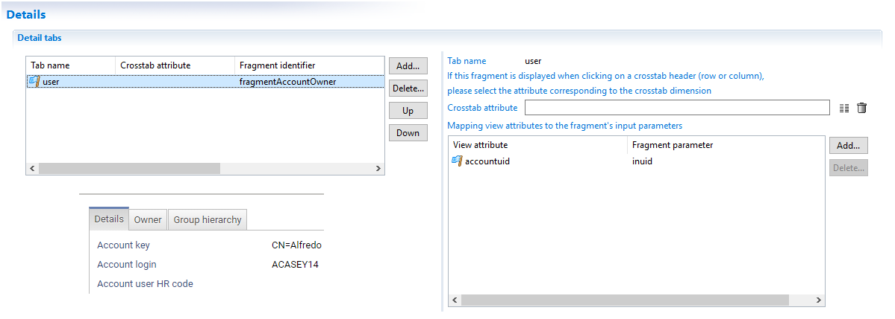

To rename the tab header for a fragment, you can click on the name (in the first column) of the main table on the left.

The fragment parameters are used to define:

- Which event triggers the display of the fragment.
- What is the data displayed inside the fragment.

If you leave the field `Crosstab attribute` empty, it means that the fragment will be active when the user clicks on an item to review
(either a crosstab cell in crosstab mode or a line in list mode).
If you select a header name in `Crosstab attribute`, either a column or a row header name, then the tab will be active only in crosstab
mode and only when the user clicks on the corresponding header.

The data to display is determined by the fragment parameters.
All fragments accept at least one parameter which is the uid of the item to display.
Some fragments have additional parameters.
In the review screen, when selecting a line in list mode, the user's selection must be given to the fragment to display details about the selected line.
The fragment's parameters are always UID.

Let's take an example with 4 fragments in the context of a right review by the organization managers:

- Identity details
- Account details
- Permission details
- Application details

All these fragments are expecting an UID as a parameter but not of the same kind.
Identity details is expecting an Identity UID, Account details is expecting an Account UID, etc.
In the review screen for the organization managers, each line in the main table is a right to review.
This line references an account and a permission (which makes a right).
When the user clicks on a line, the account UID mentioned in this line is given to the Account details fragment,
the Identity UID is given to the Identity details fragment, etc.

The table named `Mapping view attributes to the fragment's input parameters` is used to map UIDs from the detail view to the fragment parameters.
When the fragment contains only one UID, its name is usually `inuid`.

> The details view should return both attributes to display in the line in list mode and all the UIDs needed for the fragments.

## Tickets tab

Tickets are the technical objects in the Ledger used to store the review scope and the reviewer' decisions.

Here is the screen for a right review by organization managers:

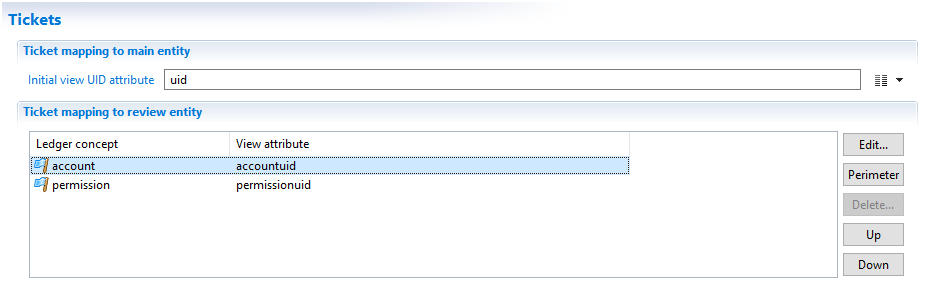

The first section is used to keep track of which entities are part of the scope.
For example in a right review by organization managers, the review start page displays a list of organizations.
The campaign manager can select several organizations to create a campaign.

The field `Initial view UID mapping` let you specify which the Organization UID from the main view (the first tab in the editor).
With this mapping, the product can mark the selected organizations as being part of the review scope.
From a technical point of view, a ticket will be attached to all selected organizations.

The second section is used to keep track of the reviewer' decisions.
The reviewer gives a status (accept, revoke,...) for each item to review and an optional comment.
These decisions are stored in tickets. Each ticket is linked to a Ledger concept (an account, a right, an identity,...)

The table lists the concept for which an attribute is expected.
For an identity review, the product wants an Identity UID.
For a right review, the product expects both an Account UID and a Permission UID.
The attributes to map come from the detail view (the fourth tab in the editor)

With this mapping, the product attaches a decision to the Ledger object defined by these UIDs.

## Reminders tab

## Emails tab

## Reports tab

## Internationalization tab

All the texts entered in the review editor should use the project default language.
For example, in the second tab named `Titles`, the `Process definition title` should be entered in English if your project default language is EN.
This is not related to the language of the Studio user interface.

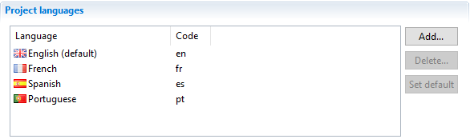

Once you have entered all the texts in the different tabs, you can translate them into other languages.
This Internationalization tab displays all the texts found in the editor and offers a column for other languages defined in the project.
The first column shows in which tab and in which field the text has been entered.

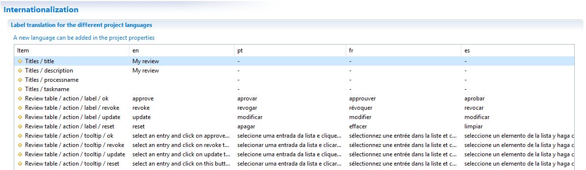

You can not change the texts in the default language column (in the above screenshot, 'en' column is read only).
You need to return in the corresponding tab to do that.
All other languages are editable. All you need to do is click in a cell and type the text.

> In the current version of the product, if you have only one language defined in the project, the texts are put directly in the generated workflow and pages files.
If you have several languages, the texts are stored in NLS for the pages and in properties for the workflow.

## Build tab
