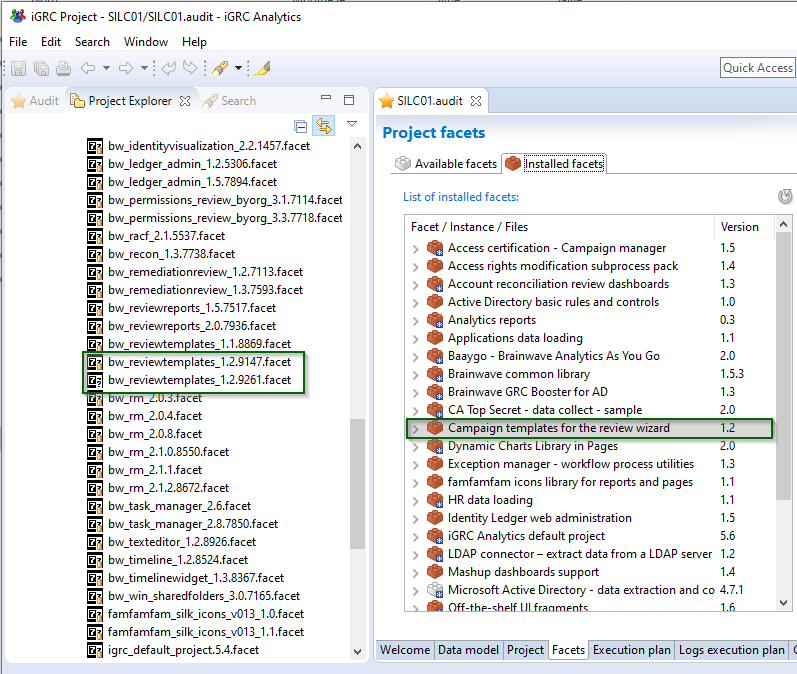
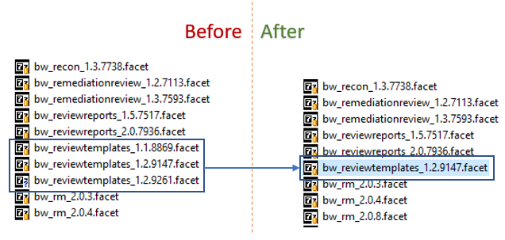
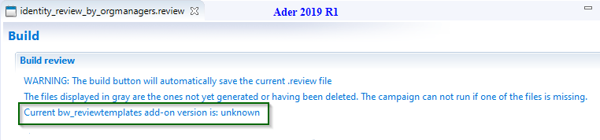
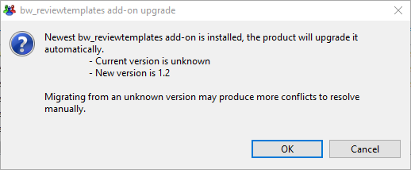
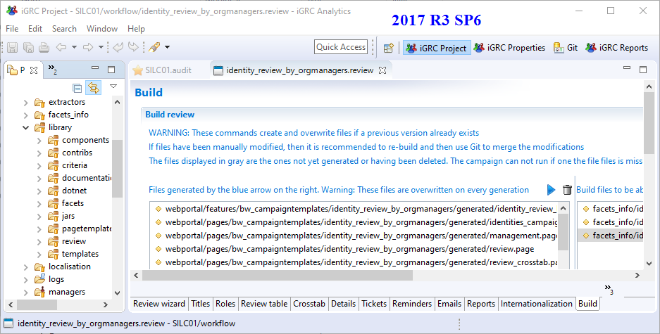
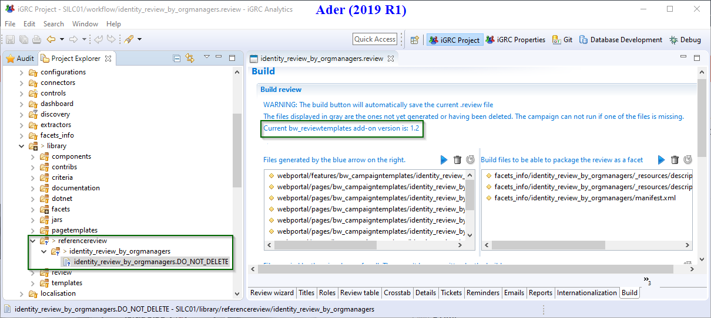

# Review wizard migration

> [!warning] This documentation applies on reviews created and generated with **2017 R3** version of iGRC product.

This documentation will guide you in the migration processes of reviews generated with the version `IGRC 2017` to `Ader R1` or other newest versions.
Many improvements and enhancements were added to the review generation engine in Ader.
The following table will show the differences in behaviours between 2017 R3 & Ader.

| Behavior                                                    | 2017 R3 | Ader  |
| :---------------------------------------------------------- | :------ | :---- |
| Overwriting the generated files at each build of the review | True    | False |
| Allow the migration of `bw_reviewtemplates` add-on          | False   | True  |
| Review generation merge tool availability                  | False   | True  |
| Manage `bw_reviewtemplates` add-on version                  | False   | True  |

It is important to understand that when using version `2017 R3` the files belonging to the upper left table in build tab are overwritten each time the Build button is pressed.
If changes have been applied to these files, then these changes will be lost when upon the build of a new version.

> [!warning] If you need to re-generate the files using verion `2017 R3` using the Build button with modifications applied to the review settings. In this case, it is your responsibility to merge into the newly generated files the differences applied to the files using a version tracker (GIT).

## Procedure

### Determining the installed Review Templatesadd-on

Before proceeding with the migration it is necessary to ensure that the review template source file (`bw_reviewtemplates_XXXXX.facet`) located in the folder `library\facet` corresponds exactly to the installed version in the project and the version used to generate the review.

Please note that when using version `2017 R3` the facet manager does not take into account the build number in the facet. For example if the following two facets are present in the `library\facets` folder, the product will not detect that an upgrade is possible:

- `bw_reviewtemplates_1.2.9147.facet`
- `bw_reviewtemplates_1.2.9261.facet`

Please be sure to keep only the `.facet` equivalent to the installed files. If unsure about what `.facet` was installed, then the easiest solution is to delete and then re-install the desired version.

### Determining the used Review Template add-on

Unfortunately for a review built using version `2017 R3` the information about which version of the add-on was used to generate the review is not available. Before migrating to Ader it is necessary to identify what version of review template add-on was installed.
Once the generation version identified please keep only this version in your `library\facets` folder.

As an example, considering the installed version was `bw_reviewtemplates_1.2.9147.facet` and in our `library\facets` folder we have three different versions:

- `bw_reviewtemplates_1.2.9261.facet`
- `bw_reviewtemplates_1.1.8869.facet`
- `bw_reviewtemplates_1.2.9147.facet`
  
It is necessary to delete `bw_reviewtemplates_1.2.9261.facet` and `bw_reviewtemplates_1.1.8869.facet` keeping only the correct source facet file (`bw_reviewtemplates_1.2.9147.facet`).

### Review file content

Before upgrading your review be sur to check that the review settings were not modified since the last review build, i.e. changes to the `REVIEW_NAME.review` file. If this is the case please revert to the previous state by replacing the version of the review file with the version used for last build.

> [!warning] If the review settings don't reflect to the current generated files this increased the risk of conflicts once the build is performed.

### First review build on Ader

After performing the previous steps, you can know launch your first new build of the review template on Ader. This build is important as it will all the necessary new elements included in the latest version of the Review Template add-on. In addition this will store a copy of review file to `library\referencereview` folder. This file is important as it will serve as a reference for the future upgrades.

After using the blue arrow to launch the build you will get dialog box that details that an upgrade is needed, you need to confirm to continue the operation.

**Before migration to Ader**: picture taken from 2017 R3 SP6

**After migration in Ader (2019 R1)** : picture taken from Ader (2019 R1)

At this point you have finished the migration of your review generated using 2017 to Ader. You can now upgrade to a newer version of `bw_reviewtemplates` if needed, you can follow [Review build and migration](./04-build) documentation for the future review builds and `bw_reviewtemplates` add-on migrations.
