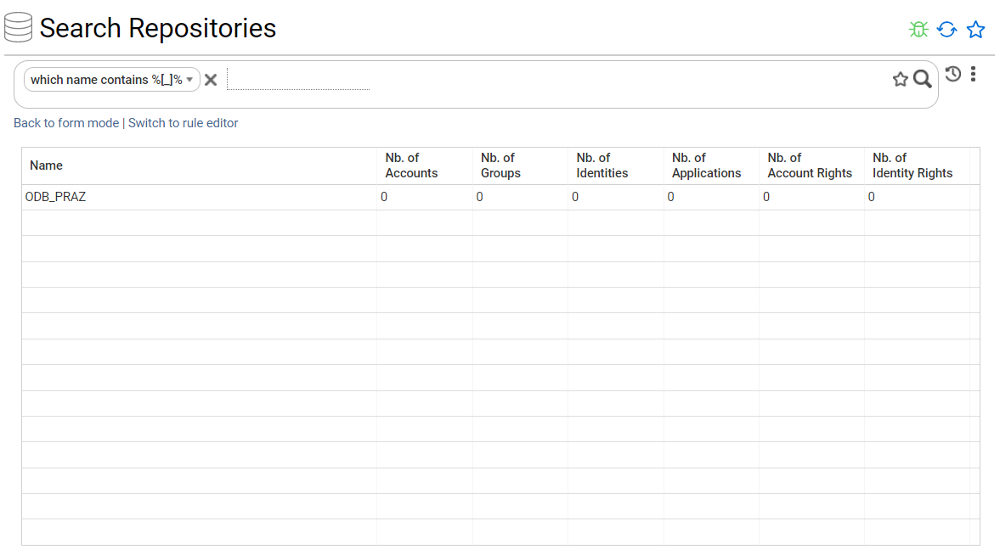

# Table of contents
{: .no_toc .text-delta }

1. TOC
{:toc}
---

# Context

When performing a search in the Portal, the value can sometime contain a special character (`'_'` for example) interpreted.

It is possible to disable the interpretation by using an escape character, depending on the DBMS used.

 > **Note:** The feature described in this article works also for searches in simple/form mode.

# SQL Server

The escape character for SQL server is `'[x]'` where **x** is the character to espace.

Below example illustrates behavior differences regarding the use of the escape character or not for the underscore special character.

- We consider all repositories

- If we filter on this set using **"which name contains `'%_%'`"** criteria, all entries are returned (even ones without underscore character)

- If we filter on this set using **"which name contains `'%[_]%'`"** criteria, only "ODB_PRAZ" entry is returned (the only result with an underscore)

# PostGreSQL

The escape character for SQL server is `'\x'` where **x** is the character to espace.

Below example illustrates behavior differences regarding the use of the escape character or not for the underscore special character.

- We consider all repositories

- If we filter on this set using **"which name contains `'%_%'`"** criteria, all entries are returned (even ones without underscore character)

- If we filter on this set using **"which name contains `'%\_%'`"** criteria, only "ODB_PRAZ" entry is returned (the only result with an underscore)

