# Theoretical rights

Theoretical rights allow to load a list of accesses Identities should have in theory, and compare it with real access rights.  

The goal is to run controls, that list over-allocations and under-allocations:  

- Over-allocations: rights the Identity has in real applications that are not in the theoretical rights model
- Under-allocations: rights the Identity should have according to the theoretical rights model, but does not have in the real applications

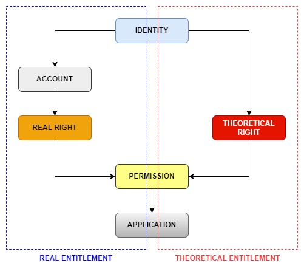

There are two ways to collect theoretical rights :
- [Permissions are provided with accounts](#collect-iam-rights)
- [The criteria for obtaining permission are known using model policy](#collect-using-model-policy)

To achieve this goal, you have to implement the following steps:  

1. Collect of the theoretical rights model, from an IAM application
2. Define the theoretical rights model policy using the ingested data
3. Run controls for the theoretical rights to return over-allocations and under-allocations

## Project & Facets

If possible, don't implement it yourself, but use the facets & what is included in the project already:  

- `bw_iamcollector`:
  - Allows to load the Theoretical rights of an IAM application into the ledger (Silo & collector lines)
  - It also contains a model policy: `iam_rolemodel`
  - *You might need to add a collector line to convert your source data to the format required by this facet*
- `IAP` / `IAS`, already contains:
  - Theoretical rights controls: `bwcd_ACC17` and `bwcd_ACC23`
  - Fragments for theoretical rights:  
    - `webportal/pages/bw_fragments/iamapplication`: to display the role model of the `IAM` applications
    - `/webportal/pages/bw_fragments/identity/theoreticalrights`: to show over-allocations on Identities

## Collect IAM Rights

In IAM Rights collect, it is possible to directly provide accounts in import files.

There is a dedicated target in collect, for IAM rights:  

It requires to point on the target permission and account (which means to point to the couple application/permission and repository/account):  
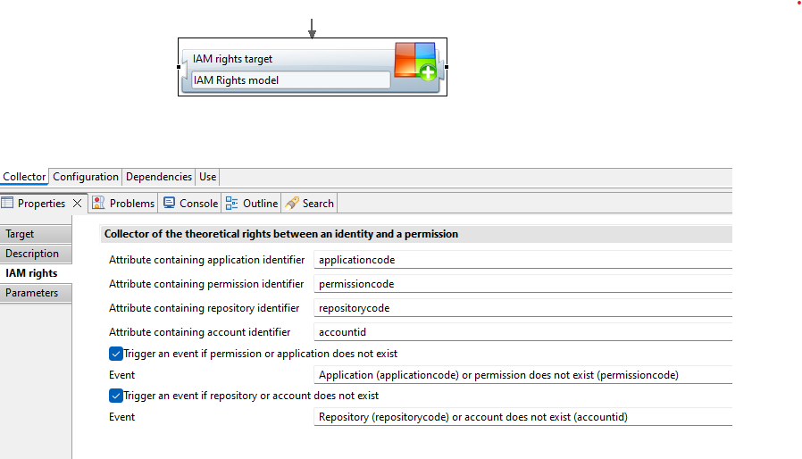

Role and comment are optional parameters for more information, they don't affect the theoretical rights:  
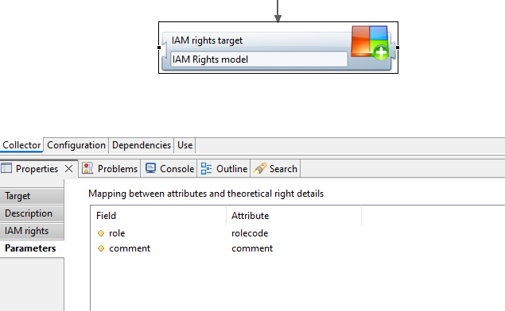  

Here is some sample data to illustrate:

| Application code | Permission code | Repository code | Account id  | Role            |
|------------------|-----------------|-----------------|-------------|-----------------|
| Elyxo            | User            | EKYXO           | VIOLET9     | DFIN_Agents     |
| RACKSTATION      | FIN_Share       | ACME            | JHORTON19   | DFIN_Agents     |
| Elyxo            | Admin           | ELYXO           | ROMAIN11    | DFIN_Admins     |
| RACKSTATION      | FIN_Share       | ACME            | OLIVA8      | DFIN_Admins     |

> The `DFIN_Agents` grants the `Elyxo/User` and `RACKSTATION/FIN_Share` permissions for the accounts `VIOLET9` from the `ELYXO` repository and `JHORTON19` from the `ACME` repository.  
> The `DFIN_Admins` grants the `Elyxo/Admin` and `RACKSTATION/FIN_Share` permissions for the accounts `ROMAIN11` from the `ELYXO` repository and `OLIVA8` from the `ACME` repository.  
> After this step made during the collect, **theoretical rights** between **Accounts**, **Identities** and **Permissions** are not yet created. They will be created during the `theoretical right model policy` step, just after the manager policy step.

## Theoretical rights loading

During the `theoretical right model policy` step, the accounts provided in the collect are converted to the reconciled identities.

After these steps, refer to [the control section](#controls).

## Collect using model policy

There is a dedicated target in the collect, for theoretical rights:  
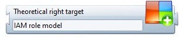  

It requires to point on the target permission (which means to point to the couple application/permission):  
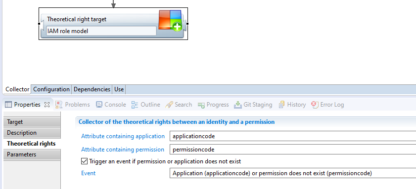  

And the parameters used by the model policy to determine the population that should have said permission:  
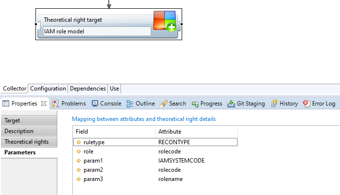  

The model can vary between clients.  
It can use an identity's job, organization, or HR code.  

Here is some sample data to illustrate:  

Using a *job title* as param1:  

| Rule type | Application code | Permission code | Role        | param1 (Job) |
|-----------|------------------|-----------------|-------------|--------------|
| IAMTYPE   | Elyxo            | User            | DFIN_Agents | Actuary      |
| IAMTYPE   | RACKSTATION      | FIN_Share       | DFIN_Agents | Actuary      |
| IAMTYPE   | Elyxo            | Admin           | DFIN_Admins | Actuary_adm  |
| IAMTYPE   | RACKSTATION      | FIN_Share       | DFIN_Admins | Actuary_adm  |

> The `DFIN_Agents` grants the `Elyxo/User` and `RACKSTATION/FIN_Share` permissions for the identities having the `Actuary` job title.  
> The `DFIN_Admins` grants the `Elyxo/Admin` and `RACKSTATION/FIN_Share` permissions for the identities having the `Actuary_adm` job title.  

Using an *HRCode* as param1:  

| Rule type | Application code | Permission code | Role        | param1 (HR Code) |
|-----------|------------------|-----------------|-------------|------------------|
| IAMTYPE   | Elyxo            | User            | DFIN_Agents | HR000285         |
| IAMTYPE   | RACKSTATION      | FIN_Share       | DFIN_Agents | HR000285         |
| IAMTYPE   | Elyxo            | User            | DFIN_Agents | HR000878         |
| IAMTYPE   | RACKSTATION      | FIN_Share       | DFIN_Agents | HR000878         |
| IAMTYPE   | Elyxo            | User            | DFIN_Agents | HR000666         |
| IAMTYPE   | RACKSTATION      | FIN_Share       | DFIN_Agents | HR000666         |
| IAMTYPE   | Elyxo            | Admin           | DFIN_Admins | HR000007         |
| IAMTYPE   | RACKSTATION      | FIN_Share       | DFIN_Admins | HR000007         |

> The `DFIN_Agents` grants the `Elyxo/User` and `RACKSTATION/FIN_Share` permissions for the identities having the `HR000285`, `HR000878` and `HR000666` HR Codes.  
> The `DFIN_Admins` grants the `Elyxo/Admin` and `RACKSTATION/FIN_Share` permissions for the identities having the `HR000007` HR Code.  

The end-result might be the same, even if the model is not build the same way. Some methods require larger files, like using the HR code to define theoretical rights for each identity (instead of using the Job title for instance).  

The data collected using this target in the collector line can be retrieved the `Theoretical right model` in the views:  
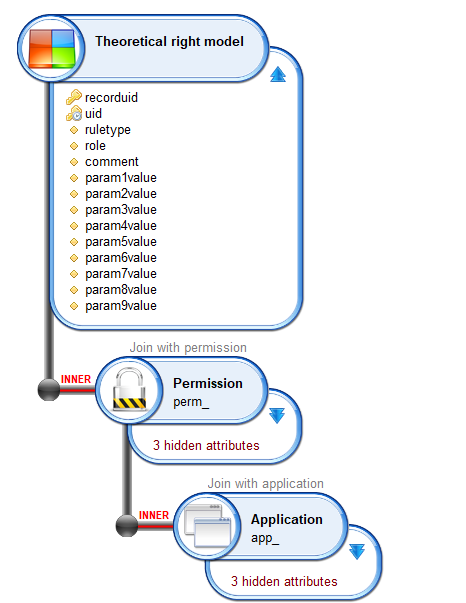  

The content of this table will be used by the model policy.  

> There is **one** entry for **each** permission.  

> After this step made during the collect, **theoretical rights** between **Identities** and **Permissions** are not yet created. They will be created during the `Entitlement model policy` step, just after the manager policy step.

## Entitlement model policy

The entitlement model policy will use the data loaded by the collect in the `Theoretical right model` to determine for each permission the target population (identities).  

It is defined in the `model` folder of the project, and the logical is very similar to manager policy.

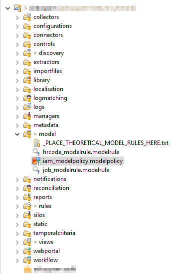  

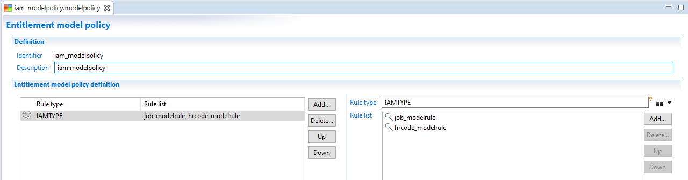  

Each rule defined in the `Theoretical right model` will be called, passing the parameter values set in the collect (see previous point) and returning identities that should have the associated permission.  

Based on their Job Title or HR code if we take the examples from earlier, associated model rules should be set as below:

- For Job

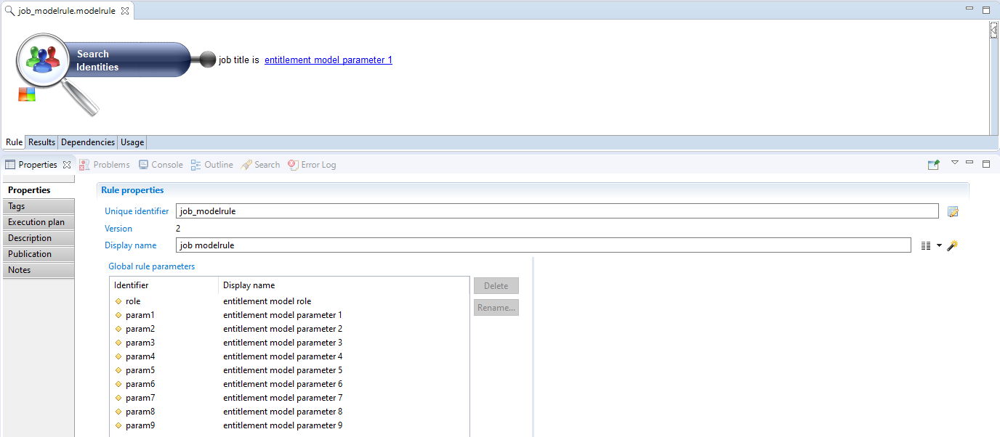  

- For HR code

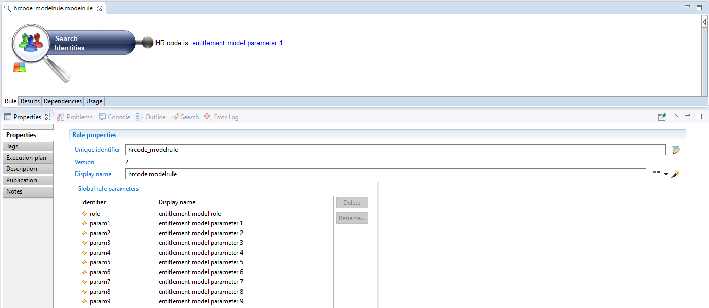  

For each rule, all **Identities** returned by it will be linked to the concerned **Permission** by a **Theoretical Right**. Those results of the model computation will be stored in the database, and can be retrieved from a view using the `Theoretical rights` entity:  

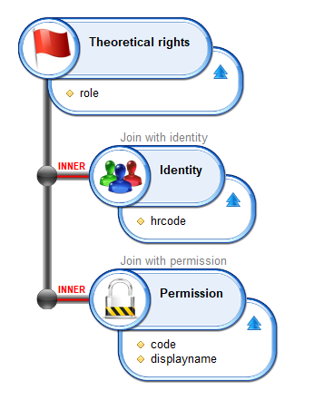  

> In the IAM collector facet, the computation is done using roles directly. The roles are assigned to identities, and the role content is loaded as the theoretical rights of each identity having the role.  

## Controls

Now that the model, theoretical rights and real rights are loaded, we can run controls to compute over-allocations and under-allocations.  

Theoretical rights controls are `type 5` controls (`Theoretical entitlements`), with the control result type determining over-allocations (=1) or under-allocations (=2).  

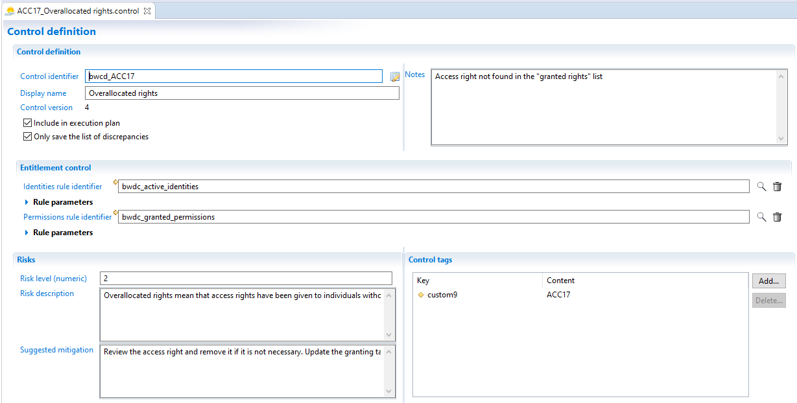

A theoretical rights control requires two rules that will determine the perimeter of real rights the controls are run on against the theoretical rights model:  

- Identities, for example active identities only

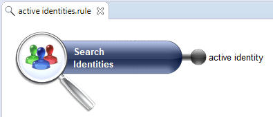

- Permissions, often permissions that are used to define the theoretical model

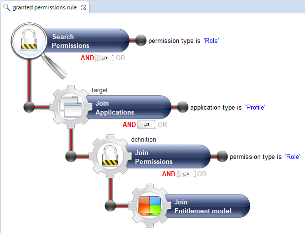

For each Identity/Permission couple returned by theses rules:  

- If the **Identity** has a **real right** and a **theoretical right** to the **Permission**, no discrepancy returned, we are in the normal situation
- If the **Identity** has a **real right** but no **theoretical right** to the **Permission**, a `overallocation` discrepancy is returned
- If the **Identity** has no **real right** but a **theoretical right** to the **Permission**, an `underallocation` discrepancy is returned

