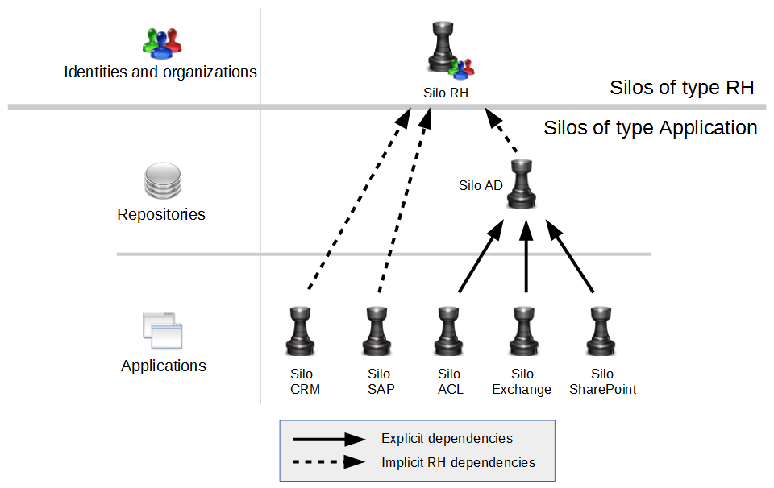

# Dependencies

The silo definition includes an optional dependency to a parent silo.  

It is important to define this information as, for example, some applications can depend on the data collected in another silo. This is typically the case for Microsoft application: Active Directory, SharePoint, Exchange, Shared Folders ...  

## Example

A silo is created to collect Active Directory's data (AD) and a second is created to collect SharePoint data.  
As SharePoint is defined by links between Active Directory accounts, groups and permissions that represent SharePoint Sites, lists, folders... the collect of your SharePoint data will fail if run before AD collect.  
To avoid this problem, it is possible to declare that SharePoint depends on AD. This will ensure that AD silo will be collected before SharePoint silo.  

In the product there are two types of dependencies : Implicit and explicit  

## Implicit dependency

When you create a silo using the creation wizard, you have to select a silo type as shown in the following snapshot:  

This type of silo is used as a first level of dependency. This dependency is implicit.  
When running the execution plan, the product loads the data in different phases:  

- First the HR type silos
- Then the Application
- Then the Theoretical rights
- Then the Control
- Finally sequentially the Additional steps 1 through 3

As of version 2016 R3 the types of silos have been augmented to include the following types:  

- Preliminary step 1 to 3
- HR
- Application
- Theoretical Rights
- Control
- Usage
- Log
- Additional step 1 to 3  

These in turn correspond to the main stages of the execution plan and allow better control of the execution sequence of silos.  

## Explicit dependencies

In the silo definition, you can add an explicit dependency between 2 silos which have the same type. For example, the silo for employees (HR type) may depend on the silo for organizations (HR type). Also, the silo for SharePoint (Application type) may depend on the silo for AD (Application type). These explicit declarations in the silo editor are the second level of dependency.  

The following diagram shows an example of the dependencies between silos:  

The best practice for silos of Application type is to separate the repository level (repository, accounts, group) and the application level (permissions, applications and rights) as shown in the above diagram for AD and SharePoint.  

This is not always possible depending on the input data files, however, splitting data into a repository silo and an application silo has many benefits. Among others this methodology allows you to debug the collect of the application permissions and rights while keeping the repository in the Ledger / Project documentation. All functional parts having being declared are conserved.  

> [!warning] Missing or wrongly defined dependencies may result in errors during the collect or activation step.
> Assuming that the dependency between SharePoint and AD is not defined in the SharePoint silo. There are 2 common use cases where the missing dependency will trigger an error:  
>
> 1. The execution plan determines the order of the collect to run. As there is no dependency, the product may choose to run SharePoint before AD. The collect of the SharePoint rights will fail if some nodes (sites, folders, documents,...) are granted to AD groups which have not been collected.
> 2. The product decides to collect AD and SharePoint in the right order. Before activation, you check the data in the Ledger and find that AD needs to be dropped and collected again. You delete AD silo. Without dependency declaration, the product won't delete SharePoint. Then AD is collected and the activation is run. The activation will fail because all SharePoint references to AD are wrong.|

> Please take your time and carefully define the dependencies of your silos as it is VERY important to safely collect data.

## Silo dependency visualisation

It is possible to visualise the sequence in which the silos will be executed. For this navigate the the execution plan tab in the project configuration. By clicking the question-mark button next to the run silos option a new window wil open displaying the silo dependency tree, in the top section, and the silo execution, sequence in the bottom section.  

