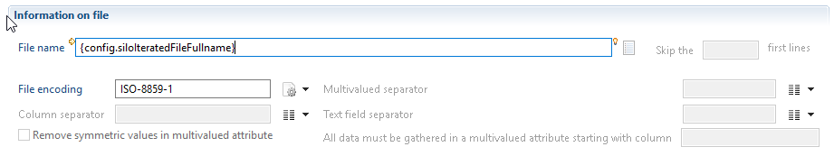

# Iteration

Some applications are typically static. For example to load a CRM application, you create a discovery, a collect line and a silo. However other applications can be dynamic. This means that the perimeter can change in time. This is the case with AD if you have multiple domains, for example. If the customer has one domain per country, it would be clever to organize the collect so that, when a new country is opened, it is collected by just adding a new LDIF file in the extract folder. For this it is necessary that the schema of the input file schema remains constant.  

You can activate the "iteration" feature by clicking the corresponding option in the silo editor (see the caption bellow). You then have to specify the folder which contains your input files. It is also possible to include the files included in the subfolders. You also can configure a filter, `*.ldif` or `TSS_*` for example, to limit the files you wish to iterate over. The product will then enumerate over found files, call your collect line for each file name found and loading the corresponding data independently.  

When iterating over files included in a folder, it is necessary to dynamically change the name of the silo name. The default silo name corresponding to the silo definition can be overridden to create as many silos as imported files. In our example one silo per AD domain. This allows you to remove all loaded data of one domain without deleting the data collected in another domain. To achieve this, two additional configuration variables are filled out automatically :  

- `{config.siloIteratedFileFullname}` who contains the full path of the file that is currently read.  
for example : `D:\importfiles\AD\``test.ldif`  
- `{config.siloIteratedFileShortname}`who contains only the name of the file without extension. for example `test`. It is usefull if file name includes information that allows the user to identify it, for instance the AD domain name.  

These two variables can then be used in the expressions defining the silo name, or the silo constants. Theses variables are also available in all the collect lines to be used in javascript expression as needed. If necessary it is also possible to locally, within a collect line, change the name of the silo.  

Finally, when iterating over files, it is important to identify how the collect line determines the file to load. There are 2 methods available:  

1. If the main collect line of the silo uses a discovery component as its main source, the parameters and files defined for your iteration purposes are automatically used. For each file found, the main collect line will be run and the name of the file processed by the discovery source will be overridden by the product.
2. If the main collect line does not start with a discovery component, then in your discovery source component on your collect sub-lines, use `config.siloIteratedFileFullname` to force the file opened by the discovery.  

  
