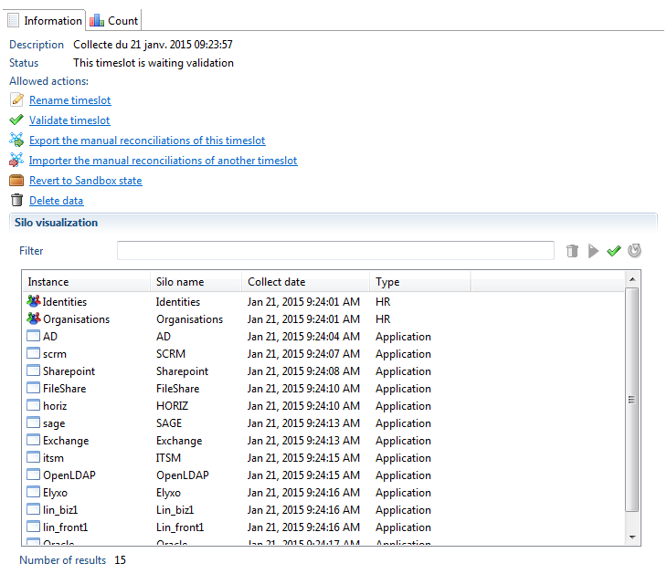
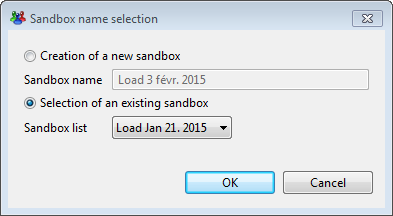

# Using Silos within the ledger

## Listing the used importfiles

As the execution plan is running, all the names, sizes and last modification dates of the files opened by the collect engine are stored in the database. As such, you can view the list of files used during the execution plan in the first tab of the Ledger in the studio; Silos :  

## Listing the loaded silos

For more information on the silos executed during the execution plan you can navigation to the timeslots view by clicking Show timeslots in the audit menu. This view shows a list of all timeslots existing in the database. After selecting a timeslot, the product displays on the right the list of silos loaded during the execution plan.  

From this list of silos, you can :  

- Check dependencies of silos (green check icon). This is a way to check if some dependencies, not declared in silo definition, are found in the data loaded in the database.
- Select several silos and delete them (trash bin icon). This will delete all the selected silos but also all silos which depend on the selected ones.
- Select several silos and reload them (blue array icon). This will delete the data of these silos and all the silos which depend on the selected ones then run the silo again to load data.  

Delete and reload actions work on both a sandbox and an activated timeslot. When these actions are performed on an activated timeslot, the timeslot is reverted to the sandbox state. A link has also been implemented that allows you to revert the activated timeslot to a sandbox state. This operation does not affect the data in the ledger and no delete or reload of data is performed.  
When reverting to the Sandbox state, returning to the activated state is done using the usual "activate" link.  

> A validated timeslot can never be reverted to activated or sandbox state.
> A validate timeslot can not be deleted, only hidden. A hidden timeslots data is still present in the database however the information cannot be displayed in the web portal.  

## Running silos

In the project configuration editor, under the "Execution plan" tab, you will find the blue arrows that can be use to run each step or to run all the step at once.  

The 2 actions under Step 1 opens a dialog box asking you to create a new sandbox or select an existing one.  

If you choose to create a new timeslot, the product behaves like in the previous versions of the product.  

If you select an existing timeslot, the product will find all the silos not yet loaded and will only run the silos needed to have a complete timeslot. This means that you can navigate to the timeslot view, delete some silos, declare new silos and collector lines and then run the silo in the execution plan tab so the product adds in the Ledger only what is missing.  

It is also possible to run each silo individually by using the dedicated buttons in the silo editor (see [here](../../getting-started/05-studio-editors#silo-editor) for more information).  
