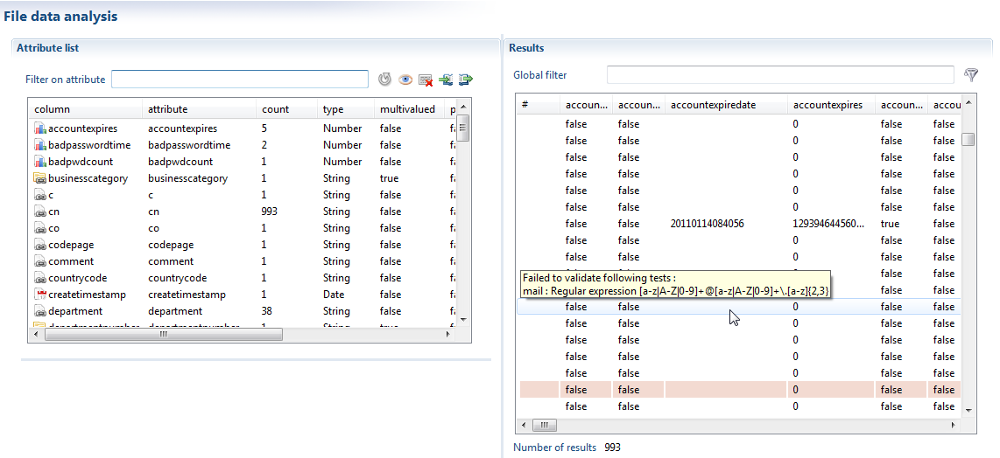
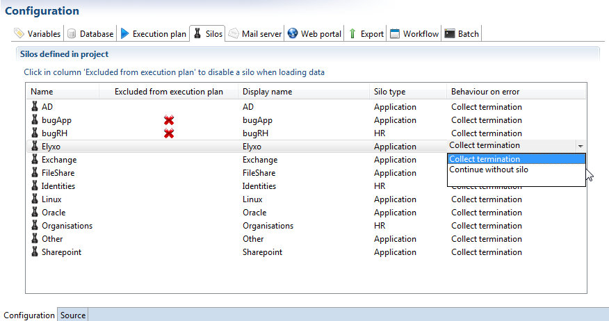

# Input file validation

A mechanism of detection of invalid input files has been included in the discovery and the silos execution. There are 2 goals :  

- If an input file is invalid, the whole silo can be ignored if it is not sensitive.
- All errors found in input files are logged in a different file for each silo. This way, sending the problems to the application owner is easier.  

The validation of input files, is automatically performed before the data collection. This functionality has been added to help ensure that no erroneous data will be imported into the database. It offers the following features :  

- Multiple checks are run on input files, more precisely on attributes extracted from discovery  
- The validation process retrieves all errors in a single pass and reports them by silo, so that application owners can be notified individually
- A strategy for further collection can be defined and is applied when a file is not validated  

The validation step has to be configured in three different places : in the discovery editor, in silo definitions, and in the silo configuration.  

## In the Discovery editor

The input files validation parameters are defined in the discovery editor, under the 'Validation' tab, as shown below :  

For each discovery attribute, it is possible to set one or several of the following conditions :  

- The attribute is mandatory (e.g. its value cannot be empty)
- The attribute is filled out with a given ratio. This helps tolerate a small margin for empty values, but raises an error if an overwhelming number of values are absent (for instance more than 20%)
- The attribute matches a given date format
- The attribute matches a given regular expression  

The validation results are displayed in the bottom section of the validation tab. The attributes that failed the validation test are listed, along with the number of invalid entries and a sample of those entries. The validation errors are also shown directly in the analysis results tab: the lines including invalid data are displayed with a colored background. Hovering the mouse over such line will yield a summary of the tests it failed to pass.  

Please bear in mind that these validation checks are not of the same nature as the standard checks you run on attributes : instead of discarding incorrect values, the product will keep them and feed them to the collector lines, but an error will be raised if a check fails. It is therefore very important to distinguish between two different strategies when for instance trying to assert that the employee number is mandatory :  

- Applying a mandatory check on the attribute will effectively filter all empty values of the attribute, which means that there is a tolerance for empty valued being present in the file, even if we don't want to see them end up in the database  
- Including a validation check on this attribute will reject the file as invalid if an empty value is present  

## In the Silo editor  

You may be aware that a discovery can be applied to several input files during collection, or at least to a data file overriding the path defined in the discovery. Thus it is imperative to declare on which file(s) to apply the discovery checks during the validation step. This has to be done in the silo definition, in the 'Validation' tab :  

The tab holds only a list with the file paths and their associated discovery. The path can either be pointing to a single file, or can be a file pattern describing any number of files. In the example shown above, for instance, all the LDIF files present in the /importfiles/demo/AD folder will be tested to verify that they follow the requirements of an AD users input file. This means that, if we have to take another AD domain into account later on, just dropping the new LDIF file will automatically ensure that it is checked along with the other domains. If, moreover, a similar file pattern has been set for silo collection, there will be no additional configuration required to have the new file checked and collected.  

The silo validation will be automatically performed when trying to run the collection from the main 'Silo' tab, but it can also be triggered independently using the green check in the same tab. The errors found during validation are compiled in a log file under _logs/silovalidation\_\<siloname\>.txt_  

## Defining a collection strategy in the configuration

There remains to define the behaviour for silo collection when an input file fails to validate the designed checks. This can be performed in the 'Silos' tab of the configuration editor.  

There are two distinct behaviours that can be defined for each silo :  

- terminating all collection
- collecting the rest of the data, only omitting the invalidated silo when it is not deemed critical  

If left unspecified, the default behaviour is to prevent all data collection.  

The validation step will automatically be performed when running silos collection, either from the studio or from the batch command line. It is possible to check all files without triggering any collection in the execution plan, by clicking on the green check under the 'Run silos' actions.

The errors found during validation are placed in a different log file for each silo, in the logs folder, under the name _silovalidation\_\<silo name\>\_\<timeslot name\>.txt_.  

Having different log files allows to send only the relevant errors to an application or repository owner responsible for the data input files provided.  
