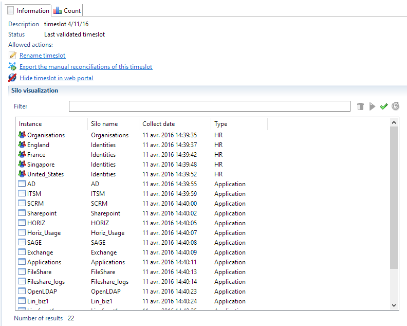

## Collect and Silos

Brainwaves includes a concept called Silo.  
Simply put, a silo is a way to tag data and to organize collect processing.  

### Overview

In previous versions of the product, all data files were collected as a whole. There was no way to delete all data related to an application or a repository like SAP (accounts, groups, rights, permissions,...). The whole sandbox or timeslot is deleted.  

In versions 2015 and above, you can define different silos (for example one per application) and run the collect so that each data stored in the Brainwave database (account, group, permission,...) belong to a silo.  

The Timeslot view of the product displays the list of silos collected and you can delete just one silo and reload it after modifying the collect line.  

  

As an example of what can be done using Silo. This new concept offers the following benefits:

- Silo definitions let you organize your collect in a declarative way. By just looking at the silo definitions, without editing the complex collect lines, you can have an overview of all data collected (HR data, repositories and applications)
- Silos can be deleted then collected again without having to destroy the whole sandbox. This is very handy in the first steps of the project when debugging an application collect line. No need to reload other repositories or HR data
- Silos bring input data file validation. For each silo, you can define some constraints for the input file and decide, by configuration, to skip it if the data files do not respect input format. This allows execution plan to continue even if a non important application can not be collected.
- Silos can enumerate files from a folder which simplify the collect line. No need to use a file enumeration component as a source. This is useful in order to have a dynamic behaviour depending on files found in a folder (for example on file per AD domain)
- Silos can have dependencies between them. The product automatically determines the order in which to execute the silos. It means that the main collect line which calls all other sub-lines is not needed any more.
- Using silos, it is easier to make an app which run immediately after installation. The app includes the silo definition and is automatically part of the execution plan.
- Including or excluding a silo from the execution plan is done in the configuration (dev, prod,...). This way, you don't have to change a collect line to do that.
- Some constants may be defined in the silo to be used in the collect line. Defining a computed attribute in the discovery for an application name or the repository code is not needed any more.
- The name, the length and the last modification date of all the files opened by any collect lines are stored in the Ledger while the execution plan is running. Nothing to do to activate this feature.

### What is a Silo ?

A silo is a file with a `.silo` extension in the silos folder. It has a name and refers to a collect line. Due to the addition of silos the main collect line previously used for the project does not exist any more. When running the execution plan, the product enumerates all silo files in the silos folder (if not excluded in technical configuration - explained later) and run the associated collect line.

  

Of course, the collect line referenced by a silo may still call sub-lines. For example, SharePoint sil   o refers to a SharePoint main collect line which calls 3 sub-lines to load nodes, groups and rights.  

The included sub-pages will provide you with more information on how to setup, configure and use silos.  
