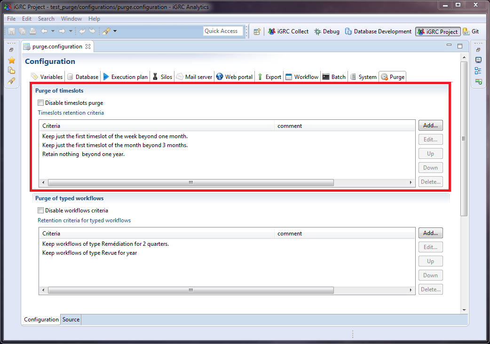
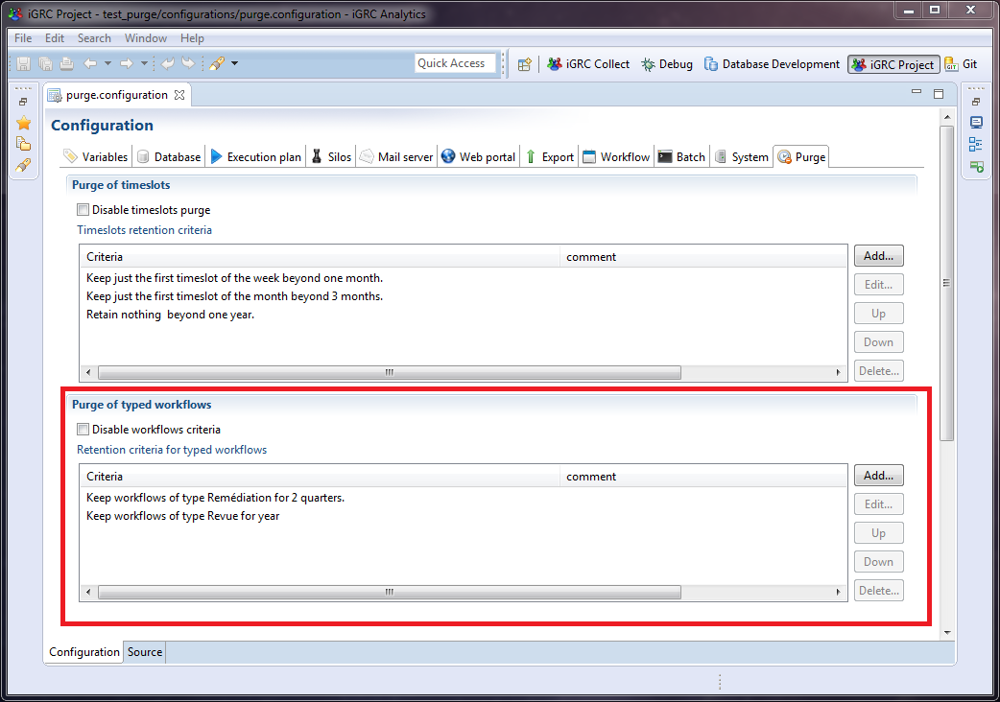
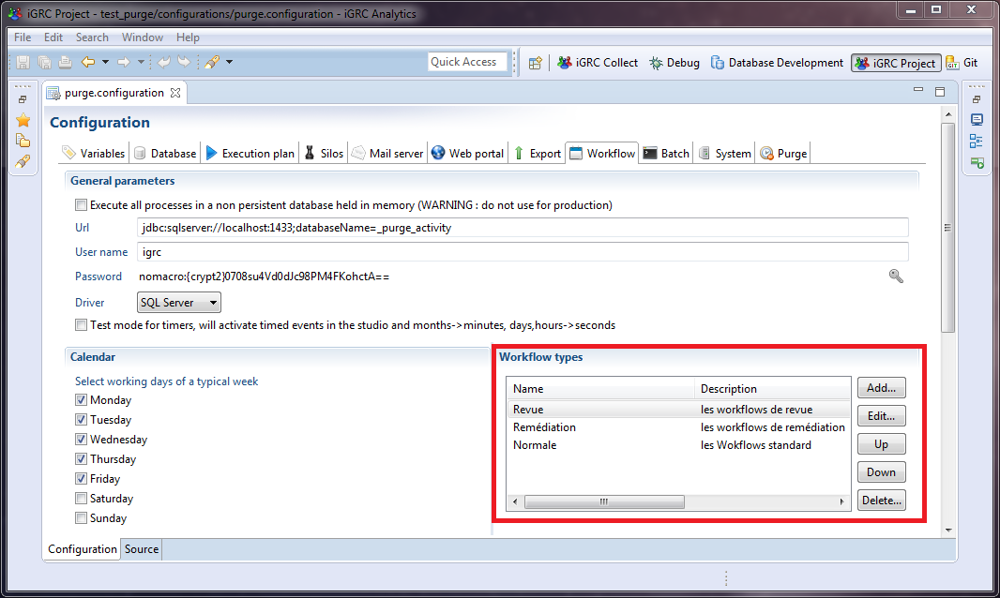
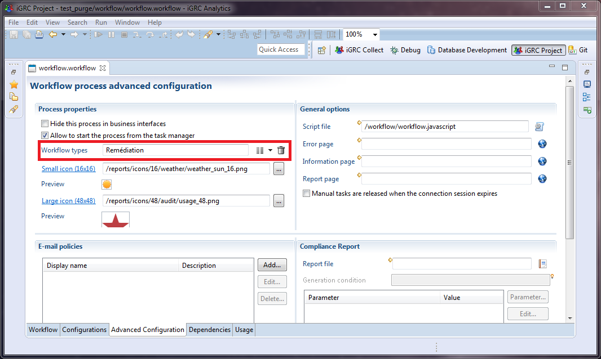
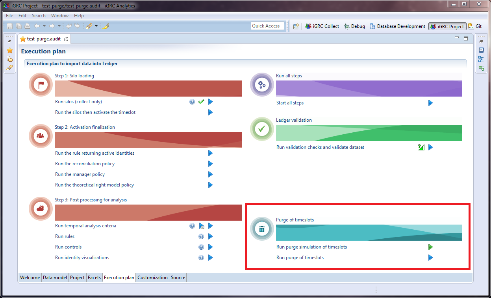

# Purging timeslots

## Purge enhancements  

The purge capabilities have been enhanced as of version **2016 R2**. These enhancements are explained below :  

- Timeslot picking  

The old purge system, using the command line `igrc_purge.cmd`, was used to delete a number of timeslots. The purge could only delete the first collected timeslots (the oldest ones). There was no way to delete specific timeslots in the middle of the timeslot history. Now the purge can keep for example one timeslot per week or per month and delete all others.  

- Workflow compliant  

The old purge could delete a timeslot without checking for workflow. It was impossible to keep a timeslot containing a process of a given type. Now the purge is aware of the process launched and does not allow the deletion of a timeslot used by an active process.  

- Rule selection  

The old system had a primitive way of selecting timeslots to purge. The timeslot selected were systematically the oldest ones. Now, you can give rules to select timeslots to delete using rules. These rules allow to delete more and more timeslots depending on the age of the timeslots.  

- Workflow type  

Old timeslots that were used to launch workflows can have different rules for the purge to be able to keep those timeslots longer even if the workflow is finished. This lets the portal access data when looking at the history of the process.  

> For an existing project in production, the purge command is compatible with the previous version. There is no need to migrate or change anything to the command line of the old purge if the old system suits your needs.

See [How-To Purge old Timeslots from the database](#legacy-methodology).

## Purge and workflow

The purge has been enhanced to be aware of existing workflows.  

If the technical configuration defines a workflow datasource (connection to an activiti database), the purge will search for active workflows. The first rule is that **it is forbidden to delete a timeslot if an active process instance has been launched on the timeslot**. Once a process is finished, the purge can delete the timeslot it was using.  

You can also set a type to workflow definitions. This type is used by the purge configuration. You will be able to select different rules for the purge depending on the type of workflow. For example, you can keep for 3 years all the timeslots that have been used to launch 'review' processes but only 2 years for the 'remediation' processes.  

Once a timeslot is deleted, the process history tabs still shows the process that was launched on the timeslot. A new feature has been introduced in this version to keep the workflow report so that the user can still view what happened in this process even though the timeslot with all the information has been deleted. To accomplish this, you can point to a report in the workflow advanced configuration tab of your process definition. This report will be generated as soon as the process is finished (even if it is terminated by an administrator). This report will always be available in the portal.  

To set up the workflow report, you can look at the article [Workflow compliance reports](../workflow/11-components#workflow-compliance-reports).  

### Purge configuration

The Advanced purge mode needs to be defined in the technical configuration under purge tab in igrc studio. It means that you can define different purge policies in each technical configuration.  
Purge configuration is divided into two parts. In the two parts, you define which timeslots you want to keep:  

- Timeslot retention criteria: used to define criteria to keep timeslots depending on the age of the timeslot  
- Workflow retention criteria: used to define criteria to keep timeslots depending on the type of workflow they contain.

> It is important to understand that the criteria are used to define what you keep and not what you delete !

The following sections describe the configuration usage of the purge criteria.  

### Purge rules

The Advanced mode for purging needs to be defined in the technical configuration under the purge tab in the igrc studio. It means that you can define different purge policies in each technical configuration.  
Purge configuration is based on a list of rules called criteria. You can define two types of criteria:  

#### Timeslot retention criteria

This allows you to define criteria that keeps the first or last timeslot of a period (week,month,quarter,..) beyond a duration of time.  



#### workflow retention criteria

This allows you to define criteria that keeps timeslots containing certain types of workflows for a duration of time. Even if you have a timeslot criteria that allows deleting a timeslot, the workflow criteria prevents the purge if timeslot is corresponding to a workflow criteria.  



### Declaration of Workflow Type

Workflow types can be declared in project configuration in the workflow configuration tab:  



### How to type a workflow

Open the `.workflow` file and go to advanced configuration then choose a previously defined workflow type.  



### Run the purge

Purge can be launched from within the igrc studio under the execution plan tab. You can launch the purge or a purge simulation which just computes what timeslots should be deleted and explains why we have to keep or remove each timeslot depending on configured criteria:  



## Batch Mode

Purging timeslots can be launched from batch using the `igrc_purge.cmd` command line or from the studio under execution plan  

### Command line

The purge command line requires 4 or 6 parameters depending on simple or advanced purge. The same `igrc_purge.cmd` command now has two modes:  

- Simple: this is the "legacy" command that was delivered in previous versions. It needs 6 parameters. The parameters define which timeslot will be deleted.  
- Advanced: all the configuration is defined in the Purge tab of the technical configuration of the project. It accepts only 4 parameters  

Mandatory parameters in the two cases are :  

- `<project name>`
- `<config directory path>`
- `<config name>`  

Purge command will return codes :  

- 0 for OK
- 1 for bad arguments
- 2 for error

### Simple Purge

This command expects 6 parameters:  
`<project name> <config directory path> <config name> <keep value> <keep unit> <action>`  
`<keep value>` is a positive value expressed in `<keep unit>`  
`<keep unit>` is either 'days' or 'timeslots' or 'states'  
`<action>` is either 'PURGE' or 'SIMULATE'  

If unit is 'states', then value is the status of timeslot (I for sandbox, W for activated timeslot, D for hidden timeslots)  

#### Examples

`igrc_purge demonstration /var/igrc/config default 365 days PURGE`  

Purge all timeslots (archived, committed, deleted) beyond current Date - 356 days  

`igrc_purge demonstration /var/igrc/config default 4 timeslots PURGE`  

Purge the four oldest timeslots  

`igrc_purge demonstration /var/igrc/config default IW states SIMULATE`  

Simulate deletion of all sandbox and activated timeslot.  

> For a complete list of timeslots statuses, see [here](./index#timeslot-status)  

## Advanced purge

This expects 4 parameters:  
 `<project name> <config directory path> <config name> <action>`  

`<action>` is either 'PURGE' or 'SIMULATE'  

This mode will be based on timeslot retention criteria defined in project configuration (see gui mode for more detail to configure advanced purge)  

### Example

`igrc_purge demonstration /var/igrc/config default PURGE`  

## Legacy methodology

An option has been implemented to allow the user to purge data from the database in order to reduce the size of the stored data.  
For this you should use the CMD script located in the home installation folder of Brainwave GRC.
Using this script you have to possibility to chose:  

- A given number of timeslots: keep `1<x<N` timeslots in the database, `N` being the initial number of timeslots present in the database.
- All timeslots beyond a given date

> [!warning] It is imperative to backup and perform regular archives of your data base before performing any purge of existing data.

The recommended procedure to archive your data is the following:  

- You have to define your retention period of active data: for example 12 months
- Every N months (3 months for example) you should perform a complete backup of the database. This backup should be archived an kept a limited amount of time (eg: 15 months)
- Following the backup of the database the data can be purged using the CMD script accordingly
- If necessary the archived data can be restored.

### Manual execution  

To execute the purge of data open a CMD or powershell window and navigate to the home installation folder. Your can then execute the following command:  

```sh
igrc_purge.cmd <project name> <config folder> <keep value> <keep unit> <action>
```

This command is detailed bellow:  

```sh
"Usage: igrc_purge <project name> <config folder> <config name> <keep value> <keep unit> <action>"
"<config folder> can contain several of these files:"
"- project.properties: file containing project configuration variables"  
"- datasource.properties: file containing database connection configuration"
"- mail.properties: file containing mail server connection configuration"  
"- workflow.properties: file containing workflow database connection configuration"
"- license.lic: file containing the Brainwave product license"
"<config name> is the name of the configuration (defined in a project .configuration file)"
"<keep value> is a positive value expressed in <keep unit>"
"<keep unit> is either 'days' or 'timeslots' or 'states'"  
"<action> is either 'PURGE' or 'SIMULATE'"
"If unit is 'states', then value is the status of timeslot (I for sandbox, W for activated timeslot)"  
"If <keep unit> and <keep value> are empty, purge will load timeslots retention criteria from configuration)"  
"Command line example: igrc_purge demonstration /var/igrc/config default 365 days PURGE"  
"Example: igrc_purge demonstration /var/igrc/config default IW states PURGE"  
"Another example to lunch purge from configuration: igrc_purge demonstration /var/igrc/config default PURGE"
```
