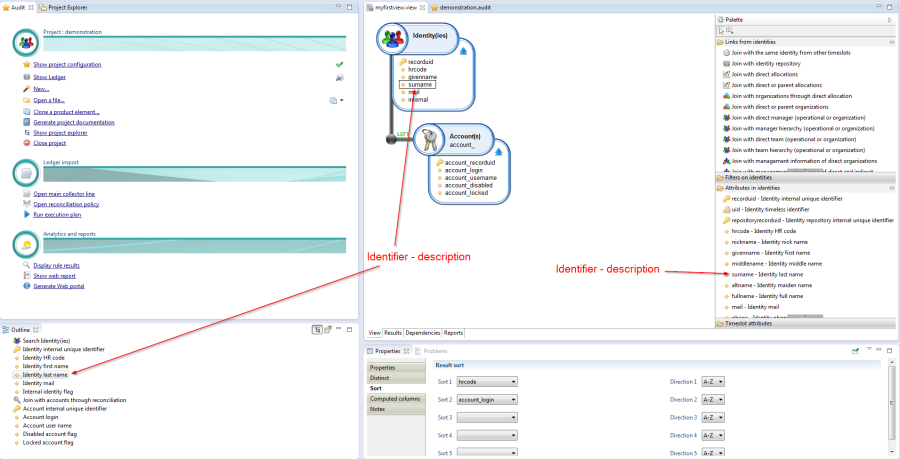
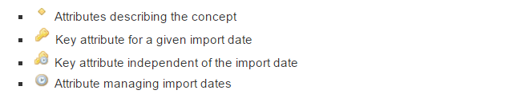

# Managing attributes

The Audit View Editor features a toolbox that presents the user with a complete list of its attributes for any selected concept. Adding an attribute in the Audit View is carried out by a simple drag/drop operation within the editor.  
Attributes are characterized according to:  

- An identifier;
- A type;
- A description

The toolbox displays the attributes following the format _identifier-description._ Once an attribute is selected in the editor, the user sees only its identifier in the graphical part; the description of the selected attribute is visible in the 'Outline' view of the editor.  

  

Several attribute families are available:  

- Attributes describing the concept. These attributes may be one of the following types:  
  - Character string
  - Boolean value
  - Integer value
  - Date and time
- Attribute providing a unique identifier to an object for a given import date This attribute is referenced in the system as '_recorduid_' and is used as a reference value to identify the object. This attribute is used by the database engine to carry out joining operations between the different concepts.
- Attribute providing a unique identity to the object independently of the import date. This attribute is referenced in the system as '_uid_'. In particular, this attribute enables data links to be created for a specific object and a specific time period.Note: using this attribute may lead to inconsistent results due to the presence in the Identity Ledger of several time-based incidences of the same object. We therefore recommend that you use the 'recorduid' attribute wherever possible.
- Attributes of keys to other objects within the Main Ledger linked to this object.To simplify the creation of Audit Views, the concepts presented effectively consolidate a group of SQL tables (nomenclatures, etc.) into one.
- Attributes managing import dates These objects can only be edited via the concept located at the root of your editor. These attributes are located in the 'Time-based attributes' section and enable queries to be composed independently of the import dates recorded in the Main Ledger.  

To make the editor easier to read, icons are shown before each attribute to enable the user to see at a glance to which family the attribute belongs:  

  

Attributes are added in the graphical editor by dragging and dropping from the toolbox. Attributes are deleted by selecting the attribute in the graphical editor and pressing the 'Delete' key or by clicking on the 'Delete' contextual menu.  
It is possible to rename the attribute identifier locally. This is carried out via the 'Attribute alias' field in the configuration box of the attribute. It is also possible to prefix explicitly those attributes of a concept that have not been renamed, via the concept's contextual menu 'Modify table prefix'

> [!warning] It is essential that each Audit View's identifier has unique attributes. If this is not the case, the reports will be unable to apply the views correctly. It is therefore highly recommended to add prefixes to all secondary concepts used by your audit view.  

> [!warning] Results of audit views are stripped of duplicates by default. You can switch this setting off by using the 'Distinct' tab in the Properties Editor of the Audit View. However, it is recommended to retain this setting unless you wish to carry out particular operations at the report level, such as consolidation.
