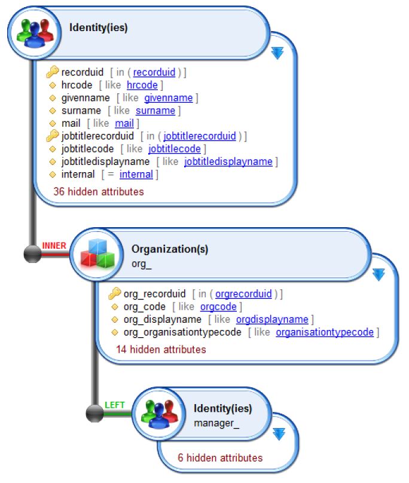
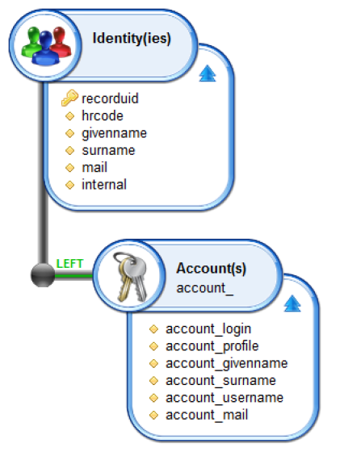

# Configuring Joins

## Key points

One of the most useful functions of Audit Views is the capability to draw on links between the concepts of the Identity Ledger to carry out advanced extracts of data.  
It is thus possible for example to retrieve a complete list of identities in a single view, showing for each:  

- Job title and organisations
- Associated accounts
- Associated permissions and applications
- And so on...

This function is implemented via the 'CONCEPT Links' section of the toolbox. This section explains which concept to use as well as the access route to follow where one or more routes are available.  
Once a new concept is placed into the Editor, a click on the concept enables the user to modify the contents of the toolbox to display the attributes and links of the concept as well as to edit the concept.  
This operation is recursive: It is possible to settle on any concept within the editor to establish new links.  

> It is possible to display the details of a link implemented in the Audit View Editor by placing the cursor over a link. The details of the link appear in the form of a tooltip.  

> [!warning] The names of attributes returned by an Audit View must be unique. We recommend therefore that you systematically apply a prefix to all secondary concepts within your Audit View.  

  

> Implementing links between the Concepts within the Main Ledger assists in assigning multi-values to attributes. For example, for each Identity, retrieve in addition the list of accounts available.
> An Audit View result is systematically a two-dimensional table with single-value attributes. Implementing links between Main Ledger Concepts gives rise to a Cartesian product of the relevant concepts: in the previous example, the result will contain the attributes of the attached identity for each access account. The number of results is therefore equal to (_number of identities_) \* (_number of accounts by identity)_.|

## Types of joins available

It is possible to configure the behaviour of the audit viewing engine once links between the concepts have been established. Two types of join are available in this manner. They relate to join families based on SQL standards.  

- [Inner Join](http://en.wikipedia.org/wiki/Join_%28SQL%29#Inner_join)
- [Left Outer Join](http://en.wikipedia.org/wiki/Join_%28SQL%29#Left_outer_join)

The default join when a relationship is implemented is a 'left value' (LEFT) join. Double clicking on this value enables the user to switch to an inner join (INNER) instead.  

### Inner join

An inner join applies to the strict Cartesian product of the two concepts. This means that the linked values are mandatory in the two concepts to enable a result to be generated.  
Take for example an Audit View that lists the access accounts associated with each identity. Setting a relationship to be an 'inner join' would mean that only those identities with at least one associated access account would appear in the table. Identities not having an associated access account would not satisfy the conditions for the search and therefore would not be included in the list of results.  

### Left outer join

A 'left outer join' involves enumerating, for each concept located on the left side of the relationship, the list of entries located in the concept on the right hand side of the relationship. If no entry is found in the right hand side of the relationship for an entry given on the left hand side, a line is nevertheless inserted into the results. The values of the linked concept (right hand side) are set to `null`.  

Returning to the previous example and setting the join to be 'LEFT', the result will contain the list of access accounts associated with each identity, as before. The results table will contain an additional line for each identity with no associated access accounts. The attribute values relating to the account will be set to _null_.  

## When to use each join type

'Left outer joins' should be used by default, in preference to 'inner joins' unless the user wishes to carry out consolidation operations on the results. The layout of 'inner joins' has the effect of hiding entries for which there are no linked elements in the right hand side of the relationship, which often means that a proportion of the results are hidden from view.  

For example, if you display a list of identities in a table, each showing the associated manager, using an inner join will have the effect of deleting the list of identities that do not have an associated manager which is often not the desired outcome.  

Examples of Audit Views using the 'left outer join':  

- Global identity list, with information on the associated manager if available
- Global identity list, with a list of the associated access accounts (numbered 0 to _n_)
- Global organisation list, with a list of members for each (numbered 0 to _n_)
- Global organisation list, with a count of members for each (0 to _n_)

Examples of Audit Views using an 'inner join':  

- List of managers with a list of direct reports for each
- List of permissions frequently affected by another permission
