# Advanced concepts

## Mathematical Operations on Results

The audit display engine integrates multiple functions to consolidate and count results. It is thus possible to format complex queries triggering mathematical operations for the purpose of presenting or analysing data.  

Mathematical operations on results are configured at the level of the view's attributes (double click on the parameter or launch a contextual menu and select 'Edit attribute properties'). It is possible to configure multiple mathematical operations on a single Audit View provided that the cardinality of the mathematical operations is identical (e.g., carrying out a count and a sum on the same attribute at the same time).  

  

Mathematical operations on results are carried out by selecting a consolidation operation via the 'Aggregation function' field. The following consolidation functions are available:  

- Number (COUNT)
- Distinct Number (COUNT DISTINCT)
- Minimum Value (MIN)
- Maximum Value (MAX)
- Average (AVG)
- Sum (SUM)

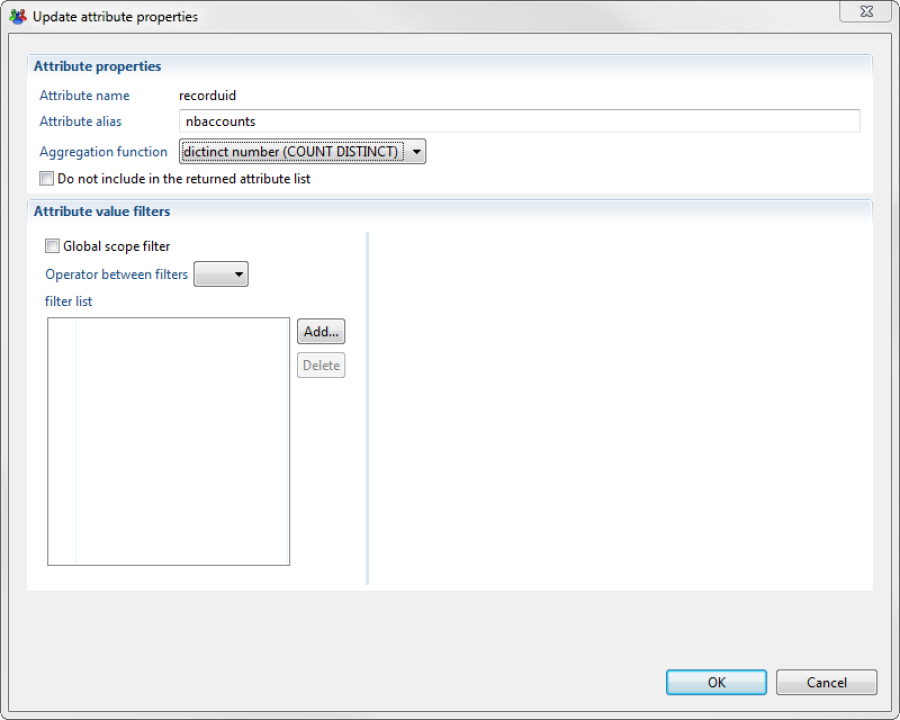  

The mathematical operation appears in the attribute details of the Audit View Editor and is displayed between parentheses to the right hand side of the attribute identifier.  

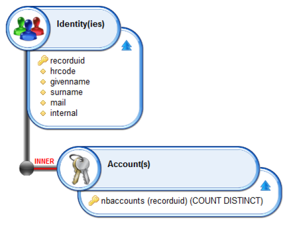  

> Following you will find a list of recommendation to setup your mathematical operations :
>
> 1. Use the 'recorduid' attribute when configuring operations to count the number of elements (i.e., 'COUNT', 'COUNT DISTINCT').
> 2. Use the 'COUNT DISTINCT'operation in preference to 'COUNT' unless the user has an extremely strong understanding of the relationships within the Identity Ledger.
> 3. Attributes to which a mathematical operation has been applied should be renamed for additional clarity when editing reports (e.g., 'nbaccounts').

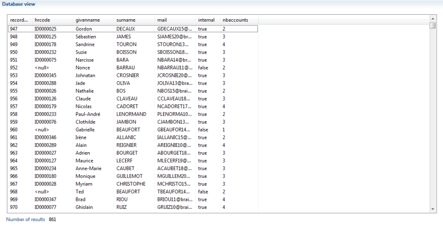

## Using Rules

It may be useful in certain cases to filter the results of an audit view via a rule. This feature can be used to :  

- prepare a customised report for a given rule
- carry out an advanced filtering operation on the results  

To perform this it is sufficient to select the rules to be applied to the various concepts within the Audit View. This operation is carried out by dragging and dropping of the "Filter using a rule" criteria from the toolbox to the selected concept.  

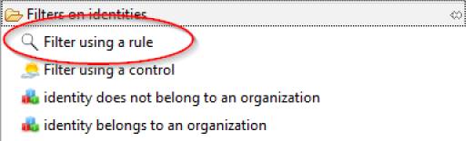  

Only the rules based on the same component as the view are available.  

It is possible to use multiple rules within a single Audit View. If multiple rules are applied to the same concept, only those lines that are present in all rules will not be filtered out (due to the summing of all rule results). Furthermore, it is possible to use rules to apply configurations. These configurations may either be validated against static values, or against the settings of the Audit View. Finally, it is possible to use rules consisting of configuration settings. These configurations may either be validated against static values, or against the settings of the Audit View.  

  

> Configuration settings for a rule are entered by double clicking on the name of the setting in the rule label: {param}.

> Double clicking on the rule name in the Audit View Editor causes the rule to be opened in the rule editor.

## Using configuration

It is possible filtering the results of an Audit View using data from outside the view that is then passed as an input to the view. This is particularly useful when the Audit Views are used in report or pages, as this gives context to the result of Audit Views by supplying parameters directly from the reports and/or pages.  

This function is the basis for reports supplied as standard in the Brainwave Identity GRC product. In fact, the range of Audit views supplied in your Project Audit uses these configuration processes.  

View parameters are specified in the Properties Editor of the Audit View.  

  

A parameter is added to an Audit View by clicking on the 'Add...' button. A dialog box opens, asking the user to select an identifier and a display name for the parameter.  

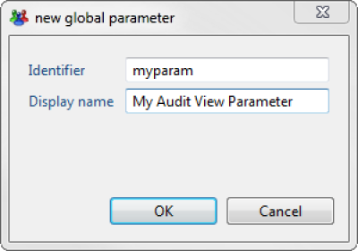  

Once your parameter has been added to the Audit View, it is accessible from the 'Global parameter' field of the Attribute Properties Editor of the Audit View.  

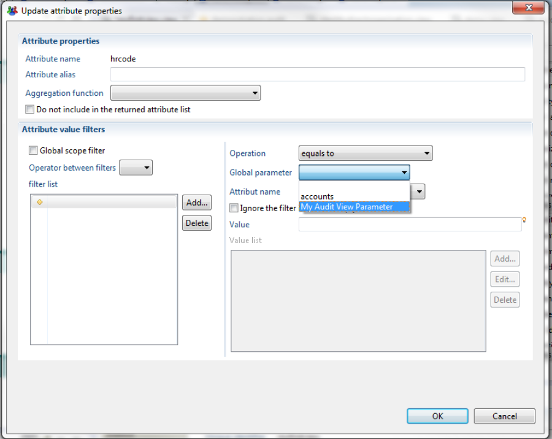  

Attributes with values filtered by a parameter appear have a unique appearance in the Audit View Editor: parameters are blue and underlined.  

  

It is possible to set the behaviour to be adopted at the data-filtering levels when the parameter is invalid:  

- Generate an error: a value being mandatory to complete the filtering
- Simply ignore the filter during the audit view process

This is carried out by way of the '_Ignore the filter if the value is blank or invalid'_ check box in the Attribute Properties Editor.  
This function is useful when filters use view parameters because it is possible to pool Audit Views to enable them to meet multiple needs from a reporting perspective. To do so, it is sufficient to have multiple filters configured on the view and to apply the filters to the view parameters.  
The view `/views/identity/identity.view` is a good example as this same view is used to:  

- Carry out multi-criteria identity searches;
- Obtain details on any given identity.

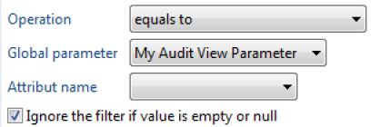

## Computed columns

It is possible to define columns with a dynamically calculated value based on their values and the values of other columns in the Dataset.  
This is particularly useful when the user wishes to carry out pre-processing on data for layout or analysis in a report.  
Calculated columns are added via the "Calculated columns" properties tab of the editor view:  

  

Column values are consolidated using JavaScript syntax.  
The dataset object provides access to current columns. It should be noted that the script is executed on each result line to calculate the column value and therefore it is helpful to prepare scripts that take into account possible NULL values for columns by the `dataset.isEmpty('columnname')` expression.  

When adding a computed column definition the following window is opened. In this windows you configure the calculated column:  

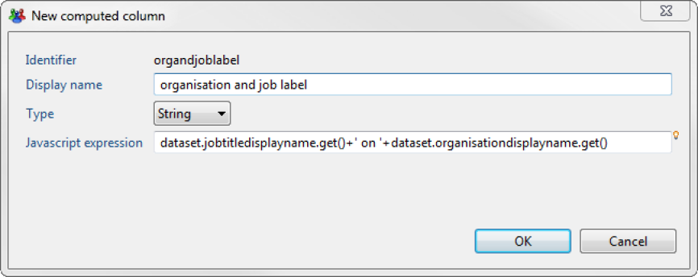  

The calculated columns are then added to the displayed results:  

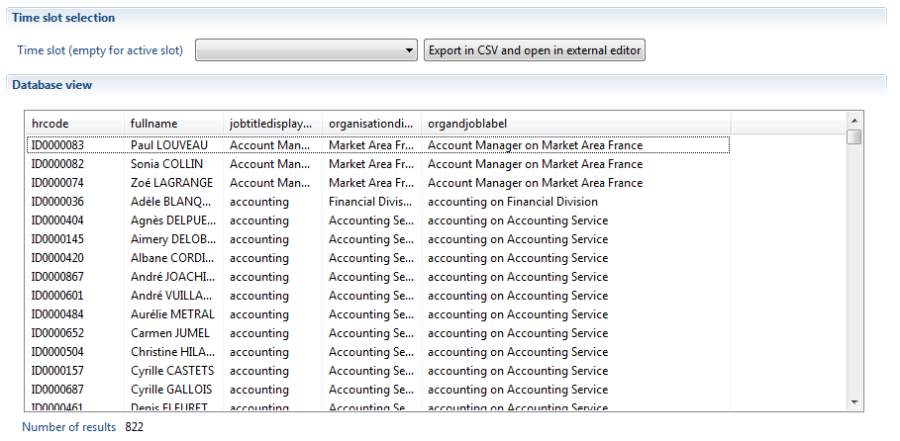

## Filtering Results by comparing Column Value

It is possible to filter results, using other columns rather than static values as the basis for the comparison.  
The configuration principle is similar to the principle described [here](./04-filtering-results.md).  

To carry out a comparison by column values, simply use the "Attribute name" field rather than "global parameter" or "value" fields.  

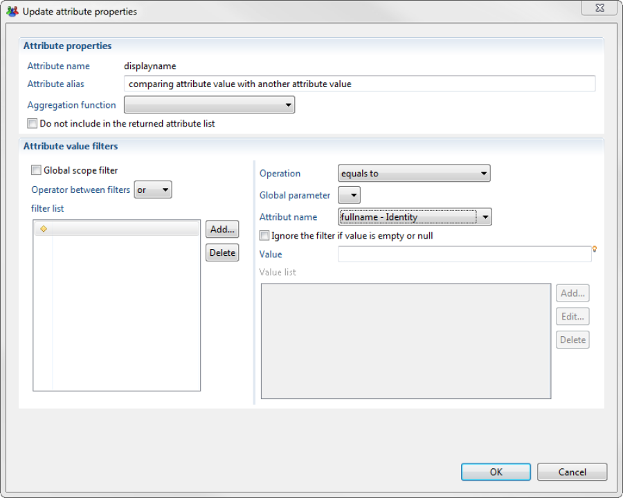

## Global filtering

In the product two types of joins are possible LEFT and INNER joins. Please refer to the corresponding documentation for more information ([here](./03-configuring-joins.md)).  

When using LEFT type joins, adding filter criteria to secondary elements of a view has a significant impact on the number of elements returned.  
For example, we may wish to generate a view that returns a list of all Identities together with the Active Directory login for each (if available).  
The query should therefore list all identities and their associated Active Directory accounts.  
This should, taken at face value, be achieved via the following View:  

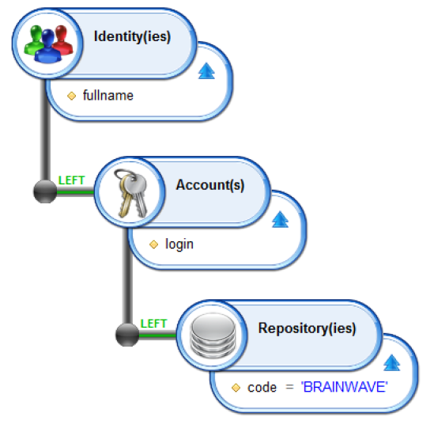  

This should return all identities and the Active Directory login if available. Using a LEFT type join will ensure that we also retrieve all identities that do not have an Active Directory login.  
In fact, this view returns the following result:  

  

The LEFT join associated with the restriction `code='BRAINWAVE'` returns a complete Cartesian product, which means that the same identity is returned several times.  
If the user wishes to carry out filtering operations using LEFT type joins, the filter criteria should be repositioned to give them a global scope.  
This is achieved using the by checking the 'Global filtering' box in the Filter Criteria configuration window.  
It should be noted that if global filtering is used, it is helpful to apply it to all necessary tests, including on any NULL values that may be returned.  

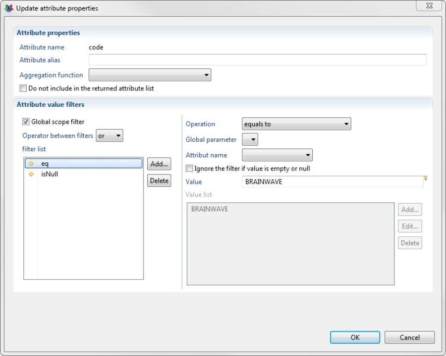  

There is no visual difference when global filtering is used, compared to standard filtering, and the view is thus as follows:  

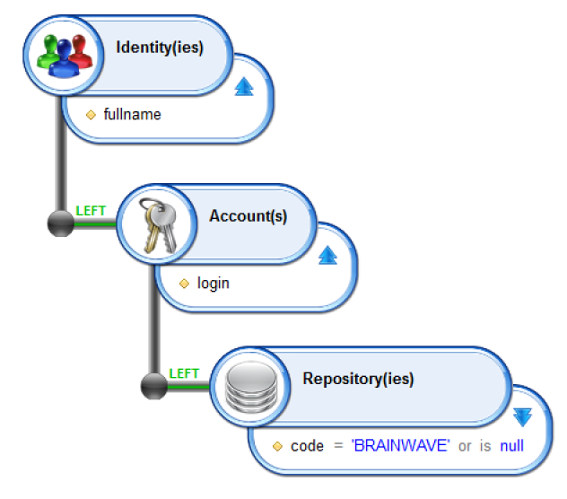  

Note the use of "or is null" to retrieve identities that do not have an Active Directory account.  
The result is then as expect

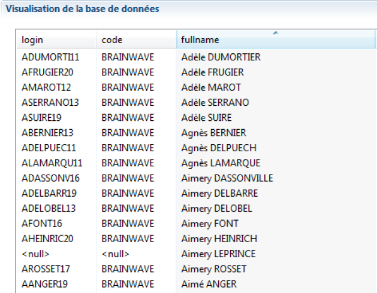

## Exporting Data to CSV

In the results tab of the view it is possible to select the timeslot on which you wish to display the results. This is done by clicking the icon labelled 1 in the caption bellow.  
It is possible to export the results of an Audit View from Brainwave Analytics to a CSV format file that can then be edited in Microsoft Excel. To do so, simply click pm the Excel button (See label 2 of the caption bellow) tool tipped _'Export to CSV and open linked program'_ in the 'Results' tab.  

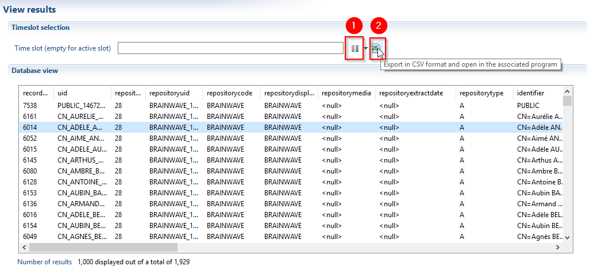

## Managing Audit View Depenencies

Dedicated tabs within the graphical editor enable you to understand how your Audit View is used by your project:  

- Dependencies
- Usage  

### Dependencies

This tab provides you with a list of files on which the current view is dependent:  

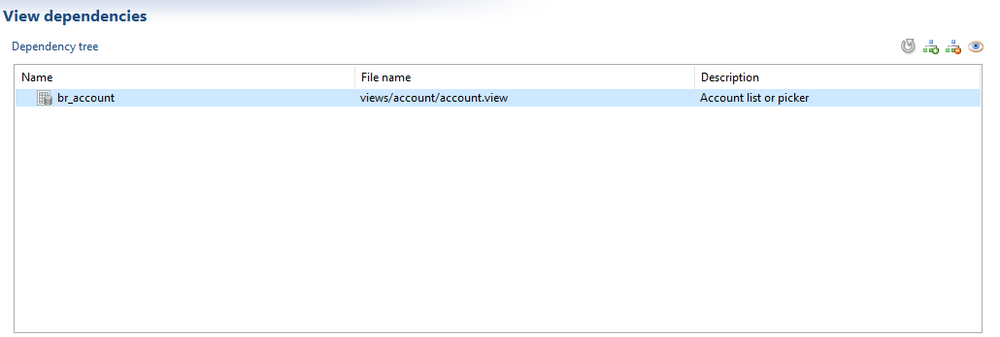

### Usage  

The usage tab allows you to browse the files that are dependent, or that use the current view:  

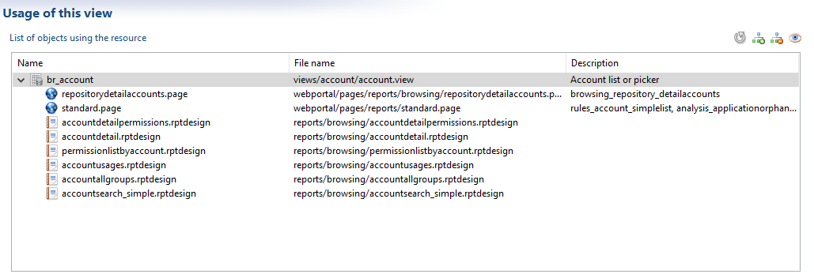

This can include a list of reports that use the view to populate it's datasets.  

> [!warning] We recommend **against** modifying the name, number or type of attributes returned by an Audit View when the Audit view is used by Reports.
> This can cause an incompatibly with the data bindings carried out at the report level.

The buttons on the top right hand side allow you to :  

- Refresh the data
- Expand the entire dependency/usage tree
- Fold the entire dependency/usage tree
- Display the full reference tree: The operation can be time consuming but allows you to propagate the dependency or usage calculation (see the caption bellow):  

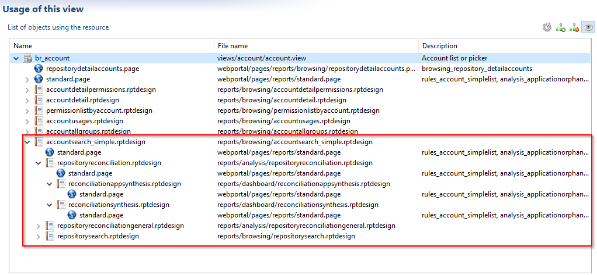

## Time analysis in views

Time analysis concept has been introduced as of iGRC 2016 version, to compare information from one timeslot to another. This option is also available the view editor.  

In the View editor, new targets have been added for specific elements - as "Identities", "Accounts", "Permissions", "Asset" etc... - and it is now possible to join the element with **_the same element from other timeslots_** , as shown below:  

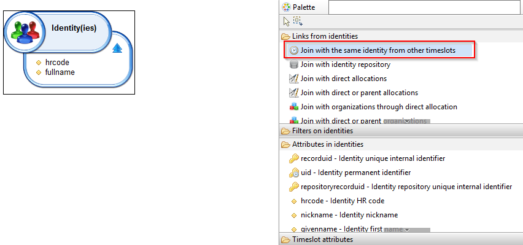

The view will return elements that are present both in the selected timeslot AND in other timeslots as well.  

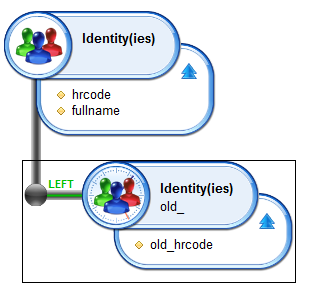

### View 1 : Identities that exist at least in one other timeslot

The results of this view will only display identities from the selected timeslot that were also present on other timeslots.  

#### Example

Let's consider the following timeslots with those identities:  

T1-\> ADAM, OLIVER, LAURA  
T2-\> ADAM, BERNARD, FRANCK  
T3-\> ADAM, BERNARD, SAMI, LAURA  
T4-\> NICOLAS, MAYA  

Results will depend on the selected timeslot (timeslot selection in the results tab) :  

- T1 results:only ADAM and LAURA, who are present both in T1 and in other TS.
- T2 results: ADAM and BERNARD
- T3 results: ADAM, BERNARD and LAURA
- T4 results: no result

It's also possible to choose a specific timeslot to be compared with. For example, to compare data from one timeslot with data from the previous timeslot, a specific attribute, **timeslotuid** , should be used :  

### View 2 : Identities that were present in the previous timeslot

Among other values,the **timeslotuid**  attribute can be filtered on the value "**previous timeslot**" to narrow down the comparison to the previous timeslot.  

It is also possible to use other attributes, as **_timeslotcommidate_**  attribute to filter on a date instead of filtering on a specific timeslot.  

#### Example 2

If we use the same example as above on View 2 :  

T1-\> ADAM, OLIVER, LAURA  
T2-\> ADAM, BERNARD, FRANCK  
T3-\> ADAM, BERNARD, SAMI, LAURA  
T4-\> NICOLAS, MAYA  

Only the identities present both in the selected timeslot and its previous timeslot will be displayed :  

- T1 results: No result, as there is no previous timeslot
- T2 results: ADAM (the only identity present both in T1 and T2)
- T3 results: ADAM, BERNARD (Identities present both in T2 and T3)
- T4 results: no result

### Known limitations

With this new targets, the type of joint (INNER or LEFT join) is not taken into account. The view filters results as an INNER join by default.  

The timeslot attribute "timeslotuid" with the specific filter criteria "previous timeslot" can only be used with the target described above ("join with the same XXX in other timeslots"). Using the filter criteria "previous timeslot" on other target will not display any result.  

However, the other timeslot attributes can be used with any type of target.
