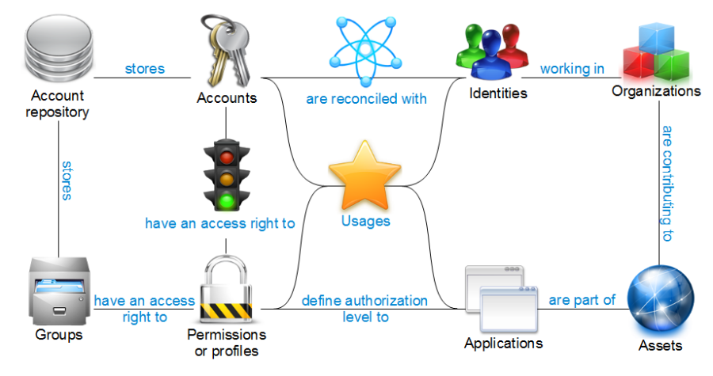
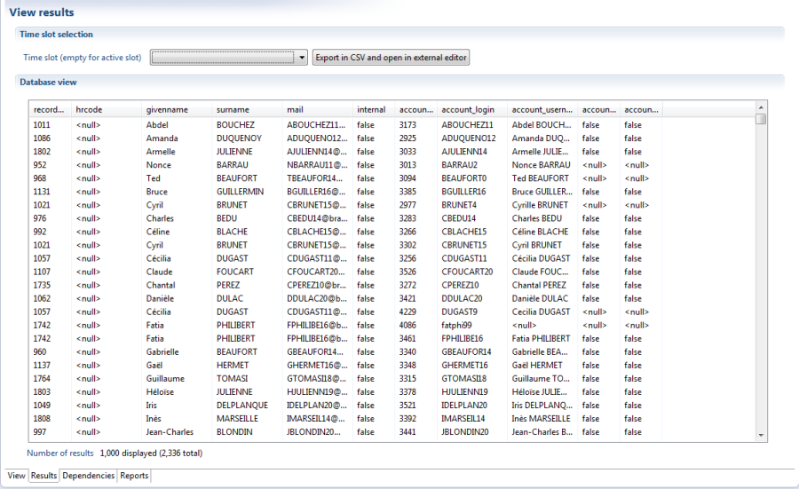

# Views

Audit views enable the user to extract information from the Identity Ledger without requiring technical expertise in the SQL language, and without knowing the technical data model of the Identity Ledger.  

Audit Views may be used by audit reports to retrieve information to be laid out on a page. They may also be used by third party applications via WebServices interfaces. The Audit View Editor also enables information to be extracted for processing and analysis in a third party tool such as Excel.  

Even though there is no requirement to understand the technical data model behind the Identity Ledger, it is nevertheless necessary to understand the concepts it features. We therefore recommend that you review the chapter dedicated to the Main Ledger in the documentation before reading this guide.  

  

An Audit View enables the user to specify the information to be extracted from the Main Ledger. By default, this is done by reference to a given date of import. You can also make use of the relationships between the different concepts within the Main Ledger, sort and filter the information presented, or carry out consolidation operations. It is also possible to create Audit Views that bring together information from different import dates within the Identity Ledger.  

Various Audit Views are contained in the sub-folder /views of your audit project and deal with all standard scenarios for data extraction and mathematical operations. They improve your productivity in creating custom audit reports by removing the requirement to reinvent the wheel. We recommend that you familiarise yourself with the different audit views that are available by consulting the chapter Standard views in this guide. Do not hesitate to open the standard views, using the editor, to appreciate the details of how they are configured.  

Audit Views are dynamically analyzed by Brainwave Analytics and trigger a series of technical queries in the database that hosts the Identity Ledger to extract information.  
The result is presented in table format.Each column corresponds to an attribute returned by the query. The results are single-valued in that if there are multiple possible values for any given attribute, the result line will be duplicated for each value of the attribute. For example, if you request a list of accounts for identities, each line will feature the complete dataset for the identity together with one of its associated accounts.  

  

Over time, you will come to appreciate that Audit Views are at least as powerful as their equivalent SQL queries; they don't have any technical limitations and are much simpler to develop and use than their equivalent SQL query.
