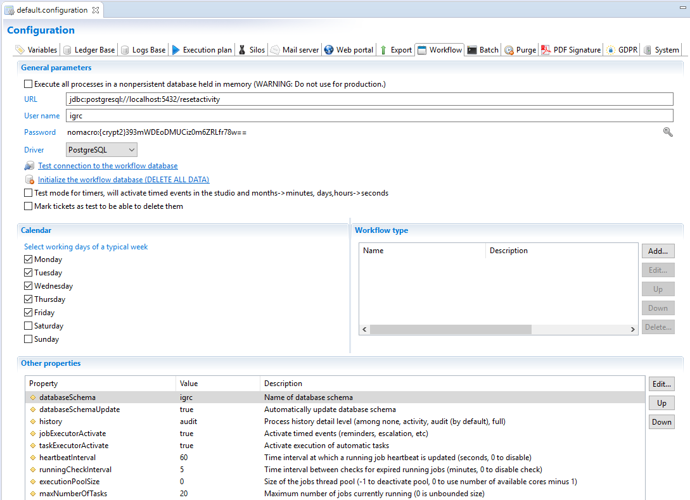
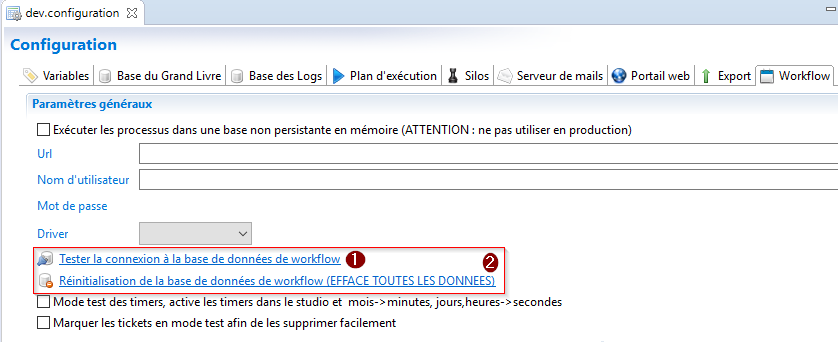
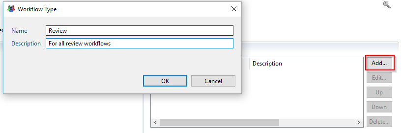

# Workflow configuration

> [!warning] The in-memory database mode is no longer supported as of Curie R3 version.

Brainwave's Workflow engine uses a separate database to store its data. Only SQL server, Oracle and Postgres databases are supported.  

Configuration of this database is done in a dedicated tab of the technical configuration of the project and is separated into 4 different sections:  

  

## General parameters

This section allows you to determine what type of database to use. Whether you wish to store all information in-memory, for development or demonstration purposes, or if you choose to configure and actual database, this is required for production environnement.  

> When using an in-memory setting ALL workflow data is lost each time the web portal is restarted.  

To configure the connection to your database you have to include the URL, Username, Password and driver, for example:  

- URL =`"jdbc:postgresql://localhost:5432/dbactiviti?searchpath=activiti"`
- Username: Activiti
- Password: activiti
- Driver: PostgreSQL

The account that connects to the database should have the `db_owner` access right on the used database schema.  
There is no possibility to test or ping the configured database. Connection and initialisation/update (if the databaseSchemaUpdate parameter is set to true) of the database is done during the launch of the webportal. If there is a connection error the corresponding error will be located in the log folder of your tomcat instance in the file igrcportal.log.  

Finally in this section it is possible to activate the test mode for timers. This is to be used ONLY for testing purposes and allows you to accelerate time management during the workflow. This is specifically used to test timer, automatic notifications and more.  

> You should be aware that activation of the test mode for timers does not include time management within the Javascript.  

## Calendar

This section allows you to determine the week workdays in order to avoid notification during the weekend for example. Please refer to the page [Reminders, Escalation and task expiration](./08-time-management#reminders-escalation-and-task-expiration) for more information.

## Workflow DataBase renitialisation

1. Test connection to the workflow database.
2. Drop and create workflow database schema and in addition ticket from audit database if asked for.  

  

> The initialization wizard will ask you if you want to delete tickets from audit database(all kind of tickets).  

The use of this option is only available for the following versions:  

- **2017 R3 SP5**  

## Workflow type

This section is used to declare the possible types that a workflow can take. This parameter is only used in during the purge process and if you have no purge configured this section can be ignored.  
There is no predefined list of workflow types. You can freely add your type by using the add button. The other buttons allow you to edit delete or organise the declared types of workflows.  

  

## Other properties  

Two additional properties can be defined in this section.  

- databaseSchema: This parameter allows you to configure the schema used. The definition of this parameter is recommended when using SQL server and Postgres. In the case of Oracle this parameter should stay empty.
- databaseSchemaUpdate: This parameter in a boolean (true or false) that allows you to Execute or not the update of the activiti schema during the launch of the webportal.  

> [!warning] Please do not try to modify the default values of the history and jobExecutorActivate parameters. These are internal parameters and must not be changed.

## Using .properties configuration files

It is possible to overwrite the workflow properties defined in the technical configuration by using a workflow.properties file. The location of this file is dependent on the configuration used. Please refer to the corresponding documentation for more information.  

Here are examples of .properties files for the different databases supported:  

SQL Server:  

```properties
jdbcUrl=jdbc\:sqlserver\://localhost\:1433;databaseName\=dbactiviti
jdbcDriver=com.microsoft.sqlserver.jdbc.SQLServerDriver
jdbcUsername=activitiaccount
jdbcPassword=activitipassword
databaseSchemaUpdate=false
databaseSchema=activiti
jobExecutorActivate=true
history=audit
hibernate.dialect=com.brainwave.iaudit.database.datasource.dialects.SQLServerCustomDialect
hibernate.connection.driver_class=com.microsoft.sqlserver.jdbc.SQLServerDriver
```

PostgreSQL:  

```properties
jdbcUrl=jdbc:postgresql://localhost:5432/dbactiviti?searchpath=activiti
jdbcDriver=org.postgresql.Driver
jdbcUsername=activitiaccount
jdbcPassword=activitipassword
databaseSchemaUpdate=false
databaseSchema=activiti
jobExecutorActivate=true
history=audit
hibernate.dialect=org.hibernate.dialect.PostgreSQLDialect
hibernate.connection.driver_class=org.postgresql.Driver
```

Oracle:  

```properties
jdbcUrl=jdbc\:oracle\:thin\:@localhost\:1521\:ORCL
jdbcDriver=oracle.jdbc.OracleDriver
jdbcUsername=activiti
jdbcPassword=activitipassword
databaseSchemaUpdate=false
jobExecutorActivate=true
history=audit
# Value of dialect depends on Oracle versions
# Before version 9
# hibernate.dialect=org.hibernate.dialect.OracleDialect
# If version 9
# hibernate.dialect=org.hibernate.dialect.Oracle9Dialect
# After version 9
hibernate.dialect=org.hibernate.dialect.Oracle10gDialect
hibernate.connection.driver_class=oracle.jdbc.OracleDriver
```

The workflow database tables can be automatically created if they do not exist. In order to activate this feature you have to add the following property in your workflow.properties file:  

```properties
databaseSchemaUpdate=true
```  

## JNDI Connection

It is possible to configure a JNDI connection to the workflow. Please refer to the webportal documentation for more information on configuring the JNDI connection.  

## Stack Size

It is possible to modify the stack size used for the workflow threads directly in the technical configuration by using variable `workflow.stack-size` in the technical configuration.  

To do so you have to modify the source of your technical configuration to add the following line between the `<WebPortal></WebPortal>` tags:  

```xml
<Property name="workflow.stack-size" propertyvalue="50000"/>
```  

The value is in kilobytes. If the stack size is defined as 0 then the value configured at the JVM level is used. In the example above the stack size is 50 MB.  
