# Variables

## Setting variable values for the process start page

A workflow corresponds to the execution of a series of tasks that are integrated to the iGRC web portal. During the process, variables can be modified by the users interacting with the process.  
Variables of a workflow instance are created in the configuration tab and can be declared in both the activities: "Start" or "Manual Activity".  

Created variables can have the following input:  

- An identifier,
- A display name,
- A type which can be:
  - number, string, date, boolean and File for variables that respect such format,
  - ledger for those that interact with the main concepts of the iGRC ledger such as Ledger Identity, Account, Permission, Application, Asset, Repository, Organization and Group. Once a variable is as a ledger type, the returning attribute contains the "UIDs" of the corresponding loaded concepts; for example all the application UID loaded into the ledger if the variable is of "ledger application" type,
  - Process Actor or Process Actor organisation. Such type of variable defines the identity who start the process also known as the process owner,  
- The variable can be mono or multivalued
- Has visibility, which corresponds to the validity perimeter of the variable. The visibility can be:
  - "Local" when the parameter is only used in the current process
  - "In/Out" when the parameter is passed trough several processes or subprocesses,
- A description
- An initial value if needed,
- Some constraints, such as filling the current created variable value with a one coming from an existing variable or a list of declared values or even using a regular expression

There is also a possibility to choose whether the variable value is stored or not in the database once the process is terminated. This can be used to ensure that the value of the variable is available for audit once the process is completed. This is also useful when discarding temporary variables.  

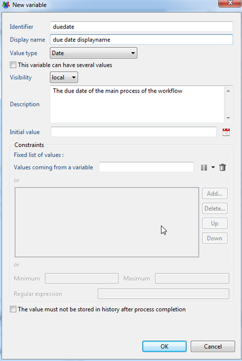

## Understanding variable modification actions

You can update workflow variables almost anywhere.  
Variable modifications are done either in the "Updates" tab of components (as shown here for the Start component, but this is also available for most of the components):  

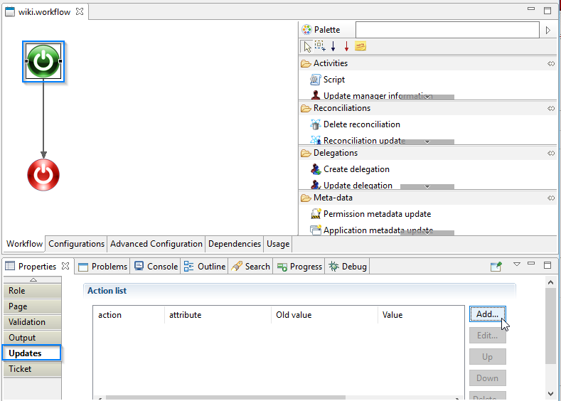  

or using a specific component:  

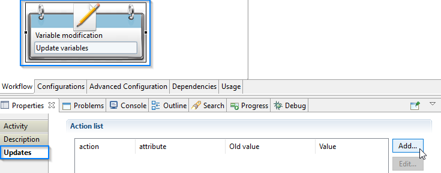  

There are multiple modification functions:  

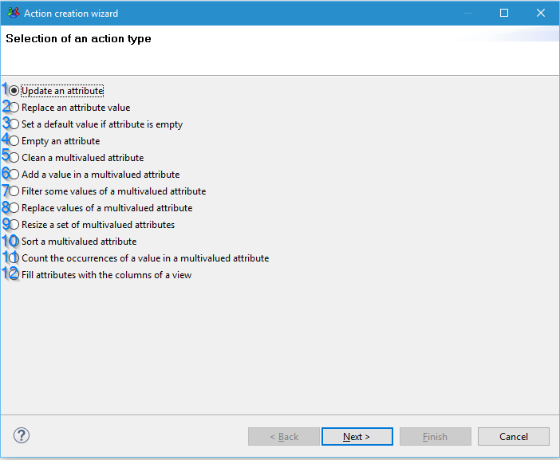  

### Update an attribute

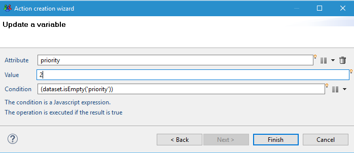  

Attribute: the workflow variable to update  
Value: the variable's new value (you can also use javascript)  
Condition: the variable will be updated if the condition is empty or if the result is true.  
Example: set to the "priority" variable to "2" if it is empty.  

### Replace an attribute value

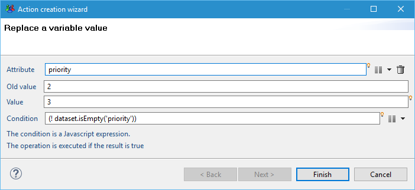  

Attribute: the workflow variable to update  
Old value: the value to replace with the "value" field's content  
Value: the variable's new value (you can also use javascript)  
Condition: the variable will be updated if the condition is empty or if the result is true.  
Example: set the "priority" variable to "3" if its value is "2".-  

> this does not work for multivalued attributes.

### Set a default value if an attribute is empty

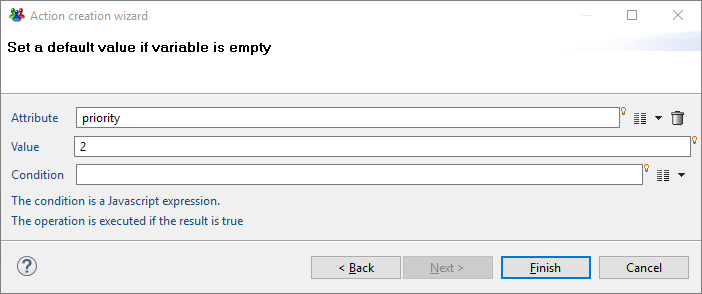  

Attribute: the workflow variable to update  
Value: the variable's new value (you can also use javascript)  
Condition: the variable will be updated if the condition is empty or if the result is true.  
Example: set to the "priority" variable to "2" if it is empty  

> this also works for multivalued attributes.  

### Empty an attribute in a variable

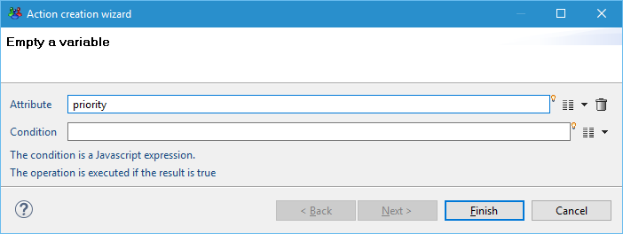  

Attribute: the workflow variable to update  
Condition: the variable will be updated if the condition is empty or if the result is true.  
Example: set to the "priority" variable to null (empty).  

> this also works for multivalued attributes.  

### Clean a multivalued attribute

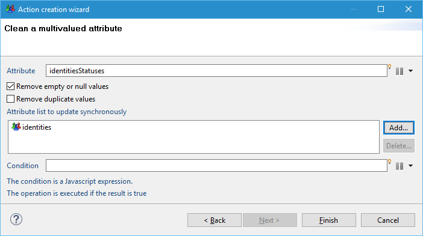  

Attribute: the main workflow variable to update  
Options:  

- Remove empty or null values: clean up the list to keep only actual values  
- Remove duplicate values: clean up the list to keep unique entries  
Attribute list to update synchronously: the list of attributes that will also be cleaned.  

Condition: the variable will be updated if the condition is empty or if the result is true.  
Example: remove all identitiesStatuses and identities where identitiesStatuses is empty or null.  

> this action is meant to be usable on synchronized attribute lists (often used in review workflows).
> Let's say that we have the following variables before calling the clean action:
>
> - identitiesStatuses `[reviewed, reviewed, null, reviewed, , null]`
> - identities `[UID1, UID2, UID3, UID4, UID5, UID6]`
>
> After calling the clean action in the screenshot above, we would have:  
>
> - identitiesStatuses `[reviewed, reviewed, reviewed]`
> - identities `[UID1, UID2, UID4]`  

### Add a value in a multivalued attribute

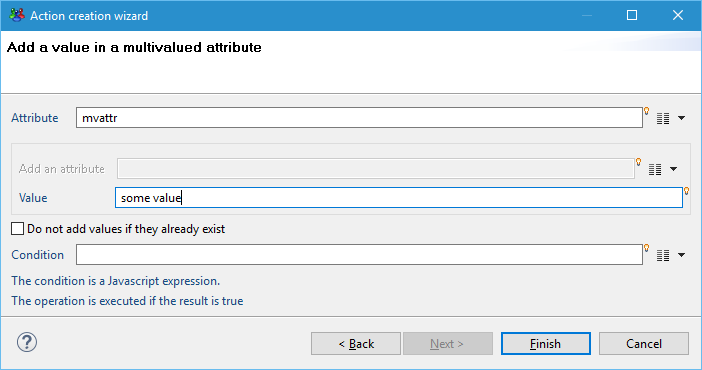  

Attribute: the main workflow variable to update  
Choose one from:  

- Add an attribute: the attribute (multivalued or not) to add to the attribute
- Value: the value to add to the multivalued attribute (you can use javascript)

Do not add values if they already exist: only add new values to the attribute  
Condition: the variable will be updated if the condition is empty or if the result is true.  
Example: add "some value" at the end of the "mvattr" attribute.  

### Filter some values of a multivalued attribute

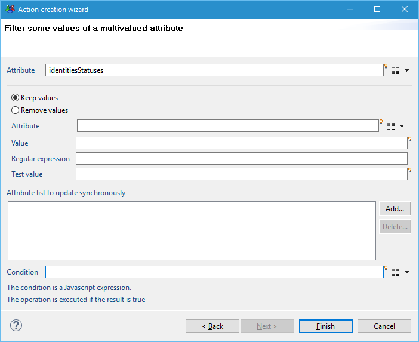  

Attribute: the main workflow variable to update  
Option:  

- Keep values: keep the main variable values matching the settings
- Remove values: remove the main variable values matching the settings  

Choose one from:  

- Attribute: the attribute (multivalued or not) used to filter values of the main attribute
- Value: the value use to filter the main attribute (you can use javascript)
- Regular expression: use to filter the main attribute  

Test value: provided for you to test values against the regular expression.  
Condition: the variable will be updated if the condition is empty or if the result is true.  
Example: add "some value" at the end of the "mvattr" attribute.

### Replace values of a multivalued attribute

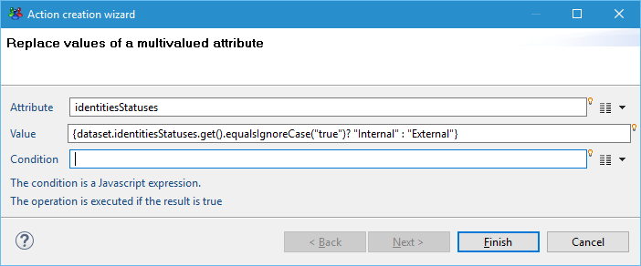  

Attribute: the workflow variable to update.  
Value: the value used to replace the main attribute's value (you can use javascript).  
Condition: the variable will be updated if the condition is empty or if the result is true.  
Example: replace all values "true" to "Internal", other values to "External".  

> that the the multivalued attribute is iterated on in the value field, this is why the javascript uses a `.get()`.  

### Resize a set of multivalued attributes

  

Attribute: the workflow variable that is used to resize other variable.  
Attribute list to update synchronously: the list of attributes to resize.  
Condition: the variable will be updated if the condition is empty or if the result is true.  
Example: resize "identities" and "identitiesStatuses" to the size of the "mvattr" attribute.

> there are two scenarii:
>
> - the attribute to resize is too long -\> it is truncated.
> - the attribute to resize is tool short -\> empty values are added.  

### Sort a multivalued attribute

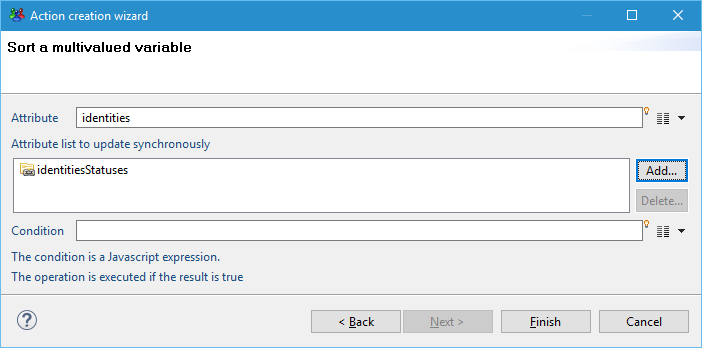  

Attribute: the workflow variable that is used for the sort order.  
Attribute list to update synchronously: the list of attributes to sort with the same order as the main attribute.  
Condition: the variable will be updated if the condition is empty or if the result is true.  
Example: sort "identities" and also "identitiesStatuses" in the same order.  

> this is useful when doing multiple iterations on different attributes, since you will want to have the main iteration variable sorted.

### Count the occurences of a value in a multivalued attribute

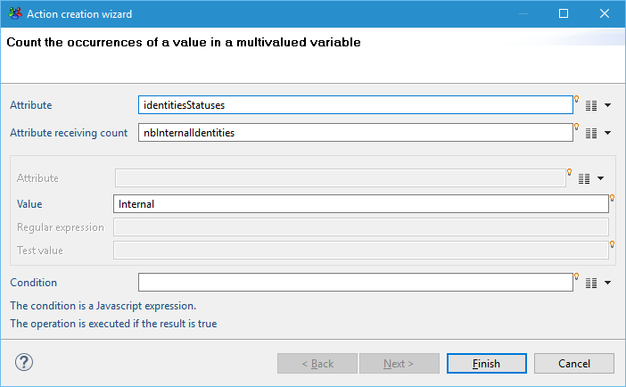  

Attribute: the main workflow variable you want to count values from.  
Attribute receiving the count: the attribute that will contain the result (has to be a number).  
Choose one from:  

- Attribute: the attribute (multivalued or not) used to count matching values of the main attribute (use the same attribute as the main attribute if you want to count the number of entries)  
- Value: the value use to count the number of matching values in the main attribute (you can use javascript)
- Regular expression: use to count the number matching values of the main attribute
Test value: provided for you to test values against the regular expression.  
Condition: the variable will be updated if the condition is empty or if the result is true.  
Example: count the number of time "identitiesStatuses" contains "Internal" and store if in the "nbInternalIdentities" attribute.

### Fill attributes with the columns of a view

  

View name: the view to call.  
Parameters: used to pass workflow variables to the view.  
Output: mapping between the view columns and the workflow variables to fill.  

> be careful when passing parameters to the view. If you want to pass a multivalued attribute, remove the `.get()` to pass all the values of the multivalued attribute.

## Variable types explained

The workflow engine allows you to use the same variables type as in the discoveries or collectors:  

- Boolean   
- Date 
- Number 
- String   

But also provides new variables types:  

- Ledger Account 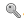
- Ledger Application 
- Ledger Asset 
- Ledger Group 
- Ledger Identity 
- Ledger Organisation 
- Ledger Permission 
- Ledger Repository 
- Process Actor 
- Process Actor Organisation 
- File 

Technically, these new types are Strings, they contain the corresponding concept uid. But you will **need** to use them since some **interfaces filter** the list of available attributes to a certain type, as illustrated here:  

  

All the types can be used for mono- or multi-valued attributes.  
The types will also be leveraged by the pages wizard.

## Structures

Workflows, such as entitlement reviews, generally displays in the web portal a table to the manager. In the table, a row corresponds to a permission for an identity (or for an account). The columns are used to either display entitlement details or edit manager's decision and comment.  

Following is a example of a page that allows the manager to review permissions for accounts:  

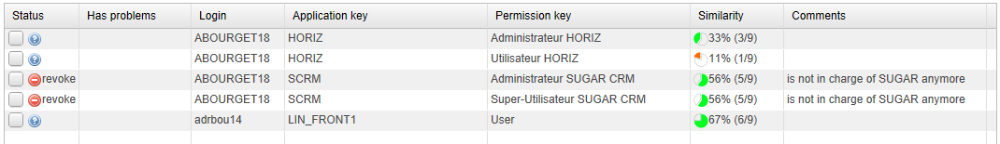  

To implement this page, several variables have been declared in the declaration of the associated workflow. These variables are all multi-valued and **must** be of the same size. As a result, if there are 5 permissions to review, there must be 5 manager's decisions and 5 manager's comments. If the manager did not edit a comment, the corresponding variable can be empty but the number of values must still be 5.  

The variables for the above examples are listed below. The first line contains the variable names and the the next lines contains the 5 values of each variables:  

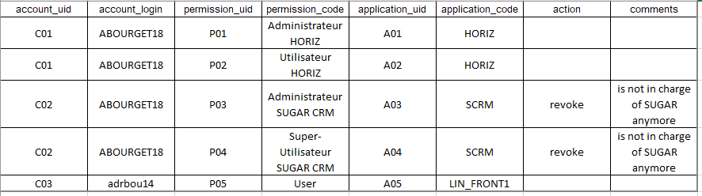  
[Excel table here](https://download.brainwavegrc.com/index.php/s/rWb2DHR6Eq5aFaj)

Having the same number of values in all multi-valued variables used in the review is very important for the workflow. These variables **must**  stay synchronized.  
For example, if the permission 'Utilisateur HORIZ' (second line) is removed from the variable `permission_code`, the corresponding values from the other variables should be removed (C01 from `account_uid`, ABOURGET18 from `account_login`,...).  

To facilitate the synchronization operations to be applied to the involved variables, a new concept has been introduced: Structure  
A Structure is a new type of variables that contains a number of other variables.  

Using the permission review example above, the variables used in the table can be included in a Structure. In this case the product automatically keeps all included variables synchronized when they are manipulated in a workflow or page.  

Following is the Structure declaration in as displayed in the workflow definition:  

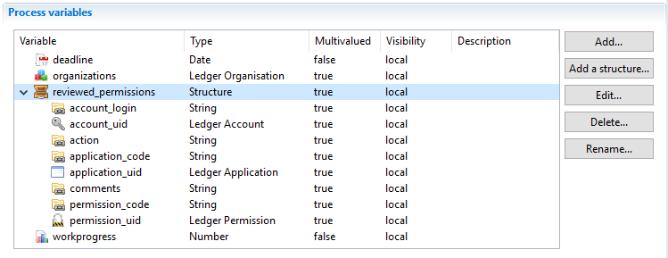  

> [!warning]  Only **multi-valued** variables can be used in a Structure.

The Pages language, JavaScript API and actions in the `'Variable modification'` component have all been enhanced to include the Structure concept.  

### Structure and variable declaration  

A Structure is declared using the `'Add a structure'` button. Structures follow a set of rules that are important to bear in mind during the variable declaration phase.  

#### Rule n°1

All names (variables, structure and structure content) **must**  be unique.

A variable embedded inside a structure can **NOT** have the same name as another variable embedded in another structure.  
A Structure is a group of variables. The product allows access to all variables using the syntax `dataset.varname.get()`. As a result all variables must have a unique name.  

  

In short, a structure is just a name and a description.

#### Rule n°2

Structure can **NOT** be nested. This means the a structure can not be included in anther structure.  

To add a variable to a structure, first, add a variable and then fill the field `'Belongs to structure'` field as shown below:  

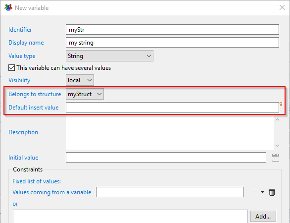  

#### Rule n°3

A variable can be included into only a single structure.  

It is **not** possible to add the same variable to multiple structures. The objective of structures is automatically synchronize the size of multi-valued variable when a process or a page updates them.  
To understand how the product handles operations on structure variables, let's define a very simple structure:  

```tree
myStruct
      ├ myNumber
      └ myStr
```

This structure contains 2 multi-valued variables (`myNumber` and `myStr`) which are initially empty when the workflow starts.  
If the process contains an action to add a value to `myNumber`, a value should also be added in the variable `myStr` to keep both variables synchronized.  
This is the purpose of the `'Default insert value'` field in the variable dialog box as show above.  
This field is used to give a default value to a variable when a value is to be added to keep it the same size as the other ones.  
If not value is provided in `'Default insert value'` the then `null` is inserted.  

#### Rule n°4

Only variables embedded in structures can have a default insert value.  

This option has no meaning outside of a structure. Indeed, the default insert value is a macro that allows the use Javascript to dynamically compute a value upon insertion.  
Using the simple example initiate above, let's add another variable `varMonoStr`, outside of the structure. A default value is configured to be inserted to both structures:  

```tree
myStruct
  ├ myNumber    0
  └ myStr       {dataset.varMonoStr.get().toUpperCase()}
varMonoStr
```

When an action to add a value to `myNumber` is executed, the product automatically computes the default insert value of `myStr`. The expression is evaluated and the the content of `varMonoStr` is taken and changed to upper case. The result is added to the variable `myStr` to keep it the same size as `myNumber`.  

An initial value can still be set on a variable. This is very different from the default insert value.  
--\> The initial value is the value given to a variable when the process starts.  
--\> The default insert value is the value used to fill a variable embedded in a structure to keep it the same size as the other variables of the same structure.  

#### Rule n°5**

A default insert value **must not** reference other structure variables in macro to avoid unexpected results.

If a structure contains 5 variables, all having a default insert value, when an action adds a value to the first variable, the product does not guarantee the order used to compute the default insert values for the 4 other variables. As a result using a macro involving a variable contained in a structure can provide unexpected results.  

### Actions in the 'Variable modification' component

The actions inside red rectangles displayed in the caption bellow have been updated to handle Structures:  

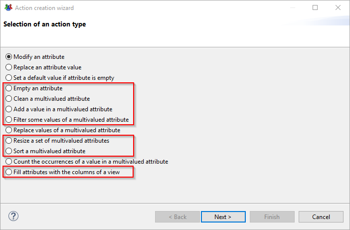  

In all of these actions, a combo box has been added to the wizard to allow the selection of a Structure:  

| Example of cleaning a multi-valued variable in a structure                                                                                                                        |                                                       Cleaning a multi-valued variable - legacy mode                                                        |
| :-------------------------------------------------------------------------------------------------------------------------------------------------------------------------------- | :---------------------------------------------------------------------------------------------------------------------------------------------------------: |
| 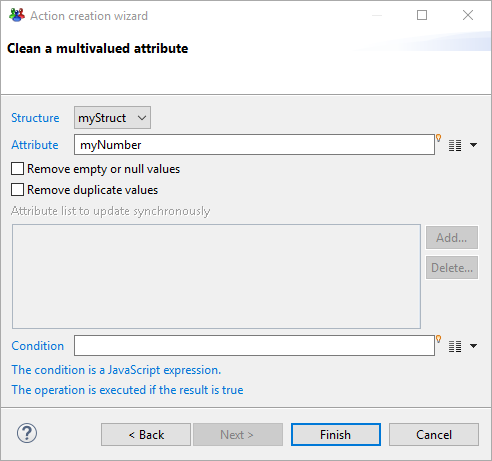                     |  |
| If a structure is selected, there is no need to select other variables to update synchronously because the action will keep all the variables in the structure with the same size |                      If no structure is selected, other variables may be synchronized with this one like in previous product versions                       |

If no structure is selected, the behavior is the same as before. However, in the `'Attribute'` field, you can only select variables outside structures.  
But if a structure is selected, the `'Attribute'` field displays only variables embedded in this structure.  
When using actions structure compatible available in the '`Variable modification`' component, the product will always ensure that the structure variables are all the same size.  

The following paragraphs examine each action and split the explanation into 2 parts:  

- The first part explains the legacy behavior when no structure is selected.
- The second part explains the new behavior when a structure is selected.

#### Empty an attribute

##### Empty an attribute legacy

The purpose of this action is to set a single value attribute to `null` or remove all values from a multi-valued attribute.  
The selected attribute is reset and no other attribute is modified.  

##### Empty an attribute in a structure

When a structure is selected, the '`Attribute`' field is disabled because it means that all the attributes contained in the structure will be reset.  
When the operation is finished, all the attributes contained in the selected structure will have a size of 0.  

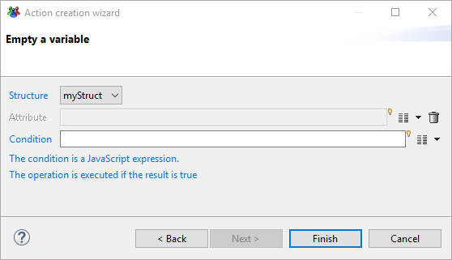  

#### Clean a multi-valued attribute

##### Clean a multi-valued attribute legacy

The purpose of this action is to remove empty and/or duplicate values in a multi-valued attribute while removing the corresponding entries from other attributes.  

The selected attribute is the main attribute to clean. The indexes of the removed items are used to remove the values at the same indexes in the attributes specified in  
'`Attribute list to update synchronously`'.  

##### Clean a multi-valued attribute in a structure

When a structure is selected, the '`Attribute`' field must contain the main attribute to clean inside the structure.  

The field '`Attribute list to update synchronously`' is disabled because the product will automatically update all the other attributes of the selected structure.  

The behavior is very similar to the legacy mode but the list of attributes to update is automatically provided by the structure instead of manually adding the attributes in the field '`Attribute list to update synchronously'`.  

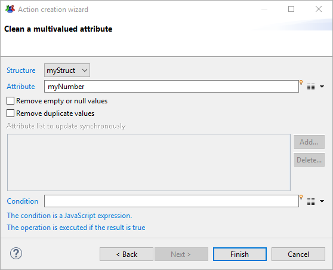  

#### Add a value in a multi-valued attribute

##### Add a value in a multi-valued attribute legacy

This action is used to add a value to an attribute or add the whole content of another single valued or multi-valued attribute.  

The computed values are added to the selected attribute and no other attribute is modified.If you want to change several attributes, you must use several 'Add' action, each one adding values to a different attribute.  

##### Add a value in a multi-valued attribute in a structure

When a structure is selected, the 'Attribute' field must contain the main attribute.  
During runtime, the values are added to the main attribute and all other attributes belonging to the same structure are expanded with their default insert values.  
If the main attribute is filled with the content of a multi-valued attribute, then the values are added one by one.  
For each value added, the default insert values of all other attributes are computed and added to the attributes.  
At the end of the execution, the main attribute contains the desired values and the other attributes contains their default insert values.  

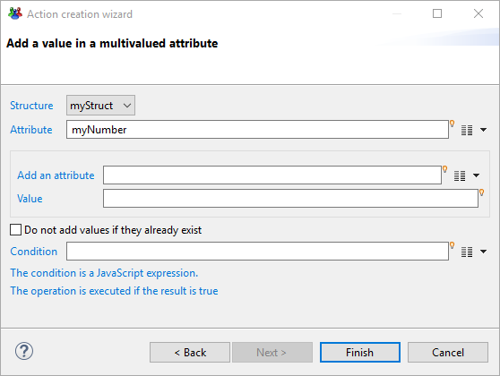  

#### Filter some values of a multi-valued attribute  

##### Filter some values of a multi-valued attribute legacy

The purpose of this action is to keep or remove values from an attribute based on the content of another attribute or using an expression (JavaScript or RegExp).  

The selected attribute is the main attribute to filter. The indexes of the removed items are used to remove the values at the same indexes in the attributes specified in  
'`Attribute list to update synchronously`'.  

##### Filter some values of a multi-valued attribute in a structure

When a structure is selected, the '`Attribute`' field must contain the main attribute to filter inside the structure.  

The field '`Attribute list to update synchronously'` is disabled as the product will automatically apply the update on all the other structure attributes.  

The behavior is very similar to the legacy mode but the list of other attributes is given by the structure content instead of the field '`Attribute list to update synchronously`'.  

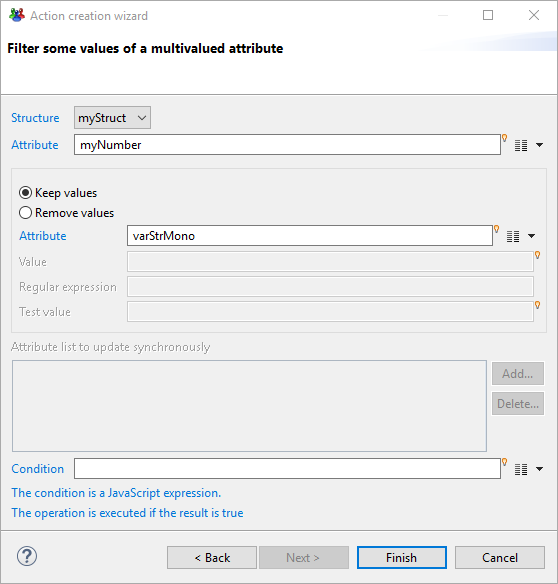  

#### Replace values of a multi-valued attribute  

##### Replace values of a multi-valued attribute legacy

This action is used to replace all values of an attribute. The value is an expression which can be computed using a new value depending on the previous value.  

During runtime, this action iterates on all values of this attribute and, for each one, the expression is evaluated, the result replacing the previous value.  
This means that if the attribute contains 5 values, the action will iterate 5 times and the expression will be evaluated 5 times.  

The expression (of the value field, not the condition one) can use macros, such as `dataset.XXX.get()`, to examine the value within an iteration. The returned result type is of the attribute type.  

##### Replace values of a multi-valued attribute in a structure

When using a structure the action iterates on all variables inside the structure.  
Only the main attribute is modified but for a particular iteration, the values of all the structure variables are accessible.  

For example, if there are 2 variables in the structure (`myStr` and `myNumber`), each one having 5 values, the action will iterate 5 times on both variables.  
This also means that the expression  
"`{dataset.myStr.get()} - {dataset.myNumber.get()}`" will be evaluated 5 times.  

On the first iteration, both `dataset.myStr.get()` and `dataset.myNumber.get()` will contain the first value.  
On the second iteration, `myStr` and `myNumber` will contain the second value, and so on.  

All variables contained in a structure are seen as mono-valued within an iteration (the value at the current iteration index) but variables outside this structure are still seen as multi-valued.  
The following screenshot shows how to concatenate the values of `myStr` with the values of `myNumber`.  

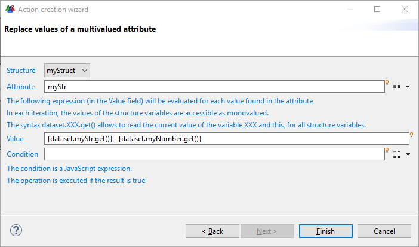  

#### Resize a set of multi-valued attributes

##### Resize a set of multi-valued attributes legacy

The purpose of this action is to align the size of several attributes on the size of a main attribute.  

The attributes specified in '`Attribute list to update synchronously`' are either expanded or reduced depending on the main attribute size.  

##### Resize a set of multi-valued attributes in a structure

When a structure is selected, the '`Attribute`' field is disabled because the main attribute will automatically be considered as the one which has the biggest size.  
The field 'Attribute list to update synchronously' is also disabled as the structure defines the list of attributes to work on.  
This means that in this mode, all variables in the structure will be expanded to correspond to the size of the largest attribute. It is not possible to reduce the size of variables when using this mode.  

  

#### Sort a multi-valued attribute

##### Sort a multi-valued attribute legacy

The purpose of this action is to sort the values of an attribute and re-order other attributes the same way.  

The selected attribute in the wizard is considered as the main attribute to sort on. The values of the other attributes listed in '`Attribute list to update synchronously`' field are moved the same way to keep the attributes consistent.  

##### Sort a multi-valued attribute in a structure

When a structure is selected, the '`Attribute`' field must contain the main attribute to sort inside the structure.  
The field '`Attribute list to update synchronously`' is disabled because the product will automatically propagate the sort order to all the other structure attributes.  
The behavior is very similar to the legacy mode but the list of other attributes is given by the structure content instead of the field 'Attribute list to update synchronously'.  

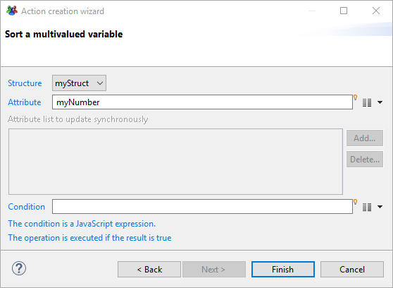  

#### Fill attributes with a view

##### Fill attributes with a view legacy

The purpose of this action is to execute a view in order to fill multi-valued attributes with the Ledger content.  

Some returned columns can be mapped to attributes to receive values from the Ledger.  

##### Fill attributes with a view in a structure

When a structure is selected, only it's included attributes can be selected when the button '`Add...`' is clicked.  

If the structure contains 4 attributes and only 3 are mapped to columns, the fourth one will be filled with the default insert value configured in the attribute definition.  
When the operation finishes, all attributes included in the structure will have the same size.  

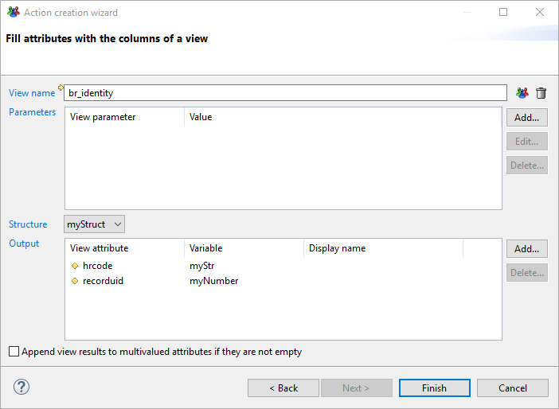  

### JavaScript API

#### Working with structures

##### Reading variables

To allow easy read-only access to variables throughout the product, the legacy syntax has been made to available for all variables, whether they belong to a structure or not.  
In a dialog box in the workflow, when you want to use a variable in an expression, you can use the the following syntax:  

`The organization is {dataset.organisation.get()}`  

The expression result will be 'The organization is DCOM' whether the variable '`organisation`' belongs to a structure or not.  

In the Javascript editor, you can use the same syntax:  

`var title = "The organization is " + dataset.organisation.get();`  

This unified way of reading variables makes the migration of workflow variables easier because you don't have to change all expressions in all fields of the workflow.  

One can progressively create structures and move some variables to these structures. The only focus should be the way the variables are updated.  

##### Updating variables

When updating variables inside the JavaScript editor, the full control is left to the programmer. The API offers 2 ways to work on variables:  

- On the structure level: if you modify a variable at this level, the product ensures that all variables sizes in a structure are consistent  
- On the DataSet level (_i.e._ using the legacy mode): at this level, you can work on separate variables EVEN if they belong to a structure.

> [!warning] The DataSet API level is very handy to manipulate variables but it is up to the creator of the page or workflow to ensure that the structure remains consistent.

When using the legacy syntax only the selected variable is affected, even if it is part of a structure:  

```js
// single valued variable
dataset.organisation = 'DCOM';
dataset.organisation.set('DCOM');
dataset.get('organisation').set('DCOM')

// multivalued variable
dataset.organisations.add('DCOM');
dataset.organisations.add('DCOM', dataset.organisations.length);
```

To access variables at the Structure level, a new method, **getStruct,** has been added to the dataset object:  

```js
var /*Struct*/ struct = dataset.getStruct('myStruct');
```  

This method returns an object of class `Struct`. This is the only way to access the Structure API level. A `Struct` object is very similar to a `DataSet` object but all operations applied to the structure insures to keep the structure consistent.  

When a script finishes in the context of a workflow, all structures included in the workflow are checked to detect size issues. If a discrepancy is found, an error is written in the log file but the workflow will continue its execution and the variables remains unbalanced.  

> [!warning] When designing and testing a process, it is important to always consult the logs to check if there are no structure errors.
> Following is an example of the error message observed:  
>
> ```page
> The structure variables have not the same size at the end of the function prepareEntitlements(): myStruct { myStr(946) myBool(0) myDate(946) myNumber(946) }
> ```

#### Struct methods

A `Struct` class is the same as the `DataSet` class and the following methods have the same behavior in both classes:  

| **Method**       | **Description**                                                             |
| :--------------- | :-------------------------------------------------------------------------- |
| add              | Add an attribute in this data set                                           |
| duplicate        | Duplicate an existing attribute in the data set with a new name             |
| equals           | Checks if this dataset is equal to another object                           |
| get              | Get an attribute value from its name                                        |
| remove           | Remove an attribute from the dataset given its name                         |
| rename           | Rename an attribute                                                         |
| isEmpty          | Check if attribute is empty (no value, null value or empty string)          |
| startsWith       | Check if attribute contains at least a value starting with object parameter |
| endsWith         | Check if attribute contains at least a value ending with object parameter   |
| contains         | Check if attribute contains at least a value containing object parameter    |
| countEmptyValues | Count the number of empty or null values in the attribute                   |
| countRegExp      | Count the number of values matching the regular expression in the attribute |

The next paragraphs describe the new `Struct` methods

##### getDataSetAtRange

**<u>Purpose</u>**: Create a new `DataSet` with the attribute set from the structure containing the subset of values in the specified range  

**<u>Signature</u>**: `var subDataSet = struct.getDataSetAtRange(first, [last]);`  

**<u>Parameters</u>**:  

| **Parameter** | **Type**  | **Mandatory**  | **Description**  |
|:--|:--|:--|:--|
| first | Number  | Yes  | First index (inclusive) |
| last  | Number  | No  | Last index (exclusive). If this parameter is omitted, the returned DataSet contains the values from index 'first' up to the end  |

**<u>Return value</u>**: A `DataSet` with the values from the specified range.  

**<u>Example</u>**:  

```
var /*Struct*/ struct = dataset.getStruct("myStruct");
var /*DataSet*/ set = struct.getDataSetAtRange(5, 8);  
// get a DataSet containing the same attributes as in Struct but only values at indexes 5, 6 and 7
```

##### addDataSet

**<u>Purpose</u>**: Add values into the set of attributes of the structure from an input DataSet. Only the attributes defined in the structure are modified. If the input DataSet contains multi-valued attributes, all the values are added. The attributes of the structure will always have the same size even if the attributes found in the input DataSet have different sizes. If some attributes must be padded, the default insertion value is used.  

**<u>Signature</u>**:  `struct.addDataSet(subDataSet);`  

**<u>Parameters</u>**:  

| **Parameter** | **Type**  | **Mandatory**  | **Description** |
|:--|:--|:--|:--|
| subDataSet | DataSet or Struct  | Yes  | The DataSet to add at the end of the attributes found in the structure |

**<u>Return value</u>**: None  

**<u>Example</u>**:  

```js
var /*Struct*/ struct = dataset.getStruct("myStruct");
var /*DataSet*/ data = new DataSet();   // Prepare a new DataSet with the values we want to add at the end of the struct
data.myNumber = 23;
data.myStr = "***";
struct.addDataSet(data);    // Add the content of the DataSet.
```

##### setDataSet

**<u>Purpose</u>**: Set values in the structure from an input DataSet. Only the attributes defined in the structure are modified. If the input DataSet contains multi-valued attributes, all the values are added. The attributes of the structure will always have the same size even if the attributes found in the input DataSet have different sizes. If some attributes must be padded, the default insertion value is used.  

**<u>Signature</u>**: struct.setDataSet(index, subDataSet);  

**<u>Parameters</u>**:  

| **Parameter** | **Type**  | **Mandatory**  | **Description**  |
|:--|:--|:--|:--|
| index | Number  | Yes  | The index at which the input data should be written |
| subDataSet | DataSet or Struct | Yes  | The DataSet to write in the structure |  

**<u>Return value</u>**: None  

**<u>Example</u>**:  

```js
var /*Struct*/ struct = dataset.getStruct("myStruct");
var /*DataSet*/ data = new DataSet();   // Prepare a new DataSet with the values we want to add at the end of the struct
data.myNumber = 23;
data.myStr = "***";
struct.setDataSet(2, data);    // Change the values at index 2 of the Struct with the content of the DataSet.
```

### removeAtIndex

**<u>Purpose</u>**: Remove a value from each and every attributes at the specified index  

**<u>Signature</u>**: `var subDataSet = struct.removeAtIndex(index);`  

**<u>Parameters</u>**:  

| **Parameter** | **Type**  | **Mandatory**  | **Description**  |
|:--|:--|:--|:--|
| index | Number  | Yes  | The index at which the input data should be written |

**<u>Return value</u>**: The DataSet with the data removed from the structure  

**<u>Example</u>**:  

```js
var /*Struct*/ struct = dataset.getStruct("myStruct");
struct.removeAtIndex(2);    // Remove index 2 of all attributes in the Struct.
```

#### Attribute methods

##### General considerations

Attribute methods are exactly the same whether the attributes comes from a DataSet or comes from a Struct class.  

```js
var /*Attribute*/ attr1 = dataset.myStr;
var /*Struct*/ struct = dataset.getStruct("myStruct");
var /*Attribute*/ attr2 = struct.myStr;
```

In the above example, `attr1` and `attr2` come respectively from the DataSet and from the Struct. They are both of class Attribute. The attributes `attr1` and `attr2` are different but they share the same set of values as we can see in the following example where the content of `attr2` is changed to add 10 values:  

```js
for (var /*Number*/ i = 0; i < 10; i++) {
  attr2.add('value' + i);
}
print(attr1.length);   // prints 10
```

The output of this script is 10, meaning that the variables `attr1` and `attr2` share the same set of values even though `attr1` and `attr2` are 2 different objects.  

The difference between modifying an attribute coming from the DataSet and modifying an attribute coming from a Struct (even if both point to the same set of values) is the level of API:  

- When using `dataset.xxx.set()` the DataSet level API is used. This means that attributes will be modified independently and there is no consistency check performed on the structures attributes.
- When using `struct.xxx.set()` the Structure level API is used. When modifying an attribute, all other attributes of the Structure will remain consistent.  

Consider a Struct containing 2 attributes (`myStr` and `myNumber`). the 2 API levels cover different use cases. As an example, Let's examine the different ways to add 10 values to the attributes:  

**<u>Using DataSetlevel</u>**:  At this level, checking the consistency between attributs of a structure is the responsibility of the programmer. When adding values to variables, it is important to be sure to add the same number of values in all attributes of the structure.  

```js
var /*Attribute*/ str = dataset.myStr;
var /*Attribute*/ num = dataset.myNumber;
for (var /*Number*/ i = 0; i < 10; i++) {
  str.add('value ' + i);
  num.add(i);
}
// check the size of both variables
print('myStr: ' + dataset.myStr.length + ' - myNumber: ' + dataset.myNumber.length);   // prints myStr: 10 - myNumber: 10
```

In the above example, a value is added to both `myStr` and `myNumber` so the consistency is preserved. At the end of the script, the size of both attribute is the same.  

**<u>Using Structure level</u>**: At this level, checking the consistency between attributes of a structure is automatically performed by the product. This means that, as soon as you add a value in one attribute, the other attributes are immediately changed to add the default insert value.  

Updating the previous snippet of code would result in the following code:  

```js
// PLEASE DO NOT USE THIS CODE ! The expected result is false !!
var /*Struct*/ struct = dataset.getStruct("myStruct");
var /*Attribute*/ str = struct.myStr;
var /*Attribute*/ num = struct.myNumber;
for (var /*Number*/ i = 0; i < 10; i++) {
  str.add('value ' + i);
  num.add(i);
}
// check the size of both variables
print('myStr: ' + dataset.myStr.length + ' - myNumber: ' + dataset.myNumber.length);  
// prints myStr: 20 - myNumber: 20 This is WRONG !!! It should be 10
```

> [!warning] This is the wrong way to add values to several attributes of a structure. It does NOT give the expected result

In effect what happens when using the above snippet is that:  

1. In the first line of the first iteration of the for loop '`value 0`' is added to `myStr` attribute. As we are working on the structure level the product automatically adds the default insert in`myNumber`. Both variables of the structure, at this step have one value.
2. In the second line of the first iteration of the for loop, the value `'0'` is added to `myNumber`. In the same way as before the default insert value is immediately added by the product to `myStr`.
As a result, when the first iteration of the for loop is finished, we have 2 values in both attributes instead of one.  

To prevent this behavior, we have to prepare both values in another dataset, then add the dataset to the structure so that the product adds all values at once to the attributes as shown below:  

```js
var /*DataSet*/ data = new DataSet();   // Prepare a new DataSet with the values we want
to add at the end of the struct
for (var /*Number*/ i = 0; i < 10; i++) {
  data.myStr.add('value ' + i);
  data.myNnumber.add(i);
}
var /*Struct*/ struct = dataset.getStruct("myStruct");
struct.addDataSet(data);                // Add the content of the DataSet.
// check the size of both variables
print('myStr: ' + dataset.myStr.length + ' - myNumber: ' + dataset.myNumber.length);  
// prints myStr: 10 - myNumber: 10 This is the correct result
```

This is the correct way of adding a 'row' in a Structure. If you omit some variables in the DataSet, the product will add the corresponding default insert values. For example, if the above structure contains a third attribute (myBool), this attribute will receive 10 default insert value

##### Attribute method behavior  

All attribute methods have the same set of methods whether the attribute has been obtained from a DataSet or from a Struct. The behavior is also the same, however, when using structures the following method work on the target attribute but also update all the other attributes of the structure to keep them consistent.  

| **Method**  | **Description**  |
|:--|:--|
| clear  |clears all the values of the attribute but also clears the other attributes in the structure |
| add  | adds a value to the attribute and adds the default insert value to the other attributes of the structure  |
| remove  | removes the value at the given index in the structure and deletes all values at the same index in the other attributes of the structure |

### Pages language

The Pages language has also been extended to support the notion of structures. The elements belonging to a page structure can be any of the following:  

- Multi-valued page variables,
- Multi-valued workflow variables of a defined `TaskRecord` that are not already part of a workflow structure,
- Workflow structures of a defined TaskRecord.  

For example in:  

```js
var1 = Variable { type: String multivalued: True }

    struct1 = Struct {
        elements: var1 default "-", task.col1, task.wf_struct
    }

    task = TaskRecord(create "structs") // wf_struct is composed of col2, col3 and col4
```

the structure `struct1` is composed of the variables `var1`, `task.col1`, `task.col2`, `task.col3` and `task.col4` (the last three being the expansion of the workflow structure `task.wf_struct`). For page variables, the optional `default` keyword has the same meaning as the 'Default insert value' has for workflow variables. When the structure is used in actions, all of its elements will be automatically synchronized.

#### Dataset based on a structure

You can construct a dataset based on a structure as in:  

```page
data1 = Dataset {
        struct: struct1
    }
```

In this case, the dataset will have the five columns `var1`, `col1`, `col2`, `col3`, `col4` and can be manipulated as any other dataset.  

> that, beside the fact that it is more compact and that it will automatically integrate any new variable added to the structure `wf_struct` at the workflow level, this declaration is strictly equivalent to:
> 
> ```page
> data2 = Dataset { columns: var1, task.col1 as col1, task.col2 as col2, task.col3 as col3, task.col4 as col4 }
> ```

##### Actions

The following actions have been extended to take structures into account: `Set`, `MultivaluedAdd`, `MultivaluedRemove`, `MultivaluedDistinct` and `TransferData`. The previous syntax of these actions still fully works and there is no need for any changes, unless you introduce structure in your pages.  

> [!warning] As for direct dataset manipulation in a Javascript method called from a workflow, if a variable part of a structure is modified directly, without using one of the structure aware action listed above, the other variables belonging to the same structure will not be updated accordingly. However, in the page editor, an error is displayed if you try to directly change the value of a variable which is part of a structure.

**<u>The Set action</u>**:  The `Set` action is used to replaces the values of the variables referenced in a structure.  

For example:  

`Set (["2", "1"], "A") to struct1(var1, col2)`  

This will replace `var1` with the elements `2` and `1`, `task.col2` with `A` and its default insert value. The remaining variables `task.col1`, `task.col3`, `task.col4` will be replaced by two times their respective default insert value. After the execution of these action, any of these variables will have the same number of elements.  

**<u>The MultivaluedAdd action</u>**:  The `MultivaluedAdd` action has the same general syntax and behavior as the `Set` action except that instead of replacing the content of the variables, it adds new values to it (either at the end or at the beginning).  

For example:  

`MultivaluedAdd (["2", "1"], "A") to struct1(col2, col3)`  

or  

`MultivaluedAdd ("1", ["X", "Y"]) to struct1(var1, col3) at top`

**<u>The MultivaluedRemove action</u>**:  This action is used to remove one or more rows from a structure when a column of the structure matches a condition.  

For example:  

`MultivaluedRemove all String IsEmpty in struct1(col2)`  

will removes all the rows where `col2` is empty in all the variables referenced by the structure `struct1`.  

**<u>The MultivaluedDistinct action</u>**:  This action allow to remove duplicate lines from a structure.  

For example:  

`MultivaluedDistinct in struct1(col3) keep last`  

will remove all but the last rows in `struct1` whose value of `col3` is the same as the one of another row.  

**<u>The TransferData action</u>**:  The TransferData action is used to replaces the values of a set of variables with the result of a dataset.  

For example, given the dataset  

```page
identities = Dataset {
       view: br_identity with "A%" to surname
   }
```

the action:  

`TransferData identities(uid, fullname) to struct1(col2, col3)`  

will replace the values of `task.col2` and `task.col3` with the values of the `uid` and `fullname` columns of the `identity` dataset. In this case, `var1`, `task.col1` and `task.col4` will be replaced with the appropriate number of copy of their respective default insert value.  

### Changes to the MultiEdit widget behavior  

The MultiEdit widget is special in the sense that it will implicitly discover workflow structures used in one of its elements and automatically maintain the synchronization of all the workflow variables.  

For example, for the same workflow as in the previous section,  

```page
task = TaskRecord(create "structs") // wf_struct is composed of col2, col3 and col4

    MultiEdit {
        add-dialog: structs_dlg returning var2, var3
        edit-dialog: structs_dlg editing task.col2 as var2, task.col3 as var3
        show-header: True
        show-count: True
        layout: Layout { grab: horizontal True vertical True }

        Element {
            variable: task.col2
            header: "Col 2"
            width: 100%
        }
        Element {
            variable: task.col3
            header: "Col 3"
            width: 100%
        }
    }
```

the widget will maintain `task.col4` to the same size as `task.col2` and `task.col3` (with the 'Default insert value' of `task.col4` inserted as needed) even though `task.col4` never appear explicitly in the MultiEdit definition.
