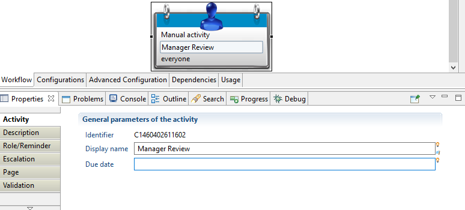
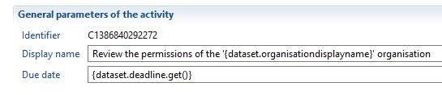
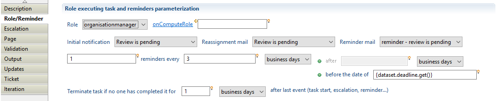
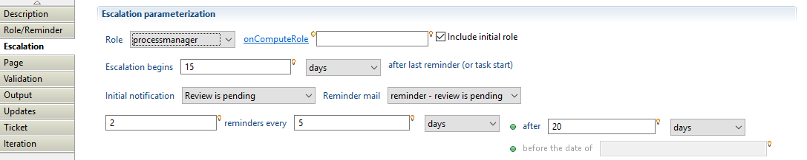
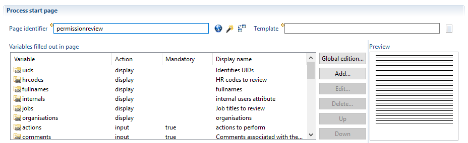
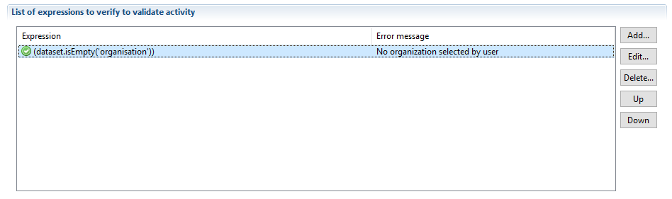
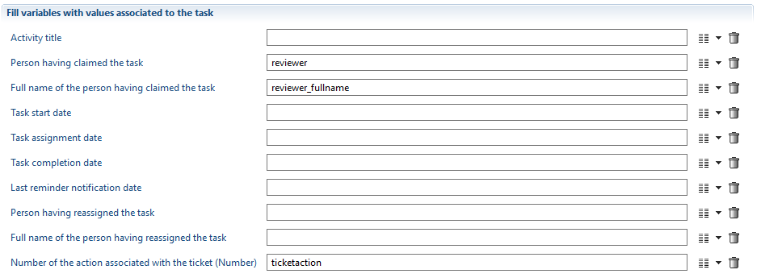
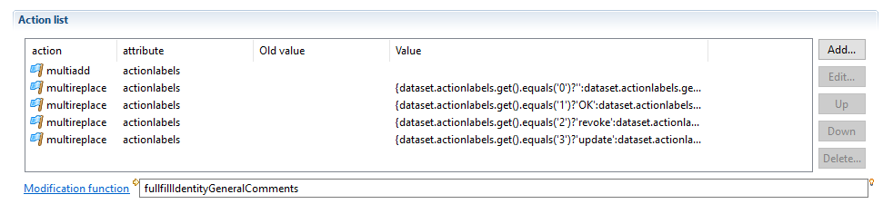
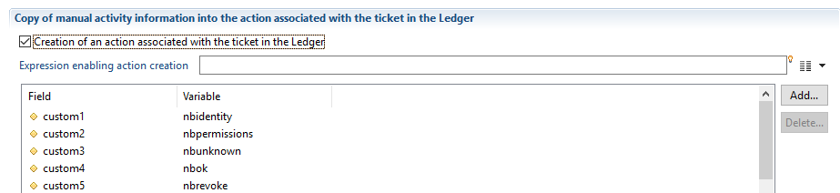
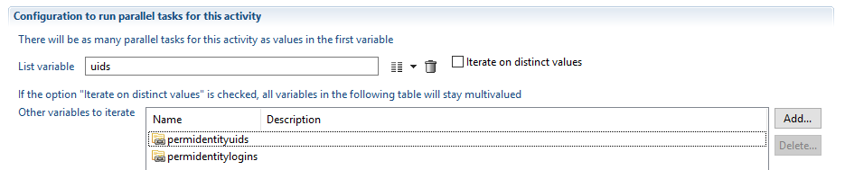

# Manual Tasks

Manual tasks are workflow tasks that need a user interaction, and therefore **require** both a **role** and a **page** (whereas automatic tasks don't).  
They are also called "Manual activities":  

Let's review each one of the Properties tabs.  

## Activity

Display name: the name of the manual activity, as displayed in the Studio, and in the web portal's Task Manager. Can be set dynamically.  
Due date: the manual activity's due date, as displayed by the portal's Task Manager.  

## Description

A description of the task's purpose (optional).  

## Role/Reminder

**Role**: the group of persons that are candidates for the manual task. For instance all the managers of the "DCOM" organization. Only one of them can take the task to complete it. The number of candidates does not determine the number of instances for a task: there is only one instance, and 1 to N candidates. If the role is empty, the workflow will fail. The roles listed are the ones present in the "Configurations" tab of the .workflow file.  

**onComputeRole**: here you can use javascript to modify the array of identities provided by the role to compute advanced roles.  

**Initial notification**: the notification sent when the task is created by the workflow engine. The notifications listed are the ones present in the "Configurations" tab of the .workflow file.  

**Reassignment email**: the notification sent when someone reassigns the task (the Functionnal administrator for instance, via the Task Manager).  

**Reminder email**: the notification to send for all the reminders, as defined below.  
Reminders: there are two options:  

- N reminders every X (business days \| days \| months) after M (business days \| days \| months)  
- N reminders every X (business days \| days \| months) before the date of D  

See the [page on reminders](./08-time-management.md#reminders-escalation-and-task-expiration) for more information.  

## Escalation

  

The parameters are almost the same ones as for the "Role/Reminder" tab, except for:  
Include initial role: if checked, the Role of the "Role/Reminder" tab is included escalation role (union), so that identities in the initial role are still candidates and can complete the task.  
Escalation begins: the number of days to wait after the last reminder or task start before the escalation is triggered.  

## Page

Page: the page identifier used by the manual task (called by the workflow engine).  

: opens a dialog to select a page.

: opens a dialog to generate a page matching the page definition below (as set in "Variables filled out in page").

 compare the current page with the page definition below (as set in "Variables filled out in page").  

Variables filled out in page: list of workflow variables that are displayed and/or modified by the identity via the page (in the portal). This is used by the workflow engine when running in debug mode to dynamically generate interfaces.  

## Validation

  

This is used to validate the identity's input in the portal: you can test attributes values just after the user presses the "Complete task" button.  

## Output

  

You can easily retrieve workflow engine information on the task and pass it to workflow variables.  
Activity title: the title of the activity, the calculated version of the definition.  
Person having claimed the task: uid of the identity who claimed the task (target variable is a "Process Actor" )  
Full name of the person having claimed the task: full name of the identity who claimed the task (target variable is a String )  
Task start date: the date the task was started/initialized by the workflow engine (target variable is a Date )  
Task assignment date: the date the task was assigned to an identity (target variable is a Date )  
Task completion date: the date the task was completed by an identity (target variable is a Date )
Last reminder notification date: the date the last reminder was sent (target variable is a Date )  
Person having reassigned the task: uid of the identity who last reassigned the task (target variable is a "Process Actor" )  
Full name of the person having reassigned the task: full name of the identity who last reassigned the task (target variable is a String )  
Number of the action associated with the ticket: the unique identifier of the ticket associated to the manual activity, if configured (target variable is a Number )  

## Updates

  

List of updates to be done on workflow variables. You also can call a script.  

See [variable modification functions](./04-variables.md#understanding-variable-modification-actions) for more details on your options.  

## Ticket

  

If enabled, a ticket associated to the manual activity will be created in the ledger.  

See [tickets](./10-tickets.md) for more details on this subject.  

## Iteration

  

Allows the manual activity to be iterated.  

See [iteration](./06-iterations-and-subprocesses.md) to learn more about this.  
