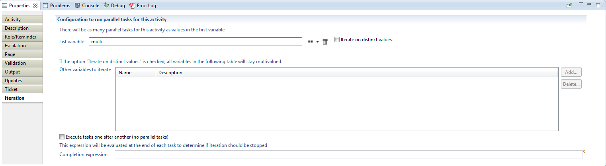
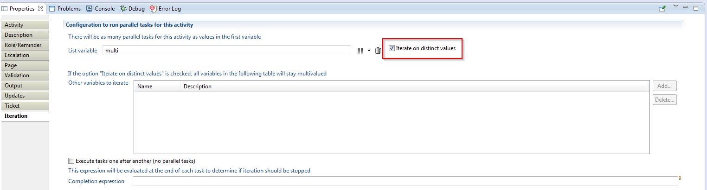
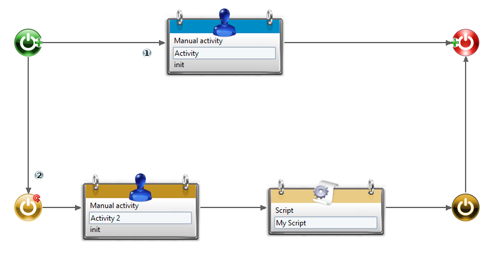

# Iterations and subprocesses

Iteration is a powerful feature allowing to create multiple instances of the same activity. It is available on a certain number of activities, the most commonly used being the manual activities and the subprocess calls. It can also be performed on any sequence of activities using an embedded subprocess.

## Procedure

### Iterations

Iterations are configured in the Iteration tab of the activity properties:

### Sequential vs parallel

The iteration will create a number of instances of our activity, and these can be created all at once, to be executed in parallel, or one after the other to be executed sequentially. Most often we will require parallel paths (especially for manual activities, as we want people to complete their tasks in their own time, not having to wait for other tasks to be finished), so this is the default mode, but there are a number of uses for sequential iteration as well, like polling (see [Timer Component](./11-components.md#timer-component) for more information).  

> To avoid unpredicted behaviour or racing conditions, the iteration will always be forced to be sequential when debugging a process ([see Debugging](./12-debugging.md) for more information).

### Iterated variables

There are three distinct groups of variables when inside an iteration:  

- The main iteration variable (the list variable at the top of the Iteration tab)  
- Additional iterated variables (listed in the table below)
- Variables outside of iteration scope (all other variables)

The main iteration variable is a multivalued variable whose size will set the number of instances of the activity. If its size is 1, then there will be only one task exactly as if no iteration had been set. If its size is zero then the process will simply skip the task and proceed forward with the execution.  
Additionally, the values contained in the variable will be distributed to each instance, so that when in an iterated task, the variable will be seen as monovalued. For instance, if our main iteration variable `myvar` is the list of strings `[HELLO, HI, HOWDY]`, the iteration will create 3 instances of the task that will all treat `myvar` as a monovalued variable. The first instance will have HELLO as a value, the second HI and the third HOWDY.  

This mechanism can be extended to additional multivalued variables, so that they are also distributed among the instances. The task instances will each receive only one value in the order of those lists. If the list is longer than the main iteration one, the extraneous values will simply be discarded. If, on the contrary, the list is shorter, the last tasks will get an empty value.  

When the iteration is completed, the values of each instance will be put together to form multivalued variables again.  

Let's have an example. Suppose that we still have our `myvar` variable, and another variable `myvar2` that contains only `[YES, NO]` before the iteration. 3 tasks are then created, and the variables are set by users as follow:  

- first task has `myvar`=HELLO, `myvar2`=YES. For some reason `myvar2` is changed to NO.
- second task has `myvar`=HI and `myvar2`=NO. Here `myvar` becomes BYE and `myvar2` PERHAPS  
- third task has `myvar`=HOWDY and `myvar2` is emtpy. `myvar2` is changed to NO  

After iteration is finished, myvar will be the list `[HELLO,BYE,HOWDY]` and myvar2 `[NO,PERHAPS, NO]`  

What happens to the other variables then, those that are not listed in the iteration ? Well, they are shared among the instances, exactly as they are defined in the process. It is of course possible to use them, even modify them in iterated instances, but extreme caution must be exercised in that case, as simultaneous writing from different instances may yield unpredicted value results.  

A downside of iteration is that all iterated variables will be monovalued inside the iteration, which means you cannot edit lists inside of iterated tasks. This can be achieved by the somewhat rather more advanced feature of iterating on distinct values.  

### Advanced Iteration

As discussed before, standard iteration on a task or group of tasks will dispatch the iterated variables to the multiple instances, each instance receiving a single value in a monovalued variable. This means that iterated tasks cannot edit or create separate lists. There is, however, an option that will allow to split list variables into sub-lists: it is a checkbox found next to the main iteration variable in the Iteration tab.  

Checking this option will have three major effects on the iterated variables:  

1. The main iteration variable will be split into sublists consisting of the successive identical values found in the variable
2. All the other iterated variables will be split along the same pattern as the main variable (identical values do not enter consideration for those variables). Extraneous values will be discarded, and empty values will be added so that the lists all match the size of the main variable  
3. All the iterated variables will still be seen as multivalued within the task instances  

Here's a quick example: let's say our main iteration variable is named `mymainvar`, and consists before iteration of the list `[A,A,A,B,B,C]` and that another variable named `myothervar` is iterated upon, initially consisting of the list `[JOHN,JACK,JOE,JUDE]`. While normal iteration would create 6 instances, here we will only have 3 different instances, with the following variables values:  

- `mymainvar`=`[A,A,A]`, `myothervar`=`[JOHN,JACK,JOE]`
- `mymainvar`=`[B,B]`, `myothervar`=`[JUDE,<empty>]`
- `mymainvar`=`[C]`, `myothervar`=`[<empty>]`

After the tasks are completed, the variables will be put together like in a standard iteration, but here as the variables are multivalued there is no guarantee that the output variables will all have the same sizes, as values can be added or subtracted from each one independently. If this is required, it will have to be ensured through the activity design and, for a manual activity, the page conception.  

We can notice that if the main iteration list contains only distinct values, the only difference between this method and the standard iteration will be that the iterated variables stay multivalued (they will all be lists containing a single element). Also, bear in mind that the splitting on the main variable will be made according to successive identical values, e.g. `[A,B,B,A]` will result in 3 instances and not 2.  

See the example section of this page for a more comprehensive example.  

### Early stopping

The iteration can be made to stop early by adding a completion expression at the bottom of the Iteration tab.  
When this expression becomes true, the iteration will stop and the process will move on regardless of the number of instances still not completed. This can be used for example in a request approval process where you only need a certain number of positive votes to grant the request.

### Embedded subprocesses

Iteration is a pretty powerful concept that can be used to create parallel tasks or to repeat a task sequentially. But sometimes you may need to iterate over more than a single task ; this can be achieved by defining a separate subprocess in which you put the sequence of tasks to be iterated, then iterating in the main process on the activity calling this subprocess. This works well, but forces you to split your process in two even if you weren't really intent on isolating the iterated activities in the first place. Furthermore, it requires setting scopes to the variables and mapping them between main process and subprocess, and will show as an independent process in the list of active processes. All in all, this might turn out to be a bit of a hassle just to iterate on a small group of tasks...Fortunately, there is a simpler alternative using an embedded subprocess.  

An embedded subprocess is simply a part of the process that is delimited by two specific activities (one for start, one for end). It has to be isolated from the main process (meaning you cannot create links between the embedded subprocess and activities that are in the scope of the main process). Here is what it looks like:

The subprocess consists of all the activities in yellow, from the subprocess start to the subprocess end. You can notice the iteration positioned on the start activity. This means that the group formed by activity 2 and the following script will be affected by the iteration, which is exactly what we wanted. The design showed in this example is quite simple, but you can design a subprocess as complex as you want (using any number of parallel branches or lengthy sequences of activities) as long as it is properly contained between the start and end activities of the subprocess.  

There are a few points to be aware of regarding embedded subprocesses:  

- you can define an embedded subprocess even if you don't iterate on its starting task. The use for this, however, has yet to be found (unless you really want the cool yellow coloring in the editor), since in that case the process will behave exactly the same whether there is an embedded subprocess or not.  
- you can have any number of embedded subprocesses in a given process, as long as they are correctly isolated from each other and from the main process. When in the editor, you will get errors if your process design is incorrect, and the process will not even be published at runtime if this is the case.  
- you can have a normal subprocess call in an embedded subprocess, and vice versa.
- what you can absolutely NOT have is an embedded subprocess inside another embedded subprocess. This will be treated as a design error.

**When to use a normal subprocess:**  

- when there is a logical separation between subprocess and main process
- when the subprocess can be called on its own, or by different processes
- when you want to be able to report the progress of the subprocess independently
- when you want the subprocess to create its own ticket to store information in the database  

**When to use an embedded subprocess:**  

- when you want to iterate on a group of tasks and do not need any of the above
- when you want to restrict the design to a single process

## Examples

### Advance iteration

We understand that the reasons for this method of advance iteration may be a little unclear; this is why we'll demonstrate a use case for this with a more comprehensive example.  

First, having to create a main variable that contains repeated values, and order it along with the other variables so that it splits as intended might seem like a lot of work for such a simple thing. This is mostly because, although this is entirely feasible using only modification actions on multivalued variables, this will be done effortlessly when our variables are filled from view columns.  

Let's say we want to implement a task where the manager of each organisation will have to review every member to state if he or she actually works in that organisation. For each organisation, we want to have a list of members, and for each member a status (OK/NOT OK for instance) and a comment from the manager (not mandatory). This means that:  

- We need to create a task for each organisation
- We need to define multivalued variables for the members (of type Ledger Identity), the status (of type String, chosen between two static values) and the comment (of type String, with no constraint).  

Thus we will work with 4 multivalued variables that we name `organisations`, `members`, `status` and `comments`. Our main activity will be a manual task on which iteration is set on `organisations`, with `members`, `status` and `comments` set as other iterated variables and where we check 'iterate on distinct values'.  
This is perhaps counter intuitive, but organisations will not hold a list of all distinct organisations, but will instead have the same size as the number of all organisation members in the database: in a previous task, we execute a view that will return the uid of every person along with the uid of his/her structure, the results being orderded by organisation uid.  

As a result, our variables will be set as follow:  `organisations`=`[ORG1,ORG1,ORG2...]`, `members`=`[M.X, Ms Y, M. Z, ....]`. The other two variables remain empty.  
Now observe that the splitting method will give us exactly what we want: it will create exactly one instance for each organisation, and each instance will handle only the list of members of the designated organisation, along with status and comments of the same size, waiting to be filled. For instance, our first task will have `organisations`=`[ORG1,ORG1]`, `members`=`[M.X, Ms Y]`,`status`=`[<empty>,<empty>]`, `comments`=`[<empty>,<empty>]`.  

After iteration is finished, the values are gathered in our original variables. We will have `organisations`=`[ORG1,ORG1,ORG2...]`, `members`=`[M.X, Ms Y, M. Z, ....]`, `status`=`[NOT OK,OK, , OK...]`, `comments`=`['Works in HR department',<empty>,<empty>,...]`. It is also possible for the list of members to be augmented if some people are missing, as long as we ensure that the other variables are filled synchronously.
