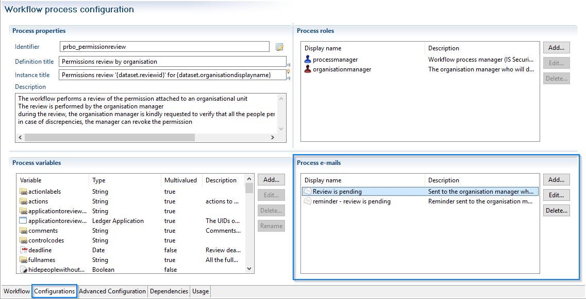
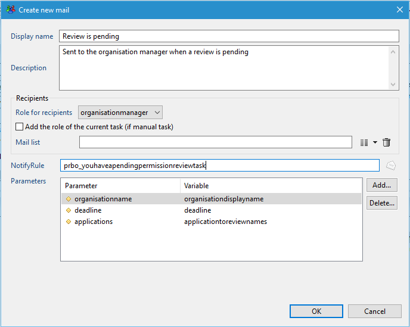
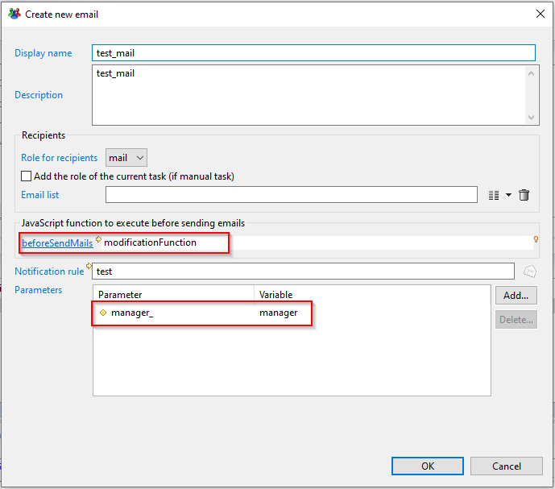
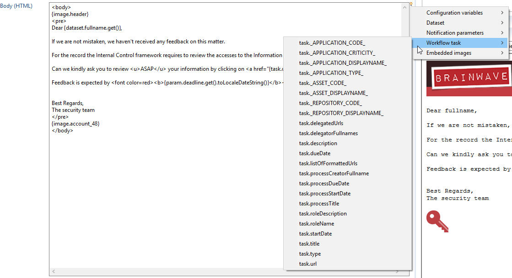
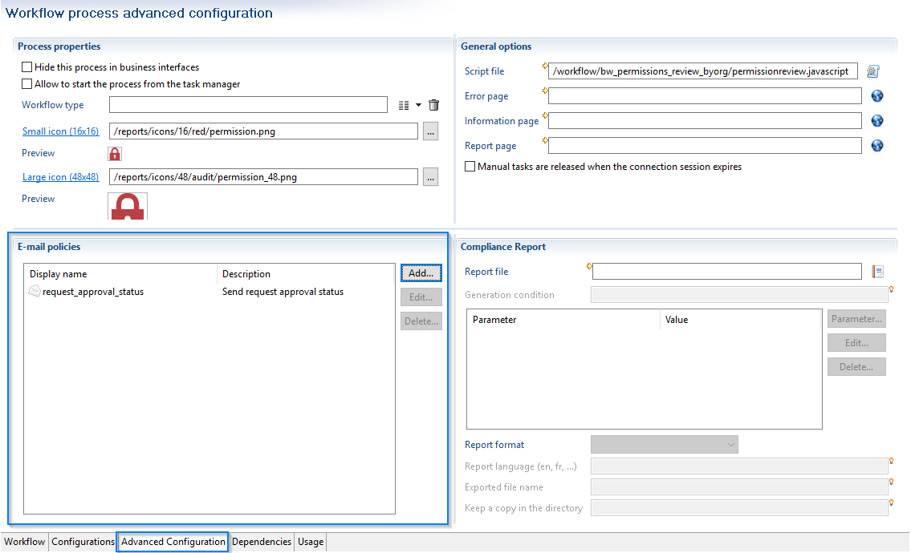
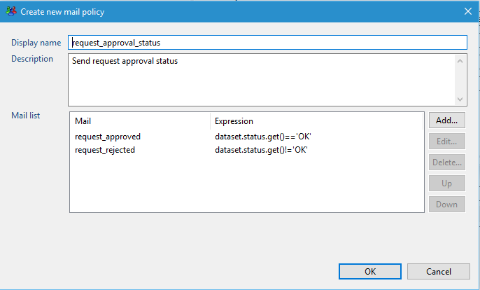
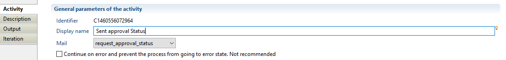

# E-mail notifications

## Why Notifications  

Notifications are used in the workflow to:  

- For task candidates and escalation candidates:  
  - Notify them that they have a new task
  - Remind them that they have a pending task
  - Send an email each time a task is manually reassigned to someone
- Send email to specific roles anywhere in the workflow

> This page does not cover Notifications Rules (.notifyrule files in the "notifications" folder of the project), see the dedicated section for more information.

## Notifications Definition

In the workflow, notifications are defined in the "Configurations" tab:  



## Adding/Modifying Notifications

When adding or modifying a notification, you will have the following dialog:  



You need to fill the following fields:  

- Display name: the identifier for the notification rule
- Description: a description of the notification rule
- Recipients: the people that will receive the notification, choose one between:  
  - Role for recipients: the workflow role containing the identities that will receive the notification
  - Add the role of the current task (if manual task): you can retrieve the role of the current task to dynamically use it for the notification
  - Mail list: a multivalued attribute containing uids or emails of identities that will receive the notification  
- NotifyRule: the notification rule used to send emails
- Parameters: allows to pass workflow variables to the notification rule
Note that since the notification rule uses a view, the workflow will send emails to the intersection of the role configured for the notification and the view used in the notification rule, so be careful when choosing a view for the notification rule (the easiest choice is to list all active identities).  

Also keep in mind that the **view** used in the notification rule should at least return the **uid** and the **email** of the identities, otherwise the workflow engine will not be able to send emails.  

## Refresh variables before sending reminders

During a workflow, when sending an email with a list of people defined in the CC field, it can be necessary to recompute this as the initially computed data can be outdated.

### User interface

The mail dialog box in the workflow editor has been updated to reference a Javascript function. This is is called after recipient resolution and before sending the email.

This function can **temporarily** modify any workflow variables. These variables can be mapped to notify rule parameters.  

> The variables modifications are valid for the **notification only**  
> Modifications are not persisted after the notification: the variable values **remain unchanged** in the workflow after the javascript call



### Script

A variable containing the recipient's UIDs is passed to the script. The script is then able to call the function `workflow.executeView` with the recipient UIDs as parameter.

This view can be used to determine for example the list of manager UIDs to stored.

The following script is an example in which for each recipient UID a view is executed to search for the manager UID. The variable containing managers is mapped to the parameter used in CC email field of the notification rule.

```js  
/* param contain recipients uids list */
function modificationFunction(/*Array*/recipients) {
  //Value before changes
  print(dataset.manager);
  dataset.manager.clear();
  if(recipients != null && recipients.length > 0){
    for (var i = 0; i < recipients.length; i++) {
      /*String*/var uid = recipients[i];
      var /*java.util.Map*/viewParams= new java.util.HashMap();
      viewParams.put("uid_", uid);
      var /*Array*/results = workflow.executeView(null, "getManagers", viewParams);
      if (results != null && results.length > 0){
        var /*Array*/ listMails = [];
        for (var index = 0; index < results.length; index++) {
          var /*java.util.Map*/data = results[index];
          var /*String*/manager_mail =   data.get("mail");
          if(manager_mail != null){
            listMails.push(manager_mail)
          }
        }
        if(listMails != null && listMails.length > 0){
          var /*String*/ listMailsStr = listMails.join(',');
          dataset.manager.add(listMailsStr);
        }
      }
    }
  }
  //Value after changes
  print(dataset.manager.toString());
  return;
}
```

### Workflow Variable

The best practice is to have dedicated variables for each mail.

## Workflow related variables

Apart from passing arguments to the notification rule (like for instance the review identifier, or an organization name), you can access standard information from the workflow directly in the notification rule interface:  

  

These variables are explained [here](../notification-rules/03-macros).  

## E-mail Policy

Email-policies are defined in the "Advanced Configuration" tab of the workflow:  

  

Simply put, a e-mail policy is a list of notifications with, for each one, a javascript expression that evaluates to true or false. When the event requiring a notification is triggered, this list will be scanned from top to bottom, and the first notification whose expression yields true will be sent. Is it important to keep in mind that a mail policy will always send only one notification, it is not a way to send multiple notifications.  

Email-policies are of great use to:  

- switch between different notifications according to the context. The most obvious example is when you have to send a notification according to a status rejected / accepted; you can create a policy resembling something like this:  
  - `request_approved | dataset.status.get()=='OK'`
  - `request_rejected | dataset.status.get()!='OK'`
- choose not to send any notification if certain conditions are not fulfilled. You can even have only one notification in your list, with an expression that will keep the mail from being sent if it is not verified. This can help in case you need to stray from the standard notification policy, such as not sending the mail if the task has been taken less than x days before, nor if the task has progressed in the last x days, etc.  

Here is an example of a switch that will send an email depending on the value of a variable in the workflow:  

  

Email policies can be used in the workflow in the same places as classic notifications. For instance in a Email notification component:  


