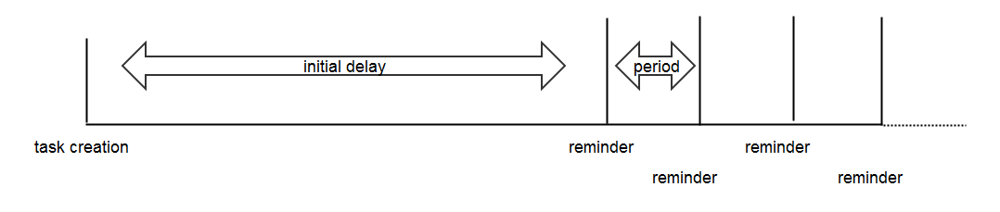
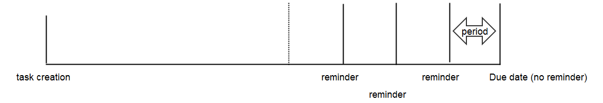
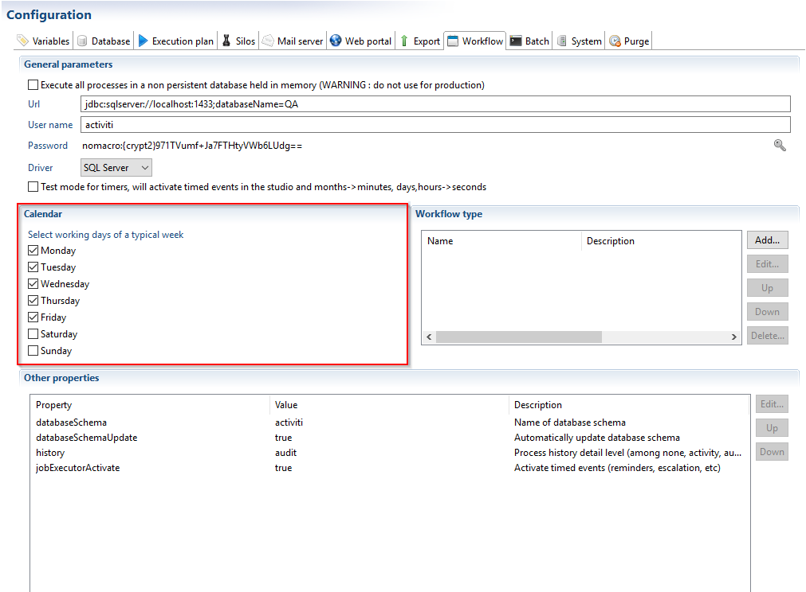
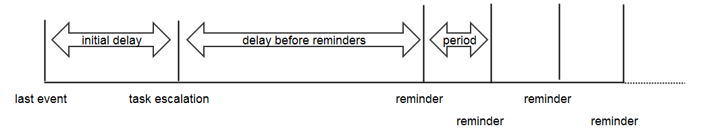
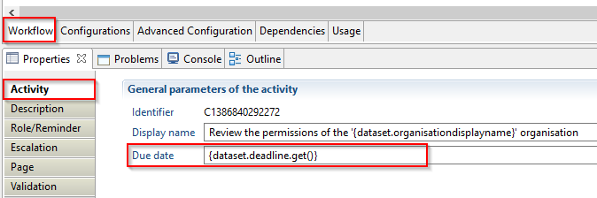

# Time management

## Reminders, Escalation and task expiration

Automatic reminders are essential to a workflow process. Even though the workflow editor provides a simple and flexible way to configure these, it is important to have a clear view of the different timed events that can occur during a manual activity. These events can be listed in the order in which they can occur as follow:  

- Task creation (with or without initial notification)
- Reminder notifications
- Escalation (with or without escalation notification)
- Escalation reminder notifications
- Task expiration

None of these events are mandatory, and they can all be set independently of one another. For example, you can have reminder notifications even if you chose not to have an initial notification at the task creation. You can also set an escalation timer for the task even without reminder or escalation notifications. The important rule here is that all the events that are set will happen precisely in the order above. It is not possible for instance (and, indeed, the configuration guarantees this) for a task to expire if there are remaining notifications to be sent.

### Procedure

Automatic notifications are configured in two sub-tabs of the properties tab (see bellow) of your manual task:  

- Role/Reminder  
  

- Escalation  
  

To configure reminders and/or escalations it is necessary to have defined beforehand in the configuration tab of the workflow:  

- Roles, _i.e._ the people that shall receive the reminders and the escalation e-mails
- Process emails

#### Reminders

Reminders are e-mails sent to the role that should perform the manual task. The configuration itself is pretty self-explanatory: you set a role that will set the candidates for the task, and set a mail if you want an initial notification when the task becomes available.  

You can define three types of emails:  

- The initial notification: The first email sent, describing the processes that should be preformed for example
- The reassignment e-mail: In a workflow it is possible to reassign a task to a new user. The selected e-mail will then be sent
- The reminder e-mail

You then set the number of reminders, the wait period between each notification and either a start date or an end date.

> For a better use of task notifications, be sure to check the 'Add the role to the current task (if manual task)' option that can be found in the mail definition: this ensures that the notifications will always be sent to the current task role, as it can change if the task has been reassigned for instance. It will also direct the notifications to the person assigned to the task if it has been claimed, instead of notifying every candidate about a task that is no longer available to them. Of course, you can add any static role or list of persons to this option if you want to include people that are not candidates in the recipients, like a supervisor.

There are indeed two different ways of setting up reminders:  

- starting from the task creation, sending notifications at a regular interval after a certain duration  
- sending notifications at a regular interval until you reach a certain date

The first one can be sketched like this:  
  

The second one can be represented like this:  
  

The second method is a bit more complex to understand if you send multiple reminders.  
The standard case would be to send only one notification before a given due date (_note:_ this is not necessarily related to the due date that you can set in the Activity tab for the task, which is only declarative and more aimed at documenting the process). If you send more than one notification, the duration before the due date will be repeated backward in time to send the other reminders. Only the reminders that can be scheduled before the task creation will be sent (e.g. if you program 100 reminders each day and only have a week to complete the task, only 6 of them will be sent).

> [!warning]  - There will be no reminder sent on the due date. If you wish to send a single notification on a given date, you can set the sentence to read '1 reminder(s) every 0 days before the date of xxx'. Otherwise, it is not difficult to compute the right duration and dates to set a desired pattern if you know how to [handle dates in macros](#how-to-handle-dates-in-javascript-and-macros).
>
> - The last event from which the ongoing events will fire will be the **last reminder notification sent**. If there are no reminders set, then those will start from the task creation.
> - Although a notification can be set on task reassignment in the same property tab, this event does not factor in the diagrams above, as it is not a timed event but one triggered manually from the web portal interface.

Timed events (reminder notifications, task expiration, escalation, ...) can be measured in days or months.  
For short span events, however, this can prove cumbersome as precious time can be wasted if they are fired on a day where the people involved cannot complete their work. For instance, if a task has to be completed in a week, and a reminder notification has to be sent 3 days before that, if the notification is sent on a Sunday then the people will have only 2 days, and not 3 to complete their work. The workflow calendar can help address this issue. It can be found in the project configuration, in the 'Workflow' tab.  
  

Here you can select which days of the week are considered working days. Then, in the workflow editor, instead of selecting 'days' as your unit of time, you can select 'business days'. This will automatically ensure that the events are only fired on the working days selected in the calendar. For the previous example, and with working days being monday to friday, this means that we would have to set the task to expire in 5 business days (a standard working week), and the reminder notification to trigger 3 business days before that.  

> [!warning]  - Only the business days units are linked to the workflow calendar. All the other time units found in the workflow editor will be considered as raw values regardless of the calendar configuration
>
> - Is it absolutely possible to mix business days with other units in timer configuration (e.g. wait a standard month before firing reminders every 4 business days). As long as you know what you are doing !
> - The calendar is shared among all the workflow processes, so the working days cannot differ from process to process
> - The calendar does not take national holidays or vacation periods into account, it applies the same time pattern to every week of the year
> - Setting the correct amount of business days to obtain a given period of time can be quite tricky for long time spans (how many business days in a 4-days week do I need to set to amount to 5 months ?). As a general rule, it is often better to use standard days or months for long durations.

#### Escalation

There are a lot of similarities with the Role/Reminder tab. Indeed, escalation notifications have the same configuration as standard reminders. The only difference is that we can add an initial delay before the task escalates, then configure reminders as explained above. If we consider the first reminder configuration, this would result in something like this:  
  

> [!warning]   The last event **will be** either the task creation, or the last reminder notification sent **and not** the due date.

Of course, the escalation reminders will be sent to the recipients defined in the escalation role, as long as the mail has been properly configured to include the task role.  

#### Task Expiration

The last event that can be triggered on a manual activity is to have the task expire after a certain duration. This is configured in the Role/Reminder tab, and the duration will expand from the last event:  

- Task creation
- Last reminder notification
- Escalation
- Last escalation reminder notification  

The expiration will trigger if the task has not been completed before the timer runs off, regardless of the state of the task (claimed, escalated, etc).  
It will result in the task being terminated, and the process will proceed forward by following the error links (colored in red) that flow from the expired activity. It will not follow the standard links.  
This means that if no outgoing error link has been defined the process execution will terminate prematurely.

A proper design will always ensure that there is at least one error link for every activity that can expire, even if it only connects to the process end activity, otherwise you might miss important execution steps as the ticket updates.

### Known limitations

When a timer expires, the execution of the workflow will only follow the outgoing error links. furthermore, this feature is no compatible with an iteration of an activity.  

## Difference between task due date and task expiration

  

There is a field named **'Due date'** in the Activity tab of a manual task or the process start task (see caption). This value is NOT related to the task expiration that is set in the Role / Reminder tab as explained in the following page: [Reminders, Escalation and task expiration](#reminders-escalation-and-task-expiration).  

The due date will not be used during the process execution, and is in no way a constraint on the process execution. It only serves documentation purposes, and is available for reporting or displayed in process administration.  

The due date of a start task indicates an estimated due date of the process, whereas, the due date of a manual task that of the task itself.

## How-To handle dates in javascript and macros

Handling dates and time spans has been made a lot easier by the addition of a few choice javascript functions. The following tips also apply to the date attributes in the discovery and collector editors.

### Switching between Date and LDAP String formats

As you may already know from collecting data using the discovery and collector modules, the dates in the iGRC database are stored in LDAP string format, _e.g._ the 1st of february 1997 will be stored as the string  `19970201`. This means that, depending on the situation, you may find yourself handling dates that are either defined as a Javascript Date object, or as a raw LDAP String. You can switch seamlessly between the two formats by using the following syntax:

- To get the LDAP String representation of the javascript Date object (or Date attribute) `mydate` : `mydate.toLDAPString()`
- To get a Date object from an LDAP string `mystring` : `fromLDAPString(mystring)`

### Getting the current date

- To get the current date as a Date object : `new Date()`
- To get the current date as an LDAP String object : `(new Date()).toLDAPString()`

Beware that this will compute the date at the time of execution of the script or macro, which might not be what you want. For instance, if used in a macro in a workflow timed event such as a reminder notification, this will yield the date when the activity is created (since all timers are resolved at activity creation), whereas if used in the Updates section of the same activity, it will yield the date when the activity is completed (since the macros and scripting functions are executed after task completion). We advise extreme caution when using this, and as a general rule recommend whenever possible to use other means to get event dates in a workflow process, such as retrieving it in a variable from the activity outputs.

### Adding/subtracting a time span to a date

This function is only accessible on a proper Date object or attribute (not an LDAP String, or any other type like a long numeral). On such an object, simply use the syntax : `mydate.add(unit,value)`

`unit` is a string giving the time unit in which to measure the span.
Valid units are:

- "s" for seconds
- "m" for minutes
- "H" for hours
- "d" for days
- "M" for months
- "y" for years

`value` is the number of time units to be added to the date. Using a negative value allows to subtract time as well.

#### Examples

Subtracting ten years to a given date : `mydate.add("y",-10)`
Adding 3h30mn to a given date : `mydate.add("h",3).add("m",30)`

### Computing the time span between two dates

You may have to write conditions such as "the time lapse between date1 and date2 cannot be more than 3 days". This is easily done using a function computing the time span between two dates in any of the previously described time units. Once again, this function can only be called on a proper Date object or attribute.

To compute the number of days between date1 and date2, use the syntax : `date1.diff(date2, "d")`

Please note that this will actually compute date1-date2, not the other way around, and can yield a negative result if date2 is more recent.
The previous condition can be written as : `date1.diff(date2,"d")<=3`
