# Tickets and workflows

## Introduction

There are four types of tickets in the Ledger that are linked to workflows, as documented on Expert-Exchange or PS Tools:  

- [TicketLog](./10-tickets.md#ticketlog)  
- [TicketAction](./10-tickets.md#ticketaction)  
- [TicketReview](./10-tickets.md#ticketreview)  
- Remediation Ticket  

> This page intends to give an overview of these ticket types and how they interact  

In short, here is what each ticket type is for:  

1. `TicketLog`: monitor workflows; one by workflow instance
2. `TicketAction`: monitor user actions; one by manual task (user action in the portal)
  - It will be linked automatically to the workflow it belongs to (the `TicketLog` of the workflow that contains it must exist)  
  - There can be more than one TicketAction linked to the same workflow (`TicketLog`)  
3. `TicketReview`: monitor reviewed entries; one by reviewed item (by someone in a manual task)
  - It has to be linked explicitly to a `TicketAction`  
4. `RemediationTicket`: monitor remediation actions; one for one or mulitple `TicketReview`

Here is how they look like in the palette:  
  

> The examples below use a standard review process generated by the review wizard (master/detail workflows)  

## 1. TicketLog

The **TicketLog** is linked to a `workflow` if the following option is set.  
In the `Start` component, enable the `Ticket creation in the Ledger` option of the `Ticket` tab:  
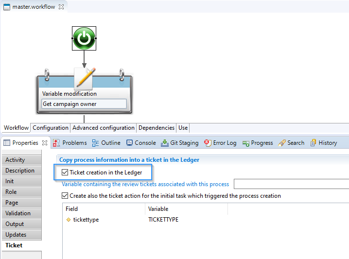  

> By default, there is no `TicketAction` associated to the launch of a process, but you can create one by checking the `Create also the ticket action for the initial task which triggered the process creation` option  

### Children workflows

Workflows can call other (children) workflows.  
The **TicketLogs** of children workflows will be linked to their parent workflow's **TicketLog**.  

For example, this standard review process' main workflow calls children processes (1 to many):  
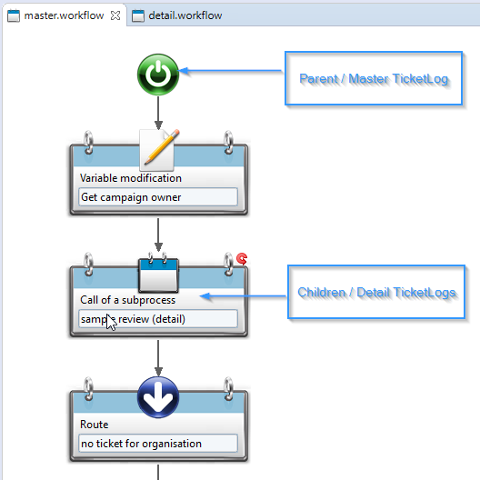  

This can be queried in views:  
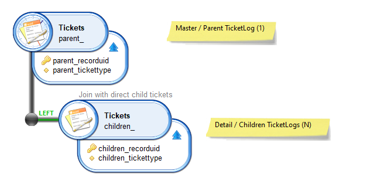  

> Similarly to other hierarchies in the Ledger (`organizations`, `groups`, etc.), there can be multiple levels involved and you can query direct and indirect links  

**Both** the parent (master) and child (detail) workflows must have the option `Ticket creation in the Ledger` enabled, so that they both have a corresponding `TicketLog`, and so that hierarchical links can be created.  

You can retrieve the recorduid of the `TicketLog` in the workflow fom the `Output` tab of the `Start` component:  
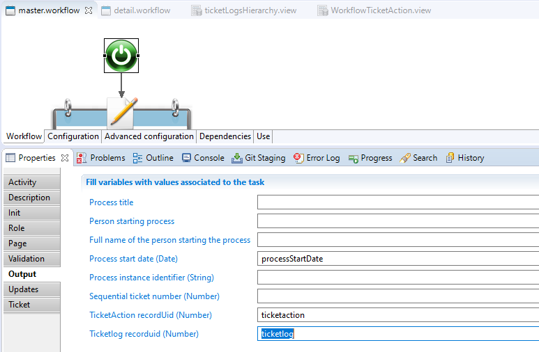  

## 2. TicketAction

A **TicketAction** represents an action in the (web) portal by someone, as opposed to other actions in a workflow that are automated (not requiring user interaction).  

There are two occasions where a user action can occur in workflows:  

 1. When a workflow is started (manually)  
 2. When there is a manual task in the workflow

A **TicketAction** is linked to the workflow instance that contains it, via it's `TicketLog`.  

### 1. Start

Starting a workflow can be a manual task (and often is).  
But the associated `TicketAction` is not created by default, you will have to enable the dedicated option in the `Ticket` tab of the `Start` component, `Create also the ticket action from the initial task which triggered the process creation`:  
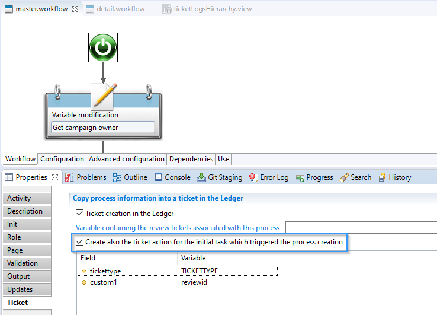  

> As a `TicketAction` is linked to a `TicketLog`, you must enable the `Ticket creation in the Ledger` option.  

The link between the workflow's `TicketLog` and the manual action starting the process can be queried in views:  
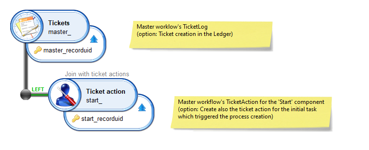  

To illustrate the same thing in another manner:  
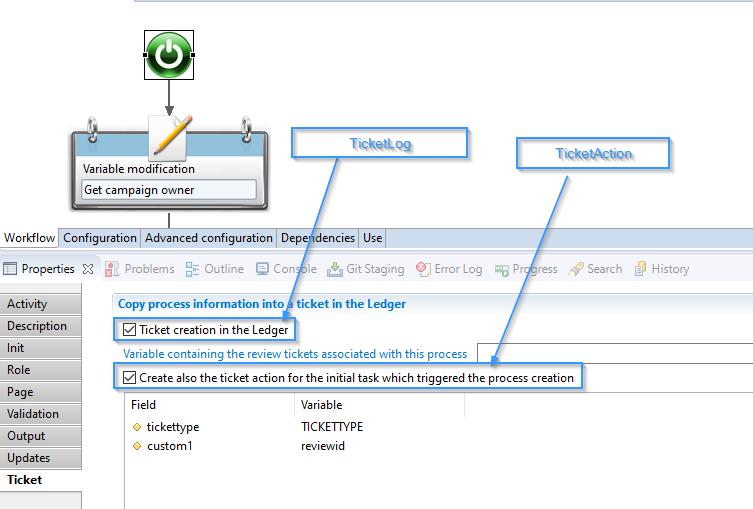  

You can retrieve the `TicketAction`'s recorduid in the `Output` tab of the start component:  
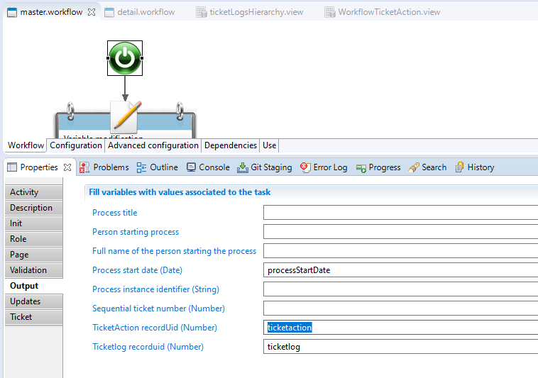  

### 2. Manual tasks

You can also add manual tasks in workflows, that will require an end-user interaction in the portal (unless it expires).  
For example in a detailed (child) workflow:  
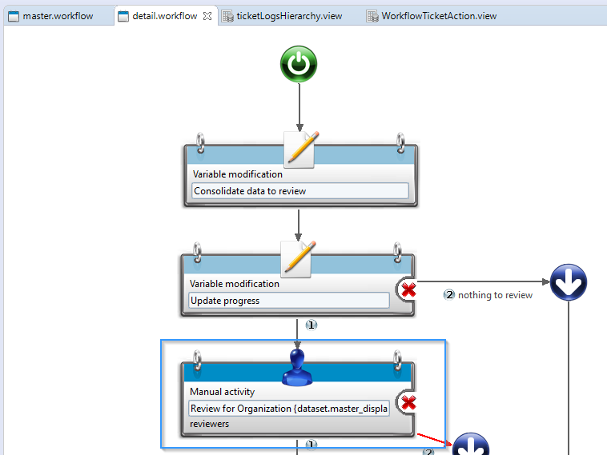  

To trigger the creation of a `TicketAction` associated with the manual task, you must enable the `Creation of TicketAction` option of the `Ticket` tab in the Manual activity item:  
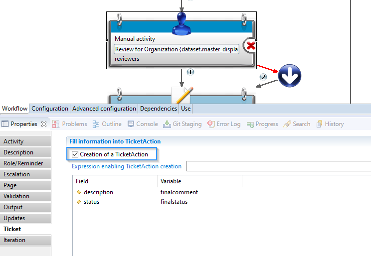  

The recorduid of the Manual Task's `TicketAction` can be retrieved in the `Output` tab:  
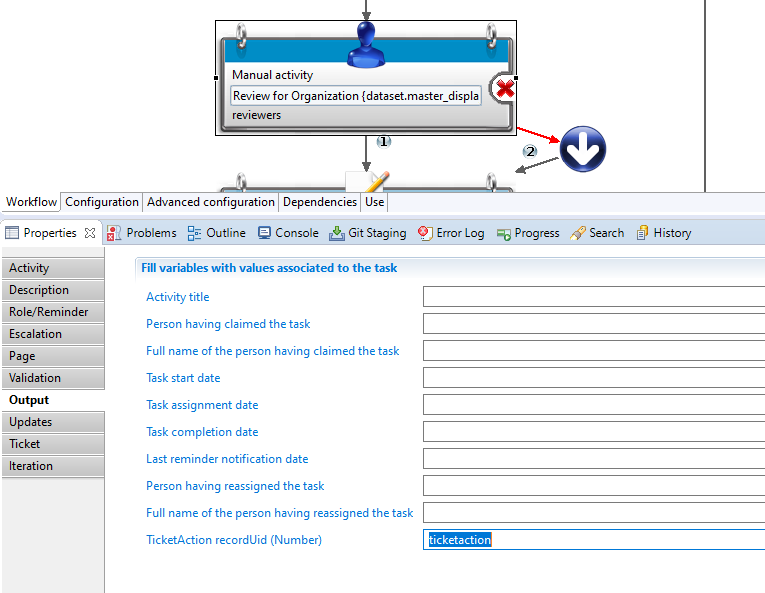  

## 3. TicketReview

The **TicketReview** holds the reviewed items; you will generally pass multivalued attributes from a Structure:  
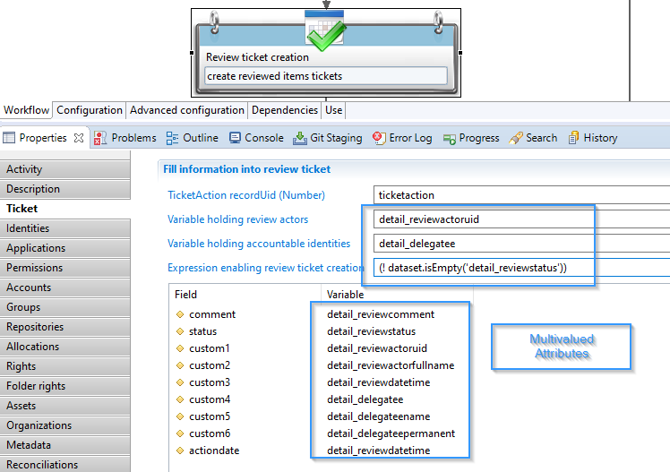  

> As said above, attributes passed to a `TicketReview` are generally multivalued and coming from a workflow Structure to maintain the cardinality and consistency of all attributes. Although it is highly recommended, if a structure is not used, take care about this cardinality and consistency.

`TicketReviews` require a `TicketAction` to be linked to, so that the reviewed items can be put in context (who did the review, during which workflow).  
To create a `TicketReview`, you will need the `TicketAction`'s recorduid, as shown here:  
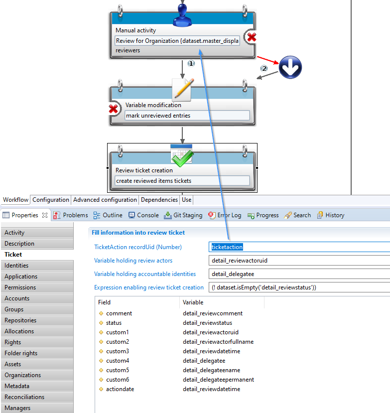  

The link between the workflow's `TicketAction` and `TicketReviews` (one to many) can be queried in views:

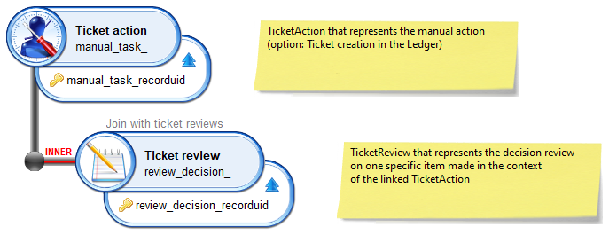  

`TicketReview` represents a review decision of an item of the Data Model. Because of that, `TicketReview` must be linked to one (and only one) reviewed item. Many item can be reviewed and linked to a `TicketReview`:  

  

> As said before, attributes used to identify the reviewed item are part of a workflow Structure, so multivalued. Again, take care about the cardinality and consistency.  

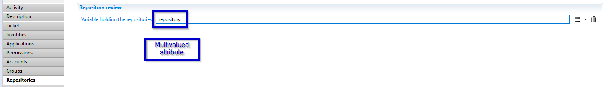  

The link between the workflow's `TicketReviews` and the reviewed item (one to one) can be queried in views:  

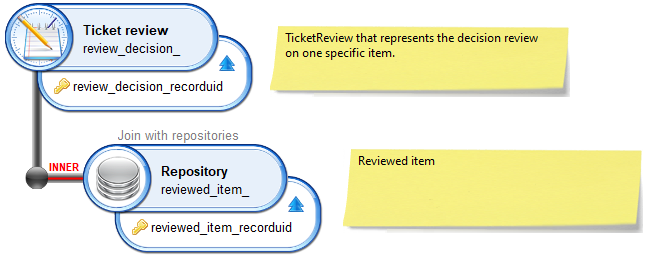  
