# Tickets

## Introduction

Tickets are used to keep a trace of workflow instances and the actions requested during their execution.  
They allow you to do delta reviews, list remediations, produce compliance reports, etc.  
Tickets are created in the Brainwave Ledger, and can be retrieved via views.  
There are three type of tickets:  

- ticketLog  
- ticketAction
- ticketReview  

> See [Tickets and Workflows](./09-tickets-and-workflows.md) for a deep dive into Workflow and tickets creation  

## TicketLog

### TicketLog creation

A ticketLog is a ticket linked to a process instance.  
To create a ticketLog, you have to activate it in the Start component, under the "Ticket" tab:  

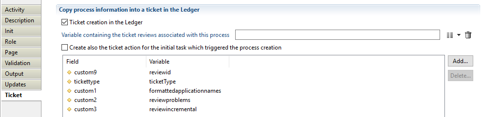

The consequence is that you will have a ticketLog created in the Ledger for each instance of the process. This works for processes launched manually, or processes that are started by a parent.  
The fields available for TicketLogs are:  

- Ticket Status: the status of the Ticket (usually Open once started, Closed once terminated)
- Ticket Description: usually the instance title (Review campaign X123)
- Ticket Priority: 1, 2 or 3 (or low, medium or high)
- Ticket Type: the type of the ticket (for instance the workflow identifier), this will help you filter tickets for a given .workflow
- Custom attributes (1 to 9)  

> When the status field is not mapped to a workflow variable, the status is automatically set by the product to reflect the current process status. But if the status field is mapped to a workflow variable, the product no longer updates the status as the value is forced using a variable. The best practice is to leave the status field empty (not mapped). This lets the task manager or the campaign manager displays the real-time status of all the processes.  

### TicketLog Identifier

You can retrieve the ticket identifier from the "output" tab in an attribute (of type Number  ticketNumber below):  

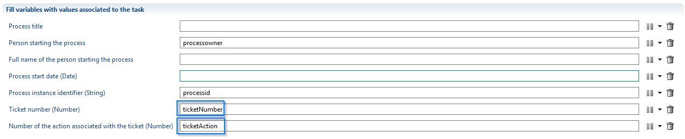

If you check the option "Create also the ticket action for the initial task which triggered the process creation", you will create a ticketAction (see below) that corresponds to the manual start activity. You can also retrieve the ticket identifier in an attribute (of type Number , ticketAction above).  

The ticket number is not the recorduid of the TicketLog. It is a sequential number depending on the workflow definition name. For example, il you have 2 process definitions (OrgReview and AppReview), process instances for OrgReview will be numbered from 1 and process instances for AppReview will also be numbered from 1.  

### TicketLog views and links  

Since workflows can call other workflows, tickets are linked when this is the case, so that you can use parent and/or child link in the views. For instance:  

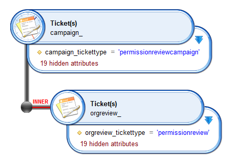

### TicketLog title nationalization

All declared nationalization for ticket title are stored in other titles attributes as plain text.  
Example:  

```properties
#Wed Mar 21 15:01:09 CET 2018
  fr=FR Workflow de test
  en=test ticketaction en
  es=ES Flujo de trabajo de prueba
```

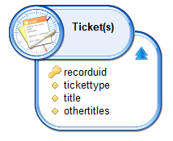

To get only the title in the desired language you need to call specific method in a javascript expression by adding new computed column.  
Example:  

`dataset.othertitles.get().getProperty('es')`  

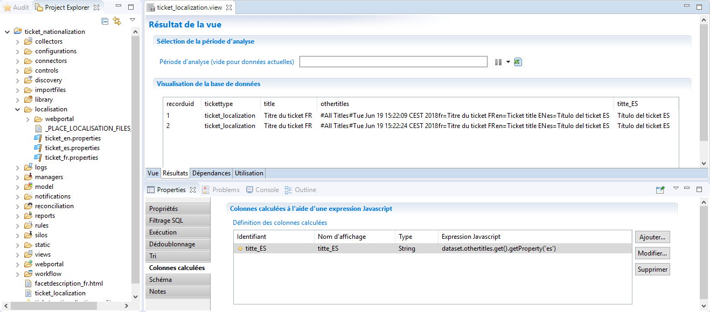

## TicketAction

### TicketAction creation

A ticketAction is linked to a manual activity (an action done in the portal by a user).  
You can activate a ticketAction creation in the "Ticket" tab of any manual activity:

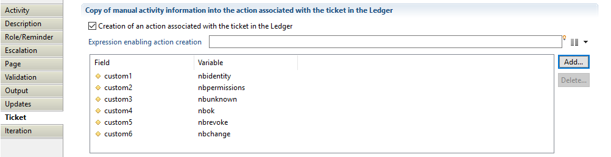  

The fields available for TicketActions are:  

- Action Status: the status of the action
- Action Description: the description of the manual activity (usually the manual activity's displayname)
- Custom attributes (1 to 9)

### TicketAction Identifier

You can retrieve the ticket identifier from the "output" tab in an attribute (of type Number , ticketaction below):

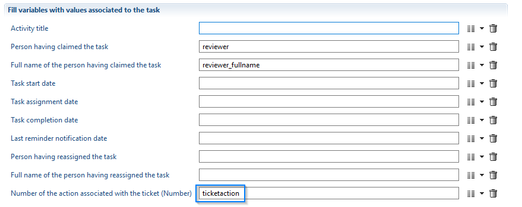

### TicketAction views and links

Since activities are done inside a process instance, you can link activities to their instances in views:  

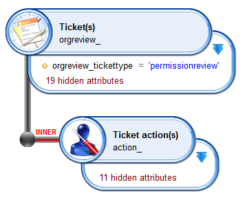

### TicketAction Title nationalization  

All declared nationalization for ticket title are stored in other titles attributes as plain text.  
Example:

```properties
#Wed Mar 21 15:01:09 CET 2018
fr=FR Workflow de test
en=test ticketaction en
es=ES Flujo de trabajo de prueba
```

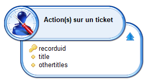  

To get only the title in the desired language you need to call specific method in a javascript expression by adding new computed column.  
Example:  

`dataset.othertitles.get().getProperty('es')`  

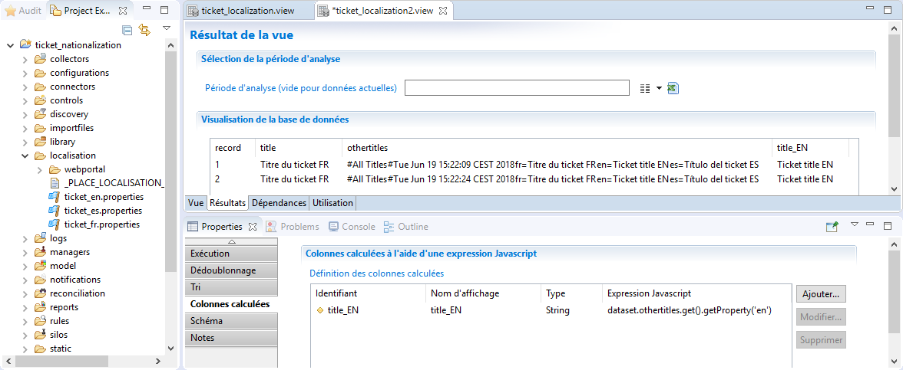  

## TicketReview

### TicketReview creation

A ticketReview is linked to a manual activity (for instance a manager's review of his team's accounts). To create ticketReviews, you have to add the ticketReview component to workflow:  

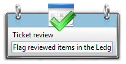  

Open the "Ticket" tab to set the ticket review's attributes:  

- Status: the status of the review ticket (for instance the review status made by the manager: ok, revoke, modify)  
- Comment: the ticket review comment (for instance the review comment made by the manager)  
- Custom attributes (1 to 19)  

> that you have to provide the ticketAction associated to the ticket(s)Review you want to create (that is because there can be more than one manual activity in the workflow definition). It is the ticketAction retrieved earlier:
>
> 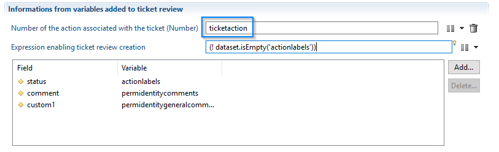  

### Link with objects from the Ledger

TicketActions can be linked to objects from the ledger, this is done in the corresponding tabs:  

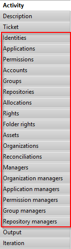  

> you can link objects of one type only. If you fill multiple tabs, the first type only will be linked to your ticketReviews.  

This means that if you want to link to rights an accounts, you will have to use two ticketReview components in the workflow.  

### Automatic iteration

The ticketReview component will automatically iterate on the variables used. This includes variables used for the ticket creation (status, comment and custom attributes) and the variables used to link the ticket to objects in the ledger. Keep this in mind, since it is a common mistake. If you use a mono-valued attribute, only the first ticketReview will get a value.

### Ticket Identifier

You can retrieve the identifiers of the tickets that have been created in a multivalued attribute in the "Output" tab:  

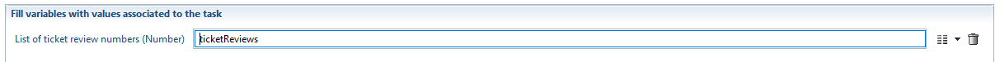  

### Ticket views and links

You can link ticketReviews to their parent ticketAction, and to ledger objects, for instance:  

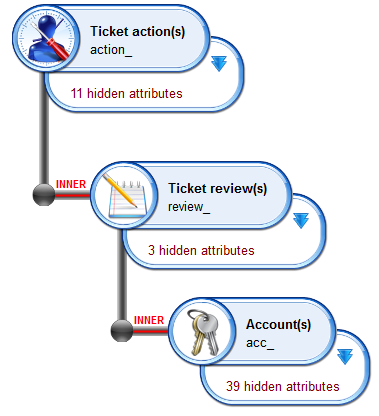  

### Remediation Ticket

When you implement a remediation workflow you should map  **Variable holding parent review tickets**, this mapped variable needs to be:

- Multivalued
- Have the same size as remediation ticket that will be created
- The value contains the ticket review RecordUid

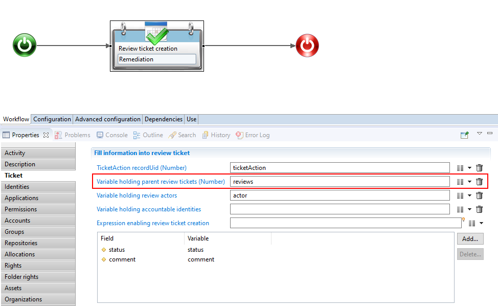

#### Linking between tickets

For each created remediation Ticket, a new TicketLog and TicketAction are created, the TicketLog is linked to the parent ticket review (Variable holding parent review tickets).

The mapped TicketAction is used to get the TicketLog and map the same information to the newly created TicketLog and TicketAction.

> [!warning] No need to create a sub-process or configure an iteration to create N ticket remediation, the ticket review component by default handle multivalued variables.

### Ticket review display name

Is is possible to set manually a display name for a ticket review. If not set product will automatically calculate a display name for you.  

The calculated display name will contain information about reviewed elements

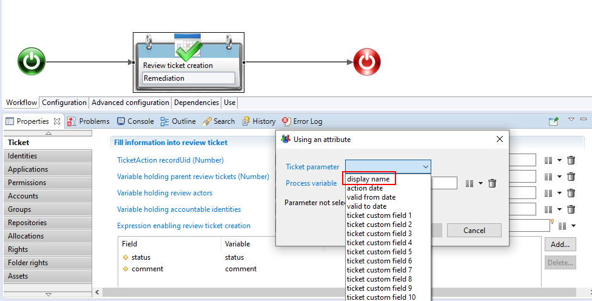

#### Ticket review display name calculation

The following table illustrates how the display name is calculated for each ticket review type:

| Ticket review type                  | Display Name                                                                                                     |
| :---------------------------------- | :--------------------------------------------------------------------------------------------------------------- |
| Identities                          | fullname (hrcode)                                                                                                |
| Applications                        | displayname (code)                                                                                               |
| Permissions                         | displayname (code) / applicationdisplayname                                                                      |
| Accounts                            | login (username) / repositorydisplayname                                                                         |
| Groups                              | displayname (code) / repositorydisplayname                                                                       |
| Repositories                        | displayname (code)                                                                                               |
| Metadata                            | key                                                                                                              |
| Allocations                         | identitydisplayname / jobtitledisplayname / organisationdisplayname                                              |
| Reconciliations (user account)      | accountlogin / identityfullname                                                                                  |
| Reconciliations (technical account) | accountlogin (noownercode)                                                                                       |
| Reconciliations (leaver account)    | accountlogin / identityfullname (leave leavedate)                                                                |
| Assets                              | displayname (code)                                                                                               |
| Organizations                       | displayname (code)                                                                                               |
| Manager (Boss)                      | bossFullname / identityFullname (operational)                                                                    |
| Rights                              | accountlogin (accountusername) / permissiondisplayname (permissioncode) / applicationdisplayname                 |
| Folder rights                       | accountlogin (accountusername) / rightbasic / permissioncode / share                                             |
| Organizations managers              | managerfullname  / organisationdisplayname (expertisedomaindisplayname)                                          |
| Application managers                | managerfullname  / applicationdisplayname (expertisedomaindisplayname)                                           |
| Permissions managers                | managerfullname  / permissiondisplayname (expertisedomaindisplayname)                                            |
| Group managers                      | managerfullname  / groupdisplayname / repositorydisplayname (expertisedomaindisplayname)                         |
| Repository managers                 | managerfullname  / repositorydisplayname (expertisedomaindisplayname)                                            |
| Account group links                 | accountlogin (accountdisplayname) / groupdisplayname (repositorydisplayname)                                     |
| Group links                         | group1displayname - repository1displayname / group2displayname - repository2displayname                          |
| Permission link                     | perm1displayname (perm1code) / perm2displayname (perm2code) / applicationdisplayname                             |
| Raw permission link                 | perm1displayname (perm1code) - application1displayname / prem2 displayname (perm2code) - application2displayname |
| Raw rights                          | accountlogin (accountusername) / permissiondisplayname (permissioncode) / applicationdisplayname                 |
| Right groups                        | groupdisplayname - repositorydisplayname / permissiondisplayname (permissioncode) / applicationdisplayname       |

> [!warning] Ticket limitations and recommendations:
>  
> 1. The max size of ticket review display name is 4000. Exceeding this size the display name will be automatically truncated.
> 2. It is **NOT** recommended to use filters based on ticket review display names in views and rules, it can lead to performance issues.
