# Components

## Start or Manual activity component

A start activity corresponds to a manual activity with a reduced number of configuration parameters. As such these two components can be described together. We will focus on detailing the configuration of the manual activity component first. All parameters and actions are listed in the "properties" tab of the components. These actions are treated sequentially during the process.  

A manual activity is used when it is required that people interact with the process through the iGRC web portal.  
The manual task is made eligible for a candidate (_e.g._ all persons of the support service). Once the candidate has taken the task, the manual task switches to another state and it disappears from the manual task of the other candidates. The task remains in the task list of the person who takes it as long as he has not released it.  

From the iGRC backoffice pallete, drag and drop the "manual activity" component to our existing workflow. Select the manual activity component and click on "properties" to display all the corresponding sub tabs to configure.  

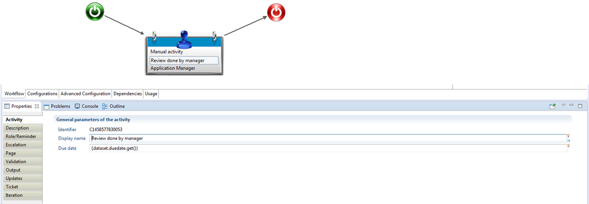

### Activity

The "Activity" sub tab of the manual activity component needs both information the "display name" as well as the task "due date" (see [Difference between task due date and task expiration](./08-time-management#difference-between-task-due-date-and-task-expiration) for more information on the due date).  

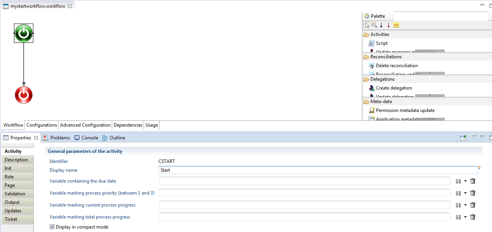  

In the case of the start component the activity tab allows the configuration of the variables related to the task itself and created by user in the configuration tab.  
As presented in the figure above, variables are:  

- the due date
- the process priority
- the current progress
- the total progress.

### Description

The description sub tab allows you to add a textual description to the manual activity.

### Init

This tab is only available for the start component and lists the variables values of the workflow instance can be updated into the "Init" tab.  

  

### Role/Reminder

This tab allows the definition of the candidates being eligible to perform the task through the "Role" item. In other words it nominates through an audit rule, the candidates who have the right to launch the process instance. Once created, such audit rule is linked to the process via its configuration tab, under the "Process roles". Please see the page on [Roles](./03-roles) for more information.  

In this example, this manual task should be performed by application managers.  
It is also possible to configure notifications. More information on how to perform detailed configuration of email notification are available on the following pages on [E-mail notifications](./07-email-notifications) and [Reminders, Escalation and task expiration](./08-time-management#reminders-escalation-and-task-expiration).

### Page

This tab is used to generate or customize (by users) the associated web page of a workflow. A workflow Gui or page interacts with the workflow database and is produced using Pages language (please refer to the corresponding documentation for more information). The web pages allow to dynamically visualize or modify the data in the web portal.  

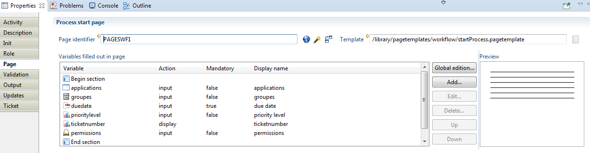  

An existing home page can be used, however there is a possibility to generate a page form. An additional features can be enabled to allow API's for an intuitive edition of the content of the page being generated. Workflow variables are available through pages via "Record Object".  
Example: TaskRecord =\> task = TaskRecord (create "my\_start\_workflow\_launcher"). "task.VariableName" permits to manipulate workflows variables.  

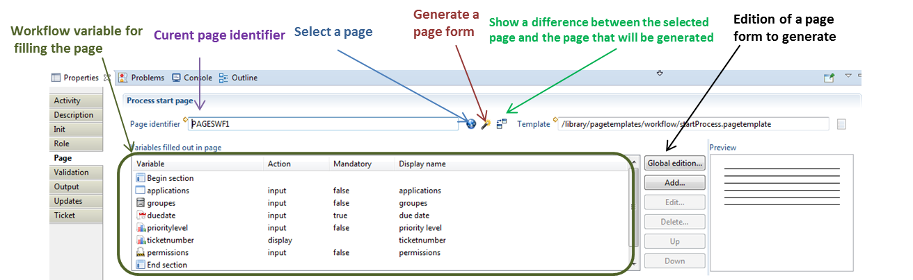  

Under the "page" tab, one should declare the list of the variables that you want to display their values inside the form presented in the web portal. This example below display profiles of the "application A" in order to review them.

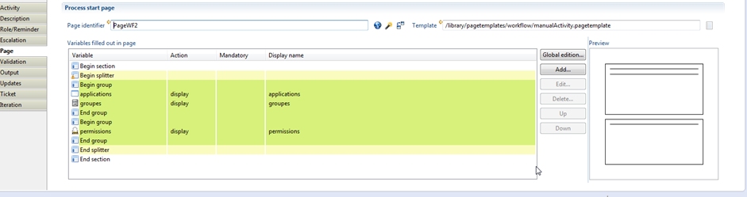  

### Validation

The validation sub-tab offers the capability to use java scripting to validate workflow activity:  

  

### Output

The output sub-tab fills the variables with the values associated to the corresponding task:  

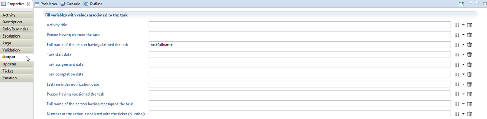  

### Update

The Updates sub-tab is the section from which some tasks can be performed on workflow variables values such as filling variables with the columns of an audit view (ledger data), clean or resize multivalued variables, etc. The full list is provided in the figure below:  

  

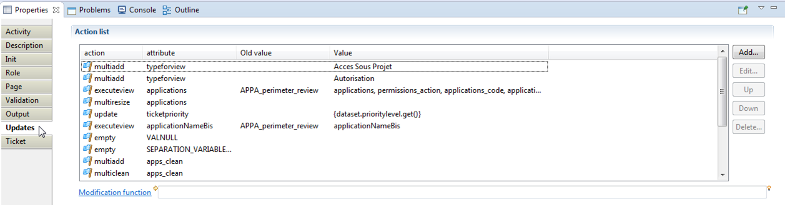  

### Ticketing

The Ticket sub-tab enables a "ticketing" feature through which a workflow instance status can be stored into the ledger. "Ticketing" logs the action performed from the workflow into the ledger. Such feature will help to save the status of the performed actions during the workflow execution while retrieving them later to display to the process owner into a dashboard after the workflow task completion.  

For a given workflow instance, one can associate a ticket (called ticket log). The ticket log is itself associated to a ticket action which itself is associated to a ticket review.  
Ticket review indicates the impacted object in the workflow process and the associated action (_e.g._ the action of deleting /creating an account or revoking/validating a permission associated to a profile).  

  

> a workflow instance references a ticket log and a manual activity reference a ticket action. A ticket log can reference several ticket actions. More information on workflow tickets is available at [Tickets](./10-tickets)

### Iteration

The manual activity configuration ends with the iteration tab which creates multiple instances of the same activity when enabled. The iteration feature only exists within a manual activity component or a sub process call or even under an email notification component.  
For instance if a manual activity references a review of an application profiles, the role is "application manager" and iteration is enabled, the same workflow instance will be created as much as there exists an application to review by manager. Note that, in most cases variables impacted by the iteration should be cleaned or resized inside the Update sub tab.  

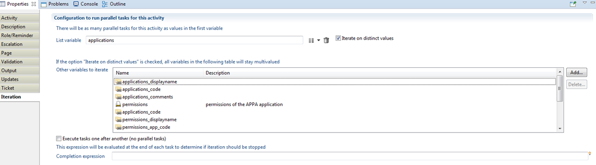

## The End component

The End component indicates the end of the workflow process. This is a mandatory component and is automatically create for each new workflow.  

Its configuration is done in the three sub tabs of the properties tab (see caption below).  
The tabs include:  

- An Activity tab, which includes the display name. You can also chose the display method.
- A Description tab which can only include a description
- An Updates tab to configure which values, if necessary, are to update at the end of the process execution. Please refer to the page on [Start, End and manual activity composants description](#start-or-manual-activity-component) for more information on the update configuration.  


## Timer Component

To poll repeatedly until a certain condition is met you need to define an iteration on the timer activity (see the page on [Itérations](./06-iterations-and-subprocesses) for more information).  

The timer activity has to be set for sequential tasks, with:  

- A main variable the size of the maximum number of tries you wish to perform
- A stopping condition that will indicate when the polling has been successful.  

This will effectively result in the timer task being repeated until either the condition is met or the number of tries has been exhausted. At the end of each task, a scripting function will be called that will perform the necessary actions and, if successful, will set the variables so that the iteration can end. Here is an example of what a process using this could look like:

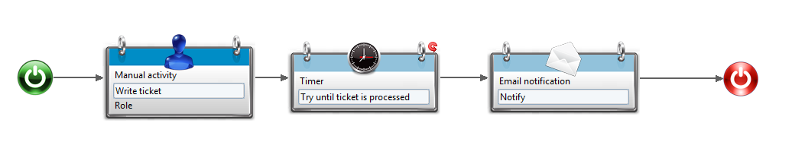  

Of course, it is entirely possible that, instead of a single script function, a whole activity or a group of activities is what needs repeating. In that case, you can use an embedded subprocess (see [Itérations](./06-iterations-and-subprocesses) for more information) which will perform the same iteration on timer and activities both. Here is what it could look like:  

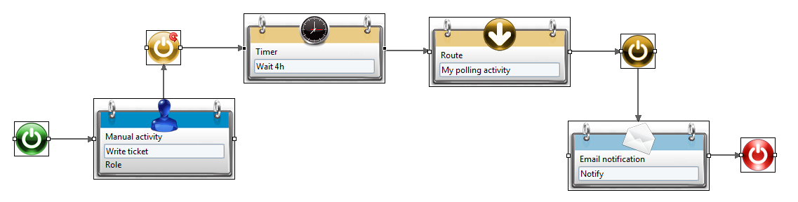  

> that we are not restricted to a fixed period of time between two tries. As the time span can be specified using a macro, we can build any sequence of time intervals that we want.  

A very easy way to do this is by setting a multivalued variable of type Number, with the right sequence of time delays. For example, let's create a variable named _delays_ in which we put the numbers 1,2,4,8,16,32,64,128. We put in the timer activity configuration: Wait {dataset.delays.get()} hours, and we add _delays_ to the variable in the iteration list (it can even be the main iteration variable). This will result in waiting for time intervals that grow twice longer each try, until we either exhaust our choices or succeed in our task.

## Timeslot management

### Context

The Timeslot management activity allows administration of the timeslots life-cycle.  
A timeslot can undergo different operations within a workflow activity:  

- Validate
- Hide/Show
- Rename
- Delete

### Procedure

The Timeslot management component can be added to the workflow through drag and drop in the workflow editor. This component allows you to manage the life-cycle of a timeslot.  

  

to manage the life-cycle of a timeslot.  
The configuration of this activity is:  

  

In this panel:  

- the variable timeslotUid must contain the unique identifier of the timeslot to operate on (it must not be empty and must reference an existing timeslot).  
- the variable action is the action to be performed. Admissible values are:
  - validate: To validate an activated timeslot.
  - hide: To hide in the webportal a validated timeslot. This can be usefull to hide corrupted data from validated timeslots
  - show: To show in the webportal a hidden timeslot
  - rename: to rename the current timeslot
  - delete: To delete an activated or sandbox timeslot
- In the case of a rename action, the last variable will contain the new display name of the timeslot (in which case it must not be empty, its value is ignored for any other action).  

The possible values for the action variable depending on the current status of the timeslot (as well as its new status) is as follows:  

| Status \ action | **validate**  |  **hide**  |       **show**       | **rename** | **delete** |
| :-------------- | :-----------: | :--------: | :------------------: | :--------: | :--------: |
| **Validated**   |               | X (Hidden) |                      |     X      |            |
| **Old**         |               | X (Hidden) |                      |     X      |            |
| **Activated**   | X (Validated) |            |                      |     X      |     X      |
| **Hidden**      |               |            | X (Validated or Old) |     X      |            |
| **Sandbox**     |               |            |                      |     X      |            |

## Application and Permission metadata update

The 'Application metadata update' and 'Permission metadata update' workflow activities allow to change information stored for an application or a permission respectively.  

For an application, metadata can include:  

- A category
- A sensitivity level  
- A reason accounting for the sensibility level
- A description

For a permission, metadata can include:  

- Whether it is flagged as managed or not
- Asensitivity level  
- A reason accounting for the sensibility level
- A description

### Application metadata

The Application metadata update activity allows to update the information stored for an application:  

  

Its configuration is done the the Metadata subtab and is detailed as following:  

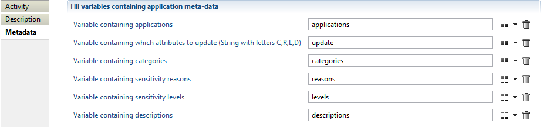

- applications: A multi-valued variable containing the list of applications to update  
- update: The list of fields to update and is any combination of the letters C, R, L and D. Letters can be in any order, lower or upper case
  - C: categories
  - R: sensitivity reasons
  - L: sensitivity levels
  - D: descriptions.
- categories: The variable containing the new categories. It can be multi-valued or not (see below)
- reasons: The variable containing the new sensitivity reasons. It can be multi-valued or not (see below)
- levels: The variable containing the new sensitivity levels. It can be multi-valued or not (see below)
- descriptions: The variable containing the new descriptions. It can be multi-valued or not (see below)  

These variables should be declared as all variables used during workflow in the workflow configuration tab. They should be declared in a similar fashion to the following caption:  

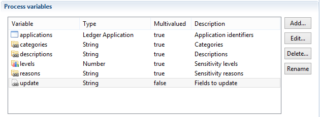  

> The variables categories, reasons, levels and descriptions can either be multi-valued or mono-valued:
>
> - If they are multi-valued, their size should match the size of the applications variable and they can contain values different for each application.
> - If they are mono-valued all the applications referenced in the applications variable will have the same value.
>
> These parameters are independent from one another. As such any combination is admissible. For example categories can be mono-valued whereas the others are multi-valued.  

### Permission metadata

The Permission metadata update activity works in a similar way.  

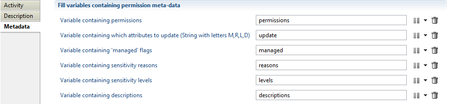  

- permissions: A multi-valued variable containing the list of permissions to update  
- update: The list of fields to update and is any combination of the letters M, R, L and D respectively denoting managed, sensitivity reasons, sensitivity levels and descriptions. Letters can be in any order, lower or upper case
- managed: The variable containing the new flag indicating if the application is managed or not
- reasons: The variable containing the new sensitivity reasons
- levels The variable containing the new sensitivity levels
- descriptions The variable containing the new descriptions  

Their declaration, performed in the configuration tab, should resemble the following caption:  

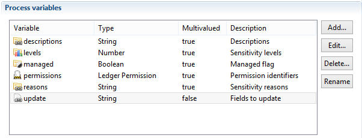

## Reconciliation management activities

There are four workflow activities dedicated to the management of account reconciliations:  

- 'Reconciliation update' activity allows to change the identity reconciled to an account
- 'Delete reconciliation' activity will delete the reconciliation information for an account
- 'Reconciliation of a service account' activity will indicate that the account is reconciled but has no owner
- 'Reconciliation with person who left the company' activity will indicate that the account is reconciled with an identity which is not anymore present in the current timeslot  

These four activities can be found in the workflow palette under the 'Reconciliation' category:

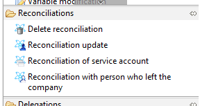

### Reconciliation update activity

This activity is used to set/change the identity reconciled to a given account. Its configuration is:  


**where**:

- account is a variable containing the account to reconcile
- identity is a variable containing the new identity to reconcile to the account
- comment is an optional variable containing a comment to associate to the reconciliation information  

These variables must be declared as in:  

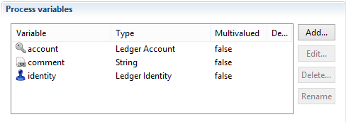

### Delete reconciliation activity

This activity is used to remove all reconciliation information for a given account, whether the account is actually reconciled to an actual identity, is a service account or is reconciled to a a person who left the company.  
Its configuration is:  

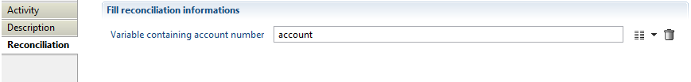  

where account is a variable containing the account whose reconciliation is to be deleted. It must be declared as:  

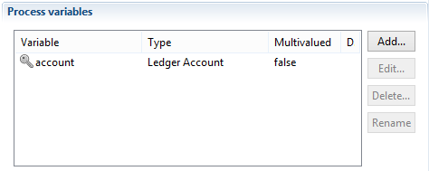  

### Reconciliation of a service account activity

This activity allows to categorize a given account as being a service account, i.e. an account without a proper owner. Its configuration is:  

  

**where**:

- account is a variable containing the service account
- reason is a variable containing the reason why this account does not belong to a proper owner. It can be any value but the 'service' value is recognized by the product's standard reports to flag service accounts
- comment is an optional variable containing a comment to associate to the reconciliation information

The declaration of these variables must be:  

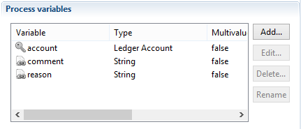  

### Reconciliation with person who left the company activity

This activity is to be used when an account needs to be reconciled to an identity which is not part of the current timeslot. Note that the identity must have been present in the Ledger at some time (in the archived timeslots).  

Its configuration is:  

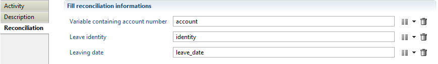  

**where**:  

- account is a variable containing the account to reconcile
- identity is a variable containing the identity who left the company
- leave\_date is the date since which the identity left

The declaration of these variables is:  


## Variable modification and email notification components

This document presents both the " variable modification" and the "email notification" components with their associated configuration. Such two components are described together in this chapter but have completely different meanings. The variable modification component allows the insertion or update of a workflow process variables values during its execution. Instead, the email notification component is used to configure email notifications during the execution or the end of a workflow process.  

### Variable modification component

This component configures the corresponding attributes values which require to be updated depending on the associated workflow process need.  

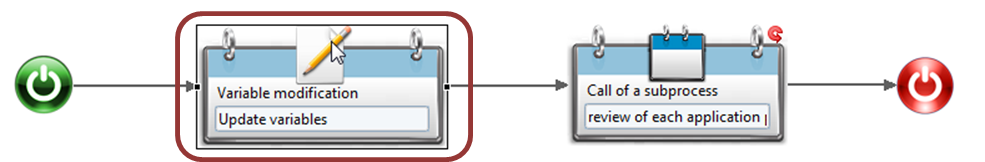  

The variable modification configuration is realised into three sub tab such as "Activity", "Description", "Updates" and available via the "properties" tab.  

The variable modification configuration is carried out into three subs tab including "Activity", "Description", "Updates" available under its "properties" tab.  

#### Variable modification Activity  

The activity component of the variable modification component allows user to define the display name.  

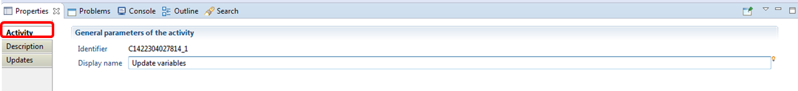  

### Variable modification Description  

As its name indicates, this sub tab is an editable field allowing user to add textual descriptions to the variable modification component.  

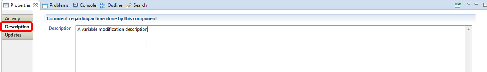  

#### Variable modification vUpdates  

The updates sub-tab allows user to perform if necessary modification on workflow variables values including filling variables with the columns of an audit view (ledger data), clean or resize multivalued variables, etc. The full list is provided in the chapter on the [Start or Manual activity component](#start-or-manual-activity-component). Below is an example of configuration from which a workflow variable named "ticketloguid" is filled with the columns of a view.  

  

### Email notification component

To send emails to workflow actors including synthesis reports, user needs to add and configure email notification component. An example could be sending an email notification at the end of a workflow process (review campaign/access request) including attachment of synthesis reports.  

  

The configuration of an email notification component includes configuring the following sub tabs: "Activity", "Description", "Output" and "Iteration".  

#### Email notification Activity

This tab enables the setting of the component display name as well as the process email. The process email implementation is available under the chapter on [E-mail notifications](./07-email-notifications).  

  

#### Email notification Description

It allows user to add text to describe the component function.  

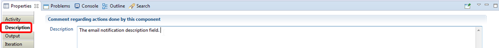  

#### Email notification Output  

Under the output sub tab, user can retrieve from the task associated to the current workflow some information related to emails such as:  

- list of emails for whom: a message was successfully sent/ any message could not be sent,
- list of person without email address.  

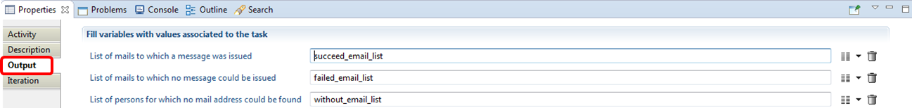  

Note that the "List of persons for which no mail address could be found" item references a Process Actor variable type.  

#### Email notification Iteration  

As detailed in the chapter on [Iterations and subprocesses](./06-iterations-and-subprocesses), the iteration sub tab in this component will permit to configure notifications with the possibility of enabling multiple instances of the same activity based on a multivalued variable.  

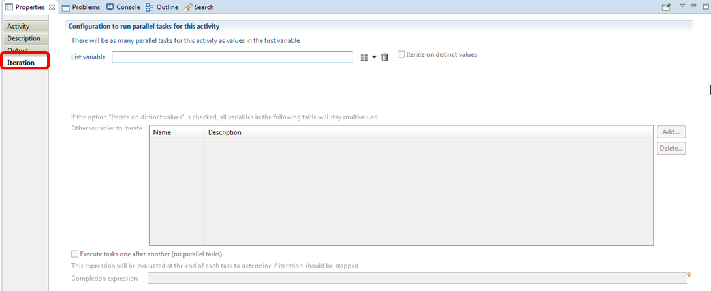

## Handling managers

The 'Update manager information' activity allows to set, change or delete the manager information on one or more entities.  

Entities that may have managers are:  

- Organizations
- Applications
- Permissions
- Accounts
- Groups
- Repositories
- Assets
- Identities  

The 'Update manager information' activity can be used to set (or update or delete) the manager of one or more entities, for example in:  

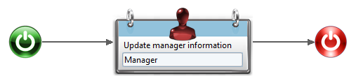  

The first tab of configuration of this activity is:  

  

**Where**:  

- in the top left combo box, you can choose the type of entity you want to update the management information on
- identifiers is a variable containing the entity(ies) timeless identifier. It can be mono or multi-valued (see below)  
- `expertise_domains` is a variable containing the expertise domain code of the manager. It can be mono or multi-valued (see below)
- `managers` is a variable containing the new manager(s) for the entities. It can be mono or multi-valued (see below)
- `comments` is a variable containing the comment of the manager information. It is optional and can be mono or multi-valued (see below)
- `delegation_flags` is a variable indicating whether the manager is a delegated manager or not. It is optional and can be mono or multi-valued (see below)
- `delegation_priorities`, `delegation_begin_dates`, `delegation_end_dates` and `delegation_reasons` are variables containing respectively the priority, begin date, end date and reason of the manager delegation. They are all optional and can be mono or multi-valued (see below)

The second tab of this activity is:  

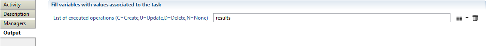  

where results is an optional multi-valued variable which will contains, once the activity has been executed, an entry for each database operation done. Possible values for each entry is:  

- `C` if a manager has been added
- `U` if some information on a manager has been updated
- `D` if the manager information has been deleted
- `N` if no operation was to be done (for example if we tried to add a manager which was already present)

These variables should be declared in a way similar to:  

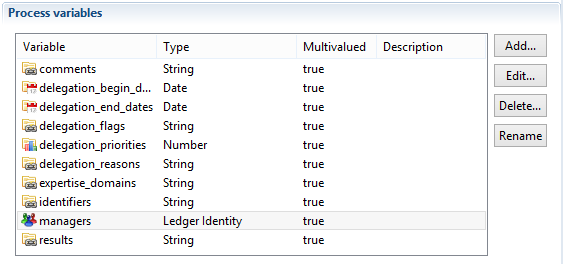  

Note that all these variables can be mono or multi-valued independently from each other. Here are some possible use cases:  

- if they are all mono-valued, only one manager information will be updated (or deleted)
- if `identifiers` is multi-valued and `managers` is mono-valued, the same identity will be manager of all the entities from `identifiers`  
- if `managers` and `expertise_domains` are multi-valued and `identifiers` is mono-valued, multiple managers will be affected to the entity, each with a possibly different expertise domain  
- if `identifiers` and `managers` are both multi-valued, the first entry of `managers` will be the manager of the first entry of `identifiers`, the second entry of `managers` will be the manager of the second entry of `identifiers`, and so on.

### Actions

#### Add managers

To set a new manager or add several managers to the same resource you need to select the Action "_Add managers_"
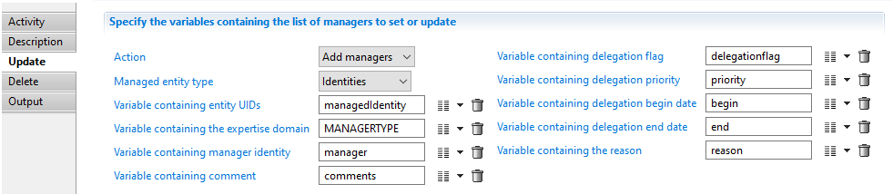  

#### Update managers

To update manager information you need to leave the Action field empty
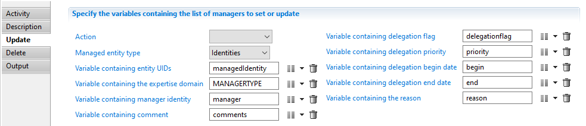  

#### Delete managers

To delete one or several managers link you need to provide the list of managers links RecordUid
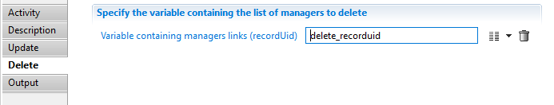  

> [!warning] When deleting managers of identity resource, only direct managers links are allowed to be deleted the indirect links are calculated and updated automatically by the product.

> [!warning] An empty multi-valued variable is not the same thing as a mono-valued variable whose value is the empty string. Furthermore, if, during the activity execution, any of the identifiers, managers or expertise\_domains variable is found to be an empty multi-valued variable, the activity will have no effect at all.

## Workflow compliance reports

A report can be automatically generated when a workflow process ends. For instance, for an account review workflow, the report will display the status of each account once the review is completed.  
This report is available in the task manager in the portal (see the corresponding section below).  
If configured the report is automatically generates whether the processes ended normally and through an explicit termination.  
The report is stored in the audit database ans does not depend on a timeslot. As a result the stored reports are independent of the purge policy. Furthermore it is possible to configure the workflow to keep a copy on the server file system.  

### Workflow configuration

The configuration of the compliance report takes place in the Advanced Configuration tab of the Workflow editor:  

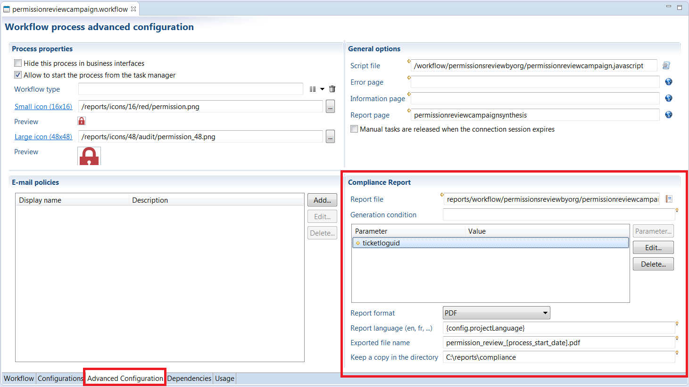  

- The 'Report file' field references the path of the `rptdesign` file (relative to the project top directory),
- The 'Generation condition' field is a Javascript expression conditioning the generation. For example, if the expression is process.isTerminated == false, the report will only be generated if it ends normally,
- The 'Parameters' table allows to specify the parameters to be sent to the report,
- The 'Report format' field is the format of the generated report,
- The 'Report language' field is the language (locale) used to generate the report (if left empty, it will be the locale defined at the project level),
- The 'Exported file name' is the name used by default when downloading the report in the portal as well as the name of the possible file system copy,
- The 'Keep a copy in the directory' field indicates if the report should also be stored on the local file system (if left empty, no local copy will be saved).

In 'Generation condition', 'Exported file name' and 'Keep a copy in directory' fields, you can use these variables:  

- project configuration using the 'config' object
- process instance variables using the 'dataset' object.  
- process instance information using the 'process' object. The 'process' object is useful to get the status, name and other information not available through user variables.  

> The compliance report can only be generated if the ticket log feature is enabled for the workflow.
> In the database, the report is linked to the TicketLog record and the ticket log number is the only way to fetch the report in the page language.

#### Pages configuration

From the portal point of view, two new commands have been added in the page language:  

- HasComplianceReportPredicate(_ticketLogId_) is a predicate returning true if there exists a compliance report associated with the ticket log identifier _ticketLogId_,
- DownloadComplianceReport _ticketLogId_ is an action which downloads a compliance report given the ticket log identifier _ticketLogId_.  

As an example, a double click action in a Table showing a list of completed processes could be  

```page
double-click: BooleanCase using HasComplianceReportPredicate(selected_ticket) in {
            when True then [ DownloadComplianceReport selected_ticket ]
            when False then [ Flash Warning "No compliance report available for this process" ]
        }
```

## Script component

### Javascript

It is possible to include javascript component to a workflow to perform various tasks using the script component. This component allows you to call a javascript function to execute.

### Specific API's

#### addReportInCache

Add a report into the web server cache in order to allow the users to have immediate access:

##### Usage

```javascript
Workflow.addReportInCache(reportName: String [, reportParams: Object] [, timeslot: String]
  [, userId: String] [, userRoles: String] [, locale: String]): String
```

- `reportName`: Project relative filename of the report to generate
- `reportParams`: Report parameters. It is a `java.util.HashMap` with the parameter name as the key and a `java.util.ArrayList` of values (String, Date,...) as the value. This parameter can be omitted if the report does not expect any parameter
- `timeslot`: Timeslot used to generate the report. The current timeslot is used if the parameter is omitted or null
- `userId`: The user UID with which the report must be generated. If this parameter is omitted or null, the report is shared among all users
- `userRoles`: The user roles with which the report must be generated. This parameter must be set if the userId has been given
- `locale`: Language used to generate the report. If this parameter is omitted or null, the report uses the web server language
- `Return value`: A string with the error message or null if the report has been successfully generated

##### Examples

**Standard reports**:  

```javascript
function add_cache() {
 var /* java.util.HashMap */ params = new java.util.HashMap();
 var /* java.util.ArrayList */ recordUid = new java.util.ArrayList();
 recordUid.add(dataset.recorduid.get());
 params.put("recorduid", recordUid);

 /* declared ID */
 workflow.addReportInCache("browsing/identitydetail.rptdesign", params, null, dataset.uid.get(), "user", "fr")
}
```

**Anonymous reports**:  

In the case of anonymous reports, _i.e._ reports whose content does not depend on the user, the configuration of the javascript is slightly different.  
An anonymous report is configured in the report declaration in the page:  

```page
batch_report_anonymous = Report {
 title: "Batch report anonymous"
 report: "/reports/custom/anonymous.rptdesign"
 anonymous: True
}
```

The javascript is as followed:

```javascript
function add_cache_anoymous() {
 var /* java.util.HashMap */ params = new java.util.HashMap();
 /* declared ID */
 /* Anonymous */
 workflow.addReportInCache("/reports/custom/anonymous.rptdesign", params, null, null, null, "fr")
}
```

#### executeView

Execute a view in the ledger on a specified timeslot.  

```js
Workflow.executeView(timeslot: String, viewName: String [, params: Object]): Array
```  

- `timeslot`: A timeslot identifier or null to use the current timeslot
- `viewName`: The name of the view to execute
- `params`: A java.util.HashMap filled with parameters expected by the view
- `Return value`: An array containing the whole result set returned by the view. Each line is a java.util.HashMap containing the column name as key and the column value as value

#### generateReport

Generate a report to a file. Several output format are supported and some parameters can be given to the report.

```javascript
Workflow.generateReport(timeslot: String, rptDesignFile: String [, outputFormat: String]
  [, locale: String] [, outputFile: String] [, params: Object]): String
```

- `timeslot`: A timeslot identifier or null to use the current timeslot
- `rptDesignFile`: The project relative path of the rptdesign file to generate
- `outputFormat`: The output format of the generated report (allowed formats are PDF, ODS, XLS, XLSZIP) or null for PDF
- `locale`: The language used to generate the report (server locale by default)
- `outputFile`: The absolute filename of the generated file or null to let the product generate a temporary file
- `params`: A java.util.HashMap filled with parameters expected by the report
- `Return value`: The absolute filename of the generated file. Always use this returned value even if outputFile parameter has been set

## Anonymize personal data

The 'Anonymization' workflow activities introduced in the product as of version 2017 R3, as it says allows the anonymization of personal data of users managed in product. This feature has been implemented in order to be compliant with the right to be forgotten as defined in the GDPR.  

### Attribute to anonymize

The activity allow to anonymize information stored in identity and owned accounts objects, it is possible to customize what attributes to anonymize through the project configuration.  

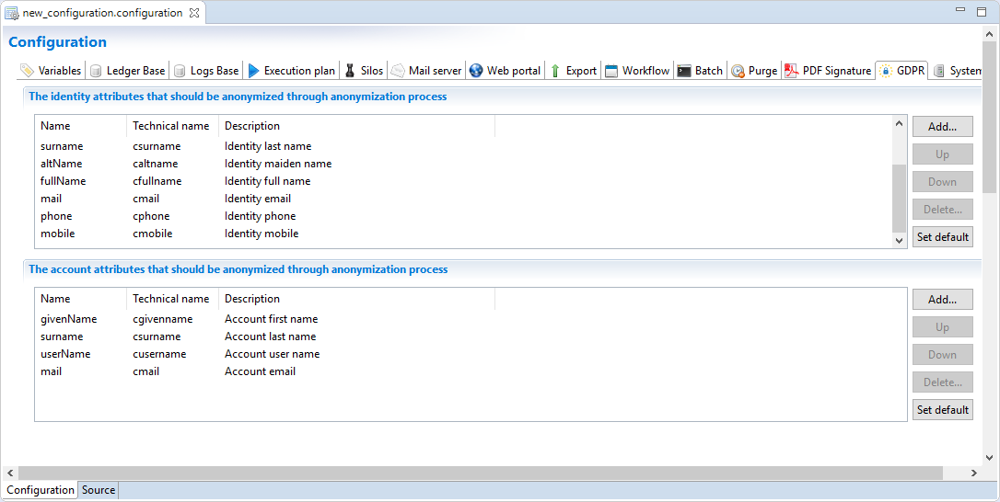  

#### Identity

By clicking on "Set default", default identity attributes will be added to the list, default attributes are: nickName, givenName, middleName, surname, altName, fullName, mail, phone, mobile.

#### Account

By clicking on "Set default", default account attributes will be added to the list, default attributes are: givenName, surname, userName, mail.

#### Additional attributes

In addition to identity and account attributes there are other personal data attributes that will automatically be modified. These include reconciliations, delegations and the Workflow tickets.

### Anonymization component  

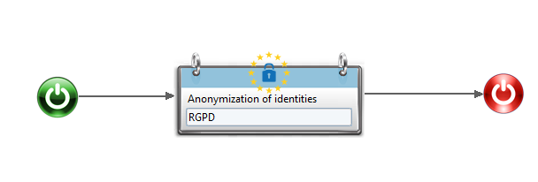  

Anonymization activity requires as an input the variable containing the list of identities(uid) to be anonymized.  
The procedure will modify the personal data of the designated users on all timeslot (Portal and History).  

  

This workflow is available for download in the Marketplace and ready for use with a page that allows to execute the anonymisation from the web portal: [here](https://marketplace.brainwavegrc.com/package/bw_gdpr_anonymisation/)  

By default, you need to have the role igrc\_administrator to access to this page from your admin menu.  

A complete documentation is also available for download attached to this page.
