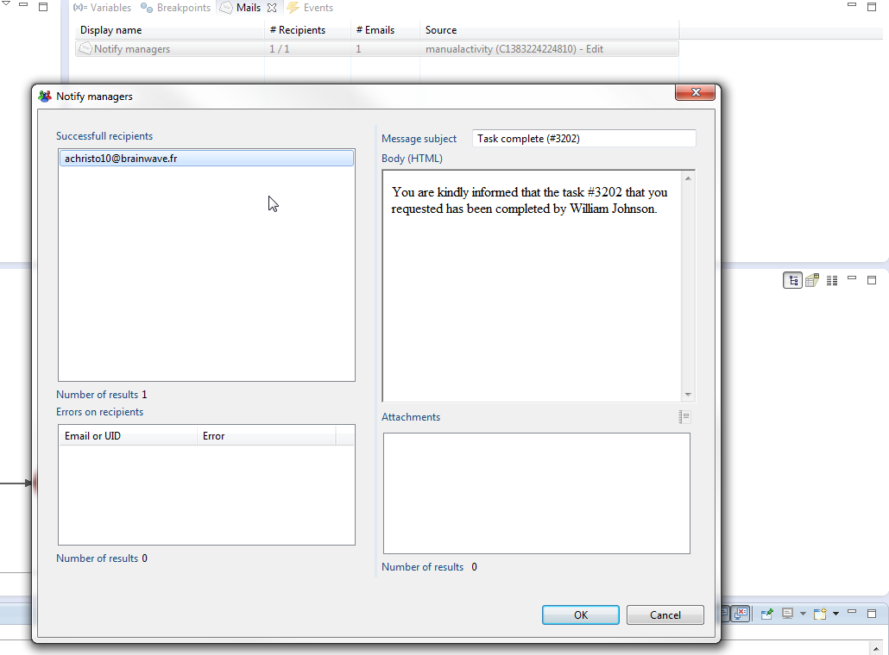
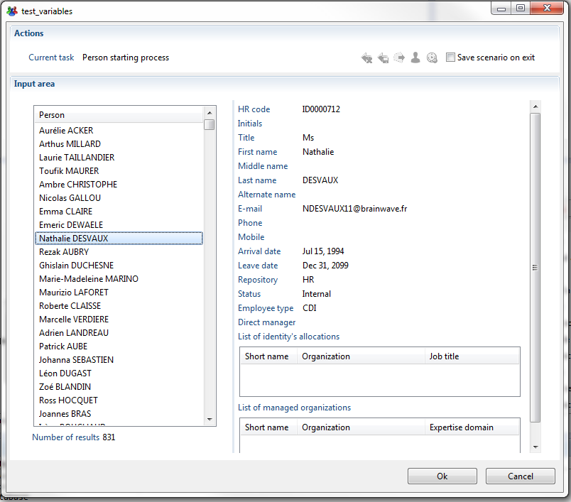
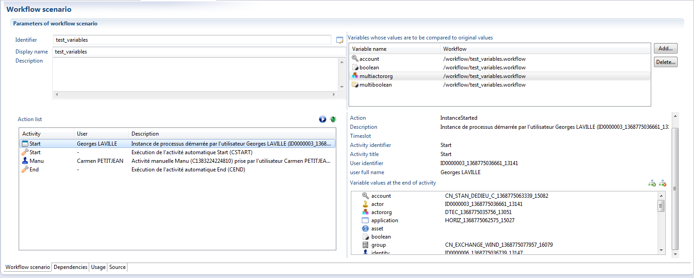
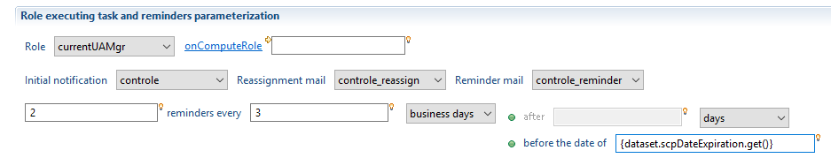

# Debugging

Debugging is an essential step when creating a workflow. The following article will present how to debug your workflow.

Those familiar with the collector debug mode will find themselves quite at ease with the debug mode of the workflow editor (see [Collecte](../collector/index)). As in the collector editor, it is possible to set breakpoints to wait on any given activity, inspect variable values, proceed forward step by step, etc. The workflow debugger, however, has been enriched with two major additions:  

- E-Mails view
- A main debug dialog.

## The Mails view

The workflow debugger provides an additional view that displays the notifications that have been sent during the process. This is only a simulation, as no notification are actually sent during debug.  



The e-mail view can be found in the debug perspective, alongside the Variables view. If for some reason it is no   t displayed in your interface, you can add it by selecting it in Eclipse menus, following the path:

Window \> Show view \> Other.  

Not only can you see how many emails have been sent for every activity of the process, but you can have a detailed list of the recipients, the errors (unfound recipients for example) and even a preview of the mail sent to any given recipient, with attachments.  

## The main debugging dialog

The first thing you will notice when launching a process in debug mode is the dialog that will immediately pop up and stay opened until the process is finished. This is in some way the 'command center' of the process, where you will be able to choose from available tasks, claim them as a selected candidate, fill variables as if you were in a page and perform various actions that will determine the path of execution.  

  

The debugging dialog is very straightforward to use, with an input area that will contain either the list of candidates to the next available task or the variables to be filled. At the top of the window, the Actions section displays the current task and a toolbar that will highlight the actions that can be performed at a given time. Those actions are:  

- unclaim task (e.g. release it without completing it, making it available to other candidates again)
- unclaim task but save variables (same as above, but the variables you have changed will be saved, so that other candidates will start over from where you left off)
- send a reminder notification. This helps you simulate timed notifications, as no timers will be set in debug mode. If the task has escalated, the escalation reminder will be sent.
- force task to escalate. This will put the task in escalation mode, exactly as if the escalation timer had expired
- set the task to expire, as if the expiration timer had gone off. This will make the process branch on expiration links (those with red color)  

The checkbox to 'save scenario on exit' is always available during debug.

## Scenarios

When debugging a process, you might have to input the same variable values or make the process take the same paths over and over.  
It would really be helpful if the process could step automatically up to a certain point, and then let you guide the rest of the execution.
It might also be very beneficial if you could store the whole debug session, with variable values, events that have occurred, etc, so that you can replay them at a later time to test the validity of certain paths even after the process definition has evolved.

Scenarios are project files where a debug session has been recorded, meaning the tasks that have been performed in order, the persons that claimed the tasks, the variables that have been input or computed at each step of execution and the events that have occurred (like an escalation or a task unclaimed by a user). The scenarios are automatically written at the end of the process if the option 'save scenario on exit' has been selected in the main debug window during the process execution. A new .scenario file in the /scenarios folder will then be created.  

This file type has its own editor where it can be reviewed and replayed at leisure. Here is what it looks like:  

  

The 'Action list' on the left side contains the list of all activities and events that have occurred during our debug session. The panel on the right side provides additional details about the selected activity, including the values of all the process variables at the end of the activity.  

There are two different modes in which the scenario can be replayed:  

- The first one will replay the scenario automatically, without prompting you for input. This mode is especially useful if you wish to quickly assert that your process still has the same behaviour regarding the paths of execution taken and the computed variables. In the top right table, you can select a subset of variables that will be tested in the new execution against their previous value. If the values does not match, the execution will stop with an error. Please bear in mind that there is no point in testing certain variables, for instance the dates when tasks are claimed (as they are bound to change from execution to execution), or the number of a ticket created by the process (which will depend on how many tickets are already present in the database).
- The second mode will display all the forms like in normal debug mode, but here the variable values are already filled (only waiting to be validated or changed), the next candidate selected and the next actions highlighted. This mode allows you to replay the process in interactive mode, enabling you to quickly proceed to the next step, but also to branch away from your previous choices at anytime. It is entirely possible to test variables in this mode as well, with the execution stopping as soon as some values differ.  

In both modes, if the scenario reaches a point where there are still active tasks to be performed which have not been previously recorded, it will automatically switch to interactive mode and open a debug window allowing to continue the process (you can even save this new session as a new scenario). It is thus possible to record a scenario up to a certain point, then terminate the process using the cancel button, and then to replay it in automatic mode to skip all the previous activities and begin where you left off.  

### Known limitations

Scenarios are dependent on the data present in the database (from the iGRC stand point) at the time of the creation of the scenario. As such, if a workflow debugging scenario was created and that the corresponding database was deleted then it will no longer be functional.


## Common errors

### duedate is null

If you have the previous error, you probably have a reminder set in the past. This means that the settings for reminders require more time than the actual task deadline allows. The above error "duedate is null" however might not be linked to the task where the reminder settings are incorrect. It is possible that the error concerns the previous task. The trick is then rather to look for the next task; that is the one that failed to be created (its reminders caused the error).

  

In the example above, scpDateExpiration needs to be at least 6 days away (two time three), otherwise the reminder system will fail.  

See: [Time management](./08-time-management.md) for detailed information on reminders.  

### String or binary date would be truncated

If you have the following error:  

```log
### Error updating database.  Cause: com.microsoft.sqlserver.jdbc. SQLServerException:
String or binary data would be truncated.
### The error may involve org.activiti.engine.impl.persistence.entity.VariableInstanceEntity.insertVariableInstance-Inline
### The error occurred while setting parameters
### SQL: insert into ACT_RU_VARIABLE (ID_, REV_,     TYPE_, NAME_, PROC_INST_ID_, EXECUTION_ID_,
  TASK_ID_, BYTEARRAY_ID_,     DOUBLE_, LONG_ , TEXT_, TEXT2_)  
values (     ?,     1,     ?,     ?,     ?,     ?,     ?,     ?,     ?,     ?,     ?,     ?     )
### Cause: com.microsoft.sqlserver.jdbc.SQLServerException: String or binary data would be truncated.
...
```

It is because one of the variables used in your process is too big to be stored in the activiti database (it is not truncated by default, and cannot be).  

To avoid this error please check the lengths of attributes used in Process Names, Task Names, etc. Please also verify that you are not using a multivalued attribute in one of these, as it could contain a long list, which once converted as string is too long.  

> **Beware**: Once this error occurs, you will, most likely, have to delete the activiti database to start over (modified workflows are not anymore taken into account).  

### Empty process list in the task manager

If you find yourself with an empty list in the task manager, you can probably find the following error in the log files:  

```log
[com.brainwave.portal.ui.handler.pages.utils.TreeDataModel1V] - Error building tree set
java.lang.NullPointerException ...
```

This can be caused by having one of the following values empty in your workflow:  

- progressCurrent
- progressTotal

Please check that you set a value, or set a default value for both variables in your workflow definition.  
For sub-processes, use the update tab of the start element to set a default value to these variables (defaults are not applied for sub-processes values).

### Prepared or callable statement has more than 2000 parameter markers

When using Microsoft's SQL server there is a limit to the number of parameters passed to a view. This results in the following error:  

```log
2016-04-11 18:47:47,699 ERROR [Workflow] - #Error: Une exception est survenue
dans l'appel WorkflowManager.listProcessInstances(ProcessFilter(status equals 1,dataset.test equals TEST))
org.apache.ibatis.exceptions.PersistenceException:
### Error querying database.  Cause: java.sql.SQLException: Prepared or callable statement
has more than 2000 parameter markers.
### The error may exist in org/activiti/db/mapping/entity/Execution.xml
### The error may involve org.activiti.engine.impl.persistence.entity.ExecutionEntity.selectProcessInstanceByQueryCriteria
### The error occurred while executing a query
### SQL: SELECT SUB.* FROM (     ...
### Cause: java.sql.SQLException: Prepared or callable statement has more than 2000 parameter markers.
  at org.apache.ibatis.exceptions.ExceptionFactory.wrapException(ExceptionFactory.java:23)
  at org.apache.ibatis.session.defaults.DefaultSqlSession.selectList(DefaultSqlSession.java:107)
  at org.apache.ibatis.session.defaults.DefaultSqlSession.selectList(DefaultSqlSession.java:98)
  at org.activiti.engine.impl.db.DbSqlSession.selectListWithRawParameter(DbSqlSession.java:423)
  at org.activiti.engine.impl.db.DbSqlSession.selectList(DbSqlSession.java:414)
  at org.activiti.engine.impl.persistence.entity.ExecutionEntityManager.findProcessInstanceByQueryCriteria(ExecutionEntityManager.java:113)
  at org.activiti.engine.impl.ProcessInstanceQueryImpl.executeList(ProcessInstanceQueryImpl.java:485)
  at org.activiti.engine.impl.AbstractQuery.execute(AbstractQuery.java:158)
  at org.activiti.engine.impl.interceptor.CommandInvoker.execute(CommandInvoker.java:24)
  at org.activiti.engine.impl.interceptor.CommandContextInterceptor.execute(CommandContextInterceptor.java:57)
  at org.activiti.engine.impl.interceptor.LogInterceptor.execute(LogInterceptor.java:31)
  at org.activiti.engine.impl.cfg.CommandExecutorImpl.execute(CommandExecutorImpl.java:40)
  at org.activiti.engine.impl.cfg.CommandExecutorImpl.execute(CommandExecutorImpl.java:35)
  at org.activiti.engine.impl.AbstractQuery.list(AbstractQuery.java:132)
  at com.brainwave.iaudit.workflow.runtime.engine.WorkflowProcessFilter.executeQuery(WorkflowProcessFilter.java:248)
  at com.brainwave.iaudit.workflow.runtime.engine.WorkflowProcessFilter.executeQuery(WorkflowProcessFilter.java:149)
  at com.brainwave.iaudit.workflow.runtime.WorkflowManager.listProcessInstances(WorkflowManager.java:1516)
  at com.brainwave.iaudit.workflow.runtime.WorkflowManager.listProcessInstancesWithVariables(WorkflowManager.java:1475)
  at com.brainwave.portal.ui.handler.pages.extensions.DataExtensions.fetchUnfilteredDataSet(DataExtensions.java:1701)
  at com.brainwave.portal.ui.handler.pages.extensions.DataExtensions.fetchDataSetInternal(DataExtensions.java:403)
  at com.brainwave.portal.ui.handler.pages.extensions.DataExtensions.fetchDataSet(DataExtensions.java:321)
  at com.brainwave.portal.ui.handler.pages.extensions.DataExtensions$13.apply(DataExtensions.java:1261)
  at com.brainwave.portal.ui.handler.pages.extensions.DataExtensions$13.apply(DataExtensions.java:1)
  at org.eclipse.xtext.xbase.lib.IterableExtensions.forEach(IterableExtensions.java:399)
  at com.brainwave.portal.utils.tools.IterableExtensions.each(IterableExtensions.java:92)
  at com.brainwave.portal.ui.handler.pages.extensions.DataExtensions.fetchUnfilteredDataSet(DataExtensions.java:1315)
  at com.brainwave.portal.ui.handler.pages.extensions.DataExtensions.fetchDataSetInternal(DataExtensions.java:403)
  at com.brainwave.portal.ui.handler.pages.extensions.DataExtensions.fetchDataSet(DataExtensions.java:335)
  at com.brainwave.portal.ui.handler.pages.utils.GridDataBatch.updateRows(GridDataBatch.java:94)
  at com.brainwave.portal.ui.handler.pages.utils.GridDataBatch.init(GridDataBatch.java:69)
  at com.brainwave.portal.ui.handler.pages.rendering.SelectionWidgetsRenderer.buildBatch(SelectionWidgetsRenderer.java:6339)
  at com.brainwave.portal.ui.handler.pages.rendering.SelectionWidgetsRenderer.access$16(SelectionWidgetsRenderer.java:6337)
  at com.brainwave.portal.ui.handler.pages.rendering.SelectionWidgetsRenderer$26.apply(SelectionWidgetsRenderer.java:1641)
  at com.brainwave.portal.ui.handler.pages.rendering.SelectionWidgetsRenderer$26.apply(SelectionWidgetsRenderer.java:1)
  at com.brainwave.portal.ui.handler.pages.utils.XJob.run(XJob.java:69)
  at org.eclipse.core.internal.jobs.Worker.run(Worker.java:54)
Caused by: java.sql.SQLException: Prepared or callable statement has more than 2000 parameter markers.
  at net.sourceforge.jtds.jdbc.SQLParser.parse(SQLParser.java:1139)
  at net.sourceforge.jtds.jdbc.SQLParser.parse(SQLParser.java:156)
  at net.sourceforge.jtds.jdbc.JtdsPreparedStatement.<init>(JtdsPreparedStatement.java:98)
  at net.sourceforge.jtds.jdbc.ConnectionJDBC2.prepareStatement(ConnectionJDBC2.java:2445)
  at net.sourceforge.jtds.jdbc.ConnectionJDBC2.prepareStatement(ConnectionJDBC2.java:2403)
  at sun.reflect.GeneratedMethodAccessor33.invoke(Unknown Source)
  at sun.reflect.DelegatingMethodAccessorImpl.invoke(Unknown Source)
  at java.lang.reflect.Method.invoke(Unknown Source)
  at org.apache.ibatis.datasource.pooled.PooledConnection.invoke(PooledConnection.java:245)
  at com.sun.proxy.$Proxy53.prepareStatement(Unknown Source)
  at org.apache.ibatis.executor.statement.PreparedStatementHandler.instantiateStatement(PreparedStatementHandler.java:72)
  at org.apache.ibatis.executor.statement.BaseStatementHandler.prepare(BaseStatementHandler.java:82)
  at org.apache.ibatis.executor.statement.RoutingStatementHandler.prepare(RoutingStatementHandler.java:54)
  at org.apache.ibatis.executor.SimpleExecutor.prepareStatement(SimpleExecutor.java:70)
  at org.apache.ibatis.executor.SimpleExecutor.doQuery(SimpleExecutor.java:56)
  at org.apache.ibatis.executor.BaseExecutor.queryFromDatabase(BaseExecutor.java:259)
  at org.apache.ibatis.executor.BaseExecutor.query(BaseExecutor.java:132)
  at org.apache.ibatis.executor.CachingExecutor.query(CachingExecutor.java:105)
  at org.apache.ibatis.executor.CachingExecutor.query(CachingExecutor.java:81)
  at org.apache.ibatis.session.defaults.DefaultSqlSession.selectList(DefaultSqlSession.java:104)
  ... 34 more
```

If you come across this error you have to modify the structure of your workflow so that the number of parameters passed to a view is systematically less than 2000.

### Only language locales are supported

Sample `igrcportal.log` file:

```log
2020-04-29 15:35:15,225 INFO [com.brainwave.portal.ui.handler.pages.internal.PagesRegistry] - Loading page file custom/workflows/nls.page
2020-04-29 15:35:15,226 ERROR [com.brainwave.portal.ui.handler.pages.internal.PagesRegistry] - Only language locales are supported: search
2020-04-29 15:35:15,226 ERROR [com.brainwave.portal.ui.handler.pages.internal.PagesRegistry] - Only language locales are supported: recherche
```

There is an issue with some NLS definition in the pages.  
The errors above are cause by the following NLS entries:  

```page
myNLS = NLS [
  search.message [en "Check the "search" option to show results" fr "Cocher l'option "recherche" pour afficher les résultats"]
]
```

Since the string separators are incorrect, `search` and `recherche` are seen as ISO country codes (instead of `en` and `fr`).  
A fix would be to use other separators inside the strings:

```page
myNLS = NLS [
  search.message [en "Check the 'search' option to show results" fr "Cocher l'option 'recherche' pour afficher les résultats"]
]
```
