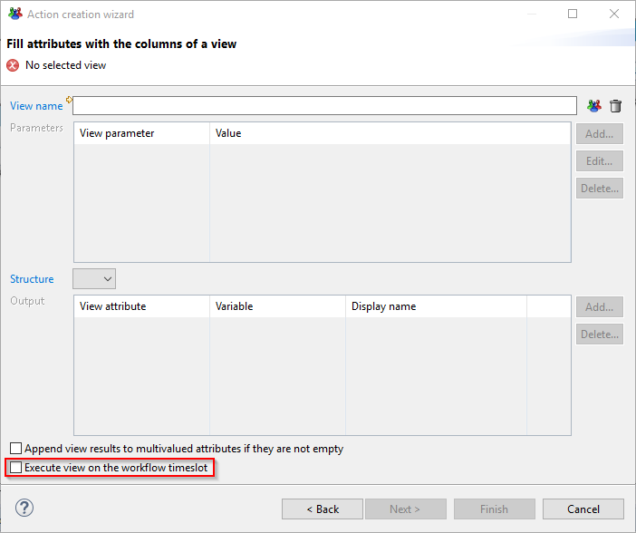

# Workflows and timeslots

As of version 2017 R3, a workflow process can not be launched on a sandbox or on an activated timeslot. The workflow process is based either on the current timeslot or an archived timeslot.  
Even if the process is started on the current timeslot, several data loading may occur over the time spent executing the process. As an example, some processes can last for several months.  
As a result, the question is: when operation performed during a workflow are executed, what is the used timeslot ?  
Is it:  

- the **workflow** timeslot (the timeslot used to start the workflow but probably not the current one) ?
- the **current** timeslot (a recently loaded timeslot) ?

## Actor versus Identity

The timeslot selection question is relevant for each rule, view or page called in the context of a worflow process.  
There is already a clear distinction for identities in the workflow editor: One can declare a variable containing identities using 2 ways:  

- Ledger Identity
- Process Actor

Technically, both variables consist of a list of identity UIDs. The difference between them is that actors are identities of the "real world" who can log onto the Portal to interact with the process. On the other end, Ledger identities are identities that are to be reviewed in the process.  
**Process Actors** are taken from the **current** timeslot because when we send an email to the process actors, we need the up to date information on this type of identity.  
**Ledger Identities** are taken from the **workflow** timeslot because we consider identities as data being reviewed. If the workflow is reviewing an old timeslot, the identities are taken from this timeslot  

## Workflow features

Let's examine all workflow features to understand which timeslot is used.  

### Roles

Roles are used to compute the list of candidates in the Workflow. They are defined using a rule returning identities. These identities correspond to workflow actors.  
The role is always executed on the **current** timeslot to get the most recent list of users. Workflow timeslot can not be used because we could select old identities with outdated information or no longer a part of the company.

### Emails and Task page  

The notification emails often contain a link that allows the workflow actor to take the task. When clicking on a the link, the corresponding page is opened in the Web Portal. This page uses the **workflow** timeslot to display data  consistent with the reviewed timeslot.  
When the user logs on the portal and select a task in his task list, the task page is displayed. Again, all data displayed in the page belong to the **workflow** timeslot.  

### Views in Updates tab  

In the update tab of several components, one can add the execution of a view to fill variable from a view result.  
This action takes the data from the **current** timeslot.  

However, as of version 2017 R3, an option has been added in this dialog box to be able to execute the view on the workflow timeslot as shown below:  

  

> This option is not selected by default. You should select it if the data you are reading are data to review and not actors. All data to review should be taken from the workflow timeslot.|

## Scripting

All the APIs accepting a timeslot as a first argument have the same behaviour: if the timeslot is null, the **current** timeslot is used.  
The following workflow APIs share this behaviour:

```js
workflow.executeView(timeslot, viewName, params)
  workflow.executeProcess(timeslot, processDefinitionId, parentProcessId,
   parentTicketLog, variables, identityUid, identityFullname)
  workflow.executeMetadata(timeslot, values)
  workflow.writeControlResults(timeslot, controlId)
  workflow.generateReport(timeslot, rptDesignFile, outputFormat, locale, outputFile, params)
```

The following APIs always work on the **current** timeslot:  

```js
workflow.executeMail(mailId, errors, uidNoMails)
workflow.executeRole(roleName)
```

### workflow.timeslot

In order to call a workflow API on the workflow timeslot, a new property has been added in the workflow object:  

`workflow.timeslot`  

For example, to execute a view on the workflow timeslot, we could write the following lines:  

```js
function getIdentityInformation() {
        var /*java.util.Map*/ params = new java.util.HashMap();
        var /*String*/ wfTimeslot = workflow.timeslot;
        var /*Array*/ result = workflow.executeView(wfTimeslot, "br_identity", params);
        return result;
    }
```
