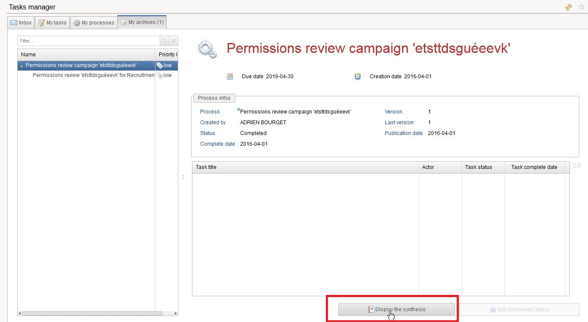

# Table of contents
{: .no_toc .text-delta }

1. TOC
{:toc}
---

# Context  

A report can be automatically generated when a workflow process ends. For instance, for an account review workflow, the report will display the status of each account once the review is completed.  
This report is available in the task manager in the portal (see the corresponding section below).  
If configured the report is automatically generates whether the processes ended normally and through an explicit termination.   
The report is stored in the audit database ans does not depend on a timeslot. As a result the stored reports are independent of the purge policy. Furthermore it is possible to configure the workflow to keep a copy on the server file system.   

# Prerequisites

## Compatibility matrix  

| 2015 |  |  |  | 2016 |  |  |
|  :---:  | :---:  | :---:  |  :---:  |  :---:  |  :---:  |  :---:  |
| R1  | R2  | R3  | R4 | R1 | R2 | R3 |
||||| **X**  | **X**  | **X**  |

The possibility to generate a compliance report was added as of version **2016 R1**.  

# Procedure

## Workflow configuration

The configuration of the compliance report takes place in the Advanced Configuration tab of the Workflow editor:     

         

- The 'Report file' field references the path of the `rptdesign` file (relative to the project top directory),
- The 'Generation condition' field is a Javascript expression conditioning the generation. For example, if the expression is process.isTerminated == false, the report will only be generated if it ends normally,
- The 'Parameters' table allows to specify the parameters to be sent to the report,
- The 'Report format' field is the format of the generated report,
- The 'Report language' field is the language (locale) used to generate the report (if left empty, it will be the locale defined at the project level),
- The 'Exported file name' is the name used by default when downloading the report in the portal as well as the name of the possible file system copy,
- The 'Keep a copy in the directory' field indicates if the report should also be stored on the local file system (if left empty, no local copy will be saved).

In 'Generation condition', 'Exported file name' and 'Keep a copy in directory' fields, you can use these variables:    

- project configuration using the 'config' object
- process instance variables using the 'dataset' object.  
- process instance information using the 'process' object. The 'process' object is useful to get the status, name and other information not available through user variables.  

| **Note**: <br><br> The compliance report can only be generated if the ticket log feature is enabled for the workflow.<br>In the database, the report is linked to the TicketLog record and the ticket log number is the only way to fetch the report in the page language.|

## Pages configuration

From the portal point of view, two new commands have been added in the page language:     

- HasComplianceReportPredicate(_ticketLogId_) is a predicate returning true if there exists a compliance report associated with the ticket log identifier _ticketLogId_,
- DownloadComplianceReport _ticketLogId_ is an action which downloads a compliance report given the ticket log identifier _ticketLogId_.  

As an example, a double click action in a Table showing a list of completed processes could be    

```
double-click: BooleanCase using HasComplianceReportPredicate(selected_ticket) in {
            when True then [ DownloadComplianceReport selected_ticket ]
            when False then [ Flash Warning "No compliance report available for this process" ]
        }
```

## Task Manager Add-on  

The task-manager add-on ([https://marketplace.brainwavegrc.com/package/bw\_task\_manager/](https://marketplace.brainwavegrc.com/package/bw_task_manager/)) has been updated to allow easy visualization of the compliance report:  

         
