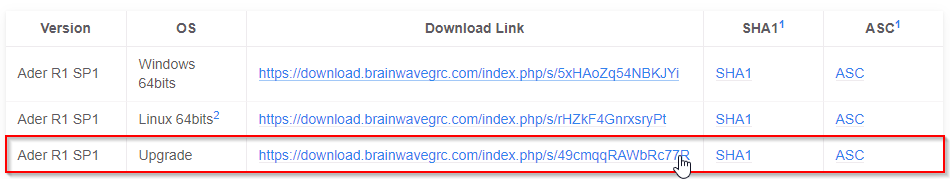
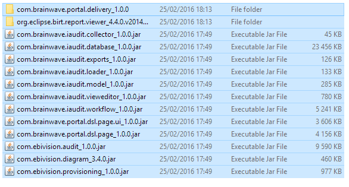
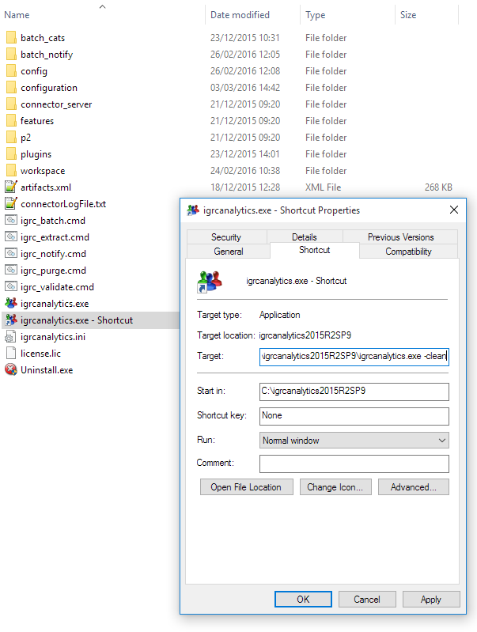
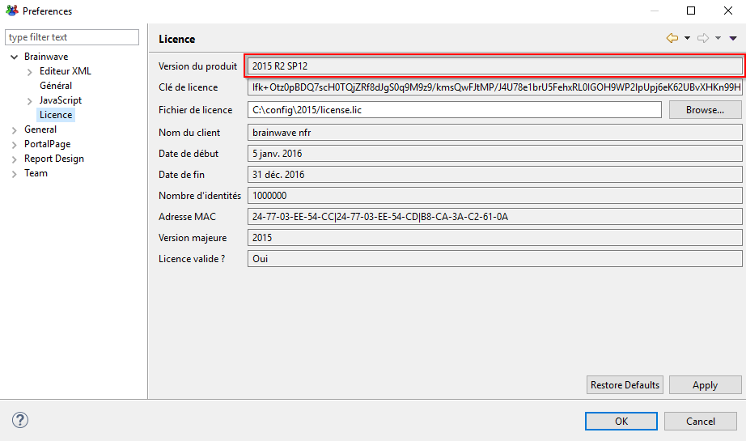

# How-to Upgrade iGRC Analytics

In this article we explain how to upgrade your current iGRC Analytics binaries.  
Two methodologies are available.

> 1. The service pack (SP) upgrade of the solution within the same minor release (R version). For example: upgrade from `Ader R1 SP4` to `Ader R1 SP6`
> 2. The minor or major release (R) upgrade of the solution. For example: upgrade from `Braille` to `Curie` or from `Curie R1` to `Curie R3`. This methodology is detailed [here](./02-project-migration.md)  

The impact of each methodology is very different and as such should be treated differently.  
Please be aware that the second methodology implies an update of the database schema. As such it is **imperative** to perform backups of the ledger and workflow databases before hand.

> [!warning] The following article details the technical upgrade of the solution where no modifications are applied to the project.  
> In order to make the most of the product updates it necessary to update the project accordingly

## Procedure

### SP upgrade

As a reminder this methodology is to be use **ONLY** in the case of an upgrade within the same minor release of the solution.
As an example this method can be used to upgrade the product from the version `Ader R1 SP2` to `Ader R1 SP5`.  
It only works for a Service Pack update: `SPx` to `SPy`.  
The version (`Ader`, `Braille`, `Curie`, etc.) AND the Release number (`R1`, `R2`, etc.) must be identical: `Version Rn SPx` to `Version Rn SPy`.  

#### Download the Upgrade

Navigate to the [Download](../downloads/01-downloads.md) page of this site and download the Upgrade zip file:

#### Backup the plugins directory

In the home installation directory of the product, in the folder where iGRC Analytics is installed (usually `C:\igrcanalytics`), backup the `plugins` directory.  
To do, the simplest method is to create an archive of the plugins folder, in the following example the application 7zip is used to do so:  

> [!warning] The studio should be closed before performing the upgrade and all automatic tasks (batch executions among others) should also be paused.

#### Upgrade the plugins folder

Select the content of the previously downloaded upgrade folder and paste it into the plugins directory of your installation (usually `C:\igrcanalytics\plugins\`):  

It is necessary to replace the existing files of the plugins folder.  

#### Restart iGRC Analytics

To start the upgraded version of the product it is necessary to rebuild the plugins catalogue, making sure that the up to date plugins are used when starting the product. To do so create, a shortcut to the `igrcanalytics.exe` file in the home installation of the product and edit the properties of the newly created file. In the Target field, add the  `-clean` option:  

The use of the `-clean` option is only required once after updating the content of your plugin folder.  

#### Verification

To check that the upgrade went well, you can check either the release notes:  

Or the actual version of the product in `Window > Preference > Brainwave > License`:

## Web portal upgrade

To upgrade the webportal, it is necessary to export and deploy the WAR once the upgrade of the studio is finished.  
This is operation **must** be performed whether a SP upgrade was performed or if the product was re-installed.  

The documentation detailing the configuration and the export of the webportal can be found here : [Web portal documentation](../igrc-platform/installation-and-deployment/03-brainwaves-web-portal/index.md).  
